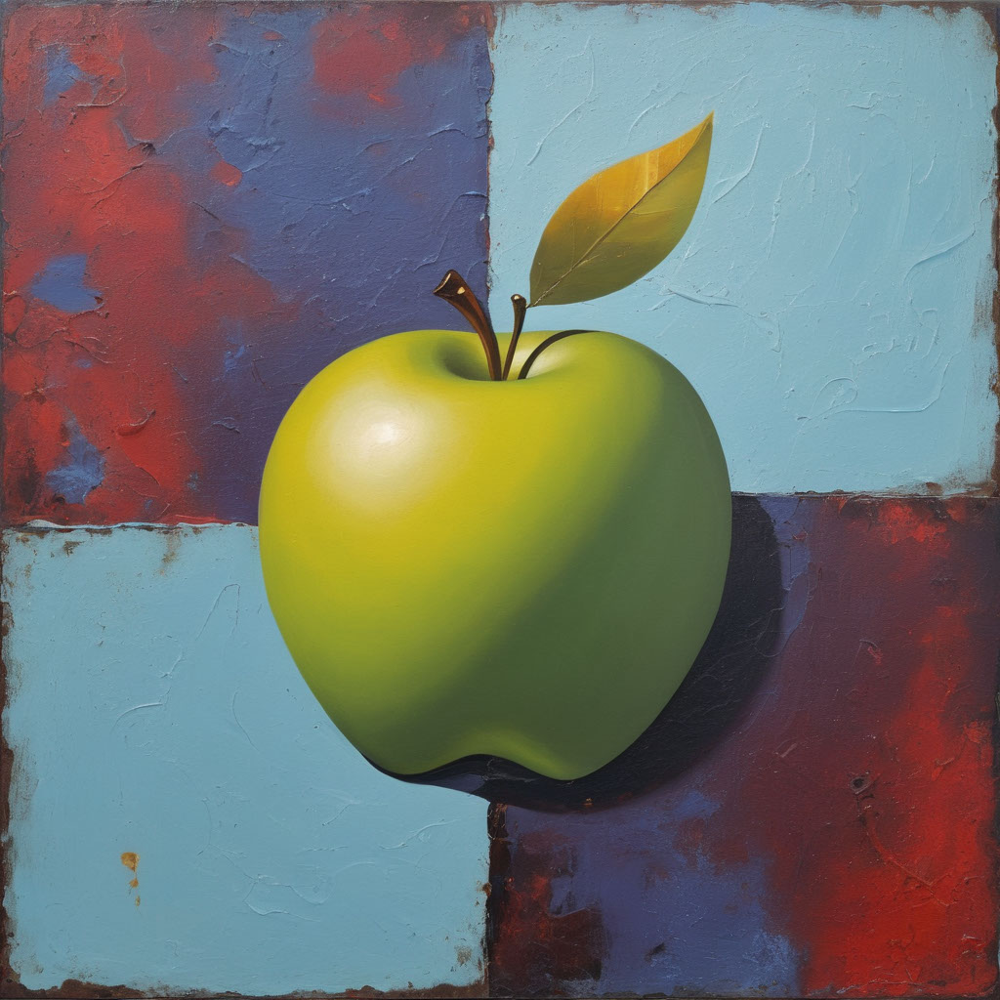
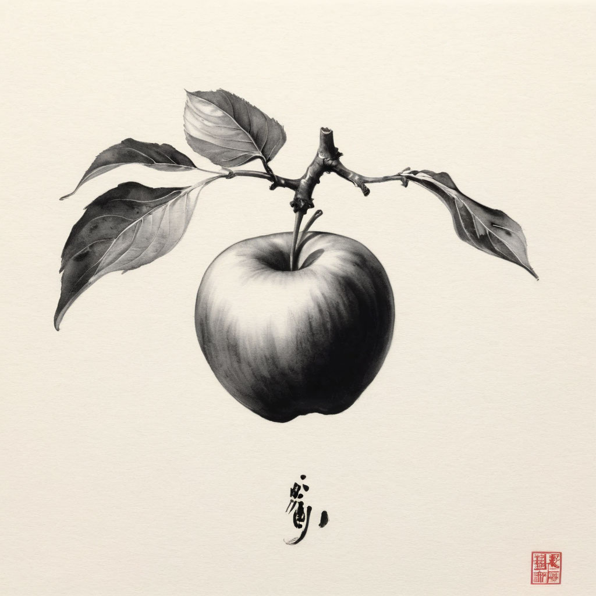
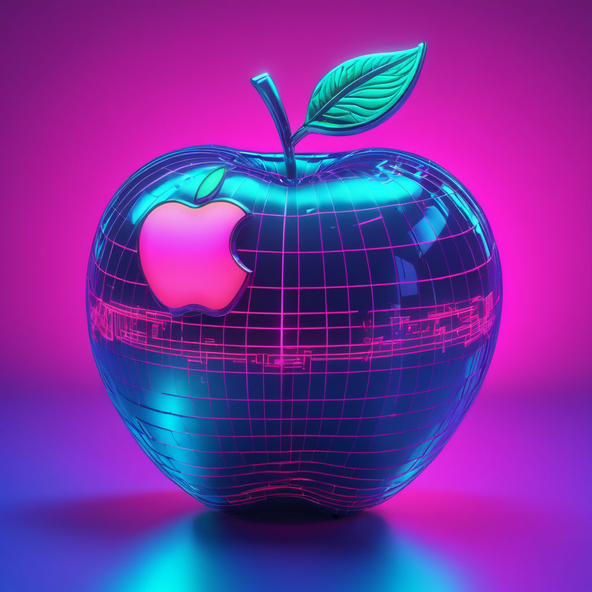
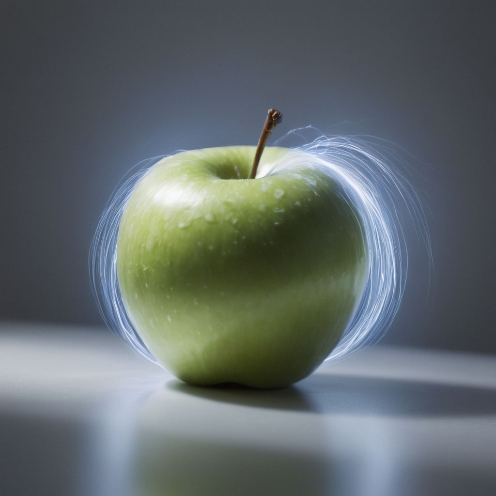
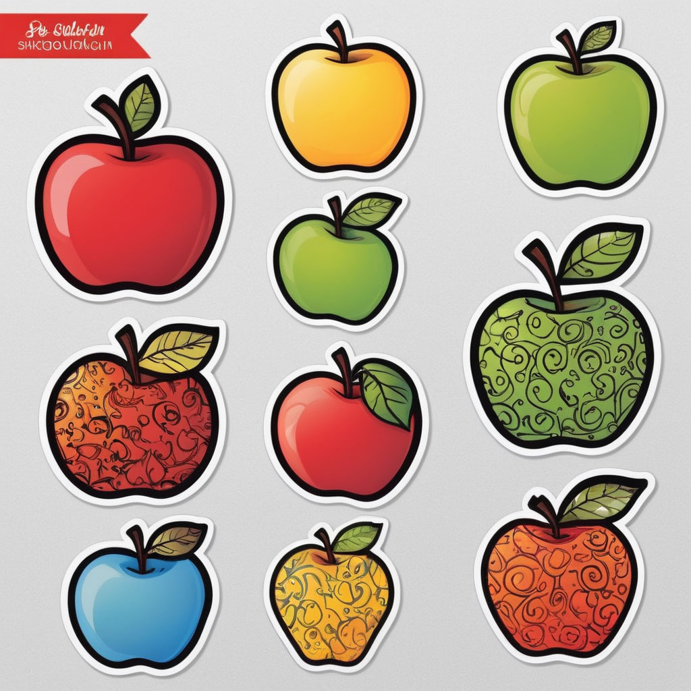
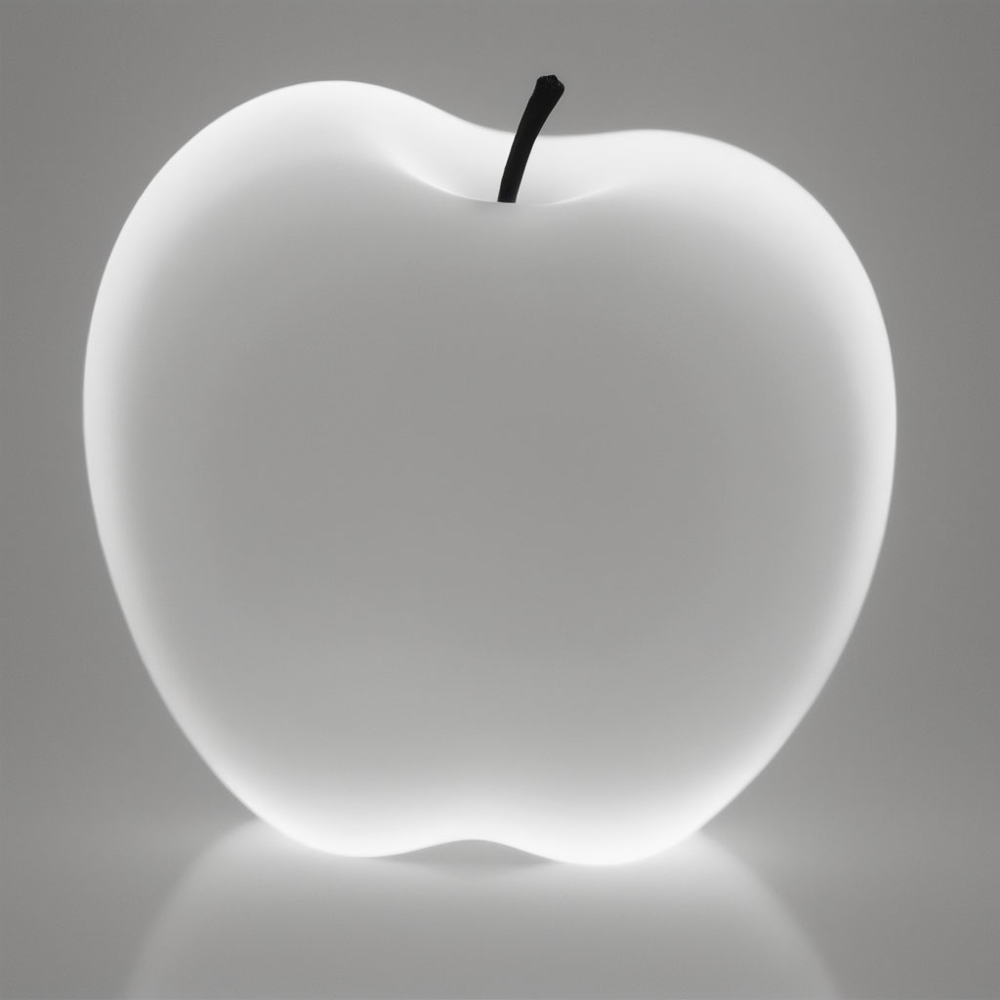
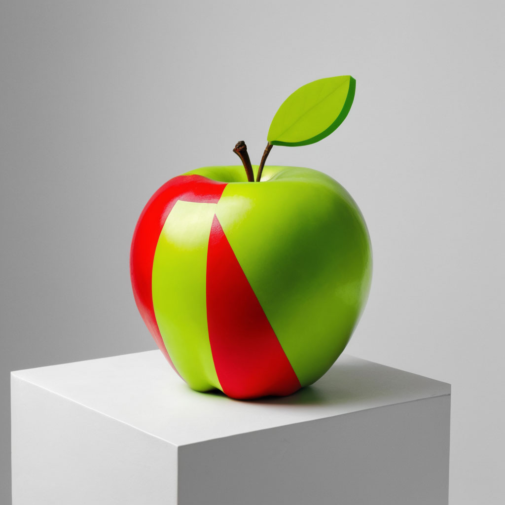

# Fooocus_Catalog_Styles
Fooocus catalog style

This space was created to allow everyone to visualize the different styles that Fooocus offers, it is an apple, with the default settings of Fooocus.
This is to allow everyone to get a good idea of ​​the styles available and their influence on the original prompt.

<table><tr>
<td><a href="2023-12-29_09-54-56_7112.jpg" target="_blank"></img></a>
2023-12-29_09-54-56_7112.jpg
</td><td><table class='metadata'><tr><td class='key'>Prompt</td><td class='value'>one apple</td></tr>
<tr><td class='key'>Negative Prompt</td><td class='value'></td></tr>
<tr><td class='key'>Fooocus V2 Expansion</td><td class='value'></td></tr>
<tr><td class='key'>Styles</td><td class='value'>['Ink Dripping Drawing']</td></tr>
<tr><td class='key'>Performance</td><td class='value'>Speed</td></tr>
<tr><td class='key'>Resolution</td><td class='value'>(1024, 1024)</td></tr>
<tr><td class='key'>Sharpness</td><td class='value'>2</td></tr>
<tr><td class='key'>Guidance Scale</td><td class='value'>4</td></tr>
<tr><td class='key'>ADM Guidance</td><td class='value'>(1.5, 0.8, 0.3)</td></tr>
<tr><td class='key'>Base Model</td><td class='value'>juggernautXL_version6Rundiffusion.safetensors</td></tr>
<tr><td class='key'>Refiner Model</td><td class='value'>None</td></tr>
<tr><td class='key'>Refiner Switch</td><td class='value'>0.5</td></tr>
<tr><td class='key'>Sampler</td><td class='value'>dpmpp_2m_sde_gpu</td></tr>
<tr><td class='key'>Scheduler</td><td class='value'>karras</td></tr>
<tr><td class='key'>Seed</td><td class='value'>2194141034514071567</td></tr>
<tr><td class='key'>LoRA 1</td><td class='value'>sd_xl_offset_example-lora_1.0.safetensors : 0.1</td></tr>
<tr><td class='key'>Version</td><td class='value'>v2.1.856</td></tr>
</table> </td></tr></table>

<table><tr>
<td><a href="2023-12-29_09-54-44_3694.jpg" target="_blank"></img></a>
2023-12-29_09-54-44_3694.jpg
</td><td><table class='metadata'><tr><td class='key'>Prompt</td><td class='value'>one apple</td></tr>
<tr><td class='key'>Negative Prompt</td><td class='value'></td></tr>
<tr><td class='key'>Fooocus V2 Expansion</td><td class='value'></td></tr>
<tr><td class='key'>Styles</td><td class='value'>['MRE Ancient Illustration']</td></tr>
<tr><td class='key'>Performance</td><td class='value'>Speed</td></tr>
<tr><td class='key'>Resolution</td><td class='value'>(1024, 1024)</td></tr>
<tr><td class='key'>Sharpness</td><td class='value'>2</td></tr>
<tr><td class='key'>Guidance Scale</td><td class='value'>4</td></tr>
<tr><td class='key'>ADM Guidance</td><td class='value'>(1.5, 0.8, 0.3)</td></tr>
<tr><td class='key'>Base Model</td><td class='value'>juggernautXL_version6Rundiffusion.safetensors</td></tr>
<tr><td class='key'>Refiner Model</td><td class='value'>None</td></tr>
<tr><td class='key'>Refiner Switch</td><td class='value'>0.5</td></tr>
<tr><td class='key'>Sampler</td><td class='value'>dpmpp_2m_sde_gpu</td></tr>
<tr><td class='key'>Scheduler</td><td class='value'>karras</td></tr>
<tr><td class='key'>Seed</td><td class='value'>2194141034514071567</td></tr>
<tr><td class='key'>LoRA 1</td><td class='value'>sd_xl_offset_example-lora_1.0.safetensors : 0.1</td></tr>
<tr><td class='key'>Version</td><td class='value'>v2.1.856</td></tr>
</table> </td></tr></table>

<table><tr>
<td><a href="2023-12-29_09-54-32_8440.jpg" target="_blank"></img></a>
2023-12-29_09-54-32_8440.jpg
</td><td><table class='metadata'><tr><td class='key'>Prompt</td><td class='value'>one apple</td></tr>
<tr><td class='key'>Negative Prompt</td><td class='value'></td></tr>
<tr><td class='key'>Fooocus V2 Expansion</td><td class='value'></td></tr>
<tr><td class='key'>Styles</td><td class='value'>['SAI Origami']</td></tr>
<tr><td class='key'>Performance</td><td class='value'>Speed</td></tr>
<tr><td class='key'>Resolution</td><td class='value'>(1024, 1024)</td></tr>
<tr><td class='key'>Sharpness</td><td class='value'>2</td></tr>
<tr><td class='key'>Guidance Scale</td><td class='value'>4</td></tr>
<tr><td class='key'>ADM Guidance</td><td class='value'>(1.5, 0.8, 0.3)</td></tr>
<tr><td class='key'>Base Model</td><td class='value'>juggernautXL_version6Rundiffusion.safetensors</td></tr>
<tr><td class='key'>Refiner Model</td><td class='value'>None</td></tr>
<tr><td class='key'>Refiner Switch</td><td class='value'>0.5</td></tr>
<tr><td class='key'>Sampler</td><td class='value'>dpmpp_2m_sde_gpu</td></tr>
<tr><td class='key'>Scheduler</td><td class='value'>karras</td></tr>
<tr><td class='key'>Seed</td><td class='value'>2194141034514071567</td></tr>
<tr><td class='key'>LoRA 1</td><td class='value'>sd_xl_offset_example-lora_1.0.safetensors : 0.1</td></tr>
<tr><td class='key'>Version</td><td class='value'>v2.1.856</td></tr>
</table> </td></tr></table>

<table><tr>
<td><a href="2023-12-29_09-54-21_6283.jpg" target="_blank"></img></a>
2023-12-29_09-54-21_6283.jpg
</td><td><table class='metadata'><tr><td class='key'>Prompt</td><td class='value'>one apple</td></tr>
<tr><td class='key'>Negative Prompt</td><td class='value'></td></tr>
<tr><td class='key'>Fooocus V2 Expansion</td><td class='value'></td></tr>
<tr><td class='key'>Styles</td><td class='value'>['Futuristic Biomechanical Cyberpunk']</td></tr>
<tr><td class='key'>Performance</td><td class='value'>Speed</td></tr>
<tr><td class='key'>Resolution</td><td class='value'>(1024, 1024)</td></tr>
<tr><td class='key'>Sharpness</td><td class='value'>2</td></tr>
<tr><td class='key'>Guidance Scale</td><td class='value'>4</td></tr>
<tr><td class='key'>ADM Guidance</td><td class='value'>(1.5, 0.8, 0.3)</td></tr>
<tr><td class='key'>Base Model</td><td class='value'>juggernautXL_version6Rundiffusion.safetensors</td></tr>
<tr><td class='key'>Refiner Model</td><td class='value'>None</td></tr>
<tr><td class='key'>Refiner Switch</td><td class='value'>0.5</td></tr>
<tr><td class='key'>Sampler</td><td class='value'>dpmpp_2m_sde_gpu</td></tr>
<tr><td class='key'>Scheduler</td><td class='value'>karras</td></tr>
<tr><td class='key'>Seed</td><td class='value'>2194141034514071567</td></tr>
<tr><td class='key'>LoRA 1</td><td class='value'>sd_xl_offset_example-lora_1.0.safetensors : 0.1</td></tr>
<tr><td class='key'>Version</td><td class='value'>v2.1.856</td></tr>
</table> </td></tr></table>

<table><tr>
<td><a href="2023-12-29_09-54-10_9994.jpg" target="_blank"></img></a>
2023-12-29_09-54-10_9994.jpg
</td><td><table class='metadata'><tr><td class='key'>Prompt</td><td class='value'>one apple</td></tr>
<tr><td class='key'>Negative Prompt</td><td class='value'></td></tr>
<tr><td class='key'>Fooocus V2 Expansion</td><td class='value'></td></tr>
<tr><td class='key'>Styles</td><td class='value'>['MRE Dynamic Illustration']</td></tr>
<tr><td class='key'>Performance</td><td class='value'>Speed</td></tr>
<tr><td class='key'>Resolution</td><td class='value'>(1024, 1024)</td></tr>
<tr><td class='key'>Sharpness</td><td class='value'>2</td></tr>
<tr><td class='key'>Guidance Scale</td><td class='value'>4</td></tr>
<tr><td class='key'>ADM Guidance</td><td class='value'>(1.5, 0.8, 0.3)</td></tr>
<tr><td class='key'>Base Model</td><td class='value'>juggernautXL_version6Rundiffusion.safetensors</td></tr>
<tr><td class='key'>Refiner Model</td><td class='value'>None</td></tr>
<tr><td class='key'>Refiner Switch</td><td class='value'>0.5</td></tr>
<tr><td class='key'>Sampler</td><td class='value'>dpmpp_2m_sde_gpu</td></tr>
<tr><td class='key'>Scheduler</td><td class='value'>karras</td></tr>
<tr><td class='key'>Seed</td><td class='value'>2194141034514071567</td></tr>
<tr><td class='key'>LoRA 1</td><td class='value'>sd_xl_offset_example-lora_1.0.safetensors : 0.1</td></tr>
<tr><td class='key'>Version</td><td class='value'>v2.1.856</td></tr>
</table> </td></tr></table>

<table><tr>
<td><a href="2023-12-29_09-53-59_5370.jpg" target="_blank"></img></a>
2023-12-29_09-53-59_5370.jpg
</td><td><table class='metadata'><tr><td class='key'>Prompt</td><td class='value'>one apple</td></tr>
<tr><td class='key'>Negative Prompt</td><td class='value'></td></tr>
<tr><td class='key'>Fooocus V2 Expansion</td><td class='value'></td></tr>
<tr><td class='key'>Styles</td><td class='value'>['MRE Dark Cyberpunk']</td></tr>
<tr><td class='key'>Performance</td><td class='value'>Speed</td></tr>
<tr><td class='key'>Resolution</td><td class='value'>(1024, 1024)</td></tr>
<tr><td class='key'>Sharpness</td><td class='value'>2</td></tr>
<tr><td class='key'>Guidance Scale</td><td class='value'>4</td></tr>
<tr><td class='key'>ADM Guidance</td><td class='value'>(1.5, 0.8, 0.3)</td></tr>
<tr><td class='key'>Base Model</td><td class='value'>juggernautXL_version6Rundiffusion.safetensors</td></tr>
<tr><td class='key'>Refiner Model</td><td class='value'>None</td></tr>
<tr><td class='key'>Refiner Switch</td><td class='value'>0.5</td></tr>
<tr><td class='key'>Sampler</td><td class='value'>dpmpp_2m_sde_gpu</td></tr>
<tr><td class='key'>Scheduler</td><td class='value'>karras</td></tr>
<tr><td class='key'>Seed</td><td class='value'>2194141034514071567</td></tr>
<tr><td class='key'>LoRA 1</td><td class='value'>sd_xl_offset_example-lora_1.0.safetensors : 0.1</td></tr>
<tr><td class='key'>Version</td><td class='value'>v2.1.856</td></tr>
</table> </td></tr></table>

<table><tr>
<td><a href="2023-12-29_09-53-48_7585.jpg" target="_blank"></img></a>
2023-12-29_09-53-48_7585.jpg
</td><td><table class='metadata'><tr><td class='key'>Prompt</td><td class='value'>one apple</td></tr>
<tr><td class='key'>Negative Prompt</td><td class='value'></td></tr>
<tr><td class='key'>Fooocus V2 Expansion</td><td class='value'></td></tr>
<tr><td class='key'>Styles</td><td class='value'>['Flat 2d Art']</td></tr>
<tr><td class='key'>Performance</td><td class='value'>Speed</td></tr>
<tr><td class='key'>Resolution</td><td class='value'>(1024, 1024)</td></tr>
<tr><td class='key'>Sharpness</td><td class='value'>2</td></tr>
<tr><td class='key'>Guidance Scale</td><td class='value'>4</td></tr>
<tr><td class='key'>ADM Guidance</td><td class='value'>(1.5, 0.8, 0.3)</td></tr>
<tr><td class='key'>Base Model</td><td class='value'>juggernautXL_version6Rundiffusion.safetensors</td></tr>
<tr><td class='key'>Refiner Model</td><td class='value'>None</td></tr>
<tr><td class='key'>Refiner Switch</td><td class='value'>0.5</td></tr>
<tr><td class='key'>Sampler</td><td class='value'>dpmpp_2m_sde_gpu</td></tr>
<tr><td class='key'>Scheduler</td><td class='value'>karras</td></tr>
<tr><td class='key'>Seed</td><td class='value'>2194141034514071567</td></tr>
<tr><td class='key'>LoRA 1</td><td class='value'>sd_xl_offset_example-lora_1.0.safetensors : 0.1</td></tr>
<tr><td class='key'>Version</td><td class='value'>v2.1.856</td></tr>
</table> </td></tr></table>

<table><tr>
<td><a href="2023-12-29_09-53-37_4868.jpg" target="_blank"></img></a>
2023-12-29_09-53-37_4868.jpg
</td><td><table class='metadata'><tr><td class='key'>Prompt</td><td class='value'>one apple</td></tr>
<tr><td class='key'>Negative Prompt</td><td class='value'></td></tr>
<tr><td class='key'>Fooocus V2 Expansion</td><td class='value'></td></tr>
<tr><td class='key'>Styles</td><td class='value'>['Neo Baroque']</td></tr>
<tr><td class='key'>Performance</td><td class='value'>Speed</td></tr>
<tr><td class='key'>Resolution</td><td class='value'>(1024, 1024)</td></tr>
<tr><td class='key'>Sharpness</td><td class='value'>2</td></tr>
<tr><td class='key'>Guidance Scale</td><td class='value'>4</td></tr>
<tr><td class='key'>ADM Guidance</td><td class='value'>(1.5, 0.8, 0.3)</td></tr>
<tr><td class='key'>Base Model</td><td class='value'>juggernautXL_version6Rundiffusion.safetensors</td></tr>
<tr><td class='key'>Refiner Model</td><td class='value'>None</td></tr>
<tr><td class='key'>Refiner Switch</td><td class='value'>0.5</td></tr>
<tr><td class='key'>Sampler</td><td class='value'>dpmpp_2m_sde_gpu</td></tr>
<tr><td class='key'>Scheduler</td><td class='value'>karras</td></tr>
<tr><td class='key'>Seed</td><td class='value'>2194141034514071567</td></tr>
<tr><td class='key'>LoRA 1</td><td class='value'>sd_xl_offset_example-lora_1.0.safetensors : 0.1</td></tr>
<tr><td class='key'>Version</td><td class='value'>v2.1.856</td></tr>
</table> </td></tr></table>

<table><tr>
<td><a href="2023-12-29_09-53-26_2611.jpg" target="_blank"></img></a>
2023-12-29_09-53-26_2611.jpg
</td><td><table class='metadata'><tr><td class='key'>Prompt</td><td class='value'>one apple</td></tr>
<tr><td class='key'>Negative Prompt</td><td class='value'></td></tr>
<tr><td class='key'>Fooocus V2 Expansion</td><td class='value'></td></tr>
<tr><td class='key'>Styles</td><td class='value'>['Artstyle Steampunk']</td></tr>
<tr><td class='key'>Performance</td><td class='value'>Speed</td></tr>
<tr><td class='key'>Resolution</td><td class='value'>(1024, 1024)</td></tr>
<tr><td class='key'>Sharpness</td><td class='value'>2</td></tr>
<tr><td class='key'>Guidance Scale</td><td class='value'>4</td></tr>
<tr><td class='key'>ADM Guidance</td><td class='value'>(1.5, 0.8, 0.3)</td></tr>
<tr><td class='key'>Base Model</td><td class='value'>juggernautXL_version6Rundiffusion.safetensors</td></tr>
<tr><td class='key'>Refiner Model</td><td class='value'>None</td></tr>
<tr><td class='key'>Refiner Switch</td><td class='value'>0.5</td></tr>
<tr><td class='key'>Sampler</td><td class='value'>dpmpp_2m_sde_gpu</td></tr>
<tr><td class='key'>Scheduler</td><td class='value'>karras</td></tr>
<tr><td class='key'>Seed</td><td class='value'>2194141034514071567</td></tr>
<tr><td class='key'>LoRA 1</td><td class='value'>sd_xl_offset_example-lora_1.0.safetensors : 0.1</td></tr>
<tr><td class='key'>Version</td><td class='value'>v2.1.856</td></tr>
</table> </td></tr></table>

<table><tr>
<td><a href="2023-12-29_09-53-12_3382.jpg" target="_blank"></img></a>
2023-12-29_09-53-12_3382.jpg
</td><td><table class='metadata'><tr><td class='key'>Prompt</td><td class='value'>one apple</td></tr>
<tr><td class='key'>Negative Prompt</td><td class='value'></td></tr>
<tr><td class='key'>Fooocus V2 Expansion</td><td class='value'></td></tr>
<tr><td class='key'>Styles</td><td class='value'>['Game Retro Arcade']</td></tr>
<tr><td class='key'>Performance</td><td class='value'>Speed</td></tr>
<tr><td class='key'>Resolution</td><td class='value'>(1024, 1024)</td></tr>
<tr><td class='key'>Sharpness</td><td class='value'>2</td></tr>
<tr><td class='key'>Guidance Scale</td><td class='value'>4</td></tr>
<tr><td class='key'>ADM Guidance</td><td class='value'>(1.5, 0.8, 0.3)</td></tr>
<tr><td class='key'>Base Model</td><td class='value'>juggernautXL_version6Rundiffusion.safetensors</td></tr>
<tr><td class='key'>Refiner Model</td><td class='value'>None</td></tr>
<tr><td class='key'>Refiner Switch</td><td class='value'>0.5</td></tr>
<tr><td class='key'>Sampler</td><td class='value'>dpmpp_2m_sde_gpu</td></tr>
<tr><td class='key'>Scheduler</td><td class='value'>karras</td></tr>
<tr><td class='key'>Seed</td><td class='value'>2194141034514071567</td></tr>
<tr><td class='key'>LoRA 1</td><td class='value'>sd_xl_offset_example-lora_1.0.safetensors : 0.1</td></tr>
<tr><td class='key'>Version</td><td class='value'>v2.1.856</td></tr>
</table> </td></tr></table>

<table><tr>
<td><a href="2023-12-29_09-52-58_5163.jpg" target="_blank"></img></a>
2023-12-29_09-52-58_5163.jpg
</td><td><table class='metadata'><tr><td class='key'>Prompt</td><td class='value'>one apple</td></tr>
<tr><td class='key'>Negative Prompt</td><td class='value'></td></tr>
<tr><td class='key'>Fooocus V2 Expansion</td><td class='value'></td></tr>
<tr><td class='key'>Styles</td><td class='value'>['Game Mario']</td></tr>
<tr><td class='key'>Performance</td><td class='value'>Speed</td></tr>
<tr><td class='key'>Resolution</td><td class='value'>(1024, 1024)</td></tr>
<tr><td class='key'>Sharpness</td><td class='value'>2</td></tr>
<tr><td class='key'>Guidance Scale</td><td class='value'>4</td></tr>
<tr><td class='key'>ADM Guidance</td><td class='value'>(1.5, 0.8, 0.3)</td></tr>
<tr><td class='key'>Base Model</td><td class='value'>juggernautXL_version6Rundiffusion.safetensors</td></tr>
<tr><td class='key'>Refiner Model</td><td class='value'>None</td></tr>
<tr><td class='key'>Refiner Switch</td><td class='value'>0.5</td></tr>
<tr><td class='key'>Sampler</td><td class='value'>dpmpp_2m_sde_gpu</td></tr>
<tr><td class='key'>Scheduler</td><td class='value'>karras</td></tr>
<tr><td class='key'>Seed</td><td class='value'>2194141034514071567</td></tr>
<tr><td class='key'>LoRA 1</td><td class='value'>sd_xl_offset_example-lora_1.0.safetensors : 0.1</td></tr>
<tr><td class='key'>Version</td><td class='value'>v2.1.856</td></tr>
</table> </td></tr></table>

<table><tr>
<td><a href="2023-12-29_09-52-41_4319.jpg" target="_blank"></img></a>
2023-12-29_09-52-41_4319.jpg
</td><td><table class='metadata'><tr><td class='key'>Prompt</td><td class='value'>one apple</td></tr>
<tr><td class='key'>Negative Prompt</td><td class='value'></td></tr>
<tr><td class='key'>Fooocus V2 Expansion</td><td class='value'></td></tr>
<tr><td class='key'>Styles</td><td class='value'>['SAI Craft Clay']</td></tr>
<tr><td class='key'>Performance</td><td class='value'>Speed</td></tr>
<tr><td class='key'>Resolution</td><td class='value'>(1024, 1024)</td></tr>
<tr><td class='key'>Sharpness</td><td class='value'>2</td></tr>
<tr><td class='key'>Guidance Scale</td><td class='value'>4</td></tr>
<tr><td class='key'>ADM Guidance</td><td class='value'>(1.5, 0.8, 0.3)</td></tr>
<tr><td class='key'>Base Model</td><td class='value'>juggernautXL_version6Rundiffusion.safetensors</td></tr>
<tr><td class='key'>Refiner Model</td><td class='value'>None</td></tr>
<tr><td class='key'>Refiner Switch</td><td class='value'>0.5</td></tr>
<tr><td class='key'>Sampler</td><td class='value'>dpmpp_2m_sde_gpu</td></tr>
<tr><td class='key'>Scheduler</td><td class='value'>karras</td></tr>
<tr><td class='key'>Seed</td><td class='value'>2194141034514071567</td></tr>
<tr><td class='key'>LoRA 1</td><td class='value'>sd_xl_offset_example-lora_1.0.safetensors : 0.1</td></tr>
<tr><td class='key'>Version</td><td class='value'>v2.1.856</td></tr>
</table> </td></tr></table>

<table><tr>
<td><a href="2023-12-29_09-52-29_9772.jpg" target="_blank"></img></a>
2023-12-29_09-52-29_9772.jpg
</td><td><table class='metadata'><tr><td class='key'>Prompt</td><td class='value'>one apple</td></tr>
<tr><td class='key'>Negative Prompt</td><td class='value'></td></tr>
<tr><td class='key'>Fooocus V2 Expansion</td><td class='value'></td></tr>
<tr><td class='key'>Styles</td><td class='value'>['Futuristic Sci Fi']</td></tr>
<tr><td class='key'>Performance</td><td class='value'>Speed</td></tr>
<tr><td class='key'>Resolution</td><td class='value'>(1024, 1024)</td></tr>
<tr><td class='key'>Sharpness</td><td class='value'>2</td></tr>
<tr><td class='key'>Guidance Scale</td><td class='value'>4</td></tr>
<tr><td class='key'>ADM Guidance</td><td class='value'>(1.5, 0.8, 0.3)</td></tr>
<tr><td class='key'>Base Model</td><td class='value'>juggernautXL_version6Rundiffusion.safetensors</td></tr>
<tr><td class='key'>Refiner Model</td><td class='value'>None</td></tr>
<tr><td class='key'>Refiner Switch</td><td class='value'>0.5</td></tr>
<tr><td class='key'>Sampler</td><td class='value'>dpmpp_2m_sde_gpu</td></tr>
<tr><td class='key'>Scheduler</td><td class='value'>karras</td></tr>
<tr><td class='key'>Seed</td><td class='value'>2194141034514071567</td></tr>
<tr><td class='key'>LoRA 1</td><td class='value'>sd_xl_offset_example-lora_1.0.safetensors : 0.1</td></tr>
<tr><td class='key'>Version</td><td class='value'>v2.1.856</td></tr>
</table> </td></tr></table>

<table><tr>
<td><a href="2023-12-29_09-52-18_4707.jpg" target="_blank"></img></a>
2023-12-29_09-52-18_4707.jpg
</td><td><table class='metadata'><tr><td class='key'>Prompt</td><td class='value'>one apple</td></tr>
<tr><td class='key'>Negative Prompt</td><td class='value'></td></tr>
<tr><td class='key'>Fooocus V2 Expansion</td><td class='value'></td></tr>
<tr><td class='key'>Styles</td><td class='value'>['MRE Artistic Vision']</td></tr>
<tr><td class='key'>Performance</td><td class='value'>Speed</td></tr>
<tr><td class='key'>Resolution</td><td class='value'>(1024, 1024)</td></tr>
<tr><td class='key'>Sharpness</td><td class='value'>2</td></tr>
<tr><td class='key'>Guidance Scale</td><td class='value'>4</td></tr>
<tr><td class='key'>ADM Guidance</td><td class='value'>(1.5, 0.8, 0.3)</td></tr>
<tr><td class='key'>Base Model</td><td class='value'>juggernautXL_version6Rundiffusion.safetensors</td></tr>
<tr><td class='key'>Refiner Model</td><td class='value'>None</td></tr>
<tr><td class='key'>Refiner Switch</td><td class='value'>0.5</td></tr>
<tr><td class='key'>Sampler</td><td class='value'>dpmpp_2m_sde_gpu</td></tr>
<tr><td class='key'>Scheduler</td><td class='value'>karras</td></tr>
<tr><td class='key'>Seed</td><td class='value'>2194141034514071567</td></tr>
<tr><td class='key'>LoRA 1</td><td class='value'>sd_xl_offset_example-lora_1.0.safetensors : 0.1</td></tr>
<tr><td class='key'>Version</td><td class='value'>v2.1.856</td></tr>
</table> </td></tr></table>

<table><tr>
<td><a href="2023-12-29_09-52-04_1941.jpg" target="_blank"></img></a>
2023-12-29_09-52-04_1941.jpg
</td><td><table class='metadata'><tr><td class='key'>Prompt</td><td class='value'>one apple</td></tr>
<tr><td class='key'>Negative Prompt</td><td class='value'></td></tr>
<tr><td class='key'>Fooocus V2 Expansion</td><td class='value'></td></tr>
<tr><td class='key'>Styles</td><td class='value'>['Rococo']</td></tr>
<tr><td class='key'>Performance</td><td class='value'>Speed</td></tr>
<tr><td class='key'>Resolution</td><td class='value'>(1024, 1024)</td></tr>
<tr><td class='key'>Sharpness</td><td class='value'>2</td></tr>
<tr><td class='key'>Guidance Scale</td><td class='value'>4</td></tr>
<tr><td class='key'>ADM Guidance</td><td class='value'>(1.5, 0.8, 0.3)</td></tr>
<tr><td class='key'>Base Model</td><td class='value'>juggernautXL_version6Rundiffusion.safetensors</td></tr>
<tr><td class='key'>Refiner Model</td><td class='value'>None</td></tr>
<tr><td class='key'>Refiner Switch</td><td class='value'>0.5</td></tr>
<tr><td class='key'>Sampler</td><td class='value'>dpmpp_2m_sde_gpu</td></tr>
<tr><td class='key'>Scheduler</td><td class='value'>karras</td></tr>
<tr><td class='key'>Seed</td><td class='value'>2194141034514071567</td></tr>
<tr><td class='key'>LoRA 1</td><td class='value'>sd_xl_offset_example-lora_1.0.safetensors : 0.1</td></tr>
<tr><td class='key'>Version</td><td class='value'>v2.1.856</td></tr>
</table> </td></tr></table>

<table><tr>
<td><a href="2023-12-29_09-51-52_3253.jpg" target="_blank"></img></a>
2023-12-29_09-51-52_3253.jpg
</td><td><table class='metadata'><tr><td class='key'>Prompt</td><td class='value'>one apple</td></tr>
<tr><td class='key'>Negative Prompt</td><td class='value'></td></tr>
<tr><td class='key'>Fooocus V2 Expansion</td><td class='value'></td></tr>
<tr><td class='key'>Styles</td><td class='value'>['SAI Isometric']</td></tr>
<tr><td class='key'>Performance</td><td class='value'>Speed</td></tr>
<tr><td class='key'>Resolution</td><td class='value'>(1024, 1024)</td></tr>
<tr><td class='key'>Sharpness</td><td class='value'>2</td></tr>
<tr><td class='key'>Guidance Scale</td><td class='value'>4</td></tr>
<tr><td class='key'>ADM Guidance</td><td class='value'>(1.5, 0.8, 0.3)</td></tr>
<tr><td class='key'>Base Model</td><td class='value'>juggernautXL_version6Rundiffusion.safetensors</td></tr>
<tr><td class='key'>Refiner Model</td><td class='value'>None</td></tr>
<tr><td class='key'>Refiner Switch</td><td class='value'>0.5</td></tr>
<tr><td class='key'>Sampler</td><td class='value'>dpmpp_2m_sde_gpu</td></tr>
<tr><td class='key'>Scheduler</td><td class='value'>karras</td></tr>
<tr><td class='key'>Seed</td><td class='value'>2194141034514071567</td></tr>
<tr><td class='key'>LoRA 1</td><td class='value'>sd_xl_offset_example-lora_1.0.safetensors : 0.1</td></tr>
<tr><td class='key'>Version</td><td class='value'>v2.1.856</td></tr>
</table> </td></tr></table>

<table><tr>
<td><a href="2023-12-29_09-51-41_9533.jpg" target="_blank"></img></a>
2023-12-29_09-51-41_9533.jpg
</td><td><table class='metadata'><tr><td class='key'>Prompt</td><td class='value'>one apple</td></tr>
<tr><td class='key'>Negative Prompt</td><td class='value'></td></tr>
<tr><td class='key'>Fooocus V2 Expansion</td><td class='value'></td></tr>
<tr><td class='key'>Styles</td><td class='value'>['Game Streetfighter']</td></tr>
<tr><td class='key'>Performance</td><td class='value'>Speed</td></tr>
<tr><td class='key'>Resolution</td><td class='value'>(1024, 1024)</td></tr>
<tr><td class='key'>Sharpness</td><td class='value'>2</td></tr>
<tr><td class='key'>Guidance Scale</td><td class='value'>4</td></tr>
<tr><td class='key'>ADM Guidance</td><td class='value'>(1.5, 0.8, 0.3)</td></tr>
<tr><td class='key'>Base Model</td><td class='value'>juggernautXL_version6Rundiffusion.safetensors</td></tr>
<tr><td class='key'>Refiner Model</td><td class='value'>None</td></tr>
<tr><td class='key'>Refiner Switch</td><td class='value'>0.5</td></tr>
<tr><td class='key'>Sampler</td><td class='value'>dpmpp_2m_sde_gpu</td></tr>
<tr><td class='key'>Scheduler</td><td class='value'>karras</td></tr>
<tr><td class='key'>Seed</td><td class='value'>2194141034514071567</td></tr>
<tr><td class='key'>LoRA 1</td><td class='value'>sd_xl_offset_example-lora_1.0.safetensors : 0.1</td></tr>
<tr><td class='key'>Version</td><td class='value'>v2.1.856</td></tr>
</table> </td></tr></table>

<table><tr>
<td><a href="2023-12-29_09-51-30_6577.jpg" target="_blank"></img></a>
2023-12-29_09-51-30_6577.jpg
</td><td><table class='metadata'><tr><td class='key'>Prompt</td><td class='value'>one apple</td></tr>
<tr><td class='key'>Negative Prompt</td><td class='value'></td></tr>
<tr><td class='key'>Fooocus V2 Expansion</td><td class='value'></td></tr>
<tr><td class='key'>Styles</td><td class='value'>['MRE Sumi E Symbolic']</td></tr>
<tr><td class='key'>Performance</td><td class='value'>Speed</td></tr>
<tr><td class='key'>Resolution</td><td class='value'>(1024, 1024)</td></tr>
<tr><td class='key'>Sharpness</td><td class='value'>2</td></tr>
<tr><td class='key'>Guidance Scale</td><td class='value'>4</td></tr>
<tr><td class='key'>ADM Guidance</td><td class='value'>(1.5, 0.8, 0.3)</td></tr>
<tr><td class='key'>Base Model</td><td class='value'>juggernautXL_version6Rundiffusion.safetensors</td></tr>
<tr><td class='key'>Refiner Model</td><td class='value'>None</td></tr>
<tr><td class='key'>Refiner Switch</td><td class='value'>0.5</td></tr>
<tr><td class='key'>Sampler</td><td class='value'>dpmpp_2m_sde_gpu</td></tr>
<tr><td class='key'>Scheduler</td><td class='value'>karras</td></tr>
<tr><td class='key'>Seed</td><td class='value'>2194141034514071567</td></tr>
<tr><td class='key'>LoRA 1</td><td class='value'>sd_xl_offset_example-lora_1.0.safetensors : 0.1</td></tr>
<tr><td class='key'>Version</td><td class='value'>v2.1.856</td></tr>
</table> </td></tr></table>

<table><tr>
<td><a href="2023-12-29_09-51-18_7060.jpg" target="_blank"></img></a>
2023-12-29_09-51-18_7060.jpg
</td><td><table class='metadata'><tr><td class='key'>Prompt</td><td class='value'>one apple</td></tr>
<tr><td class='key'>Negative Prompt</td><td class='value'></td></tr>
<tr><td class='key'>Fooocus V2 Expansion</td><td class='value'></td></tr>
<tr><td class='key'>Styles</td><td class='value'>['SAI 3D Model']</td></tr>
<tr><td class='key'>Performance</td><td class='value'>Speed</td></tr>
<tr><td class='key'>Resolution</td><td class='value'>(1024, 1024)</td></tr>
<tr><td class='key'>Sharpness</td><td class='value'>2</td></tr>
<tr><td class='key'>Guidance Scale</td><td class='value'>4</td></tr>
<tr><td class='key'>ADM Guidance</td><td class='value'>(1.5, 0.8, 0.3)</td></tr>
<tr><td class='key'>Base Model</td><td class='value'>juggernautXL_version6Rundiffusion.safetensors</td></tr>
<tr><td class='key'>Refiner Model</td><td class='value'>None</td></tr>
<tr><td class='key'>Refiner Switch</td><td class='value'>0.5</td></tr>
<tr><td class='key'>Sampler</td><td class='value'>dpmpp_2m_sde_gpu</td></tr>
<tr><td class='key'>Scheduler</td><td class='value'>karras</td></tr>
<tr><td class='key'>Seed</td><td class='value'>2194141034514071567</td></tr>
<tr><td class='key'>LoRA 1</td><td class='value'>sd_xl_offset_example-lora_1.0.safetensors : 0.1</td></tr>
<tr><td class='key'>Version</td><td class='value'>v2.1.856</td></tr>
</table> </td></tr></table>

<table><tr>
<td><a href="2023-12-29_09-51-07_3303.jpg" target="_blank"></img></a>
2023-12-29_09-51-07_3303.jpg
</td><td><table class='metadata'><tr><td class='key'>Prompt</td><td class='value'>one apple</td></tr>
<tr><td class='key'>Negative Prompt</td><td class='value'></td></tr>
<tr><td class='key'>Fooocus V2 Expansion</td><td class='value'></td></tr>
<tr><td class='key'>Styles</td><td class='value'>['Mk Cibulak Porcelain']</td></tr>
<tr><td class='key'>Performance</td><td class='value'>Speed</td></tr>
<tr><td class='key'>Resolution</td><td class='value'>(1024, 1024)</td></tr>
<tr><td class='key'>Sharpness</td><td class='value'>2</td></tr>
<tr><td class='key'>Guidance Scale</td><td class='value'>4</td></tr>
<tr><td class='key'>ADM Guidance</td><td class='value'>(1.5, 0.8, 0.3)</td></tr>
<tr><td class='key'>Base Model</td><td class='value'>juggernautXL_version6Rundiffusion.safetensors</td></tr>
<tr><td class='key'>Refiner Model</td><td class='value'>None</td></tr>
<tr><td class='key'>Refiner Switch</td><td class='value'>0.5</td></tr>
<tr><td class='key'>Sampler</td><td class='value'>dpmpp_2m_sde_gpu</td></tr>
<tr><td class='key'>Scheduler</td><td class='value'>karras</td></tr>
<tr><td class='key'>Seed</td><td class='value'>2194141034514071567</td></tr>
<tr><td class='key'>LoRA 1</td><td class='value'>sd_xl_offset_example-lora_1.0.safetensors : 0.1</td></tr>
<tr><td class='key'>Version</td><td class='value'>v2.1.856</td></tr>
</table> </td></tr></table>

<table><tr>
<td><a href="2023-12-29_09-50-56_8279.jpg" target="_blank"></img></a>
2023-12-29_09-50-56_8279.jpg
</td><td><table class='metadata'><tr><td class='key'>Prompt</td><td class='value'>one apple</td></tr>
<tr><td class='key'>Negative Prompt</td><td class='value'></td></tr>
<tr><td class='key'>Fooocus V2 Expansion</td><td class='value'></td></tr>
<tr><td class='key'>Styles</td><td class='value'>['Neo Rococo']</td></tr>
<tr><td class='key'>Performance</td><td class='value'>Speed</td></tr>
<tr><td class='key'>Resolution</td><td class='value'>(1024, 1024)</td></tr>
<tr><td class='key'>Sharpness</td><td class='value'>2</td></tr>
<tr><td class='key'>Guidance Scale</td><td class='value'>4</td></tr>
<tr><td class='key'>ADM Guidance</td><td class='value'>(1.5, 0.8, 0.3)</td></tr>
<tr><td class='key'>Base Model</td><td class='value'>juggernautXL_version6Rundiffusion.safetensors</td></tr>
<tr><td class='key'>Refiner Model</td><td class='value'>None</td></tr>
<tr><td class='key'>Refiner Switch</td><td class='value'>0.5</td></tr>
<tr><td class='key'>Sampler</td><td class='value'>dpmpp_2m_sde_gpu</td></tr>
<tr><td class='key'>Scheduler</td><td class='value'>karras</td></tr>
<tr><td class='key'>Seed</td><td class='value'>2194141034514071567</td></tr>
<tr><td class='key'>LoRA 1</td><td class='value'>sd_xl_offset_example-lora_1.0.safetensors : 0.1</td></tr>
<tr><td class='key'>Version</td><td class='value'>v2.1.856</td></tr>
</table> </td></tr></table>

<table><tr>
<td><a href="2023-12-29_09-50-44_8814.jpg" target="_blank"></img></a>
2023-12-29_09-50-44_8814.jpg
</td><td><table class='metadata'><tr><td class='key'>Prompt</td><td class='value'>one apple</td></tr>
<tr><td class='key'>Negative Prompt</td><td class='value'></td></tr>
<tr><td class='key'>Fooocus V2 Expansion</td><td class='value'></td></tr>
<tr><td class='key'>Styles</td><td class='value'>['Artstyle Cubist']</td></tr>
<tr><td class='key'>Performance</td><td class='value'>Speed</td></tr>
<tr><td class='key'>Resolution</td><td class='value'>(1024, 1024)</td></tr>
<tr><td class='key'>Sharpness</td><td class='value'>2</td></tr>
<tr><td class='key'>Guidance Scale</td><td class='value'>4</td></tr>
<tr><td class='key'>ADM Guidance</td><td class='value'>(1.5, 0.8, 0.3)</td></tr>
<tr><td class='key'>Base Model</td><td class='value'>juggernautXL_version6Rundiffusion.safetensors</td></tr>
<tr><td class='key'>Refiner Model</td><td class='value'>None</td></tr>
<tr><td class='key'>Refiner Switch</td><td class='value'>0.5</td></tr>
<tr><td class='key'>Sampler</td><td class='value'>dpmpp_2m_sde_gpu</td></tr>
<tr><td class='key'>Scheduler</td><td class='value'>karras</td></tr>
<tr><td class='key'>Seed</td><td class='value'>2194141034514071567</td></tr>
<tr><td class='key'>LoRA 1</td><td class='value'>sd_xl_offset_example-lora_1.0.safetensors : 0.1</td></tr>
<tr><td class='key'>Version</td><td class='value'>v2.1.856</td></tr>
</table> </td></tr></table>

<table><tr>
<td><a href="2023-12-29_09-50-33_2318.jpg" target="_blank"></img></a>
2023-12-29_09-50-33_2318.jpg
</td><td><table class='metadata'><tr><td class='key'>Prompt</td><td class='value'>one apple</td></tr>
<tr><td class='key'>Negative Prompt</td><td class='value'></td></tr>
<tr><td class='key'>Fooocus V2 Expansion</td><td class='value'></td></tr>
<tr><td class='key'>Styles</td><td class='value'>['Mk Tlingit Art']</td></tr>
<tr><td class='key'>Performance</td><td class='value'>Speed</td></tr>
<tr><td class='key'>Resolution</td><td class='value'>(1024, 1024)</td></tr>
<tr><td class='key'>Sharpness</td><td class='value'>2</td></tr>
<tr><td class='key'>Guidance Scale</td><td class='value'>4</td></tr>
<tr><td class='key'>ADM Guidance</td><td class='value'>(1.5, 0.8, 0.3)</td></tr>
<tr><td class='key'>Base Model</td><td class='value'>juggernautXL_version6Rundiffusion.safetensors</td></tr>
<tr><td class='key'>Refiner Model</td><td class='value'>None</td></tr>
<tr><td class='key'>Refiner Switch</td><td class='value'>0.5</td></tr>
<tr><td class='key'>Sampler</td><td class='value'>dpmpp_2m_sde_gpu</td></tr>
<tr><td class='key'>Scheduler</td><td class='value'>karras</td></tr>
<tr><td class='key'>Seed</td><td class='value'>2194141034514071567</td></tr>
<tr><td class='key'>LoRA 1</td><td class='value'>sd_xl_offset_example-lora_1.0.safetensors : 0.1</td></tr>
<tr><td class='key'>Version</td><td class='value'>v2.1.856</td></tr>
</table> </td></tr></table>

<table><tr>
<td><a href="2023-12-29_09-50-22_6177.jpg" target="_blank"></img></a>
2023-12-29_09-50-22_6177.jpg
</td><td><table class='metadata'><tr><td class='key'>Prompt</td><td class='value'>one apple</td></tr>
<tr><td class='key'>Negative Prompt</td><td class='value'></td></tr>
<tr><td class='key'>Fooocus V2 Expansion</td><td class='value'></td></tr>
<tr><td class='key'>Styles</td><td class='value'>['MRE Undead Art']</td></tr>
<tr><td class='key'>Performance</td><td class='value'>Speed</td></tr>
<tr><td class='key'>Resolution</td><td class='value'>(1024, 1024)</td></tr>
<tr><td class='key'>Sharpness</td><td class='value'>2</td></tr>
<tr><td class='key'>Guidance Scale</td><td class='value'>4</td></tr>
<tr><td class='key'>ADM Guidance</td><td class='value'>(1.5, 0.8, 0.3)</td></tr>
<tr><td class='key'>Base Model</td><td class='value'>juggernautXL_version6Rundiffusion.safetensors</td></tr>
<tr><td class='key'>Refiner Model</td><td class='value'>None</td></tr>
<tr><td class='key'>Refiner Switch</td><td class='value'>0.5</td></tr>
<tr><td class='key'>Sampler</td><td class='value'>dpmpp_2m_sde_gpu</td></tr>
<tr><td class='key'>Scheduler</td><td class='value'>karras</td></tr>
<tr><td class='key'>Seed</td><td class='value'>2194141034514071567</td></tr>
<tr><td class='key'>LoRA 1</td><td class='value'>sd_xl_offset_example-lora_1.0.safetensors : 0.1</td></tr>
<tr><td class='key'>Version</td><td class='value'>v2.1.856</td></tr>
</table> </td></tr></table>

<table><tr>
<td><a href="2023-12-29_09-50-11_5342.jpg" target="_blank"></img></a>
2023-12-29_09-50-11_5342.jpg
</td><td><table class='metadata'><tr><td class='key'>Prompt</td><td class='value'>one apple</td></tr>
<tr><td class='key'>Negative Prompt</td><td class='value'></td></tr>
<tr><td class='key'>Fooocus V2 Expansion</td><td class='value'></td></tr>
<tr><td class='key'>Styles</td><td class='value'>['Artstyle Graffiti']</td></tr>
<tr><td class='key'>Performance</td><td class='value'>Speed</td></tr>
<tr><td class='key'>Resolution</td><td class='value'>(1024, 1024)</td></tr>
<tr><td class='key'>Sharpness</td><td class='value'>2</td></tr>
<tr><td class='key'>Guidance Scale</td><td class='value'>4</td></tr>
<tr><td class='key'>ADM Guidance</td><td class='value'>(1.5, 0.8, 0.3)</td></tr>
<tr><td class='key'>Base Model</td><td class='value'>juggernautXL_version6Rundiffusion.safetensors</td></tr>
<tr><td class='key'>Refiner Model</td><td class='value'>None</td></tr>
<tr><td class='key'>Refiner Switch</td><td class='value'>0.5</td></tr>
<tr><td class='key'>Sampler</td><td class='value'>dpmpp_2m_sde_gpu</td></tr>
<tr><td class='key'>Scheduler</td><td class='value'>karras</td></tr>
<tr><td class='key'>Seed</td><td class='value'>2194141034514071567</td></tr>
<tr><td class='key'>LoRA 1</td><td class='value'>sd_xl_offset_example-lora_1.0.safetensors : 0.1</td></tr>
<tr><td class='key'>Version</td><td class='value'>v2.1.856</td></tr>
</table> </td></tr></table>

<table><tr>
<td><a href="2023-12-29_09-50-00_6399.jpg" target="_blank"></img></a>
2023-12-29_09-50-00_6399.jpg
</td><td><table class='metadata'><tr><td class='key'>Prompt</td><td class='value'>one apple</td></tr>
<tr><td class='key'>Negative Prompt</td><td class='value'></td></tr>
<tr><td class='key'>Fooocus V2 Expansion</td><td class='value'></td></tr>
<tr><td class='key'>Styles</td><td class='value'>['Suprematism']</td></tr>
<tr><td class='key'>Performance</td><td class='value'>Speed</td></tr>
<tr><td class='key'>Resolution</td><td class='value'>(1024, 1024)</td></tr>
<tr><td class='key'>Sharpness</td><td class='value'>2</td></tr>
<tr><td class='key'>Guidance Scale</td><td class='value'>4</td></tr>
<tr><td class='key'>ADM Guidance</td><td class='value'>(1.5, 0.8, 0.3)</td></tr>
<tr><td class='key'>Base Model</td><td class='value'>juggernautXL_version6Rundiffusion.safetensors</td></tr>
<tr><td class='key'>Refiner Model</td><td class='value'>None</td></tr>
<tr><td class='key'>Refiner Switch</td><td class='value'>0.5</td></tr>
<tr><td class='key'>Sampler</td><td class='value'>dpmpp_2m_sde_gpu</td></tr>
<tr><td class='key'>Scheduler</td><td class='value'>karras</td></tr>
<tr><td class='key'>Seed</td><td class='value'>2194141034514071567</td></tr>
<tr><td class='key'>LoRA 1</td><td class='value'>sd_xl_offset_example-lora_1.0.safetensors : 0.1</td></tr>
<tr><td class='key'>Version</td><td class='value'>v2.1.856</td></tr>
</table> </td></tr></table>

<table><tr>
<td><a href="2023-12-29_09-49-48_2180.jpg" target="_blank"></img></a>
2023-12-29_09-49-48_2180.jpg
</td><td><table class='metadata'><tr><td class='key'>Prompt</td><td class='value'>one apple</td></tr>
<tr><td class='key'>Negative Prompt</td><td class='value'></td></tr>
<tr><td class='key'>Fooocus V2 Expansion</td><td class='value'></td></tr>
<tr><td class='key'>Styles</td><td class='value'>['SAI Digital Art']</td></tr>
<tr><td class='key'>Performance</td><td class='value'>Speed</td></tr>
<tr><td class='key'>Resolution</td><td class='value'>(1024, 1024)</td></tr>
<tr><td class='key'>Sharpness</td><td class='value'>2</td></tr>
<tr><td class='key'>Guidance Scale</td><td class='value'>4</td></tr>
<tr><td class='key'>ADM Guidance</td><td class='value'>(1.5, 0.8, 0.3)</td></tr>
<tr><td class='key'>Base Model</td><td class='value'>juggernautXL_version6Rundiffusion.safetensors</td></tr>
<tr><td class='key'>Refiner Model</td><td class='value'>None</td></tr>
<tr><td class='key'>Refiner Switch</td><td class='value'>0.5</td></tr>
<tr><td class='key'>Sampler</td><td class='value'>dpmpp_2m_sde_gpu</td></tr>
<tr><td class='key'>Scheduler</td><td class='value'>karras</td></tr>
<tr><td class='key'>Seed</td><td class='value'>2194141034514071567</td></tr>
<tr><td class='key'>LoRA 1</td><td class='value'>sd_xl_offset_example-lora_1.0.safetensors : 0.1</td></tr>
<tr><td class='key'>Version</td><td class='value'>v2.1.856</td></tr>
</table> </td></tr></table>

<table><tr>
<td><a href="2023-12-29_09-49-37_4289.jpg" target="_blank"></img></a>
2023-12-29_09-49-37_4289.jpg
</td><td><table class='metadata'><tr><td class='key'>Prompt</td><td class='value'>one apple</td></tr>
<tr><td class='key'>Negative Prompt</td><td class='value'></td></tr>
<tr><td class='key'>Fooocus V2 Expansion</td><td class='value'></td></tr>
<tr><td class='key'>Styles</td><td class='value'>['Fooocus Cinematic']</td></tr>
<tr><td class='key'>Performance</td><td class='value'>Speed</td></tr>
<tr><td class='key'>Resolution</td><td class='value'>(1024, 1024)</td></tr>
<tr><td class='key'>Sharpness</td><td class='value'>2</td></tr>
<tr><td class='key'>Guidance Scale</td><td class='value'>4</td></tr>
<tr><td class='key'>ADM Guidance</td><td class='value'>(1.5, 0.8, 0.3)</td></tr>
<tr><td class='key'>Base Model</td><td class='value'>juggernautXL_version6Rundiffusion.safetensors</td></tr>
<tr><td class='key'>Refiner Model</td><td class='value'>None</td></tr>
<tr><td class='key'>Refiner Switch</td><td class='value'>0.5</td></tr>
<tr><td class='key'>Sampler</td><td class='value'>dpmpp_2m_sde_gpu</td></tr>
<tr><td class='key'>Scheduler</td><td class='value'>karras</td></tr>
<tr><td class='key'>Seed</td><td class='value'>2194141034514071567</td></tr>
<tr><td class='key'>LoRA 1</td><td class='value'>sd_xl_offset_example-lora_1.0.safetensors : 0.1</td></tr>
<tr><td class='key'>Version</td><td class='value'>v2.1.856</td></tr>
</table> </td></tr></table>

<table><tr>
<td><a href="2023-12-29_09-49-26_6854.jpg" target="_blank"></img></a>
2023-12-29_09-49-26_6854.jpg
</td><td><table class='metadata'><tr><td class='key'>Prompt</td><td class='value'>one apple</td></tr>
<tr><td class='key'>Negative Prompt</td><td class='value'></td></tr>
<tr><td class='key'>Fooocus V2 Expansion</td><td class='value'></td></tr>
<tr><td class='key'>Styles</td><td class='value'>['Mk Pictorialism']</td></tr>
<tr><td class='key'>Performance</td><td class='value'>Speed</td></tr>
<tr><td class='key'>Resolution</td><td class='value'>(1024, 1024)</td></tr>
<tr><td class='key'>Sharpness</td><td class='value'>2</td></tr>
<tr><td class='key'>Guidance Scale</td><td class='value'>4</td></tr>
<tr><td class='key'>ADM Guidance</td><td class='value'>(1.5, 0.8, 0.3)</td></tr>
<tr><td class='key'>Base Model</td><td class='value'>juggernautXL_version6Rundiffusion.safetensors</td></tr>
<tr><td class='key'>Refiner Model</td><td class='value'>None</td></tr>
<tr><td class='key'>Refiner Switch</td><td class='value'>0.5</td></tr>
<tr><td class='key'>Sampler</td><td class='value'>dpmpp_2m_sde_gpu</td></tr>
<tr><td class='key'>Scheduler</td><td class='value'>karras</td></tr>
<tr><td class='key'>Seed</td><td class='value'>2194141034514071567</td></tr>
<tr><td class='key'>LoRA 1</td><td class='value'>sd_xl_offset_example-lora_1.0.safetensors : 0.1</td></tr>
<tr><td class='key'>Version</td><td class='value'>v2.1.856</td></tr>
</table> </td></tr></table>

<table><tr>
<td><a href="2023-12-29_09-49-15_5945.jpg" target="_blank"></img></a>
2023-12-29_09-49-15_5945.jpg
</td><td><table class='metadata'><tr><td class='key'>Prompt</td><td class='value'>one apple</td></tr>
<tr><td class='key'>Negative Prompt</td><td class='value'></td></tr>
<tr><td class='key'>Fooocus V2 Expansion</td><td class='value'></td></tr>
<tr><td class='key'>Styles</td><td class='value'>['Mk Encaustic Paint']</td></tr>
<tr><td class='key'>Performance</td><td class='value'>Speed</td></tr>
<tr><td class='key'>Resolution</td><td class='value'>(1024, 1024)</td></tr>
<tr><td class='key'>Sharpness</td><td class='value'>2</td></tr>
<tr><td class='key'>Guidance Scale</td><td class='value'>4</td></tr>
<tr><td class='key'>ADM Guidance</td><td class='value'>(1.5, 0.8, 0.3)</td></tr>
<tr><td class='key'>Base Model</td><td class='value'>juggernautXL_version6Rundiffusion.safetensors</td></tr>
<tr><td class='key'>Refiner Model</td><td class='value'>None</td></tr>
<tr><td class='key'>Refiner Switch</td><td class='value'>0.5</td></tr>
<tr><td class='key'>Sampler</td><td class='value'>dpmpp_2m_sde_gpu</td></tr>
<tr><td class='key'>Scheduler</td><td class='value'>karras</td></tr>
<tr><td class='key'>Seed</td><td class='value'>2194141034514071567</td></tr>
<tr><td class='key'>LoRA 1</td><td class='value'>sd_xl_offset_example-lora_1.0.safetensors : 0.1</td></tr>
<tr><td class='key'>Version</td><td class='value'>v2.1.856</td></tr>
</table> </td></tr></table>

<table><tr>
<td><a href="2023-12-29_09-49-03_3420.jpg" target="_blank"></img></a>
2023-12-29_09-49-03_3420.jpg
</td><td><table class='metadata'><tr><td class='key'>Prompt</td><td class='value'>one apple</td></tr>
<tr><td class='key'>Negative Prompt</td><td class='value'></td></tr>
<tr><td class='key'>Fooocus V2 Expansion</td><td class='value'></td></tr>
<tr><td class='key'>Styles</td><td class='value'>['SAI Enhance']</td></tr>
<tr><td class='key'>Performance</td><td class='value'>Speed</td></tr>
<tr><td class='key'>Resolution</td><td class='value'>(1024, 1024)</td></tr>
<tr><td class='key'>Sharpness</td><td class='value'>2</td></tr>
<tr><td class='key'>Guidance Scale</td><td class='value'>4</td></tr>
<tr><td class='key'>ADM Guidance</td><td class='value'>(1.5, 0.8, 0.3)</td></tr>
<tr><td class='key'>Base Model</td><td class='value'>juggernautXL_version6Rundiffusion.safetensors</td></tr>
<tr><td class='key'>Refiner Model</td><td class='value'>None</td></tr>
<tr><td class='key'>Refiner Switch</td><td class='value'>0.5</td></tr>
<tr><td class='key'>Sampler</td><td class='value'>dpmpp_2m_sde_gpu</td></tr>
<tr><td class='key'>Scheduler</td><td class='value'>karras</td></tr>
<tr><td class='key'>Seed</td><td class='value'>2194141034514071567</td></tr>
<tr><td class='key'>LoRA 1</td><td class='value'>sd_xl_offset_example-lora_1.0.safetensors : 0.1</td></tr>
<tr><td class='key'>Version</td><td class='value'>v2.1.856</td></tr>
</table> </td></tr></table>

<table><tr>
<td><a href="2023-12-29_09-48-51_1774.jpg" target="_blank"></img></a>
2023-12-29_09-48-51_1774.jpg
</td><td><table class='metadata'><tr><td class='key'>Prompt</td><td class='value'>one apple</td></tr>
<tr><td class='key'>Negative Prompt</td><td class='value'></td></tr>
<tr><td class='key'>Fooocus V2 Expansion</td><td class='value'></td></tr>
<tr><td class='key'>Styles</td><td class='value'>['SAI Anime']</td></tr>
<tr><td class='key'>Performance</td><td class='value'>Speed</td></tr>
<tr><td class='key'>Resolution</td><td class='value'>(1024, 1024)</td></tr>
<tr><td class='key'>Sharpness</td><td class='value'>2</td></tr>
<tr><td class='key'>Guidance Scale</td><td class='value'>4</td></tr>
<tr><td class='key'>ADM Guidance</td><td class='value'>(1.5, 0.8, 0.3)</td></tr>
<tr><td class='key'>Base Model</td><td class='value'>juggernautXL_version6Rundiffusion.safetensors</td></tr>
<tr><td class='key'>Refiner Model</td><td class='value'>None</td></tr>
<tr><td class='key'>Refiner Switch</td><td class='value'>0.5</td></tr>
<tr><td class='key'>Sampler</td><td class='value'>dpmpp_2m_sde_gpu</td></tr>
<tr><td class='key'>Scheduler</td><td class='value'>karras</td></tr>
<tr><td class='key'>Seed</td><td class='value'>2194141034514071567</td></tr>
<tr><td class='key'>LoRA 1</td><td class='value'>sd_xl_offset_example-lora_1.0.safetensors : 0.1</td></tr>
<tr><td class='key'>Version</td><td class='value'>v2.1.856</td></tr>
</table> </td></tr></table>

<table><tr>
<td><a href="2023-12-29_09-48-40_6801.jpg" target="_blank"></img></a>
2023-12-29_09-48-40_6801.jpg
</td><td><table class='metadata'><tr><td class='key'>Prompt</td><td class='value'>one apple</td></tr>
<tr><td class='key'>Negative Prompt</td><td class='value'></td></tr>
<tr><td class='key'>Fooocus V2 Expansion</td><td class='value'></td></tr>
<tr><td class='key'>Styles</td><td class='value'>['SAI Fantasy Art']</td></tr>
<tr><td class='key'>Performance</td><td class='value'>Speed</td></tr>
<tr><td class='key'>Resolution</td><td class='value'>(1024, 1024)</td></tr>
<tr><td class='key'>Sharpness</td><td class='value'>2</td></tr>
<tr><td class='key'>Guidance Scale</td><td class='value'>4</td></tr>
<tr><td class='key'>ADM Guidance</td><td class='value'>(1.5, 0.8, 0.3)</td></tr>
<tr><td class='key'>Base Model</td><td class='value'>juggernautXL_version6Rundiffusion.safetensors</td></tr>
<tr><td class='key'>Refiner Model</td><td class='value'>None</td></tr>
<tr><td class='key'>Refiner Switch</td><td class='value'>0.5</td></tr>
<tr><td class='key'>Sampler</td><td class='value'>dpmpp_2m_sde_gpu</td></tr>
<tr><td class='key'>Scheduler</td><td class='value'>karras</td></tr>
<tr><td class='key'>Seed</td><td class='value'>2194141034514071567</td></tr>
<tr><td class='key'>LoRA 1</td><td class='value'>sd_xl_offset_example-lora_1.0.safetensors : 0.1</td></tr>
<tr><td class='key'>Version</td><td class='value'>v2.1.856</td></tr>
</table> </td></tr></table>

<table><tr>
<td><a href="2023-12-29_09-48-28_9653.jpg" target="_blank"></img></a>
2023-12-29_09-48-28_9653.jpg
</td><td><table class='metadata'><tr><td class='key'>Prompt</td><td class='value'>one apple</td></tr>
<tr><td class='key'>Negative Prompt</td><td class='value'></td></tr>
<tr><td class='key'>Fooocus V2 Expansion</td><td class='value'></td></tr>
<tr><td class='key'>Styles</td><td class='value'>['Misc Stained Glass']</td></tr>
<tr><td class='key'>Performance</td><td class='value'>Speed</td></tr>
<tr><td class='key'>Resolution</td><td class='value'>(1024, 1024)</td></tr>
<tr><td class='key'>Sharpness</td><td class='value'>2</td></tr>
<tr><td class='key'>Guidance Scale</td><td class='value'>4</td></tr>
<tr><td class='key'>ADM Guidance</td><td class='value'>(1.5, 0.8, 0.3)</td></tr>
<tr><td class='key'>Base Model</td><td class='value'>juggernautXL_version6Rundiffusion.safetensors</td></tr>
<tr><td class='key'>Refiner Model</td><td class='value'>None</td></tr>
<tr><td class='key'>Refiner Switch</td><td class='value'>0.5</td></tr>
<tr><td class='key'>Sampler</td><td class='value'>dpmpp_2m_sde_gpu</td></tr>
<tr><td class='key'>Scheduler</td><td class='value'>karras</td></tr>
<tr><td class='key'>Seed</td><td class='value'>2194141034514071567</td></tr>
<tr><td class='key'>LoRA 1</td><td class='value'>sd_xl_offset_example-lora_1.0.safetensors : 0.1</td></tr>
<tr><td class='key'>Version</td><td class='value'>v2.1.856</td></tr>
</table> </td></tr></table>

<table><tr>
<td><a href="2023-12-29_09-48-17_4759.jpg" target="_blank"></img></a>
2023-12-29_09-48-17_4759.jpg
</td><td><table class='metadata'><tr><td class='key'>Prompt</td><td class='value'>one apple</td></tr>
<tr><td class='key'>Negative Prompt</td><td class='value'></td></tr>
<tr><td class='key'>Fooocus V2 Expansion</td><td class='value'></td></tr>
<tr><td class='key'>Styles</td><td class='value'>['Vibrant Rim Light']</td></tr>
<tr><td class='key'>Performance</td><td class='value'>Speed</td></tr>
<tr><td class='key'>Resolution</td><td class='value'>(1024, 1024)</td></tr>
<tr><td class='key'>Sharpness</td><td class='value'>2</td></tr>
<tr><td class='key'>Guidance Scale</td><td class='value'>4</td></tr>
<tr><td class='key'>ADM Guidance</td><td class='value'>(1.5, 0.8, 0.3)</td></tr>
<tr><td class='key'>Base Model</td><td class='value'>juggernautXL_version6Rundiffusion.safetensors</td></tr>
<tr><td class='key'>Refiner Model</td><td class='value'>None</td></tr>
<tr><td class='key'>Refiner Switch</td><td class='value'>0.5</td></tr>
<tr><td class='key'>Sampler</td><td class='value'>dpmpp_2m_sde_gpu</td></tr>
<tr><td class='key'>Scheduler</td><td class='value'>karras</td></tr>
<tr><td class='key'>Seed</td><td class='value'>2194141034514071567</td></tr>
<tr><td class='key'>LoRA 1</td><td class='value'>sd_xl_offset_example-lora_1.0.safetensors : 0.1</td></tr>
<tr><td class='key'>Version</td><td class='value'>v2.1.856</td></tr>
</table> </td></tr></table>

<table><tr>
<td><a href="2023-12-29_09-48-06_8267.jpg" target="_blank"></img></a>
2023-12-29_09-48-06_8267.jpg
</td><td><table class='metadata'><tr><td class='key'>Prompt</td><td class='value'>one apple</td></tr>
<tr><td class='key'>Negative Prompt</td><td class='value'></td></tr>
<tr><td class='key'>Fooocus V2 Expansion</td><td class='value'></td></tr>
<tr><td class='key'>Styles</td><td class='value'>['Volumetric Lighting']</td></tr>
<tr><td class='key'>Performance</td><td class='value'>Speed</td></tr>
<tr><td class='key'>Resolution</td><td class='value'>(1024, 1024)</td></tr>
<tr><td class='key'>Sharpness</td><td class='value'>2</td></tr>
<tr><td class='key'>Guidance Scale</td><td class='value'>4</td></tr>
<tr><td class='key'>ADM Guidance</td><td class='value'>(1.5, 0.8, 0.3)</td></tr>
<tr><td class='key'>Base Model</td><td class='value'>juggernautXL_version6Rundiffusion.safetensors</td></tr>
<tr><td class='key'>Refiner Model</td><td class='value'>None</td></tr>
<tr><td class='key'>Refiner Switch</td><td class='value'>0.5</td></tr>
<tr><td class='key'>Sampler</td><td class='value'>dpmpp_2m_sde_gpu</td></tr>
<tr><td class='key'>Scheduler</td><td class='value'>karras</td></tr>
<tr><td class='key'>Seed</td><td class='value'>2194141034514071567</td></tr>
<tr><td class='key'>LoRA 1</td><td class='value'>sd_xl_offset_example-lora_1.0.safetensors : 0.1</td></tr>
<tr><td class='key'>Version</td><td class='value'>v2.1.856</td></tr>
</table> </td></tr></table>

<table><tr>
<td><a href="2023-12-29_09-47-54_1186.jpg" target="_blank"></img></a>
2023-12-29_09-47-54_1186.jpg
</td><td><table class='metadata'><tr><td class='key'>Prompt</td><td class='value'>one apple</td></tr>
<tr><td class='key'>Negative Prompt</td><td class='value'></td></tr>
<tr><td class='key'>Fooocus V2 Expansion</td><td class='value'></td></tr>
<tr><td class='key'>Styles</td><td class='value'>['Fooocus Photograph']</td></tr>
<tr><td class='key'>Performance</td><td class='value'>Speed</td></tr>
<tr><td class='key'>Resolution</td><td class='value'>(1024, 1024)</td></tr>
<tr><td class='key'>Sharpness</td><td class='value'>2</td></tr>
<tr><td class='key'>Guidance Scale</td><td class='value'>4</td></tr>
<tr><td class='key'>ADM Guidance</td><td class='value'>(1.5, 0.8, 0.3)</td></tr>
<tr><td class='key'>Base Model</td><td class='value'>juggernautXL_version6Rundiffusion.safetensors</td></tr>
<tr><td class='key'>Refiner Model</td><td class='value'>None</td></tr>
<tr><td class='key'>Refiner Switch</td><td class='value'>0.5</td></tr>
<tr><td class='key'>Sampler</td><td class='value'>dpmpp_2m_sde_gpu</td></tr>
<tr><td class='key'>Scheduler</td><td class='value'>karras</td></tr>
<tr><td class='key'>Seed</td><td class='value'>2194141034514071567</td></tr>
<tr><td class='key'>LoRA 1</td><td class='value'>sd_xl_offset_example-lora_1.0.safetensors : 0.1</td></tr>
<tr><td class='key'>Version</td><td class='value'>v2.1.856</td></tr>
</table> </td></tr></table>

<table><tr>
<td><a href="2023-12-29_09-47-39_9834.jpg" target="_blank"></img></a>
2023-12-29_09-47-39_9834.jpg
</td><td><table class='metadata'><tr><td class='key'>Prompt</td><td class='value'>one apple</td></tr>
<tr><td class='key'>Negative Prompt</td><td class='value'></td></tr>
<tr><td class='key'>Fooocus V2 Expansion</td><td class='value'></td></tr>
<tr><td class='key'>Styles</td><td class='value'>['Fooocus Masterpiece']</td></tr>
<tr><td class='key'>Performance</td><td class='value'>Speed</td></tr>
<tr><td class='key'>Resolution</td><td class='value'>(1024, 1024)</td></tr>
<tr><td class='key'>Sharpness</td><td class='value'>2</td></tr>
<tr><td class='key'>Guidance Scale</td><td class='value'>4</td></tr>
<tr><td class='key'>ADM Guidance</td><td class='value'>(1.5, 0.8, 0.3)</td></tr>
<tr><td class='key'>Base Model</td><td class='value'>juggernautXL_version6Rundiffusion.safetensors</td></tr>
<tr><td class='key'>Refiner Model</td><td class='value'>None</td></tr>
<tr><td class='key'>Refiner Switch</td><td class='value'>0.5</td></tr>
<tr><td class='key'>Sampler</td><td class='value'>dpmpp_2m_sde_gpu</td></tr>
<tr><td class='key'>Scheduler</td><td class='value'>karras</td></tr>
<tr><td class='key'>Seed</td><td class='value'>2194141034514071567</td></tr>
<tr><td class='key'>LoRA 1</td><td class='value'>sd_xl_offset_example-lora_1.0.safetensors : 0.1</td></tr>
<tr><td class='key'>Version</td><td class='value'>v2.1.856</td></tr>
</table> </td></tr></table>

<table><tr>
<td><a href="2023-12-29_09-47-28_8852.jpg" target="_blank"></img></a>
2023-12-29_09-47-28_8852.jpg
</td><td><table class='metadata'><tr><td class='key'>Prompt</td><td class='value'>one apple</td></tr>
<tr><td class='key'>Negative Prompt</td><td class='value'></td></tr>
<tr><td class='key'>Fooocus V2 Expansion</td><td class='value'></td></tr>
<tr><td class='key'>Styles</td><td class='value'>['Logo Design']</td></tr>
<tr><td class='key'>Performance</td><td class='value'>Speed</td></tr>
<tr><td class='key'>Resolution</td><td class='value'>(1024, 1024)</td></tr>
<tr><td class='key'>Sharpness</td><td class='value'>2</td></tr>
<tr><td class='key'>Guidance Scale</td><td class='value'>4</td></tr>
<tr><td class='key'>ADM Guidance</td><td class='value'>(1.5, 0.8, 0.3)</td></tr>
<tr><td class='key'>Base Model</td><td class='value'>juggernautXL_version6Rundiffusion.safetensors</td></tr>
<tr><td class='key'>Refiner Model</td><td class='value'>None</td></tr>
<tr><td class='key'>Refiner Switch</td><td class='value'>0.5</td></tr>
<tr><td class='key'>Sampler</td><td class='value'>dpmpp_2m_sde_gpu</td></tr>
<tr><td class='key'>Scheduler</td><td class='value'>karras</td></tr>
<tr><td class='key'>Seed</td><td class='value'>2194141034514071567</td></tr>
<tr><td class='key'>LoRA 1</td><td class='value'>sd_xl_offset_example-lora_1.0.safetensors : 0.1</td></tr>
<tr><td class='key'>Version</td><td class='value'>v2.1.856</td></tr>
</table> </td></tr></table>

<table><tr>
<td><a href="2023-12-29_09-47-17_8506.jpg" target="_blank"></img></a>
2023-12-29_09-47-17_8506.jpg
</td><td><table class='metadata'><tr><td class='key'>Prompt</td><td class='value'>one apple</td></tr>
<tr><td class='key'>Negative Prompt</td><td class='value'></td></tr>
<tr><td class='key'>Fooocus V2 Expansion</td><td class='value'></td></tr>
<tr><td class='key'>Styles</td><td class='value'>['Pencil Sketch Drawing']</td></tr>
<tr><td class='key'>Performance</td><td class='value'>Speed</td></tr>
<tr><td class='key'>Resolution</td><td class='value'>(1024, 1024)</td></tr>
<tr><td class='key'>Sharpness</td><td class='value'>2</td></tr>
<tr><td class='key'>Guidance Scale</td><td class='value'>4</td></tr>
<tr><td class='key'>ADM Guidance</td><td class='value'>(1.5, 0.8, 0.3)</td></tr>
<tr><td class='key'>Base Model</td><td class='value'>juggernautXL_version6Rundiffusion.safetensors</td></tr>
<tr><td class='key'>Refiner Model</td><td class='value'>None</td></tr>
<tr><td class='key'>Refiner Switch</td><td class='value'>0.5</td></tr>
<tr><td class='key'>Sampler</td><td class='value'>dpmpp_2m_sde_gpu</td></tr>
<tr><td class='key'>Scheduler</td><td class='value'>karras</td></tr>
<tr><td class='key'>Seed</td><td class='value'>2194141034514071567</td></tr>
<tr><td class='key'>LoRA 1</td><td class='value'>sd_xl_offset_example-lora_1.0.safetensors : 0.1</td></tr>
<tr><td class='key'>Version</td><td class='value'>v2.1.856</td></tr>
</table> </td></tr></table>

<table><tr>
<td><a href="2023-12-29_09-47-04_5259.jpg" target="_blank"></img></a>
2023-12-29_09-47-04_5259.jpg
</td><td><table class='metadata'><tr><td class='key'>Prompt</td><td class='value'>one apple</td></tr>
<tr><td class='key'>Negative Prompt</td><td class='value'></td></tr>
<tr><td class='key'>Fooocus V2 Expansion</td><td class='value'></td></tr>
<tr><td class='key'>Styles</td><td class='value'>['SAI Line Art']</td></tr>
<tr><td class='key'>Performance</td><td class='value'>Speed</td></tr>
<tr><td class='key'>Resolution</td><td class='value'>(1024, 1024)</td></tr>
<tr><td class='key'>Sharpness</td><td class='value'>2</td></tr>
<tr><td class='key'>Guidance Scale</td><td class='value'>4</td></tr>
<tr><td class='key'>ADM Guidance</td><td class='value'>(1.5, 0.8, 0.3)</td></tr>
<tr><td class='key'>Base Model</td><td class='value'>juggernautXL_version6Rundiffusion.safetensors</td></tr>
<tr><td class='key'>Refiner Model</td><td class='value'>None</td></tr>
<tr><td class='key'>Refiner Switch</td><td class='value'>0.5</td></tr>
<tr><td class='key'>Sampler</td><td class='value'>dpmpp_2m_sde_gpu</td></tr>
<tr><td class='key'>Scheduler</td><td class='value'>karras</td></tr>
<tr><td class='key'>Seed</td><td class='value'>2194141034514071567</td></tr>
<tr><td class='key'>LoRA 1</td><td class='value'>sd_xl_offset_example-lora_1.0.safetensors : 0.1</td></tr>
<tr><td class='key'>Version</td><td class='value'>v2.1.856</td></tr>
</table> </td></tr></table>

<table><tr>
<td><a href="2023-12-29_09-46-50_9886.jpg" target="_blank"></img></a>
2023-12-29_09-46-50_9886.jpg
</td><td><table class='metadata'><tr><td class='key'>Prompt</td><td class='value'>one apple</td></tr>
<tr><td class='key'>Negative Prompt</td><td class='value'></td></tr>
<tr><td class='key'>Fooocus V2 Expansion</td><td class='value'></td></tr>
<tr><td class='key'>Styles</td><td class='value'>['MRE Comic']</td></tr>
<tr><td class='key'>Performance</td><td class='value'>Speed</td></tr>
<tr><td class='key'>Resolution</td><td class='value'>(1024, 1024)</td></tr>
<tr><td class='key'>Sharpness</td><td class='value'>2</td></tr>
<tr><td class='key'>Guidance Scale</td><td class='value'>4</td></tr>
<tr><td class='key'>ADM Guidance</td><td class='value'>(1.5, 0.8, 0.3)</td></tr>
<tr><td class='key'>Base Model</td><td class='value'>juggernautXL_version6Rundiffusion.safetensors</td></tr>
<tr><td class='key'>Refiner Model</td><td class='value'>None</td></tr>
<tr><td class='key'>Refiner Switch</td><td class='value'>0.5</td></tr>
<tr><td class='key'>Sampler</td><td class='value'>dpmpp_2m_sde_gpu</td></tr>
<tr><td class='key'>Scheduler</td><td class='value'>karras</td></tr>
<tr><td class='key'>Seed</td><td class='value'>2194141034514071567</td></tr>
<tr><td class='key'>LoRA 1</td><td class='value'>sd_xl_offset_example-lora_1.0.safetensors : 0.1</td></tr>
<tr><td class='key'>Version</td><td class='value'>v2.1.856</td></tr>
</table> </td></tr></table>

<table><tr>
<td><a href="2023-12-29_09-46-40_7608.jpg" target="_blank"></img></a>
2023-12-29_09-46-40_7608.jpg
</td><td><table class='metadata'><tr><td class='key'>Prompt</td><td class='value'>one apple</td></tr>
<tr><td class='key'>Negative Prompt</td><td class='value'></td></tr>
<tr><td class='key'>Fooocus V2 Expansion</td><td class='value'></td></tr>
<tr><td class='key'>Styles</td><td class='value'>['Marker Drawing']</td></tr>
<tr><td class='key'>Performance</td><td class='value'>Speed</td></tr>
<tr><td class='key'>Resolution</td><td class='value'>(1024, 1024)</td></tr>
<tr><td class='key'>Sharpness</td><td class='value'>2</td></tr>
<tr><td class='key'>Guidance Scale</td><td class='value'>4</td></tr>
<tr><td class='key'>ADM Guidance</td><td class='value'>(1.5, 0.8, 0.3)</td></tr>
<tr><td class='key'>Base Model</td><td class='value'>juggernautXL_version6Rundiffusion.safetensors</td></tr>
<tr><td class='key'>Refiner Model</td><td class='value'>None</td></tr>
<tr><td class='key'>Refiner Switch</td><td class='value'>0.5</td></tr>
<tr><td class='key'>Sampler</td><td class='value'>dpmpp_2m_sde_gpu</td></tr>
<tr><td class='key'>Scheduler</td><td class='value'>karras</td></tr>
<tr><td class='key'>Seed</td><td class='value'>2194141034514071567</td></tr>
<tr><td class='key'>LoRA 1</td><td class='value'>sd_xl_offset_example-lora_1.0.safetensors : 0.1</td></tr>
<tr><td class='key'>Version</td><td class='value'>v2.1.856</td></tr>
</table> </td></tr></table>

<table><tr>
<td><a href="2023-12-29_09-46-22_4612.jpg" target="_blank"></img></a>
2023-12-29_09-46-22_4612.jpg
</td><td><table class='metadata'><tr><td class='key'>Prompt</td><td class='value'>one apple</td></tr>
<tr><td class='key'>Negative Prompt</td><td class='value'></td></tr>
<tr><td class='key'>Fooocus V2 Expansion</td><td class='value'></td></tr>
<tr><td class='key'>Styles</td><td class='value'>['Character Design Sheet']</td></tr>
<tr><td class='key'>Performance</td><td class='value'>Speed</td></tr>
<tr><td class='key'>Resolution</td><td class='value'>(1024, 1024)</td></tr>
<tr><td class='key'>Sharpness</td><td class='value'>2</td></tr>
<tr><td class='key'>Guidance Scale</td><td class='value'>4</td></tr>
<tr><td class='key'>ADM Guidance</td><td class='value'>(1.5, 0.8, 0.3)</td></tr>
<tr><td class='key'>Base Model</td><td class='value'>juggernautXL_version6Rundiffusion.safetensors</td></tr>
<tr><td class='key'>Refiner Model</td><td class='value'>None</td></tr>
<tr><td class='key'>Refiner Switch</td><td class='value'>0.5</td></tr>
<tr><td class='key'>Sampler</td><td class='value'>dpmpp_2m_sde_gpu</td></tr>
<tr><td class='key'>Scheduler</td><td class='value'>karras</td></tr>
<tr><td class='key'>Seed</td><td class='value'>2194141034514071567</td></tr>
<tr><td class='key'>LoRA 1</td><td class='value'>sd_xl_offset_example-lora_1.0.safetensors : 0.1</td></tr>
<tr><td class='key'>Version</td><td class='value'>v2.1.856</td></tr>
</table> </td></tr></table>

<table><tr>
<td><a href="2023-12-29_09-46-12_1210.jpg" target="_blank"></img></a>
2023-12-29_09-46-12_1210.jpg
</td><td><table class='metadata'><tr><td class='key'>Prompt</td><td class='value'>one apple</td></tr>
<tr><td class='key'>Negative Prompt</td><td class='value'></td></tr>
<tr><td class='key'>Fooocus V2 Expansion</td><td class='value'></td></tr>
<tr><td class='key'>Styles</td><td class='value'>['Doodle Art']</td></tr>
<tr><td class='key'>Performance</td><td class='value'>Speed</td></tr>
<tr><td class='key'>Resolution</td><td class='value'>(1024, 1024)</td></tr>
<tr><td class='key'>Sharpness</td><td class='value'>2</td></tr>
<tr><td class='key'>Guidance Scale</td><td class='value'>4</td></tr>
<tr><td class='key'>ADM Guidance</td><td class='value'>(1.5, 0.8, 0.3)</td></tr>
<tr><td class='key'>Base Model</td><td class='value'>juggernautXL_version6Rundiffusion.safetensors</td></tr>
<tr><td class='key'>Refiner Model</td><td class='value'>None</td></tr>
<tr><td class='key'>Refiner Switch</td><td class='value'>0.5</td></tr>
<tr><td class='key'>Sampler</td><td class='value'>dpmpp_2m_sde_gpu</td></tr>
<tr><td class='key'>Scheduler</td><td class='value'>karras</td></tr>
<tr><td class='key'>Seed</td><td class='value'>2194141034514071567</td></tr>
<tr><td class='key'>LoRA 1</td><td class='value'>sd_xl_offset_example-lora_1.0.safetensors : 0.1</td></tr>
<tr><td class='key'>Version</td><td class='value'>v2.1.856</td></tr>
</table> </td></tr></table>

<table><tr>
<td><a href="2023-12-29_09-46-01_2392.jpg" target="_blank"></img></a>
2023-12-29_09-46-01_2392.jpg
</td><td><table class='metadata'><tr><td class='key'>Prompt</td><td class='value'>one apple</td></tr>
<tr><td class='key'>Negative Prompt</td><td class='value'></td></tr>
<tr><td class='key'>Fooocus V2 Expansion</td><td class='value'></td></tr>
<tr><td class='key'>Styles</td><td class='value'>['MRE Surreal Painting']</td></tr>
<tr><td class='key'>Performance</td><td class='value'>Speed</td></tr>
<tr><td class='key'>Resolution</td><td class='value'>(1024, 1024)</td></tr>
<tr><td class='key'>Sharpness</td><td class='value'>2</td></tr>
<tr><td class='key'>Guidance Scale</td><td class='value'>4</td></tr>
<tr><td class='key'>ADM Guidance</td><td class='value'>(1.5, 0.8, 0.3)</td></tr>
<tr><td class='key'>Base Model</td><td class='value'>juggernautXL_version6Rundiffusion.safetensors</td></tr>
<tr><td class='key'>Refiner Model</td><td class='value'>None</td></tr>
<tr><td class='key'>Refiner Switch</td><td class='value'>0.5</td></tr>
<tr><td class='key'>Sampler</td><td class='value'>dpmpp_2m_sde_gpu</td></tr>
<tr><td class='key'>Scheduler</td><td class='value'>karras</td></tr>
<tr><td class='key'>Seed</td><td class='value'>2194141034514071567</td></tr>
<tr><td class='key'>LoRA 1</td><td class='value'>sd_xl_offset_example-lora_1.0.safetensors : 0.1</td></tr>
<tr><td class='key'>Version</td><td class='value'>v2.1.856</td></tr>
</table> </td></tr></table>

<table><tr>
<td><a href="2023-12-29_09-45-50_4565.jpg" target="_blank"></img></a>
2023-12-29_09-45-50_4565.jpg
</td><td><table class='metadata'><tr><td class='key'>Prompt</td><td class='value'>one apple</td></tr>
<tr><td class='key'>Negative Prompt</td><td class='value'></td></tr>
<tr><td class='key'>Fooocus V2 Expansion</td><td class='value'></td></tr>
<tr><td class='key'>Styles</td><td class='value'>['Infographic Drawing']</td></tr>
<tr><td class='key'>Performance</td><td class='value'>Speed</td></tr>
<tr><td class='key'>Resolution</td><td class='value'>(1024, 1024)</td></tr>
<tr><td class='key'>Sharpness</td><td class='value'>2</td></tr>
<tr><td class='key'>Guidance Scale</td><td class='value'>4</td></tr>
<tr><td class='key'>ADM Guidance</td><td class='value'>(1.5, 0.8, 0.3)</td></tr>
<tr><td class='key'>Base Model</td><td class='value'>juggernautXL_version6Rundiffusion.safetensors</td></tr>
<tr><td class='key'>Refiner Model</td><td class='value'>None</td></tr>
<tr><td class='key'>Refiner Switch</td><td class='value'>0.5</td></tr>
<tr><td class='key'>Sampler</td><td class='value'>dpmpp_2m_sde_gpu</td></tr>
<tr><td class='key'>Scheduler</td><td class='value'>karras</td></tr>
<tr><td class='key'>Seed</td><td class='value'>2194141034514071567</td></tr>
<tr><td class='key'>LoRA 1</td><td class='value'>sd_xl_offset_example-lora_1.0.safetensors : 0.1</td></tr>
<tr><td class='key'>Version</td><td class='value'>v2.1.856</td></tr>
</table> </td></tr></table>

<table><tr>
<td><a href="2023-12-29_09-45-38_9076.jpg" target="_blank"></img></a>
2023-12-29_09-45-38_9076.jpg
</td><td><table class='metadata'><tr><td class='key'>Prompt</td><td class='value'>one apple</td></tr>
<tr><td class='key'>Negative Prompt</td><td class='value'></td></tr>
<tr><td class='key'>Fooocus V2 Expansion</td><td class='value'></td></tr>
<tr><td class='key'>Styles</td><td class='value'>['Japanese Ink Drawing']</td></tr>
<tr><td class='key'>Performance</td><td class='value'>Speed</td></tr>
<tr><td class='key'>Resolution</td><td class='value'>(1024, 1024)</td></tr>
<tr><td class='key'>Sharpness</td><td class='value'>2</td></tr>
<tr><td class='key'>Guidance Scale</td><td class='value'>4</td></tr>
<tr><td class='key'>ADM Guidance</td><td class='value'>(1.5, 0.8, 0.3)</td></tr>
<tr><td class='key'>Base Model</td><td class='value'>juggernautXL_version6Rundiffusion.safetensors</td></tr>
<tr><td class='key'>Refiner Model</td><td class='value'>None</td></tr>
<tr><td class='key'>Refiner Switch</td><td class='value'>0.5</td></tr>
<tr><td class='key'>Sampler</td><td class='value'>dpmpp_2m_sde_gpu</td></tr>
<tr><td class='key'>Scheduler</td><td class='value'>karras</td></tr>
<tr><td class='key'>Seed</td><td class='value'>2194141034514071567</td></tr>
<tr><td class='key'>LoRA 1</td><td class='value'>sd_xl_offset_example-lora_1.0.safetensors : 0.1</td></tr>
<tr><td class='key'>Version</td><td class='value'>v2.1.856</td></tr>
</table> </td></tr></table>

<table><tr>
<td><a href="2023-12-29_09-45-27_7673.jpg" target="_blank"></img></a>
2023-12-29_09-45-27_7673.jpg
</td><td><table class='metadata'><tr><td class='key'>Prompt</td><td class='value'>one apple</td></tr>
<tr><td class='key'>Negative Prompt</td><td class='value'></td></tr>
<tr><td class='key'>Fooocus V2 Expansion</td><td class='value'></td></tr>
<tr><td class='key'>Styles</td><td class='value'>['Steampunk 2']</td></tr>
<tr><td class='key'>Performance</td><td class='value'>Speed</td></tr>
<tr><td class='key'>Resolution</td><td class='value'>(1024, 1024)</td></tr>
<tr><td class='key'>Sharpness</td><td class='value'>2</td></tr>
<tr><td class='key'>Guidance Scale</td><td class='value'>4</td></tr>
<tr><td class='key'>ADM Guidance</td><td class='value'>(1.5, 0.8, 0.3)</td></tr>
<tr><td class='key'>Base Model</td><td class='value'>juggernautXL_version6Rundiffusion.safetensors</td></tr>
<tr><td class='key'>Refiner Model</td><td class='value'>None</td></tr>
<tr><td class='key'>Refiner Switch</td><td class='value'>0.5</td></tr>
<tr><td class='key'>Sampler</td><td class='value'>dpmpp_2m_sde_gpu</td></tr>
<tr><td class='key'>Scheduler</td><td class='value'>karras</td></tr>
<tr><td class='key'>Seed</td><td class='value'>2194141034514071567</td></tr>
<tr><td class='key'>LoRA 1</td><td class='value'>sd_xl_offset_example-lora_1.0.safetensors : 0.1</td></tr>
<tr><td class='key'>Version</td><td class='value'>v2.1.856</td></tr>
</table> </td></tr></table>

<table><tr>
<td><a href="2023-12-29_09-45-13_5833.jpg" target="_blank"></img></a>
2023-12-29_09-45-13_5833.jpg
</td><td><table class='metadata'><tr><td class='key'>Prompt</td><td class='value'>one apple</td></tr>
<tr><td class='key'>Negative Prompt</td><td class='value'></td></tr>
<tr><td class='key'>Fooocus V2 Expansion</td><td class='value'></td></tr>
<tr><td class='key'>Styles</td><td class='value'>['Tranquil Relaxing Atmosphere']</td></tr>
<tr><td class='key'>Performance</td><td class='value'>Speed</td></tr>
<tr><td class='key'>Resolution</td><td class='value'>(1024, 1024)</td></tr>
<tr><td class='key'>Sharpness</td><td class='value'>2</td></tr>
<tr><td class='key'>Guidance Scale</td><td class='value'>4</td></tr>
<tr><td class='key'>ADM Guidance</td><td class='value'>(1.5, 0.8, 0.3)</td></tr>
<tr><td class='key'>Base Model</td><td class='value'>juggernautXL_version6Rundiffusion.safetensors</td></tr>
<tr><td class='key'>Refiner Model</td><td class='value'>None</td></tr>
<tr><td class='key'>Refiner Switch</td><td class='value'>0.5</td></tr>
<tr><td class='key'>Sampler</td><td class='value'>dpmpp_2m_sde_gpu</td></tr>
<tr><td class='key'>Scheduler</td><td class='value'>karras</td></tr>
<tr><td class='key'>Seed</td><td class='value'>2194141034514071567</td></tr>
<tr><td class='key'>LoRA 1</td><td class='value'>sd_xl_offset_example-lora_1.0.safetensors : 0.1</td></tr>
<tr><td class='key'>Version</td><td class='value'>v2.1.856</td></tr>
</table> </td></tr></table>

<table><tr>
<td><a href="2023-12-29_09-45-01_9403.jpg" target="_blank"></img></a>
2023-12-29_09-45-01_9403.jpg
</td><td><table class='metadata'><tr><td class='key'>Prompt</td><td class='value'>one apple</td></tr>
<tr><td class='key'>Negative Prompt</td><td class='value'></td></tr>
<tr><td class='key'>Fooocus V2 Expansion</td><td class='value'></td></tr>
<tr><td class='key'>Styles</td><td class='value'>['Double Exposure']</td></tr>
<tr><td class='key'>Performance</td><td class='value'>Speed</td></tr>
<tr><td class='key'>Resolution</td><td class='value'>(1024, 1024)</td></tr>
<tr><td class='key'>Sharpness</td><td class='value'>2</td></tr>
<tr><td class='key'>Guidance Scale</td><td class='value'>4</td></tr>
<tr><td class='key'>ADM Guidance</td><td class='value'>(1.5, 0.8, 0.3)</td></tr>
<tr><td class='key'>Base Model</td><td class='value'>juggernautXL_version6Rundiffusion.safetensors</td></tr>
<tr><td class='key'>Refiner Model</td><td class='value'>None</td></tr>
<tr><td class='key'>Refiner Switch</td><td class='value'>0.5</td></tr>
<tr><td class='key'>Sampler</td><td class='value'>dpmpp_2m_sde_gpu</td></tr>
<tr><td class='key'>Scheduler</td><td class='value'>karras</td></tr>
<tr><td class='key'>Seed</td><td class='value'>2194141034514071567</td></tr>
<tr><td class='key'>LoRA 1</td><td class='value'>sd_xl_offset_example-lora_1.0.safetensors : 0.1</td></tr>
<tr><td class='key'>Version</td><td class='value'>v2.1.856</td></tr>
</table> </td></tr></table>

<table><tr>
<td><a href="2023-12-29_09-44-48_6192.jpg" target="_blank"></img></a>
2023-12-29_09-44-48_6192.jpg
</td><td><table class='metadata'><tr><td class='key'>Prompt</td><td class='value'>one apple</td></tr>
<tr><td class='key'>Negative Prompt</td><td class='value'></td></tr>
<tr><td class='key'>Fooocus V2 Expansion</td><td class='value'></td></tr>
<tr><td class='key'>Styles</td><td class='value'>['Fooocus Negative']</td></tr>
<tr><td class='key'>Performance</td><td class='value'>Speed</td></tr>
<tr><td class='key'>Resolution</td><td class='value'>(1024, 1024)</td></tr>
<tr><td class='key'>Sharpness</td><td class='value'>2</td></tr>
<tr><td class='key'>Guidance Scale</td><td class='value'>4</td></tr>
<tr><td class='key'>ADM Guidance</td><td class='value'>(1.5, 0.8, 0.3)</td></tr>
<tr><td class='key'>Base Model</td><td class='value'>juggernautXL_version6Rundiffusion.safetensors</td></tr>
<tr><td class='key'>Refiner Model</td><td class='value'>None</td></tr>
<tr><td class='key'>Refiner Switch</td><td class='value'>0.5</td></tr>
<tr><td class='key'>Sampler</td><td class='value'>dpmpp_2m_sde_gpu</td></tr>
<tr><td class='key'>Scheduler</td><td class='value'>karras</td></tr>
<tr><td class='key'>Seed</td><td class='value'>2194141034514071567</td></tr>
<tr><td class='key'>LoRA 1</td><td class='value'>sd_xl_offset_example-lora_1.0.safetensors : 0.1</td></tr>
<tr><td class='key'>Version</td><td class='value'>v2.1.856</td></tr>
</table> </td></tr></table>

<table><tr>
<td><a href="2023-12-29_09-44-35_5427.jpg" target="_blank"></img></a>
2023-12-29_09-44-35_5427.jpg
</td><td><table class='metadata'><tr><td class='key'>Prompt</td><td class='value'>one apple</td></tr>
<tr><td class='key'>Negative Prompt</td><td class='value'></td></tr>
<tr><td class='key'>Fooocus V2 Expansion</td><td class='value'></td></tr>
<tr><td class='key'>Styles</td><td class='value'>['Light Cheery Atmosphere']</td></tr>
<tr><td class='key'>Performance</td><td class='value'>Speed</td></tr>
<tr><td class='key'>Resolution</td><td class='value'>(1024, 1024)</td></tr>
<tr><td class='key'>Sharpness</td><td class='value'>2</td></tr>
<tr><td class='key'>Guidance Scale</td><td class='value'>4</td></tr>
<tr><td class='key'>ADM Guidance</td><td class='value'>(1.5, 0.8, 0.3)</td></tr>
<tr><td class='key'>Base Model</td><td class='value'>juggernautXL_version6Rundiffusion.safetensors</td></tr>
<tr><td class='key'>Refiner Model</td><td class='value'>None</td></tr>
<tr><td class='key'>Refiner Switch</td><td class='value'>0.5</td></tr>
<tr><td class='key'>Sampler</td><td class='value'>dpmpp_2m_sde_gpu</td></tr>
<tr><td class='key'>Scheduler</td><td class='value'>karras</td></tr>
<tr><td class='key'>Seed</td><td class='value'>2194141034514071567</td></tr>
<tr><td class='key'>LoRA 1</td><td class='value'>sd_xl_offset_example-lora_1.0.safetensors : 0.1</td></tr>
<tr><td class='key'>Version</td><td class='value'>v2.1.856</td></tr>
</table> </td></tr></table>

<table><tr>
<td><a href="2023-12-29_09-44-24_4897.jpg" target="_blank"></img></a>
2023-12-29_09-44-24_4897.jpg
</td><td><table class='metadata'><tr><td class='key'>Prompt</td><td class='value'>one apple</td></tr>
<tr><td class='key'>Negative Prompt</td><td class='value'></td></tr>
<tr><td class='key'>Fooocus V2 Expansion</td><td class='value'></td></tr>
<tr><td class='key'>Styles</td><td class='value'>['Ads Real Estate']</td></tr>
<tr><td class='key'>Performance</td><td class='value'>Speed</td></tr>
<tr><td class='key'>Resolution</td><td class='value'>(1024, 1024)</td></tr>
<tr><td class='key'>Sharpness</td><td class='value'>2</td></tr>
<tr><td class='key'>Guidance Scale</td><td class='value'>4</td></tr>
<tr><td class='key'>ADM Guidance</td><td class='value'>(1.5, 0.8, 0.3)</td></tr>
<tr><td class='key'>Base Model</td><td class='value'>juggernautXL_version6Rundiffusion.safetensors</td></tr>
<tr><td class='key'>Refiner Model</td><td class='value'>None</td></tr>
<tr><td class='key'>Refiner Switch</td><td class='value'>0.5</td></tr>
<tr><td class='key'>Sampler</td><td class='value'>dpmpp_2m_sde_gpu</td></tr>
<tr><td class='key'>Scheduler</td><td class='value'>karras</td></tr>
<tr><td class='key'>Seed</td><td class='value'>2194141034514071567</td></tr>
<tr><td class='key'>LoRA 1</td><td class='value'>sd_xl_offset_example-lora_1.0.safetensors : 0.1</td></tr>
<tr><td class='key'>Version</td><td class='value'>v2.1.856</td></tr>
</table> </td></tr></table>

<table><tr>
<td><a href="2023-12-29_09-44-07_5874.jpg" target="_blank"></img></a>
2023-12-29_09-44-07_5874.jpg
</td><td><table class='metadata'><tr><td class='key'>Prompt</td><td class='value'>one apple</td></tr>
<tr><td class='key'>Negative Prompt</td><td class='value'></td></tr>
<tr><td class='key'>Fooocus V2 Expansion</td><td class='value'></td></tr>
<tr><td class='key'>Styles</td><td class='value'>['Game Minecraft']</td></tr>
<tr><td class='key'>Performance</td><td class='value'>Speed</td></tr>
<tr><td class='key'>Resolution</td><td class='value'>(1024, 1024)</td></tr>
<tr><td class='key'>Sharpness</td><td class='value'>2</td></tr>
<tr><td class='key'>Guidance Scale</td><td class='value'>4</td></tr>
<tr><td class='key'>ADM Guidance</td><td class='value'>(1.5, 0.8, 0.3)</td></tr>
<tr><td class='key'>Base Model</td><td class='value'>juggernautXL_version6Rundiffusion.safetensors</td></tr>
<tr><td class='key'>Refiner Model</td><td class='value'>None</td></tr>
<tr><td class='key'>Refiner Switch</td><td class='value'>0.5</td></tr>
<tr><td class='key'>Sampler</td><td class='value'>dpmpp_2m_sde_gpu</td></tr>
<tr><td class='key'>Scheduler</td><td class='value'>karras</td></tr>
<tr><td class='key'>Seed</td><td class='value'>2194141034514071567</td></tr>
<tr><td class='key'>LoRA 1</td><td class='value'>sd_xl_offset_example-lora_1.0.safetensors : 0.1</td></tr>
<tr><td class='key'>Version</td><td class='value'>v2.1.856</td></tr>
</table> </td></tr></table>

<table><tr>
<td><a href="2023-12-29_09-43-56_8673.jpg" target="_blank"></img></a>
2023-12-29_09-43-56_8673.jpg
</td><td><table class='metadata'><tr><td class='key'>Prompt</td><td class='value'>one apple</td></tr>
<tr><td class='key'>Negative Prompt</td><td class='value'></td></tr>
<tr><td class='key'>Fooocus V2 Expansion</td><td class='value'></td></tr>
<tr><td class='key'>Styles</td><td class='value'>['SAI Lowpoly']</td></tr>
<tr><td class='key'>Performance</td><td class='value'>Speed</td></tr>
<tr><td class='key'>Resolution</td><td class='value'>(1024, 1024)</td></tr>
<tr><td class='key'>Sharpness</td><td class='value'>2</td></tr>
<tr><td class='key'>Guidance Scale</td><td class='value'>4</td></tr>
<tr><td class='key'>ADM Guidance</td><td class='value'>(1.5, 0.8, 0.3)</td></tr>
<tr><td class='key'>Base Model</td><td class='value'>juggernautXL_version6Rundiffusion.safetensors</td></tr>
<tr><td class='key'>Refiner Model</td><td class='value'>None</td></tr>
<tr><td class='key'>Refiner Switch</td><td class='value'>0.5</td></tr>
<tr><td class='key'>Sampler</td><td class='value'>dpmpp_2m_sde_gpu</td></tr>
<tr><td class='key'>Scheduler</td><td class='value'>karras</td></tr>
<tr><td class='key'>Seed</td><td class='value'>2194141034514071567</td></tr>
<tr><td class='key'>LoRA 1</td><td class='value'>sd_xl_offset_example-lora_1.0.safetensors : 0.1</td></tr>
<tr><td class='key'>Version</td><td class='value'>v2.1.856</td></tr>
</table> </td></tr></table>

<table><tr>
<td><a href="2023-12-29_09-43-45_6176.jpg" target="_blank"></img></a>
2023-12-29_09-43-45_6176.jpg
</td><td><table class='metadata'><tr><td class='key'>Prompt</td><td class='value'>one apple</td></tr>
<tr><td class='key'>Negative Prompt</td><td class='value'></td></tr>
<tr><td class='key'>Fooocus V2 Expansion</td><td class='value'></td></tr>
<tr><td class='key'>Styles</td><td class='value'>['SAI Pixel Art']</td></tr>
<tr><td class='key'>Performance</td><td class='value'>Speed</td></tr>
<tr><td class='key'>Resolution</td><td class='value'>(1024, 1024)</td></tr>
<tr><td class='key'>Sharpness</td><td class='value'>2</td></tr>
<tr><td class='key'>Guidance Scale</td><td class='value'>4</td></tr>
<tr><td class='key'>ADM Guidance</td><td class='value'>(1.5, 0.8, 0.3)</td></tr>
<tr><td class='key'>Base Model</td><td class='value'>juggernautXL_version6Rundiffusion.safetensors</td></tr>
<tr><td class='key'>Refiner Model</td><td class='value'>None</td></tr>
<tr><td class='key'>Refiner Switch</td><td class='value'>0.5</td></tr>
<tr><td class='key'>Sampler</td><td class='value'>dpmpp_2m_sde_gpu</td></tr>
<tr><td class='key'>Scheduler</td><td class='value'>karras</td></tr>
<tr><td class='key'>Seed</td><td class='value'>2194141034514071567</td></tr>
<tr><td class='key'>LoRA 1</td><td class='value'>sd_xl_offset_example-lora_1.0.safetensors : 0.1</td></tr>
<tr><td class='key'>Version</td><td class='value'>v2.1.856</td></tr>
</table> </td></tr></table>

<table><tr>
<td><a href="2023-12-29_09-43-33_2428.jpg" target="_blank"></img></a>
2023-12-29_09-43-33_2428.jpg
</td><td><table class='metadata'><tr><td class='key'>Prompt</td><td class='value'>one apple</td></tr>
<tr><td class='key'>Negative Prompt</td><td class='value'></td></tr>
<tr><td class='key'>Fooocus V2 Expansion</td><td class='value'></td></tr>
<tr><td class='key'>Styles</td><td class='value'>['Game Gta']</td></tr>
<tr><td class='key'>Performance</td><td class='value'>Speed</td></tr>
<tr><td class='key'>Resolution</td><td class='value'>(1024, 1024)</td></tr>
<tr><td class='key'>Sharpness</td><td class='value'>2</td></tr>
<tr><td class='key'>Guidance Scale</td><td class='value'>4</td></tr>
<tr><td class='key'>ADM Guidance</td><td class='value'>(1.5, 0.8, 0.3)</td></tr>
<tr><td class='key'>Base Model</td><td class='value'>juggernautXL_version6Rundiffusion.safetensors</td></tr>
<tr><td class='key'>Refiner Model</td><td class='value'>None</td></tr>
<tr><td class='key'>Refiner Switch</td><td class='value'>0.5</td></tr>
<tr><td class='key'>Sampler</td><td class='value'>dpmpp_2m_sde_gpu</td></tr>
<tr><td class='key'>Scheduler</td><td class='value'>karras</td></tr>
<tr><td class='key'>Seed</td><td class='value'>2194141034514071567</td></tr>
<tr><td class='key'>LoRA 1</td><td class='value'>sd_xl_offset_example-lora_1.0.safetensors : 0.1</td></tr>
<tr><td class='key'>Version</td><td class='value'>v2.1.856</td></tr>
</table> </td></tr></table>

<table><tr>
<td><a href="2023-12-29_09-43-18_7676.jpg" target="_blank"></img></a>
2023-12-29_09-43-18_7676.jpg
</td><td><table class='metadata'><tr><td class='key'>Prompt</td><td class='value'>one apple</td></tr>
<tr><td class='key'>Negative Prompt</td><td class='value'></td></tr>
<tr><td class='key'>Fooocus V2 Expansion</td><td class='value'></td></tr>
<tr><td class='key'>Styles</td><td class='value'>['Game Rpg Fantasy Game']</td></tr>
<tr><td class='key'>Performance</td><td class='value'>Speed</td></tr>
<tr><td class='key'>Resolution</td><td class='value'>(1024, 1024)</td></tr>
<tr><td class='key'>Sharpness</td><td class='value'>2</td></tr>
<tr><td class='key'>Guidance Scale</td><td class='value'>4</td></tr>
<tr><td class='key'>ADM Guidance</td><td class='value'>(1.5, 0.8, 0.3)</td></tr>
<tr><td class='key'>Base Model</td><td class='value'>juggernautXL_version6Rundiffusion.safetensors</td></tr>
<tr><td class='key'>Refiner Model</td><td class='value'>None</td></tr>
<tr><td class='key'>Refiner Switch</td><td class='value'>0.5</td></tr>
<tr><td class='key'>Sampler</td><td class='value'>dpmpp_2m_sde_gpu</td></tr>
<tr><td class='key'>Scheduler</td><td class='value'>karras</td></tr>
<tr><td class='key'>Seed</td><td class='value'>2194141034514071567</td></tr>
<tr><td class='key'>LoRA 1</td><td class='value'>sd_xl_offset_example-lora_1.0.safetensors : 0.1</td></tr>
<tr><td class='key'>Version</td><td class='value'>v2.1.856</td></tr>
</table> </td></tr></table>

<table><tr>
<td><a href="2023-12-29_09-43-07_9445.jpg" target="_blank"></img></a>
2023-12-29_09-43-07_9445.jpg
</td><td><table class='metadata'><tr><td class='key'>Prompt</td><td class='value'>one apple</td></tr>
<tr><td class='key'>Negative Prompt</td><td class='value'></td></tr>
<tr><td class='key'>Fooocus V2 Expansion</td><td class='value'></td></tr>
<tr><td class='key'>Styles</td><td class='value'>['Artstyle Typography']</td></tr>
<tr><td class='key'>Performance</td><td class='value'>Speed</td></tr>
<tr><td class='key'>Resolution</td><td class='value'>(1024, 1024)</td></tr>
<tr><td class='key'>Sharpness</td><td class='value'>2</td></tr>
<tr><td class='key'>Guidance Scale</td><td class='value'>4</td></tr>
<tr><td class='key'>ADM Guidance</td><td class='value'>(1.5, 0.8, 0.3)</td></tr>
<tr><td class='key'>Base Model</td><td class='value'>juggernautXL_version6Rundiffusion.safetensors</td></tr>
<tr><td class='key'>Refiner Model</td><td class='value'>None</td></tr>
<tr><td class='key'>Refiner Switch</td><td class='value'>0.5</td></tr>
<tr><td class='key'>Sampler</td><td class='value'>dpmpp_2m_sde_gpu</td></tr>
<tr><td class='key'>Scheduler</td><td class='value'>karras</td></tr>
<tr><td class='key'>Seed</td><td class='value'>2194141034514071567</td></tr>
<tr><td class='key'>LoRA 1</td><td class='value'>sd_xl_offset_example-lora_1.0.safetensors : 0.1</td></tr>
<tr><td class='key'>Version</td><td class='value'>v2.1.856</td></tr>
</table> </td></tr></table>

<table><tr>
<td><a href="2023-12-29_09-42-56_6880.jpg" target="_blank"></img></a>
2023-12-29_09-42-56_6880.jpg
</td><td><table class='metadata'><tr><td class='key'>Prompt</td><td class='value'>one apple</td></tr>
<tr><td class='key'>Negative Prompt</td><td class='value'></td></tr>
<tr><td class='key'>Fooocus V2 Expansion</td><td class='value'></td></tr>
<tr><td class='key'>Styles</td><td class='value'>['MRE Manga']</td></tr>
<tr><td class='key'>Performance</td><td class='value'>Speed</td></tr>
<tr><td class='key'>Resolution</td><td class='value'>(1024, 1024)</td></tr>
<tr><td class='key'>Sharpness</td><td class='value'>2</td></tr>
<tr><td class='key'>Guidance Scale</td><td class='value'>4</td></tr>
<tr><td class='key'>ADM Guidance</td><td class='value'>(1.5, 0.8, 0.3)</td></tr>
<tr><td class='key'>Base Model</td><td class='value'>juggernautXL_version6Rundiffusion.safetensors</td></tr>
<tr><td class='key'>Refiner Model</td><td class='value'>None</td></tr>
<tr><td class='key'>Refiner Switch</td><td class='value'>0.5</td></tr>
<tr><td class='key'>Sampler</td><td class='value'>dpmpp_2m_sde_gpu</td></tr>
<tr><td class='key'>Scheduler</td><td class='value'>karras</td></tr>
<tr><td class='key'>Seed</td><td class='value'>2194141034514071567</td></tr>
<tr><td class='key'>LoRA 1</td><td class='value'>sd_xl_offset_example-lora_1.0.safetensors : 0.1</td></tr>
<tr><td class='key'>Version</td><td class='value'>v2.1.856</td></tr>
</table> </td></tr></table>

<table><tr>
<td><a href="2023-12-29_09-42-45_1534.jpg" target="_blank"></img></a>
2023-12-29_09-42-45_1534.jpg
</td><td><table class='metadata'><tr><td class='key'>Prompt</td><td class='value'>one apple</td></tr>
<tr><td class='key'>Negative Prompt</td><td class='value'></td></tr>
<tr><td class='key'>Fooocus V2 Expansion</td><td class='value'></td></tr>
<tr><td class='key'>Styles</td><td class='value'>['SAI Neonpunk']</td></tr>
<tr><td class='key'>Performance</td><td class='value'>Speed</td></tr>
<tr><td class='key'>Resolution</td><td class='value'>(1024, 1024)</td></tr>
<tr><td class='key'>Sharpness</td><td class='value'>2</td></tr>
<tr><td class='key'>Guidance Scale</td><td class='value'>4</td></tr>
<tr><td class='key'>ADM Guidance</td><td class='value'>(1.5, 0.8, 0.3)</td></tr>
<tr><td class='key'>Base Model</td><td class='value'>juggernautXL_version6Rundiffusion.safetensors</td></tr>
<tr><td class='key'>Refiner Model</td><td class='value'>None</td></tr>
<tr><td class='key'>Refiner Switch</td><td class='value'>0.5</td></tr>
<tr><td class='key'>Sampler</td><td class='value'>dpmpp_2m_sde_gpu</td></tr>
<tr><td class='key'>Scheduler</td><td class='value'>karras</td></tr>
<tr><td class='key'>Seed</td><td class='value'>2194141034514071567</td></tr>
<tr><td class='key'>LoRA 1</td><td class='value'>sd_xl_offset_example-lora_1.0.safetensors : 0.1</td></tr>
<tr><td class='key'>Version</td><td class='value'>v2.1.856</td></tr>
</table> </td></tr></table>

<table><tr>
<td><a href="2023-12-29_09-42-34_8426.jpg" target="_blank"></img></a>
2023-12-29_09-42-34_8426.jpg
</td><td><table class='metadata'><tr><td class='key'>Prompt</td><td class='value'>one apple</td></tr>
<tr><td class='key'>Negative Prompt</td><td class='value'></td></tr>
<tr><td class='key'>Fooocus V2 Expansion</td><td class='value'></td></tr>
<tr><td class='key'>Styles</td><td class='value'>['MRE Underground']</td></tr>
<tr><td class='key'>Performance</td><td class='value'>Speed</td></tr>
<tr><td class='key'>Resolution</td><td class='value'>(1024, 1024)</td></tr>
<tr><td class='key'>Sharpness</td><td class='value'>2</td></tr>
<tr><td class='key'>Guidance Scale</td><td class='value'>4</td></tr>
<tr><td class='key'>ADM Guidance</td><td class='value'>(1.5, 0.8, 0.3)</td></tr>
<tr><td class='key'>Base Model</td><td class='value'>juggernautXL_version6Rundiffusion.safetensors</td></tr>
<tr><td class='key'>Refiner Model</td><td class='value'>None</td></tr>
<tr><td class='key'>Refiner Switch</td><td class='value'>0.5</td></tr>
<tr><td class='key'>Sampler</td><td class='value'>dpmpp_2m_sde_gpu</td></tr>
<tr><td class='key'>Scheduler</td><td class='value'>karras</td></tr>
<tr><td class='key'>Seed</td><td class='value'>2194141034514071567</td></tr>
<tr><td class='key'>LoRA 1</td><td class='value'>sd_xl_offset_example-lora_1.0.safetensors : 0.1</td></tr>
<tr><td class='key'>Version</td><td class='value'>v2.1.856</td></tr>
</table> </td></tr></table>

<table><tr>
<td><a href="2023-12-29_09-42-23_8969.jpg" target="_blank"></img></a>
2023-12-29_09-42-23_8969.jpg
</td><td><table class='metadata'><tr><td class='key'>Prompt</td><td class='value'>one apple</td></tr>
<tr><td class='key'>Negative Prompt</td><td class='value'></td></tr>
<tr><td class='key'>Fooocus V2 Expansion</td><td class='value'></td></tr>
<tr><td class='key'>Styles</td><td class='value'>['Misc Dreamscape']</td></tr>
<tr><td class='key'>Performance</td><td class='value'>Speed</td></tr>
<tr><td class='key'>Resolution</td><td class='value'>(1024, 1024)</td></tr>
<tr><td class='key'>Sharpness</td><td class='value'>2</td></tr>
<tr><td class='key'>Guidance Scale</td><td class='value'>4</td></tr>
<tr><td class='key'>ADM Guidance</td><td class='value'>(1.5, 0.8, 0.3)</td></tr>
<tr><td class='key'>Base Model</td><td class='value'>juggernautXL_version6Rundiffusion.safetensors</td></tr>
<tr><td class='key'>Refiner Model</td><td class='value'>None</td></tr>
<tr><td class='key'>Refiner Switch</td><td class='value'>0.5</td></tr>
<tr><td class='key'>Sampler</td><td class='value'>dpmpp_2m_sde_gpu</td></tr>
<tr><td class='key'>Scheduler</td><td class='value'>karras</td></tr>
<tr><td class='key'>Seed</td><td class='value'>2194141034514071567</td></tr>
<tr><td class='key'>LoRA 1</td><td class='value'>sd_xl_offset_example-lora_1.0.safetensors : 0.1</td></tr>
<tr><td class='key'>Version</td><td class='value'>v2.1.856</td></tr>
</table> </td></tr></table>

<table><tr>
<td><a href="2023-12-29_09-42-12_8465.jpg" target="_blank"></img></a>
2023-12-29_09-42-12_8465.jpg
</td><td><table class='metadata'><tr><td class='key'>Prompt</td><td class='value'>one apple</td></tr>
<tr><td class='key'>Negative Prompt</td><td class='value'></td></tr>
<tr><td class='key'>Fooocus V2 Expansion</td><td class='value'></td></tr>
<tr><td class='key'>Styles</td><td class='value'>['MRE Elemental Art']</td></tr>
<tr><td class='key'>Performance</td><td class='value'>Speed</td></tr>
<tr><td class='key'>Resolution</td><td class='value'>(1024, 1024)</td></tr>
<tr><td class='key'>Sharpness</td><td class='value'>2</td></tr>
<tr><td class='key'>Guidance Scale</td><td class='value'>4</td></tr>
<tr><td class='key'>ADM Guidance</td><td class='value'>(1.5, 0.8, 0.3)</td></tr>
<tr><td class='key'>Base Model</td><td class='value'>juggernautXL_version6Rundiffusion.safetensors</td></tr>
<tr><td class='key'>Refiner Model</td><td class='value'>None</td></tr>
<tr><td class='key'>Refiner Switch</td><td class='value'>0.5</td></tr>
<tr><td class='key'>Sampler</td><td class='value'>dpmpp_2m_sde_gpu</td></tr>
<tr><td class='key'>Scheduler</td><td class='value'>karras</td></tr>
<tr><td class='key'>Seed</td><td class='value'>2194141034514071567</td></tr>
<tr><td class='key'>LoRA 1</td><td class='value'>sd_xl_offset_example-lora_1.0.safetensors : 0.1</td></tr>
<tr><td class='key'>Version</td><td class='value'>v2.1.856</td></tr>
</table> </td></tr></table>

<table><tr>
<td><a href="2023-12-29_09-41-58_8162.jpg" target="_blank"></img></a>
2023-12-29_09-41-58_8162.jpg
</td><td><table class='metadata'><tr><td class='key'>Prompt</td><td class='value'>one apple</td></tr>
<tr><td class='key'>Negative Prompt</td><td class='value'></td></tr>
<tr><td class='key'>Fooocus V2 Expansion</td><td class='value'></td></tr>
<tr><td class='key'>Styles</td><td class='value'>['MRE Gloomy Art']</td></tr>
<tr><td class='key'>Performance</td><td class='value'>Speed</td></tr>
<tr><td class='key'>Resolution</td><td class='value'>(1024, 1024)</td></tr>
<tr><td class='key'>Sharpness</td><td class='value'>2</td></tr>
<tr><td class='key'>Guidance Scale</td><td class='value'>4</td></tr>
<tr><td class='key'>ADM Guidance</td><td class='value'>(1.5, 0.8, 0.3)</td></tr>
<tr><td class='key'>Base Model</td><td class='value'>juggernautXL_version6Rundiffusion.safetensors</td></tr>
<tr><td class='key'>Refiner Model</td><td class='value'>None</td></tr>
<tr><td class='key'>Refiner Switch</td><td class='value'>0.5</td></tr>
<tr><td class='key'>Sampler</td><td class='value'>dpmpp_2m_sde_gpu</td></tr>
<tr><td class='key'>Scheduler</td><td class='value'>karras</td></tr>
<tr><td class='key'>Seed</td><td class='value'>2194141034514071567</td></tr>
<tr><td class='key'>LoRA 1</td><td class='value'>sd_xl_offset_example-lora_1.0.safetensors : 0.1</td></tr>
<tr><td class='key'>Version</td><td class='value'>v2.1.856</td></tr>
</table> </td></tr></table>

<table><tr>
<td><a href="2023-12-29_09-41-47_4338.jpg" target="_blank"></img></a>
2023-12-29_09-41-47_4338.jpg
</td><td><table class='metadata'><tr><td class='key'>Prompt</td><td class='value'>one apple</td></tr>
<tr><td class='key'>Negative Prompt</td><td class='value'></td></tr>
<tr><td class='key'>Fooocus V2 Expansion</td><td class='value'></td></tr>
<tr><td class='key'>Styles</td><td class='value'>['MRE Space Art']</td></tr>
<tr><td class='key'>Performance</td><td class='value'>Speed</td></tr>
<tr><td class='key'>Resolution</td><td class='value'>(1024, 1024)</td></tr>
<tr><td class='key'>Sharpness</td><td class='value'>2</td></tr>
<tr><td class='key'>Guidance Scale</td><td class='value'>4</td></tr>
<tr><td class='key'>ADM Guidance</td><td class='value'>(1.5, 0.8, 0.3)</td></tr>
<tr><td class='key'>Base Model</td><td class='value'>juggernautXL_version6Rundiffusion.safetensors</td></tr>
<tr><td class='key'>Refiner Model</td><td class='value'>None</td></tr>
<tr><td class='key'>Refiner Switch</td><td class='value'>0.5</td></tr>
<tr><td class='key'>Sampler</td><td class='value'>dpmpp_2m_sde_gpu</td></tr>
<tr><td class='key'>Scheduler</td><td class='value'>karras</td></tr>
<tr><td class='key'>Seed</td><td class='value'>2194141034514071567</td></tr>
<tr><td class='key'>LoRA 1</td><td class='value'>sd_xl_offset_example-lora_1.0.safetensors : 0.1</td></tr>
<tr><td class='key'>Version</td><td class='value'>v2.1.856</td></tr>
</table> </td></tr></table>

<table><tr>
<td><a href="2023-12-29_09-41-37_6782.jpg" target="_blank"></img></a>
2023-12-29_09-41-37_6782.jpg
</td><td><table class='metadata'><tr><td class='key'>Prompt</td><td class='value'>one apple</td></tr>
<tr><td class='key'>Negative Prompt</td><td class='value'></td></tr>
<tr><td class='key'>Fooocus V2 Expansion</td><td class='value'></td></tr>
<tr><td class='key'>Styles</td><td class='value'>['Artstyle Pop Art']</td></tr>
<tr><td class='key'>Performance</td><td class='value'>Speed</td></tr>
<tr><td class='key'>Resolution</td><td class='value'>(1024, 1024)</td></tr>
<tr><td class='key'>Sharpness</td><td class='value'>2</td></tr>
<tr><td class='key'>Guidance Scale</td><td class='value'>4</td></tr>
<tr><td class='key'>ADM Guidance</td><td class='value'>(1.5, 0.8, 0.3)</td></tr>
<tr><td class='key'>Base Model</td><td class='value'>juggernautXL_version6Rundiffusion.safetensors</td></tr>
<tr><td class='key'>Refiner Model</td><td class='value'>None</td></tr>
<tr><td class='key'>Refiner Switch</td><td class='value'>0.5</td></tr>
<tr><td class='key'>Sampler</td><td class='value'>dpmpp_2m_sde_gpu</td></tr>
<tr><td class='key'>Scheduler</td><td class='value'>karras</td></tr>
<tr><td class='key'>Seed</td><td class='value'>2194141034514071567</td></tr>
<tr><td class='key'>LoRA 1</td><td class='value'>sd_xl_offset_example-lora_1.0.safetensors : 0.1</td></tr>
<tr><td class='key'>Version</td><td class='value'>v2.1.856</td></tr>
</table> </td></tr></table>

<table><tr>
<td><a href="2023-12-29_09-41-26_9508.jpg" target="_blank"></img></a>
2023-12-29_09-41-26_9508.jpg
</td><td><table class='metadata'><tr><td class='key'>Prompt</td><td class='value'>one apple</td></tr>
<tr><td class='key'>Negative Prompt</td><td class='value'></td></tr>
<tr><td class='key'>Fooocus V2 Expansion</td><td class='value'></td></tr>
<tr><td class='key'>Styles</td><td class='value'>['MRE Dark Dream']</td></tr>
<tr><td class='key'>Performance</td><td class='value'>Speed</td></tr>
<tr><td class='key'>Resolution</td><td class='value'>(1024, 1024)</td></tr>
<tr><td class='key'>Sharpness</td><td class='value'>2</td></tr>
<tr><td class='key'>Guidance Scale</td><td class='value'>4</td></tr>
<tr><td class='key'>ADM Guidance</td><td class='value'>(1.5, 0.8, 0.3)</td></tr>
<tr><td class='key'>Base Model</td><td class='value'>juggernautXL_version6Rundiffusion.safetensors</td></tr>
<tr><td class='key'>Refiner Model</td><td class='value'>None</td></tr>
<tr><td class='key'>Refiner Switch</td><td class='value'>0.5</td></tr>
<tr><td class='key'>Sampler</td><td class='value'>dpmpp_2m_sde_gpu</td></tr>
<tr><td class='key'>Scheduler</td><td class='value'>karras</td></tr>
<tr><td class='key'>Seed</td><td class='value'>2194141034514071567</td></tr>
<tr><td class='key'>LoRA 1</td><td class='value'>sd_xl_offset_example-lora_1.0.safetensors : 0.1</td></tr>
<tr><td class='key'>Version</td><td class='value'>v2.1.856</td></tr>
</table> </td></tr></table>

<table><tr>
<td><a href="2023-12-29_09-41-14_1663.jpg" target="_blank"></img></a>
2023-12-29_09-41-14_1663.jpg
</td><td><table class='metadata'><tr><td class='key'>Prompt</td><td class='value'>one apple</td></tr>
<tr><td class='key'>Negative Prompt</td><td class='value'></td></tr>
<tr><td class='key'>Fooocus V2 Expansion</td><td class='value'></td></tr>
<tr><td class='key'>Styles</td><td class='value'>['SAI Photographic']</td></tr>
<tr><td class='key'>Performance</td><td class='value'>Speed</td></tr>
<tr><td class='key'>Resolution</td><td class='value'>(1024, 1024)</td></tr>
<tr><td class='key'>Sharpness</td><td class='value'>2</td></tr>
<tr><td class='key'>Guidance Scale</td><td class='value'>4</td></tr>
<tr><td class='key'>ADM Guidance</td><td class='value'>(1.5, 0.8, 0.3)</td></tr>
<tr><td class='key'>Base Model</td><td class='value'>juggernautXL_version6Rundiffusion.safetensors</td></tr>
<tr><td class='key'>Refiner Model</td><td class='value'>None</td></tr>
<tr><td class='key'>Refiner Switch</td><td class='value'>0.5</td></tr>
<tr><td class='key'>Sampler</td><td class='value'>dpmpp_2m_sde_gpu</td></tr>
<tr><td class='key'>Scheduler</td><td class='value'>karras</td></tr>
<tr><td class='key'>Seed</td><td class='value'>2194141034514071567</td></tr>
<tr><td class='key'>LoRA 1</td><td class='value'>sd_xl_offset_example-lora_1.0.safetensors : 0.1</td></tr>
<tr><td class='key'>Version</td><td class='value'>v2.1.856</td></tr>
</table> </td></tr></table>

<table><tr>
<td><a href="2023-12-29_09-41-02_4219.jpg" target="_blank"></img></a>
2023-12-29_09-41-02_4219.jpg
</td><td><table class='metadata'><tr><td class='key'>Prompt</td><td class='value'>one apple</td></tr>
<tr><td class='key'>Negative Prompt</td><td class='value'></td></tr>
<tr><td class='key'>Fooocus V2 Expansion</td><td class='value'></td></tr>
<tr><td class='key'>Styles</td><td class='value'>['Ads Food Photography']</td></tr>
<tr><td class='key'>Performance</td><td class='value'>Speed</td></tr>
<tr><td class='key'>Resolution</td><td class='value'>(1024, 1024)</td></tr>
<tr><td class='key'>Sharpness</td><td class='value'>2</td></tr>
<tr><td class='key'>Guidance Scale</td><td class='value'>4</td></tr>
<tr><td class='key'>ADM Guidance</td><td class='value'>(1.5, 0.8, 0.3)</td></tr>
<tr><td class='key'>Base Model</td><td class='value'>juggernautXL_version6Rundiffusion.safetensors</td></tr>
<tr><td class='key'>Refiner Model</td><td class='value'>None</td></tr>
<tr><td class='key'>Refiner Switch</td><td class='value'>0.5</td></tr>
<tr><td class='key'>Sampler</td><td class='value'>dpmpp_2m_sde_gpu</td></tr>
<tr><td class='key'>Scheduler</td><td class='value'>karras</td></tr>
<tr><td class='key'>Seed</td><td class='value'>2194141034514071567</td></tr>
<tr><td class='key'>LoRA 1</td><td class='value'>sd_xl_offset_example-lora_1.0.safetensors : 0.1</td></tr>
<tr><td class='key'>Version</td><td class='value'>v2.1.856</td></tr>
</table> </td></tr></table>

<table><tr>
<td><a href="2023-12-29_09-40-48_3968.jpg" target="_blank"></img></a>
2023-12-29_09-40-48_3968.jpg
</td><td><table class='metadata'><tr><td class='key'>Prompt</td><td class='value'>one apple</td></tr>
<tr><td class='key'>Negative Prompt</td><td class='value'></td></tr>
<tr><td class='key'>Fooocus V2 Expansion</td><td class='value'></td></tr>
<tr><td class='key'>Styles</td><td class='value'>['Ads Gourmet Food Photography']</td></tr>
<tr><td class='key'>Performance</td><td class='value'>Speed</td></tr>
<tr><td class='key'>Resolution</td><td class='value'>(1024, 1024)</td></tr>
<tr><td class='key'>Sharpness</td><td class='value'>2</td></tr>
<tr><td class='key'>Guidance Scale</td><td class='value'>4</td></tr>
<tr><td class='key'>ADM Guidance</td><td class='value'>(1.5, 0.8, 0.3)</td></tr>
<tr><td class='key'>Base Model</td><td class='value'>juggernautXL_version6Rundiffusion.safetensors</td></tr>
<tr><td class='key'>Refiner Model</td><td class='value'>None</td></tr>
<tr><td class='key'>Refiner Switch</td><td class='value'>0.5</td></tr>
<tr><td class='key'>Sampler</td><td class='value'>dpmpp_2m_sde_gpu</td></tr>
<tr><td class='key'>Scheduler</td><td class='value'>karras</td></tr>
<tr><td class='key'>Seed</td><td class='value'>2194141034514071567</td></tr>
<tr><td class='key'>LoRA 1</td><td class='value'>sd_xl_offset_example-lora_1.0.safetensors : 0.1</td></tr>
<tr><td class='key'>Version</td><td class='value'>v2.1.856</td></tr>
</table> </td></tr></table>

<table><tr>
<td><a href="2023-12-29_09-40-37_9715.jpg" target="_blank"></img></a>
2023-12-29_09-40-37_9715.jpg
</td><td><table class='metadata'><tr><td class='key'>Prompt</td><td class='value'>one apple</td></tr>
<tr><td class='key'>Negative Prompt</td><td class='value'></td></tr>
<tr><td class='key'>Fooocus V2 Expansion</td><td class='value'></td></tr>
<tr><td class='key'>Styles</td><td class='value'>['SAI Analog Film']</td></tr>
<tr><td class='key'>Performance</td><td class='value'>Speed</td></tr>
<tr><td class='key'>Resolution</td><td class='value'>(1024, 1024)</td></tr>
<tr><td class='key'>Sharpness</td><td class='value'>2</td></tr>
<tr><td class='key'>Guidance Scale</td><td class='value'>4</td></tr>
<tr><td class='key'>ADM Guidance</td><td class='value'>(1.5, 0.8, 0.3)</td></tr>
<tr><td class='key'>Base Model</td><td class='value'>juggernautXL_version6Rundiffusion.safetensors</td></tr>
<tr><td class='key'>Refiner Model</td><td class='value'>None</td></tr>
<tr><td class='key'>Refiner Switch</td><td class='value'>0.5</td></tr>
<tr><td class='key'>Sampler</td><td class='value'>dpmpp_2m_sde_gpu</td></tr>
<tr><td class='key'>Scheduler</td><td class='value'>karras</td></tr>
<tr><td class='key'>Seed</td><td class='value'>2194141034514071567</td></tr>
<tr><td class='key'>LoRA 1</td><td class='value'>sd_xl_offset_example-lora_1.0.safetensors : 0.1</td></tr>
<tr><td class='key'>Version</td><td class='value'>v2.1.856</td></tr>
</table> </td></tr></table>

<table><tr>
<td><a href="2023-12-29_09-40-26_8828.jpg" target="_blank"></img></a>
2023-12-29_09-40-26_8828.jpg
</td><td><table class='metadata'><tr><td class='key'>Prompt</td><td class='value'>one apple</td></tr>
<tr><td class='key'>Negative Prompt</td><td class='value'></td></tr>
<tr><td class='key'>Fooocus V2 Expansion</td><td class='value'></td></tr>
<tr><td class='key'>Styles</td><td class='value'>['SAI Cinematic']</td></tr>
<tr><td class='key'>Performance</td><td class='value'>Speed</td></tr>
<tr><td class='key'>Resolution</td><td class='value'>(1024, 1024)</td></tr>
<tr><td class='key'>Sharpness</td><td class='value'>2</td></tr>
<tr><td class='key'>Guidance Scale</td><td class='value'>4</td></tr>
<tr><td class='key'>ADM Guidance</td><td class='value'>(1.5, 0.8, 0.3)</td></tr>
<tr><td class='key'>Base Model</td><td class='value'>juggernautXL_version6Rundiffusion.safetensors</td></tr>
<tr><td class='key'>Refiner Model</td><td class='value'>None</td></tr>
<tr><td class='key'>Refiner Switch</td><td class='value'>0.5</td></tr>
<tr><td class='key'>Sampler</td><td class='value'>dpmpp_2m_sde_gpu</td></tr>
<tr><td class='key'>Scheduler</td><td class='value'>karras</td></tr>
<tr><td class='key'>Seed</td><td class='value'>2194141034514071567</td></tr>
<tr><td class='key'>LoRA 1</td><td class='value'>sd_xl_offset_example-lora_1.0.safetensors : 0.1</td></tr>
<tr><td class='key'>Version</td><td class='value'>v2.1.856</td></tr>
</table> </td></tr></table>

<table><tr>
<td><a href="2023-12-29_09-40-13_7535.jpg" target="_blank"></img></a>
2023-12-29_09-40-13_7535.jpg
</td><td><table class='metadata'><tr><td class='key'>Prompt</td><td class='value'>one apple</td></tr>
<tr><td class='key'>Negative Prompt</td><td class='value'></td></tr>
<tr><td class='key'>Fooocus V2 Expansion</td><td class='value'></td></tr>
<tr><td class='key'>Styles</td><td class='value'>['SAI Comic Book']</td></tr>
<tr><td class='key'>Performance</td><td class='value'>Speed</td></tr>
<tr><td class='key'>Resolution</td><td class='value'>(1024, 1024)</td></tr>
<tr><td class='key'>Sharpness</td><td class='value'>2</td></tr>
<tr><td class='key'>Guidance Scale</td><td class='value'>4</td></tr>
<tr><td class='key'>ADM Guidance</td><td class='value'>(1.5, 0.8, 0.3)</td></tr>
<tr><td class='key'>Base Model</td><td class='value'>juggernautXL_version6Rundiffusion.safetensors</td></tr>
<tr><td class='key'>Refiner Model</td><td class='value'>None</td></tr>
<tr><td class='key'>Refiner Switch</td><td class='value'>0.5</td></tr>
<tr><td class='key'>Sampler</td><td class='value'>dpmpp_2m_sde_gpu</td></tr>
<tr><td class='key'>Scheduler</td><td class='value'>karras</td></tr>
<tr><td class='key'>Seed</td><td class='value'>2194141034514071567</td></tr>
<tr><td class='key'>LoRA 1</td><td class='value'>sd_xl_offset_example-lora_1.0.safetensors : 0.1</td></tr>
<tr><td class='key'>Version</td><td class='value'>v2.1.856</td></tr>
</table> </td></tr></table>

<table><tr>
<td><a href="2023-12-29_09-40-01_1716.jpg" target="_blank"></img></a>
2023-12-29_09-40-01_1716.jpg
</td><td><table class='metadata'><tr><td class='key'>Prompt</td><td class='value'>one apple</td></tr>
<tr><td class='key'>Negative Prompt</td><td class='value'></td></tr>
<tr><td class='key'>Fooocus V2 Expansion</td><td class='value'></td></tr>
<tr><td class='key'>Styles</td><td class='value'>['SAI Texture']</td></tr>
<tr><td class='key'>Performance</td><td class='value'>Speed</td></tr>
<tr><td class='key'>Resolution</td><td class='value'>(1024, 1024)</td></tr>
<tr><td class='key'>Sharpness</td><td class='value'>2</td></tr>
<tr><td class='key'>Guidance Scale</td><td class='value'>4</td></tr>
<tr><td class='key'>ADM Guidance</td><td class='value'>(1.5, 0.8, 0.3)</td></tr>
<tr><td class='key'>Base Model</td><td class='value'>juggernautXL_version6Rundiffusion.safetensors</td></tr>
<tr><td class='key'>Refiner Model</td><td class='value'>None</td></tr>
<tr><td class='key'>Refiner Switch</td><td class='value'>0.5</td></tr>
<tr><td class='key'>Sampler</td><td class='value'>dpmpp_2m_sde_gpu</td></tr>
<tr><td class='key'>Scheduler</td><td class='value'>karras</td></tr>
<tr><td class='key'>Seed</td><td class='value'>2194141034514071567</td></tr>
<tr><td class='key'>LoRA 1</td><td class='value'>sd_xl_offset_example-lora_1.0.safetensors : 0.1</td></tr>
<tr><td class='key'>Version</td><td class='value'>v2.1.856</td></tr>
</table> </td></tr></table>

<table><tr>
<td><a href="2023-12-29_09-39-50_2099.jpg" target="_blank"></img></a>
2023-12-29_09-39-50_2099.jpg
</td><td><table class='metadata'><tr><td class='key'>Prompt</td><td class='value'>one apple</td></tr>
<tr><td class='key'>Negative Prompt</td><td class='value'></td></tr>
<tr><td class='key'>Fooocus V2 Expansion</td><td class='value'></td></tr>
<tr><td class='key'>Styles</td><td class='value'>['MRE Cinematic Dynamic']</td></tr>
<tr><td class='key'>Performance</td><td class='value'>Speed</td></tr>
<tr><td class='key'>Resolution</td><td class='value'>(1024, 1024)</td></tr>
<tr><td class='key'>Sharpness</td><td class='value'>2</td></tr>
<tr><td class='key'>Guidance Scale</td><td class='value'>4</td></tr>
<tr><td class='key'>ADM Guidance</td><td class='value'>(1.5, 0.8, 0.3)</td></tr>
<tr><td class='key'>Base Model</td><td class='value'>juggernautXL_version6Rundiffusion.safetensors</td></tr>
<tr><td class='key'>Refiner Model</td><td class='value'>None</td></tr>
<tr><td class='key'>Refiner Switch</td><td class='value'>0.5</td></tr>
<tr><td class='key'>Sampler</td><td class='value'>dpmpp_2m_sde_gpu</td></tr>
<tr><td class='key'>Scheduler</td><td class='value'>karras</td></tr>
<tr><td class='key'>Seed</td><td class='value'>2194141034514071567</td></tr>
<tr><td class='key'>LoRA 1</td><td class='value'>sd_xl_offset_example-lora_1.0.safetensors : 0.1</td></tr>
<tr><td class='key'>Version</td><td class='value'>v2.1.856</td></tr>
</table> </td></tr></table>

<table><tr>
<td><a href="2023-12-29_09-39-39_1338.jpg" target="_blank"></img></a>
2023-12-29_09-39-39_1338.jpg
</td><td><table class='metadata'><tr><td class='key'>Prompt</td><td class='value'>one apple</td></tr>
<tr><td class='key'>Negative Prompt</td><td class='value'></td></tr>
<tr><td class='key'>Fooocus V2 Expansion</td><td class='value'></td></tr>
<tr><td class='key'>Styles</td><td class='value'>['MRE Spontaneous Picture']</td></tr>
<tr><td class='key'>Performance</td><td class='value'>Speed</td></tr>
<tr><td class='key'>Resolution</td><td class='value'>(1024, 1024)</td></tr>
<tr><td class='key'>Sharpness</td><td class='value'>2</td></tr>
<tr><td class='key'>Guidance Scale</td><td class='value'>4</td></tr>
<tr><td class='key'>ADM Guidance</td><td class='value'>(1.5, 0.8, 0.3)</td></tr>
<tr><td class='key'>Base Model</td><td class='value'>juggernautXL_version6Rundiffusion.safetensors</td></tr>
<tr><td class='key'>Refiner Model</td><td class='value'>None</td></tr>
<tr><td class='key'>Refiner Switch</td><td class='value'>0.5</td></tr>
<tr><td class='key'>Sampler</td><td class='value'>dpmpp_2m_sde_gpu</td></tr>
<tr><td class='key'>Scheduler</td><td class='value'>karras</td></tr>
<tr><td class='key'>Seed</td><td class='value'>2194141034514071567</td></tr>
<tr><td class='key'>LoRA 1</td><td class='value'>sd_xl_offset_example-lora_1.0.safetensors : 0.1</td></tr>
<tr><td class='key'>Version</td><td class='value'>v2.1.856</td></tr>
</table> </td></tr></table>

<table><tr>
<td><a href="2023-12-29_09-39-28_3868.jpg" target="_blank"></img></a>
2023-12-29_09-39-28_3868.jpg
</td><td><table class='metadata'><tr><td class='key'>Prompt</td><td class='value'>one apple</td></tr>
<tr><td class='key'>Negative Prompt</td><td class='value'></td></tr>
<tr><td class='key'>Fooocus V2 Expansion</td><td class='value'></td></tr>
<tr><td class='key'>Styles</td><td class='value'>['MRE Bad Dream']</td></tr>
<tr><td class='key'>Performance</td><td class='value'>Speed</td></tr>
<tr><td class='key'>Resolution</td><td class='value'>(1024, 1024)</td></tr>
<tr><td class='key'>Sharpness</td><td class='value'>2</td></tr>
<tr><td class='key'>Guidance Scale</td><td class='value'>4</td></tr>
<tr><td class='key'>ADM Guidance</td><td class='value'>(1.5, 0.8, 0.3)</td></tr>
<tr><td class='key'>Base Model</td><td class='value'>juggernautXL_version6Rundiffusion.safetensors</td></tr>
<tr><td class='key'>Refiner Model</td><td class='value'>None</td></tr>
<tr><td class='key'>Refiner Switch</td><td class='value'>0.5</td></tr>
<tr><td class='key'>Sampler</td><td class='value'>dpmpp_2m_sde_gpu</td></tr>
<tr><td class='key'>Scheduler</td><td class='value'>karras</td></tr>
<tr><td class='key'>Seed</td><td class='value'>2194141034514071567</td></tr>
<tr><td class='key'>LoRA 1</td><td class='value'>sd_xl_offset_example-lora_1.0.safetensors : 0.1</td></tr>
<tr><td class='key'>Version</td><td class='value'>v2.1.856</td></tr>
</table> </td></tr></table>

<table><tr>
<td><a href="2023-12-29_09-39-13_5251.jpg" target="_blank"></img></a>
2023-12-29_09-39-13_5251.jpg
</td><td><table class='metadata'><tr><td class='key'>Prompt</td><td class='value'>one apple</td></tr>
<tr><td class='key'>Negative Prompt</td><td class='value'></td></tr>
<tr><td class='key'>Fooocus V2 Expansion</td><td class='value'></td></tr>
<tr><td class='key'>Styles</td><td class='value'>['MRE Brave Art']</td></tr>
<tr><td class='key'>Performance</td><td class='value'>Speed</td></tr>
<tr><td class='key'>Resolution</td><td class='value'>(1024, 1024)</td></tr>
<tr><td class='key'>Sharpness</td><td class='value'>2</td></tr>
<tr><td class='key'>Guidance Scale</td><td class='value'>4</td></tr>
<tr><td class='key'>ADM Guidance</td><td class='value'>(1.5, 0.8, 0.3)</td></tr>
<tr><td class='key'>Base Model</td><td class='value'>juggernautXL_version6Rundiffusion.safetensors</td></tr>
<tr><td class='key'>Refiner Model</td><td class='value'>None</td></tr>
<tr><td class='key'>Refiner Switch</td><td class='value'>0.5</td></tr>
<tr><td class='key'>Sampler</td><td class='value'>dpmpp_2m_sde_gpu</td></tr>
<tr><td class='key'>Scheduler</td><td class='value'>karras</td></tr>
<tr><td class='key'>Seed</td><td class='value'>2194141034514071567</td></tr>
<tr><td class='key'>LoRA 1</td><td class='value'>sd_xl_offset_example-lora_1.0.safetensors : 0.1</td></tr>
<tr><td class='key'>Version</td><td class='value'>v2.1.856</td></tr>
</table> </td></tr></table>

<table><tr>
<td><a href="2023-12-29_09-39-02_3085.jpg" target="_blank"></img></a>
2023-12-29_09-39-02_3085.jpg
</td><td><table class='metadata'><tr><td class='key'>Prompt</td><td class='value'>one apple</td></tr>
<tr><td class='key'>Negative Prompt</td><td class='value'></td></tr>
<tr><td class='key'>Fooocus V2 Expansion</td><td class='value'></td></tr>
<tr><td class='key'>Styles</td><td class='value'>['MRE Heroic Fantasy']</td></tr>
<tr><td class='key'>Performance</td><td class='value'>Speed</td></tr>
<tr><td class='key'>Resolution</td><td class='value'>(1024, 1024)</td></tr>
<tr><td class='key'>Sharpness</td><td class='value'>2</td></tr>
<tr><td class='key'>Guidance Scale</td><td class='value'>4</td></tr>
<tr><td class='key'>ADM Guidance</td><td class='value'>(1.5, 0.8, 0.3)</td></tr>
<tr><td class='key'>Base Model</td><td class='value'>juggernautXL_version6Rundiffusion.safetensors</td></tr>
<tr><td class='key'>Refiner Model</td><td class='value'>None</td></tr>
<tr><td class='key'>Refiner Switch</td><td class='value'>0.5</td></tr>
<tr><td class='key'>Sampler</td><td class='value'>dpmpp_2m_sde_gpu</td></tr>
<tr><td class='key'>Scheduler</td><td class='value'>karras</td></tr>
<tr><td class='key'>Seed</td><td class='value'>2194141034514071567</td></tr>
<tr><td class='key'>LoRA 1</td><td class='value'>sd_xl_offset_example-lora_1.0.safetensors : 0.1</td></tr>
<tr><td class='key'>Version</td><td class='value'>v2.1.856</td></tr>
</table> </td></tr></table>

<table><tr>
<td><a href="2023-12-29_09-38-50_8967.jpg" target="_blank"></img></a>
2023-12-29_09-38-50_8967.jpg
</td><td><table class='metadata'><tr><td class='key'>Prompt</td><td class='value'>one apple</td></tr>
<tr><td class='key'>Negative Prompt</td><td class='value'></td></tr>
<tr><td class='key'>Fooocus V2 Expansion</td><td class='value'></td></tr>
<tr><td class='key'>Styles</td><td class='value'>['MRE Lyrical Geometry']</td></tr>
<tr><td class='key'>Performance</td><td class='value'>Speed</td></tr>
<tr><td class='key'>Resolution</td><td class='value'>(1024, 1024)</td></tr>
<tr><td class='key'>Sharpness</td><td class='value'>2</td></tr>
<tr><td class='key'>Guidance Scale</td><td class='value'>4</td></tr>
<tr><td class='key'>ADM Guidance</td><td class='value'>(1.5, 0.8, 0.3)</td></tr>
<tr><td class='key'>Base Model</td><td class='value'>juggernautXL_version6Rundiffusion.safetensors</td></tr>
<tr><td class='key'>Refiner Model</td><td class='value'>None</td></tr>
<tr><td class='key'>Refiner Switch</td><td class='value'>0.5</td></tr>
<tr><td class='key'>Sampler</td><td class='value'>dpmpp_2m_sde_gpu</td></tr>
<tr><td class='key'>Scheduler</td><td class='value'>karras</td></tr>
<tr><td class='key'>Seed</td><td class='value'>2194141034514071567</td></tr>
<tr><td class='key'>LoRA 1</td><td class='value'>sd_xl_offset_example-lora_1.0.safetensors : 0.1</td></tr>
<tr><td class='key'>Version</td><td class='value'>v2.1.856</td></tr>
</table> </td></tr></table>

<table><tr>
<td><a href="2023-12-29_09-38-39_5347.jpg" target="_blank"></img></a>
2023-12-29_09-38-39_5347.jpg
</td><td><table class='metadata'><tr><td class='key'>Prompt</td><td class='value'>one apple</td></tr>
<tr><td class='key'>Negative Prompt</td><td class='value'></td></tr>
<tr><td class='key'>Fooocus V2 Expansion</td><td class='value'></td></tr>
<tr><td class='key'>Styles</td><td class='value'>['MRE Sumi E Detailed']</td></tr>
<tr><td class='key'>Performance</td><td class='value'>Speed</td></tr>
<tr><td class='key'>Resolution</td><td class='value'>(1024, 1024)</td></tr>
<tr><td class='key'>Sharpness</td><td class='value'>2</td></tr>
<tr><td class='key'>Guidance Scale</td><td class='value'>4</td></tr>
<tr><td class='key'>ADM Guidance</td><td class='value'>(1.5, 0.8, 0.3)</td></tr>
<tr><td class='key'>Base Model</td><td class='value'>juggernautXL_version6Rundiffusion.safetensors</td></tr>
<tr><td class='key'>Refiner Model</td><td class='value'>None</td></tr>
<tr><td class='key'>Refiner Switch</td><td class='value'>0.5</td></tr>
<tr><td class='key'>Sampler</td><td class='value'>dpmpp_2m_sde_gpu</td></tr>
<tr><td class='key'>Scheduler</td><td class='value'>karras</td></tr>
<tr><td class='key'>Seed</td><td class='value'>2194141034514071567</td></tr>
<tr><td class='key'>LoRA 1</td><td class='value'>sd_xl_offset_example-lora_1.0.safetensors : 0.1</td></tr>
<tr><td class='key'>Version</td><td class='value'>v2.1.856</td></tr>
</table> </td></tr></table>

<table><tr>
<td><a href="2023-12-29_09-38-27_2509.jpg" target="_blank"></img></a>
2023-12-29_09-38-27_2509.jpg
</td><td><table class='metadata'><tr><td class='key'>Prompt</td><td class='value'>one apple</td></tr>
<tr><td class='key'>Negative Prompt</td><td class='value'></td></tr>
<tr><td class='key'>Fooocus V2 Expansion</td><td class='value'></td></tr>
<tr><td class='key'>Styles</td><td class='value'>['MRE Anime']</td></tr>
<tr><td class='key'>Performance</td><td class='value'>Speed</td></tr>
<tr><td class='key'>Resolution</td><td class='value'>(1024, 1024)</td></tr>
<tr><td class='key'>Sharpness</td><td class='value'>2</td></tr>
<tr><td class='key'>Guidance Scale</td><td class='value'>4</td></tr>
<tr><td class='key'>ADM Guidance</td><td class='value'>(1.5, 0.8, 0.3)</td></tr>
<tr><td class='key'>Base Model</td><td class='value'>juggernautXL_version6Rundiffusion.safetensors</td></tr>
<tr><td class='key'>Refiner Model</td><td class='value'>None</td></tr>
<tr><td class='key'>Refiner Switch</td><td class='value'>0.5</td></tr>
<tr><td class='key'>Sampler</td><td class='value'>dpmpp_2m_sde_gpu</td></tr>
<tr><td class='key'>Scheduler</td><td class='value'>karras</td></tr>
<tr><td class='key'>Seed</td><td class='value'>2194141034514071567</td></tr>
<tr><td class='key'>LoRA 1</td><td class='value'>sd_xl_offset_example-lora_1.0.safetensors : 0.1</td></tr>
<tr><td class='key'>Version</td><td class='value'>v2.1.856</td></tr>
</table> </td></tr></table>

<table><tr>
<td><a href="2023-12-29_09-38-12_2193.jpg" target="_blank"></img></a>
2023-12-29_09-38-12_2193.jpg
</td><td><table class='metadata'><tr><td class='key'>Prompt</td><td class='value'>one apple</td></tr>
<tr><td class='key'>Negative Prompt</td><td class='value'></td></tr>
<tr><td class='key'>Fooocus V2 Expansion</td><td class='value'></td></tr>
<tr><td class='key'>Styles</td><td class='value'>['Ads Advertising']</td></tr>
<tr><td class='key'>Performance</td><td class='value'>Speed</td></tr>
<tr><td class='key'>Resolution</td><td class='value'>(1024, 1024)</td></tr>
<tr><td class='key'>Sharpness</td><td class='value'>2</td></tr>
<tr><td class='key'>Guidance Scale</td><td class='value'>4</td></tr>
<tr><td class='key'>ADM Guidance</td><td class='value'>(1.5, 0.8, 0.3)</td></tr>
<tr><td class='key'>Base Model</td><td class='value'>juggernautXL_version6Rundiffusion.safetensors</td></tr>
<tr><td class='key'>Refiner Model</td><td class='value'>None</td></tr>
<tr><td class='key'>Refiner Switch</td><td class='value'>0.5</td></tr>
<tr><td class='key'>Sampler</td><td class='value'>dpmpp_2m_sde_gpu</td></tr>
<tr><td class='key'>Scheduler</td><td class='value'>karras</td></tr>
<tr><td class='key'>Seed</td><td class='value'>2194141034514071567</td></tr>
<tr><td class='key'>LoRA 1</td><td class='value'>sd_xl_offset_example-lora_1.0.safetensors : 0.1</td></tr>
<tr><td class='key'>Version</td><td class='value'>v2.1.856</td></tr>
</table> </td></tr></table>

<table><tr>
<td><a href="2023-12-29_09-38-00_5808.jpg" target="_blank"></img></a>
2023-12-29_09-38-00_5808.jpg
</td><td><table class='metadata'><tr><td class='key'>Prompt</td><td class='value'>one apple</td></tr>
<tr><td class='key'>Negative Prompt</td><td class='value'></td></tr>
<tr><td class='key'>Fooocus V2 Expansion</td><td class='value'></td></tr>
<tr><td class='key'>Styles</td><td class='value'>['Ads Automotive']</td></tr>
<tr><td class='key'>Performance</td><td class='value'>Speed</td></tr>
<tr><td class='key'>Resolution</td><td class='value'>(1024, 1024)</td></tr>
<tr><td class='key'>Sharpness</td><td class='value'>2</td></tr>
<tr><td class='key'>Guidance Scale</td><td class='value'>4</td></tr>
<tr><td class='key'>ADM Guidance</td><td class='value'>(1.5, 0.8, 0.3)</td></tr>
<tr><td class='key'>Base Model</td><td class='value'>juggernautXL_version6Rundiffusion.safetensors</td></tr>
<tr><td class='key'>Refiner Model</td><td class='value'>None</td></tr>
<tr><td class='key'>Refiner Switch</td><td class='value'>0.5</td></tr>
<tr><td class='key'>Sampler</td><td class='value'>dpmpp_2m_sde_gpu</td></tr>
<tr><td class='key'>Scheduler</td><td class='value'>karras</td></tr>
<tr><td class='key'>Seed</td><td class='value'>2194141034514071567</td></tr>
<tr><td class='key'>LoRA 1</td><td class='value'>sd_xl_offset_example-lora_1.0.safetensors : 0.1</td></tr>
<tr><td class='key'>Version</td><td class='value'>v2.1.856</td></tr>
</table> </td></tr></table>

<table><tr>
<td><a href="2023-12-29_09-37-42_2814.jpg" target="_blank"></img></a>
2023-12-29_09-37-42_2814.jpg
</td><td><table class='metadata'><tr><td class='key'>Prompt</td><td class='value'>one apple</td></tr>
<tr><td class='key'>Negative Prompt</td><td class='value'></td></tr>
<tr><td class='key'>Fooocus V2 Expansion</td><td class='value'></td></tr>
<tr><td class='key'>Styles</td><td class='value'>['Ads Corporate']</td></tr>
<tr><td class='key'>Performance</td><td class='value'>Speed</td></tr>
<tr><td class='key'>Resolution</td><td class='value'>(1024, 1024)</td></tr>
<tr><td class='key'>Sharpness</td><td class='value'>2</td></tr>
<tr><td class='key'>Guidance Scale</td><td class='value'>4</td></tr>
<tr><td class='key'>ADM Guidance</td><td class='value'>(1.5, 0.8, 0.3)</td></tr>
<tr><td class='key'>Base Model</td><td class='value'>juggernautXL_version6Rundiffusion.safetensors</td></tr>
<tr><td class='key'>Refiner Model</td><td class='value'>None</td></tr>
<tr><td class='key'>Refiner Switch</td><td class='value'>0.5</td></tr>
<tr><td class='key'>Sampler</td><td class='value'>dpmpp_2m_sde_gpu</td></tr>
<tr><td class='key'>Scheduler</td><td class='value'>karras</td></tr>
<tr><td class='key'>Seed</td><td class='value'>2194141034514071567</td></tr>
<tr><td class='key'>LoRA 1</td><td class='value'>sd_xl_offset_example-lora_1.0.safetensors : 0.1</td></tr>
<tr><td class='key'>Version</td><td class='value'>v2.1.856</td></tr>
</table> </td></tr></table>

<table><tr>
<td><a href="2023-12-29_09-37-29_7755.jpg" target="_blank"></img></a>
2023-12-29_09-37-29_7755.jpg
</td><td><table class='metadata'><tr><td class='key'>Prompt</td><td class='value'>one apple</td></tr>
<tr><td class='key'>Negative Prompt</td><td class='value'></td></tr>
<tr><td class='key'>Fooocus V2 Expansion</td><td class='value'></td></tr>
<tr><td class='key'>Styles</td><td class='value'>['Ads Fashion Editorial']</td></tr>
<tr><td class='key'>Performance</td><td class='value'>Speed</td></tr>
<tr><td class='key'>Resolution</td><td class='value'>(1024, 1024)</td></tr>
<tr><td class='key'>Sharpness</td><td class='value'>2</td></tr>
<tr><td class='key'>Guidance Scale</td><td class='value'>4</td></tr>
<tr><td class='key'>ADM Guidance</td><td class='value'>(1.5, 0.8, 0.3)</td></tr>
<tr><td class='key'>Base Model</td><td class='value'>juggernautXL_version6Rundiffusion.safetensors</td></tr>
<tr><td class='key'>Refiner Model</td><td class='value'>None</td></tr>
<tr><td class='key'>Refiner Switch</td><td class='value'>0.5</td></tr>
<tr><td class='key'>Sampler</td><td class='value'>dpmpp_2m_sde_gpu</td></tr>
<tr><td class='key'>Scheduler</td><td class='value'>karras</td></tr>
<tr><td class='key'>Seed</td><td class='value'>2194141034514071567</td></tr>
<tr><td class='key'>LoRA 1</td><td class='value'>sd_xl_offset_example-lora_1.0.safetensors : 0.1</td></tr>
<tr><td class='key'>Version</td><td class='value'>v2.1.856</td></tr>
</table> </td></tr></table>

<table><tr>
<td><a href="2023-12-29_09-37-18_8638.jpg" target="_blank"></img></a>
2023-12-29_09-37-18_8638.jpg
</td><td><table class='metadata'><tr><td class='key'>Prompt</td><td class='value'>one apple</td></tr>
<tr><td class='key'>Negative Prompt</td><td class='value'></td></tr>
<tr><td class='key'>Fooocus V2 Expansion</td><td class='value'></td></tr>
<tr><td class='key'>Styles</td><td class='value'>['Ads Luxury']</td></tr>
<tr><td class='key'>Performance</td><td class='value'>Speed</td></tr>
<tr><td class='key'>Resolution</td><td class='value'>(1024, 1024)</td></tr>
<tr><td class='key'>Sharpness</td><td class='value'>2</td></tr>
<tr><td class='key'>Guidance Scale</td><td class='value'>4</td></tr>
<tr><td class='key'>ADM Guidance</td><td class='value'>(1.5, 0.8, 0.3)</td></tr>
<tr><td class='key'>Base Model</td><td class='value'>juggernautXL_version6Rundiffusion.safetensors</td></tr>
<tr><td class='key'>Refiner Model</td><td class='value'>None</td></tr>
<tr><td class='key'>Refiner Switch</td><td class='value'>0.5</td></tr>
<tr><td class='key'>Sampler</td><td class='value'>dpmpp_2m_sde_gpu</td></tr>
<tr><td class='key'>Scheduler</td><td class='value'>karras</td></tr>
<tr><td class='key'>Seed</td><td class='value'>2194141034514071567</td></tr>
<tr><td class='key'>LoRA 1</td><td class='value'>sd_xl_offset_example-lora_1.0.safetensors : 0.1</td></tr>
<tr><td class='key'>Version</td><td class='value'>v2.1.856</td></tr>
</table> </td></tr></table>

<table><tr>
<td><a href="2023-12-29_09-37-00_6841.jpg" target="_blank"></img></a>
2023-12-29_09-37-00_6841.jpg
</td><td><table class='metadata'><tr><td class='key'>Prompt</td><td class='value'>one apple</td></tr>
<tr><td class='key'>Negative Prompt</td><td class='value'></td></tr>
<tr><td class='key'>Fooocus V2 Expansion</td><td class='value'></td></tr>
<tr><td class='key'>Styles</td><td class='value'>['Ads Retail']</td></tr>
<tr><td class='key'>Performance</td><td class='value'>Speed</td></tr>
<tr><td class='key'>Resolution</td><td class='value'>(1024, 1024)</td></tr>
<tr><td class='key'>Sharpness</td><td class='value'>2</td></tr>
<tr><td class='key'>Guidance Scale</td><td class='value'>4</td></tr>
<tr><td class='key'>ADM Guidance</td><td class='value'>(1.5, 0.8, 0.3)</td></tr>
<tr><td class='key'>Base Model</td><td class='value'>juggernautXL_version6Rundiffusion.safetensors</td></tr>
<tr><td class='key'>Refiner Model</td><td class='value'>None</td></tr>
<tr><td class='key'>Refiner Switch</td><td class='value'>0.5</td></tr>
<tr><td class='key'>Sampler</td><td class='value'>dpmpp_2m_sde_gpu</td></tr>
<tr><td class='key'>Scheduler</td><td class='value'>karras</td></tr>
<tr><td class='key'>Seed</td><td class='value'>2194141034514071567</td></tr>
<tr><td class='key'>LoRA 1</td><td class='value'>sd_xl_offset_example-lora_1.0.safetensors : 0.1</td></tr>
<tr><td class='key'>Version</td><td class='value'>v2.1.856</td></tr>
</table> </td></tr></table>

<table><tr>
<td><a href="2023-12-29_09-36-48_1267.jpg" target="_blank"></img></a>
2023-12-29_09-36-48_1267.jpg
</td><td><table class='metadata'><tr><td class='key'>Prompt</td><td class='value'>one apple</td></tr>
<tr><td class='key'>Negative Prompt</td><td class='value'></td></tr>
<tr><td class='key'>Fooocus V2 Expansion</td><td class='value'></td></tr>
<tr><td class='key'>Styles</td><td class='value'>['Artstyle Abstract']</td></tr>
<tr><td class='key'>Performance</td><td class='value'>Speed</td></tr>
<tr><td class='key'>Resolution</td><td class='value'>(1024, 1024)</td></tr>
<tr><td class='key'>Sharpness</td><td class='value'>2</td></tr>
<tr><td class='key'>Guidance Scale</td><td class='value'>4</td></tr>
<tr><td class='key'>ADM Guidance</td><td class='value'>(1.5, 0.8, 0.3)</td></tr>
<tr><td class='key'>Base Model</td><td class='value'>juggernautXL_version6Rundiffusion.safetensors</td></tr>
<tr><td class='key'>Refiner Model</td><td class='value'>None</td></tr>
<tr><td class='key'>Refiner Switch</td><td class='value'>0.5</td></tr>
<tr><td class='key'>Sampler</td><td class='value'>dpmpp_2m_sde_gpu</td></tr>
<tr><td class='key'>Scheduler</td><td class='value'>karras</td></tr>
<tr><td class='key'>Seed</td><td class='value'>2194141034514071567</td></tr>
<tr><td class='key'>LoRA 1</td><td class='value'>sd_xl_offset_example-lora_1.0.safetensors : 0.1</td></tr>
<tr><td class='key'>Version</td><td class='value'>v2.1.856</td></tr>
</table> </td></tr></table>

<table><tr>
<td><a href="2023-12-29_09-36-37_6470.jpg" target="_blank"></img></a>
2023-12-29_09-36-37_6470.jpg
</td><td><table class='metadata'><tr><td class='key'>Prompt</td><td class='value'>one apple</td></tr>
<tr><td class='key'>Negative Prompt</td><td class='value'></td></tr>
<tr><td class='key'>Fooocus V2 Expansion</td><td class='value'></td></tr>
<tr><td class='key'>Styles</td><td class='value'>['Artstyle Abstract Expressionism']</td></tr>
<tr><td class='key'>Performance</td><td class='value'>Speed</td></tr>
<tr><td class='key'>Resolution</td><td class='value'>(1024, 1024)</td></tr>
<tr><td class='key'>Sharpness</td><td class='value'>2</td></tr>
<tr><td class='key'>Guidance Scale</td><td class='value'>4</td></tr>
<tr><td class='key'>ADM Guidance</td><td class='value'>(1.5, 0.8, 0.3)</td></tr>
<tr><td class='key'>Base Model</td><td class='value'>juggernautXL_version6Rundiffusion.safetensors</td></tr>
<tr><td class='key'>Refiner Model</td><td class='value'>None</td></tr>
<tr><td class='key'>Refiner Switch</td><td class='value'>0.5</td></tr>
<tr><td class='key'>Sampler</td><td class='value'>dpmpp_2m_sde_gpu</td></tr>
<tr><td class='key'>Scheduler</td><td class='value'>karras</td></tr>
<tr><td class='key'>Seed</td><td class='value'>2194141034514071567</td></tr>
<tr><td class='key'>LoRA 1</td><td class='value'>sd_xl_offset_example-lora_1.0.safetensors : 0.1</td></tr>
<tr><td class='key'>Version</td><td class='value'>v2.1.856</td></tr>
</table> </td></tr></table>

<table><tr>
<td><a href="2023-12-29_09-36-23_9300.jpg" target="_blank"></img></a>
2023-12-29_09-36-23_9300.jpg
</td><td><table class='metadata'><tr><td class='key'>Prompt</td><td class='value'>one apple</td></tr>
<tr><td class='key'>Negative Prompt</td><td class='value'></td></tr>
<tr><td class='key'>Fooocus V2 Expansion</td><td class='value'></td></tr>
<tr><td class='key'>Styles</td><td class='value'>['Artstyle Art Deco']</td></tr>
<tr><td class='key'>Performance</td><td class='value'>Speed</td></tr>
<tr><td class='key'>Resolution</td><td class='value'>(1024, 1024)</td></tr>
<tr><td class='key'>Sharpness</td><td class='value'>2</td></tr>
<tr><td class='key'>Guidance Scale</td><td class='value'>4</td></tr>
<tr><td class='key'>ADM Guidance</td><td class='value'>(1.5, 0.8, 0.3)</td></tr>
<tr><td class='key'>Base Model</td><td class='value'>juggernautXL_version6Rundiffusion.safetensors</td></tr>
<tr><td class='key'>Refiner Model</td><td class='value'>None</td></tr>
<tr><td class='key'>Refiner Switch</td><td class='value'>0.5</td></tr>
<tr><td class='key'>Sampler</td><td class='value'>dpmpp_2m_sde_gpu</td></tr>
<tr><td class='key'>Scheduler</td><td class='value'>karras</td></tr>
<tr><td class='key'>Seed</td><td class='value'>2194141034514071567</td></tr>
<tr><td class='key'>LoRA 1</td><td class='value'>sd_xl_offset_example-lora_1.0.safetensors : 0.1</td></tr>
<tr><td class='key'>Version</td><td class='value'>v2.1.856</td></tr>
</table> </td></tr></table>

<table><tr>
<td><a href="2023-12-29_09-36-12_8082.jpg" target="_blank"></img></a>
2023-12-29_09-36-12_8082.jpg
</td><td><table class='metadata'><tr><td class='key'>Prompt</td><td class='value'>one apple</td></tr>
<tr><td class='key'>Negative Prompt</td><td class='value'></td></tr>
<tr><td class='key'>Fooocus V2 Expansion</td><td class='value'></td></tr>
<tr><td class='key'>Styles</td><td class='value'>['Artstyle Art Nouveau']</td></tr>
<tr><td class='key'>Performance</td><td class='value'>Speed</td></tr>
<tr><td class='key'>Resolution</td><td class='value'>(1024, 1024)</td></tr>
<tr><td class='key'>Sharpness</td><td class='value'>2</td></tr>
<tr><td class='key'>Guidance Scale</td><td class='value'>4</td></tr>
<tr><td class='key'>ADM Guidance</td><td class='value'>(1.5, 0.8, 0.3)</td></tr>
<tr><td class='key'>Base Model</td><td class='value'>juggernautXL_version6Rundiffusion.safetensors</td></tr>
<tr><td class='key'>Refiner Model</td><td class='value'>None</td></tr>
<tr><td class='key'>Refiner Switch</td><td class='value'>0.5</td></tr>
<tr><td class='key'>Sampler</td><td class='value'>dpmpp_2m_sde_gpu</td></tr>
<tr><td class='key'>Scheduler</td><td class='value'>karras</td></tr>
<tr><td class='key'>Seed</td><td class='value'>2194141034514071567</td></tr>
<tr><td class='key'>LoRA 1</td><td class='value'>sd_xl_offset_example-lora_1.0.safetensors : 0.1</td></tr>
<tr><td class='key'>Version</td><td class='value'>v2.1.856</td></tr>
</table> </td></tr></table>

<table><tr>
<td><a href="2023-12-29_09-36-00_7548.jpg" target="_blank"></img></a>
2023-12-29_09-36-00_7548.jpg
</td><td><table class='metadata'><tr><td class='key'>Prompt</td><td class='value'>one apple</td></tr>
<tr><td class='key'>Negative Prompt</td><td class='value'></td></tr>
<tr><td class='key'>Fooocus V2 Expansion</td><td class='value'></td></tr>
<tr><td class='key'>Styles</td><td class='value'>['Artstyle Constructivist']</td></tr>
<tr><td class='key'>Performance</td><td class='value'>Speed</td></tr>
<tr><td class='key'>Resolution</td><td class='value'>(1024, 1024)</td></tr>
<tr><td class='key'>Sharpness</td><td class='value'>2</td></tr>
<tr><td class='key'>Guidance Scale</td><td class='value'>4</td></tr>
<tr><td class='key'>ADM Guidance</td><td class='value'>(1.5, 0.8, 0.3)</td></tr>
<tr><td class='key'>Base Model</td><td class='value'>juggernautXL_version6Rundiffusion.safetensors</td></tr>
<tr><td class='key'>Refiner Model</td><td class='value'>None</td></tr>
<tr><td class='key'>Refiner Switch</td><td class='value'>0.5</td></tr>
<tr><td class='key'>Sampler</td><td class='value'>dpmpp_2m_sde_gpu</td></tr>
<tr><td class='key'>Scheduler</td><td class='value'>karras</td></tr>
<tr><td class='key'>Seed</td><td class='value'>2194141034514071567</td></tr>
<tr><td class='key'>LoRA 1</td><td class='value'>sd_xl_offset_example-lora_1.0.safetensors : 0.1</td></tr>
<tr><td class='key'>Version</td><td class='value'>v2.1.856</td></tr>
</table> </td></tr></table>

<table><tr>
<td><a href="2023-12-29_09-35-49_6689.jpg" target="_blank"></img></a>
2023-12-29_09-35-49_6689.jpg
</td><td><table class='metadata'><tr><td class='key'>Prompt</td><td class='value'>one apple</td></tr>
<tr><td class='key'>Negative Prompt</td><td class='value'></td></tr>
<tr><td class='key'>Fooocus V2 Expansion</td><td class='value'></td></tr>
<tr><td class='key'>Styles</td><td class='value'>['Artstyle Expressionist']</td></tr>
<tr><td class='key'>Performance</td><td class='value'>Speed</td></tr>
<tr><td class='key'>Resolution</td><td class='value'>(1024, 1024)</td></tr>
<tr><td class='key'>Sharpness</td><td class='value'>2</td></tr>
<tr><td class='key'>Guidance Scale</td><td class='value'>4</td></tr>
<tr><td class='key'>ADM Guidance</td><td class='value'>(1.5, 0.8, 0.3)</td></tr>
<tr><td class='key'>Base Model</td><td class='value'>juggernautXL_version6Rundiffusion.safetensors</td></tr>
<tr><td class='key'>Refiner Model</td><td class='value'>None</td></tr>
<tr><td class='key'>Refiner Switch</td><td class='value'>0.5</td></tr>
<tr><td class='key'>Sampler</td><td class='value'>dpmpp_2m_sde_gpu</td></tr>
<tr><td class='key'>Scheduler</td><td class='value'>karras</td></tr>
<tr><td class='key'>Seed</td><td class='value'>2194141034514071567</td></tr>
<tr><td class='key'>LoRA 1</td><td class='value'>sd_xl_offset_example-lora_1.0.safetensors : 0.1</td></tr>
<tr><td class='key'>Version</td><td class='value'>v2.1.856</td></tr>
</table> </td></tr></table>

<table><tr>
<td><a href="2023-12-29_09-35-38_5803.jpg" target="_blank"></img></a>
2023-12-29_09-35-38_5803.jpg
</td><td><table class='metadata'><tr><td class='key'>Prompt</td><td class='value'>one apple</td></tr>
<tr><td class='key'>Negative Prompt</td><td class='value'></td></tr>
<tr><td class='key'>Fooocus V2 Expansion</td><td class='value'></td></tr>
<tr><td class='key'>Styles</td><td class='value'>['Artstyle Hyperrealism']</td></tr>
<tr><td class='key'>Performance</td><td class='value'>Speed</td></tr>
<tr><td class='key'>Resolution</td><td class='value'>(1024, 1024)</td></tr>
<tr><td class='key'>Sharpness</td><td class='value'>2</td></tr>
<tr><td class='key'>Guidance Scale</td><td class='value'>4</td></tr>
<tr><td class='key'>ADM Guidance</td><td class='value'>(1.5, 0.8, 0.3)</td></tr>
<tr><td class='key'>Base Model</td><td class='value'>juggernautXL_version6Rundiffusion.safetensors</td></tr>
<tr><td class='key'>Refiner Model</td><td class='value'>None</td></tr>
<tr><td class='key'>Refiner Switch</td><td class='value'>0.5</td></tr>
<tr><td class='key'>Sampler</td><td class='value'>dpmpp_2m_sde_gpu</td></tr>
<tr><td class='key'>Scheduler</td><td class='value'>karras</td></tr>
<tr><td class='key'>Seed</td><td class='value'>2194141034514071567</td></tr>
<tr><td class='key'>LoRA 1</td><td class='value'>sd_xl_offset_example-lora_1.0.safetensors : 0.1</td></tr>
<tr><td class='key'>Version</td><td class='value'>v2.1.856</td></tr>
</table> </td></tr></table>

<table><tr>
<td><a href="2023-12-29_09-35-27_6145.jpg" target="_blank"></img></a>
2023-12-29_09-35-27_6145.jpg
</td><td><table class='metadata'><tr><td class='key'>Prompt</td><td class='value'>one apple</td></tr>
<tr><td class='key'>Negative Prompt</td><td class='value'></td></tr>
<tr><td class='key'>Fooocus V2 Expansion</td><td class='value'></td></tr>
<tr><td class='key'>Styles</td><td class='value'>['Artstyle Impressionist']</td></tr>
<tr><td class='key'>Performance</td><td class='value'>Speed</td></tr>
<tr><td class='key'>Resolution</td><td class='value'>(1024, 1024)</td></tr>
<tr><td class='key'>Sharpness</td><td class='value'>2</td></tr>
<tr><td class='key'>Guidance Scale</td><td class='value'>4</td></tr>
<tr><td class='key'>ADM Guidance</td><td class='value'>(1.5, 0.8, 0.3)</td></tr>
<tr><td class='key'>Base Model</td><td class='value'>juggernautXL_version6Rundiffusion.safetensors</td></tr>
<tr><td class='key'>Refiner Model</td><td class='value'>None</td></tr>
<tr><td class='key'>Refiner Switch</td><td class='value'>0.5</td></tr>
<tr><td class='key'>Sampler</td><td class='value'>dpmpp_2m_sde_gpu</td></tr>
<tr><td class='key'>Scheduler</td><td class='value'>karras</td></tr>
<tr><td class='key'>Seed</td><td class='value'>2194141034514071567</td></tr>
<tr><td class='key'>LoRA 1</td><td class='value'>sd_xl_offset_example-lora_1.0.safetensors : 0.1</td></tr>
<tr><td class='key'>Version</td><td class='value'>v2.1.856</td></tr>
</table> </td></tr></table>

<table><tr>
<td><a href="2023-12-29_09-35-16_5652.jpg" target="_blank"></img></a>
2023-12-29_09-35-16_5652.jpg
</td><td><table class='metadata'><tr><td class='key'>Prompt</td><td class='value'>one apple</td></tr>
<tr><td class='key'>Negative Prompt</td><td class='value'></td></tr>
<tr><td class='key'>Fooocus V2 Expansion</td><td class='value'></td></tr>
<tr><td class='key'>Styles</td><td class='value'>['Artstyle Pointillism']</td></tr>
<tr><td class='key'>Performance</td><td class='value'>Speed</td></tr>
<tr><td class='key'>Resolution</td><td class='value'>(1024, 1024)</td></tr>
<tr><td class='key'>Sharpness</td><td class='value'>2</td></tr>
<tr><td class='key'>Guidance Scale</td><td class='value'>4</td></tr>
<tr><td class='key'>ADM Guidance</td><td class='value'>(1.5, 0.8, 0.3)</td></tr>
<tr><td class='key'>Base Model</td><td class='value'>juggernautXL_version6Rundiffusion.safetensors</td></tr>
<tr><td class='key'>Refiner Model</td><td class='value'>None</td></tr>
<tr><td class='key'>Refiner Switch</td><td class='value'>0.5</td></tr>
<tr><td class='key'>Sampler</td><td class='value'>dpmpp_2m_sde_gpu</td></tr>
<tr><td class='key'>Scheduler</td><td class='value'>karras</td></tr>
<tr><td class='key'>Seed</td><td class='value'>2194141034514071567</td></tr>
<tr><td class='key'>LoRA 1</td><td class='value'>sd_xl_offset_example-lora_1.0.safetensors : 0.1</td></tr>
<tr><td class='key'>Version</td><td class='value'>v2.1.856</td></tr>
</table> </td></tr></table>

<table><tr>
<td><a href="2023-12-29_09-35-05_3972.jpg" target="_blank"></img></a>
2023-12-29_09-35-05_3972.jpg
</td><td><table class='metadata'><tr><td class='key'>Prompt</td><td class='value'>one apple</td></tr>
<tr><td class='key'>Negative Prompt</td><td class='value'></td></tr>
<tr><td class='key'>Fooocus V2 Expansion</td><td class='value'></td></tr>
<tr><td class='key'>Styles</td><td class='value'>['Artstyle Psychedelic']</td></tr>
<tr><td class='key'>Performance</td><td class='value'>Speed</td></tr>
<tr><td class='key'>Resolution</td><td class='value'>(1024, 1024)</td></tr>
<tr><td class='key'>Sharpness</td><td class='value'>2</td></tr>
<tr><td class='key'>Guidance Scale</td><td class='value'>4</td></tr>
<tr><td class='key'>ADM Guidance</td><td class='value'>(1.5, 0.8, 0.3)</td></tr>
<tr><td class='key'>Base Model</td><td class='value'>juggernautXL_version6Rundiffusion.safetensors</td></tr>
<tr><td class='key'>Refiner Model</td><td class='value'>None</td></tr>
<tr><td class='key'>Refiner Switch</td><td class='value'>0.5</td></tr>
<tr><td class='key'>Sampler</td><td class='value'>dpmpp_2m_sde_gpu</td></tr>
<tr><td class='key'>Scheduler</td><td class='value'>karras</td></tr>
<tr><td class='key'>Seed</td><td class='value'>2194141034514071567</td></tr>
<tr><td class='key'>LoRA 1</td><td class='value'>sd_xl_offset_example-lora_1.0.safetensors : 0.1</td></tr>
<tr><td class='key'>Version</td><td class='value'>v2.1.856</td></tr>
</table> </td></tr></table>

<table><tr>
<td><a href="2023-12-29_09-34-49_9626.jpg" target="_blank"></img></a>
2023-12-29_09-34-49_9626.jpg
</td><td><table class='metadata'><tr><td class='key'>Prompt</td><td class='value'>one apple</td></tr>
<tr><td class='key'>Negative Prompt</td><td class='value'></td></tr>
<tr><td class='key'>Fooocus V2 Expansion</td><td class='value'></td></tr>
<tr><td class='key'>Styles</td><td class='value'>['Artstyle Renaissance']</td></tr>
<tr><td class='key'>Performance</td><td class='value'>Speed</td></tr>
<tr><td class='key'>Resolution</td><td class='value'>(1024, 1024)</td></tr>
<tr><td class='key'>Sharpness</td><td class='value'>2</td></tr>
<tr><td class='key'>Guidance Scale</td><td class='value'>4</td></tr>
<tr><td class='key'>ADM Guidance</td><td class='value'>(1.5, 0.8, 0.3)</td></tr>
<tr><td class='key'>Base Model</td><td class='value'>juggernautXL_version6Rundiffusion.safetensors</td></tr>
<tr><td class='key'>Refiner Model</td><td class='value'>None</td></tr>
<tr><td class='key'>Refiner Switch</td><td class='value'>0.5</td></tr>
<tr><td class='key'>Sampler</td><td class='value'>dpmpp_2m_sde_gpu</td></tr>
<tr><td class='key'>Scheduler</td><td class='value'>karras</td></tr>
<tr><td class='key'>Seed</td><td class='value'>2194141034514071567</td></tr>
<tr><td class='key'>LoRA 1</td><td class='value'>sd_xl_offset_example-lora_1.0.safetensors : 0.1</td></tr>
<tr><td class='key'>Version</td><td class='value'>v2.1.856</td></tr>
</table> </td></tr></table>

<table><tr>
<td><a href="2023-12-29_09-34-38_6919.jpg" target="_blank"></img></a>
2023-12-29_09-34-38_6919.jpg
</td><td><table class='metadata'><tr><td class='key'>Prompt</td><td class='value'>one apple</td></tr>
<tr><td class='key'>Negative Prompt</td><td class='value'></td></tr>
<tr><td class='key'>Fooocus V2 Expansion</td><td class='value'></td></tr>
<tr><td class='key'>Styles</td><td class='value'>['Artstyle Surrealist']</td></tr>
<tr><td class='key'>Performance</td><td class='value'>Speed</td></tr>
<tr><td class='key'>Resolution</td><td class='value'>(1024, 1024)</td></tr>
<tr><td class='key'>Sharpness</td><td class='value'>2</td></tr>
<tr><td class='key'>Guidance Scale</td><td class='value'>4</td></tr>
<tr><td class='key'>ADM Guidance</td><td class='value'>(1.5, 0.8, 0.3)</td></tr>
<tr><td class='key'>Base Model</td><td class='value'>juggernautXL_version6Rundiffusion.safetensors</td></tr>
<tr><td class='key'>Refiner Model</td><td class='value'>None</td></tr>
<tr><td class='key'>Refiner Switch</td><td class='value'>0.5</td></tr>
<tr><td class='key'>Sampler</td><td class='value'>dpmpp_2m_sde_gpu</td></tr>
<tr><td class='key'>Scheduler</td><td class='value'>karras</td></tr>
<tr><td class='key'>Seed</td><td class='value'>2194141034514071567</td></tr>
<tr><td class='key'>LoRA 1</td><td class='value'>sd_xl_offset_example-lora_1.0.safetensors : 0.1</td></tr>
<tr><td class='key'>Version</td><td class='value'>v2.1.856</td></tr>
</table> </td></tr></table>

<table><tr>
<td><a href="2023-12-29_09-34-27_6775.jpg" target="_blank"></img></a>
2023-12-29_09-34-27_6775.jpg
</td><td><table class='metadata'><tr><td class='key'>Prompt</td><td class='value'>one apple</td></tr>
<tr><td class='key'>Negative Prompt</td><td class='value'></td></tr>
<tr><td class='key'>Fooocus V2 Expansion</td><td class='value'></td></tr>
<tr><td class='key'>Styles</td><td class='value'>['Artstyle Watercolor']</td></tr>
<tr><td class='key'>Performance</td><td class='value'>Speed</td></tr>
<tr><td class='key'>Resolution</td><td class='value'>(1024, 1024)</td></tr>
<tr><td class='key'>Sharpness</td><td class='value'>2</td></tr>
<tr><td class='key'>Guidance Scale</td><td class='value'>4</td></tr>
<tr><td class='key'>ADM Guidance</td><td class='value'>(1.5, 0.8, 0.3)</td></tr>
<tr><td class='key'>Base Model</td><td class='value'>juggernautXL_version6Rundiffusion.safetensors</td></tr>
<tr><td class='key'>Refiner Model</td><td class='value'>None</td></tr>
<tr><td class='key'>Refiner Switch</td><td class='value'>0.5</td></tr>
<tr><td class='key'>Sampler</td><td class='value'>dpmpp_2m_sde_gpu</td></tr>
<tr><td class='key'>Scheduler</td><td class='value'>karras</td></tr>
<tr><td class='key'>Seed</td><td class='value'>2194141034514071567</td></tr>
<tr><td class='key'>LoRA 1</td><td class='value'>sd_xl_offset_example-lora_1.0.safetensors : 0.1</td></tr>
<tr><td class='key'>Version</td><td class='value'>v2.1.856</td></tr>
</table> </td></tr></table>

<table><tr>
<td><a href="2023-12-29_09-34-16_1015.jpg" target="_blank"></img></a>
2023-12-29_09-34-16_1015.jpg
</td><td><table class='metadata'><tr><td class='key'>Prompt</td><td class='value'>one apple</td></tr>
<tr><td class='key'>Negative Prompt</td><td class='value'></td></tr>
<tr><td class='key'>Fooocus V2 Expansion</td><td class='value'></td></tr>
<tr><td class='key'>Styles</td><td class='value'>['Futuristic Biomechanical']</td></tr>
<tr><td class='key'>Performance</td><td class='value'>Speed</td></tr>
<tr><td class='key'>Resolution</td><td class='value'>(1024, 1024)</td></tr>
<tr><td class='key'>Sharpness</td><td class='value'>2</td></tr>
<tr><td class='key'>Guidance Scale</td><td class='value'>4</td></tr>
<tr><td class='key'>ADM Guidance</td><td class='value'>(1.5, 0.8, 0.3)</td></tr>
<tr><td class='key'>Base Model</td><td class='value'>juggernautXL_version6Rundiffusion.safetensors</td></tr>
<tr><td class='key'>Refiner Model</td><td class='value'>None</td></tr>
<tr><td class='key'>Refiner Switch</td><td class='value'>0.5</td></tr>
<tr><td class='key'>Sampler</td><td class='value'>dpmpp_2m_sde_gpu</td></tr>
<tr><td class='key'>Scheduler</td><td class='value'>karras</td></tr>
<tr><td class='key'>Seed</td><td class='value'>2194141034514071567</td></tr>
<tr><td class='key'>LoRA 1</td><td class='value'>sd_xl_offset_example-lora_1.0.safetensors : 0.1</td></tr>
<tr><td class='key'>Version</td><td class='value'>v2.1.856</td></tr>
</table> </td></tr></table>

<table><tr>
<td><a href="2023-12-29_09-34-04_4846.jpg" target="_blank"></img></a>
2023-12-29_09-34-04_4846.jpg
</td><td><table class='metadata'><tr><td class='key'>Prompt</td><td class='value'>one apple</td></tr>
<tr><td class='key'>Negative Prompt</td><td class='value'></td></tr>
<tr><td class='key'>Fooocus V2 Expansion</td><td class='value'></td></tr>
<tr><td class='key'>Styles</td><td class='value'>['Futuristic Cybernetic']</td></tr>
<tr><td class='key'>Performance</td><td class='value'>Speed</td></tr>
<tr><td class='key'>Resolution</td><td class='value'>(1024, 1024)</td></tr>
<tr><td class='key'>Sharpness</td><td class='value'>2</td></tr>
<tr><td class='key'>Guidance Scale</td><td class='value'>4</td></tr>
<tr><td class='key'>ADM Guidance</td><td class='value'>(1.5, 0.8, 0.3)</td></tr>
<tr><td class='key'>Base Model</td><td class='value'>juggernautXL_version6Rundiffusion.safetensors</td></tr>
<tr><td class='key'>Refiner Model</td><td class='value'>None</td></tr>
<tr><td class='key'>Refiner Switch</td><td class='value'>0.5</td></tr>
<tr><td class='key'>Sampler</td><td class='value'>dpmpp_2m_sde_gpu</td></tr>
<tr><td class='key'>Scheduler</td><td class='value'>karras</td></tr>
<tr><td class='key'>Seed</td><td class='value'>2194141034514071567</td></tr>
<tr><td class='key'>LoRA 1</td><td class='value'>sd_xl_offset_example-lora_1.0.safetensors : 0.1</td></tr>
<tr><td class='key'>Version</td><td class='value'>v2.1.856</td></tr>
</table> </td></tr></table>

<table><tr>
<td><a href="2023-12-29_09-33-46_4481.jpg" target="_blank"></img></a>
2023-12-29_09-33-46_4481.jpg
</td><td><table class='metadata'><tr><td class='key'>Prompt</td><td class='value'>one apple</td></tr>
<tr><td class='key'>Negative Prompt</td><td class='value'></td></tr>
<tr><td class='key'>Fooocus V2 Expansion</td><td class='value'></td></tr>
<tr><td class='key'>Styles</td><td class='value'>['Futuristic Cybernetic Robot']</td></tr>
<tr><td class='key'>Performance</td><td class='value'>Speed</td></tr>
<tr><td class='key'>Resolution</td><td class='value'>(1024, 1024)</td></tr>
<tr><td class='key'>Sharpness</td><td class='value'>2</td></tr>
<tr><td class='key'>Guidance Scale</td><td class='value'>4</td></tr>
<tr><td class='key'>ADM Guidance</td><td class='value'>(1.5, 0.8, 0.3)</td></tr>
<tr><td class='key'>Base Model</td><td class='value'>juggernautXL_version6Rundiffusion.safetensors</td></tr>
<tr><td class='key'>Refiner Model</td><td class='value'>None</td></tr>
<tr><td class='key'>Refiner Switch</td><td class='value'>0.5</td></tr>
<tr><td class='key'>Sampler</td><td class='value'>dpmpp_2m_sde_gpu</td></tr>
<tr><td class='key'>Scheduler</td><td class='value'>karras</td></tr>
<tr><td class='key'>Seed</td><td class='value'>2194141034514071567</td></tr>
<tr><td class='key'>LoRA 1</td><td class='value'>sd_xl_offset_example-lora_1.0.safetensors : 0.1</td></tr>
<tr><td class='key'>Version</td><td class='value'>v2.1.856</td></tr>
</table> </td></tr></table>

<table><tr>
<td><a href="2023-12-29_09-33-23_7079.jpg" target="_blank"></img></a>
2023-12-29_09-33-23_7079.jpg
</td><td><table class='metadata'><tr><td class='key'>Prompt</td><td class='value'>one apple</td></tr>
<tr><td class='key'>Negative Prompt</td><td class='value'></td></tr>
<tr><td class='key'>Fooocus V2 Expansion</td><td class='value'></td></tr>
<tr><td class='key'>Styles</td><td class='value'>['Futuristic Cyberpunk Cityscape']</td></tr>
<tr><td class='key'>Performance</td><td class='value'>Speed</td></tr>
<tr><td class='key'>Resolution</td><td class='value'>(1024, 1024)</td></tr>
<tr><td class='key'>Sharpness</td><td class='value'>2</td></tr>
<tr><td class='key'>Guidance Scale</td><td class='value'>4</td></tr>
<tr><td class='key'>ADM Guidance</td><td class='value'>(1.5, 0.8, 0.3)</td></tr>
<tr><td class='key'>Base Model</td><td class='value'>juggernautXL_version6Rundiffusion.safetensors</td></tr>
<tr><td class='key'>Refiner Model</td><td class='value'>None</td></tr>
<tr><td class='key'>Refiner Switch</td><td class='value'>0.5</td></tr>
<tr><td class='key'>Sampler</td><td class='value'>dpmpp_2m_sde_gpu</td></tr>
<tr><td class='key'>Scheduler</td><td class='value'>karras</td></tr>
<tr><td class='key'>Seed</td><td class='value'>2194141034514071567</td></tr>
<tr><td class='key'>LoRA 1</td><td class='value'>sd_xl_offset_example-lora_1.0.safetensors : 0.1</td></tr>
<tr><td class='key'>Version</td><td class='value'>v2.1.856</td></tr>
</table> </td></tr></table>

<table><tr>
<td><a href="2023-12-29_09-33-11_3329.jpg" target="_blank"></img></a>
2023-12-29_09-33-11_3329.jpg
</td><td><table class='metadata'><tr><td class='key'>Prompt</td><td class='value'>one apple</td></tr>
<tr><td class='key'>Negative Prompt</td><td class='value'></td></tr>
<tr><td class='key'>Fooocus V2 Expansion</td><td class='value'></td></tr>
<tr><td class='key'>Styles</td><td class='value'>['Futuristic Futuristic']</td></tr>
<tr><td class='key'>Performance</td><td class='value'>Speed</td></tr>
<tr><td class='key'>Resolution</td><td class='value'>(1024, 1024)</td></tr>
<tr><td class='key'>Sharpness</td><td class='value'>2</td></tr>
<tr><td class='key'>Guidance Scale</td><td class='value'>4</td></tr>
<tr><td class='key'>ADM Guidance</td><td class='value'>(1.5, 0.8, 0.3)</td></tr>
<tr><td class='key'>Base Model</td><td class='value'>juggernautXL_version6Rundiffusion.safetensors</td></tr>
<tr><td class='key'>Refiner Model</td><td class='value'>None</td></tr>
<tr><td class='key'>Refiner Switch</td><td class='value'>0.5</td></tr>
<tr><td class='key'>Sampler</td><td class='value'>dpmpp_2m_sde_gpu</td></tr>
<tr><td class='key'>Scheduler</td><td class='value'>karras</td></tr>
<tr><td class='key'>Seed</td><td class='value'>2194141034514071567</td></tr>
<tr><td class='key'>LoRA 1</td><td class='value'>sd_xl_offset_example-lora_1.0.safetensors : 0.1</td></tr>
<tr><td class='key'>Version</td><td class='value'>v2.1.856</td></tr>
</table> </td></tr></table>

<table><tr>
<td><a href="2023-12-29_09-33-00_3780.jpg" target="_blank"></img></a>
2023-12-29_09-33-00_3780.jpg
</td><td><table class='metadata'><tr><td class='key'>Prompt</td><td class='value'>one apple</td></tr>
<tr><td class='key'>Negative Prompt</td><td class='value'></td></tr>
<tr><td class='key'>Fooocus V2 Expansion</td><td class='value'></td></tr>
<tr><td class='key'>Styles</td><td class='value'>['Futuristic Retro Cyberpunk']</td></tr>
<tr><td class='key'>Performance</td><td class='value'>Speed</td></tr>
<tr><td class='key'>Resolution</td><td class='value'>(1024, 1024)</td></tr>
<tr><td class='key'>Sharpness</td><td class='value'>2</td></tr>
<tr><td class='key'>Guidance Scale</td><td class='value'>4</td></tr>
<tr><td class='key'>ADM Guidance</td><td class='value'>(1.5, 0.8, 0.3)</td></tr>
<tr><td class='key'>Base Model</td><td class='value'>juggernautXL_version6Rundiffusion.safetensors</td></tr>
<tr><td class='key'>Refiner Model</td><td class='value'>None</td></tr>
<tr><td class='key'>Refiner Switch</td><td class='value'>0.5</td></tr>
<tr><td class='key'>Sampler</td><td class='value'>dpmpp_2m_sde_gpu</td></tr>
<tr><td class='key'>Scheduler</td><td class='value'>karras</td></tr>
<tr><td class='key'>Seed</td><td class='value'>2194141034514071567</td></tr>
<tr><td class='key'>LoRA 1</td><td class='value'>sd_xl_offset_example-lora_1.0.safetensors : 0.1</td></tr>
<tr><td class='key'>Version</td><td class='value'>v2.1.856</td></tr>
</table> </td></tr></table>

<table><tr>
<td><a href="2023-12-29_09-32-48_7498.jpg" target="_blank"></img></a>
2023-12-29_09-32-48_7498.jpg
</td><td><table class='metadata'><tr><td class='key'>Prompt</td><td class='value'>one apple</td></tr>
<tr><td class='key'>Negative Prompt</td><td class='value'></td></tr>
<tr><td class='key'>Fooocus V2 Expansion</td><td class='value'></td></tr>
<tr><td class='key'>Styles</td><td class='value'>['Futuristic Retro Futurism']</td></tr>
<tr><td class='key'>Performance</td><td class='value'>Speed</td></tr>
<tr><td class='key'>Resolution</td><td class='value'>(1024, 1024)</td></tr>
<tr><td class='key'>Sharpness</td><td class='value'>2</td></tr>
<tr><td class='key'>Guidance Scale</td><td class='value'>4</td></tr>
<tr><td class='key'>ADM Guidance</td><td class='value'>(1.5, 0.8, 0.3)</td></tr>
<tr><td class='key'>Base Model</td><td class='value'>juggernautXL_version6Rundiffusion.safetensors</td></tr>
<tr><td class='key'>Refiner Model</td><td class='value'>None</td></tr>
<tr><td class='key'>Refiner Switch</td><td class='value'>0.5</td></tr>
<tr><td class='key'>Sampler</td><td class='value'>dpmpp_2m_sde_gpu</td></tr>
<tr><td class='key'>Scheduler</td><td class='value'>karras</td></tr>
<tr><td class='key'>Seed</td><td class='value'>2194141034514071567</td></tr>
<tr><td class='key'>LoRA 1</td><td class='value'>sd_xl_offset_example-lora_1.0.safetensors : 0.1</td></tr>
<tr><td class='key'>Version</td><td class='value'>v2.1.856</td></tr>
</table> </td></tr></table>

<table><tr>
<td><a href="2023-12-29_09-32-36_2260.jpg" target="_blank"></img></a>
2023-12-29_09-32-36_2260.jpg
</td><td><table class='metadata'><tr><td class='key'>Prompt</td><td class='value'>one apple</td></tr>
<tr><td class='key'>Negative Prompt</td><td class='value'></td></tr>
<tr><td class='key'>Fooocus V2 Expansion</td><td class='value'></td></tr>
<tr><td class='key'>Styles</td><td class='value'>['Futuristic Vaporwave']</td></tr>
<tr><td class='key'>Performance</td><td class='value'>Speed</td></tr>
<tr><td class='key'>Resolution</td><td class='value'>(1024, 1024)</td></tr>
<tr><td class='key'>Sharpness</td><td class='value'>2</td></tr>
<tr><td class='key'>Guidance Scale</td><td class='value'>4</td></tr>
<tr><td class='key'>ADM Guidance</td><td class='value'>(1.5, 0.8, 0.3)</td></tr>
<tr><td class='key'>Base Model</td><td class='value'>juggernautXL_version6Rundiffusion.safetensors</td></tr>
<tr><td class='key'>Refiner Model</td><td class='value'>None</td></tr>
<tr><td class='key'>Refiner Switch</td><td class='value'>0.5</td></tr>
<tr><td class='key'>Sampler</td><td class='value'>dpmpp_2m_sde_gpu</td></tr>
<tr><td class='key'>Scheduler</td><td class='value'>karras</td></tr>
<tr><td class='key'>Seed</td><td class='value'>2194141034514071567</td></tr>
<tr><td class='key'>LoRA 1</td><td class='value'>sd_xl_offset_example-lora_1.0.safetensors : 0.1</td></tr>
<tr><td class='key'>Version</td><td class='value'>v2.1.856</td></tr>
</table> </td></tr></table>

<table><tr>
<td><a href="2023-12-29_09-32-17_4522.jpg" target="_blank"></img></a>
2023-12-29_09-32-17_4522.jpg
</td><td><table class='metadata'><tr><td class='key'>Prompt</td><td class='value'>one apple</td></tr>
<tr><td class='key'>Negative Prompt</td><td class='value'></td></tr>
<tr><td class='key'>Fooocus V2 Expansion</td><td class='value'></td></tr>
<tr><td class='key'>Styles</td><td class='value'>['Game Bubble Bobble']</td></tr>
<tr><td class='key'>Performance</td><td class='value'>Speed</td></tr>
<tr><td class='key'>Resolution</td><td class='value'>(1024, 1024)</td></tr>
<tr><td class='key'>Sharpness</td><td class='value'>2</td></tr>
<tr><td class='key'>Guidance Scale</td><td class='value'>4</td></tr>
<tr><td class='key'>ADM Guidance</td><td class='value'>(1.5, 0.8, 0.3)</td></tr>
<tr><td class='key'>Base Model</td><td class='value'>juggernautXL_version6Rundiffusion.safetensors</td></tr>
<tr><td class='key'>Refiner Model</td><td class='value'>None</td></tr>
<tr><td class='key'>Refiner Switch</td><td class='value'>0.5</td></tr>
<tr><td class='key'>Sampler</td><td class='value'>dpmpp_2m_sde_gpu</td></tr>
<tr><td class='key'>Scheduler</td><td class='value'>karras</td></tr>
<tr><td class='key'>Seed</td><td class='value'>2194141034514071567</td></tr>
<tr><td class='key'>LoRA 1</td><td class='value'>sd_xl_offset_example-lora_1.0.safetensors : 0.1</td></tr>
<tr><td class='key'>Version</td><td class='value'>v2.1.856</td></tr>
</table> </td></tr></table>

<table><tr>
<td><a href="2023-12-29_09-32-01_6491.jpg" target="_blank"></img></a>
2023-12-29_09-32-01_6491.jpg
</td><td><table class='metadata'><tr><td class='key'>Prompt</td><td class='value'>one apple</td></tr>
<tr><td class='key'>Negative Prompt</td><td class='value'></td></tr>
<tr><td class='key'>Fooocus V2 Expansion</td><td class='value'></td></tr>
<tr><td class='key'>Styles</td><td class='value'>['Game Cyberpunk Game']</td></tr>
<tr><td class='key'>Performance</td><td class='value'>Speed</td></tr>
<tr><td class='key'>Resolution</td><td class='value'>(1024, 1024)</td></tr>
<tr><td class='key'>Sharpness</td><td class='value'>2</td></tr>
<tr><td class='key'>Guidance Scale</td><td class='value'>4</td></tr>
<tr><td class='key'>ADM Guidance</td><td class='value'>(1.5, 0.8, 0.3)</td></tr>
<tr><td class='key'>Base Model</td><td class='value'>juggernautXL_version6Rundiffusion.safetensors</td></tr>
<tr><td class='key'>Refiner Model</td><td class='value'>None</td></tr>
<tr><td class='key'>Refiner Switch</td><td class='value'>0.5</td></tr>
<tr><td class='key'>Sampler</td><td class='value'>dpmpp_2m_sde_gpu</td></tr>
<tr><td class='key'>Scheduler</td><td class='value'>karras</td></tr>
<tr><td class='key'>Seed</td><td class='value'>2194141034514071567</td></tr>
<tr><td class='key'>LoRA 1</td><td class='value'>sd_xl_offset_example-lora_1.0.safetensors : 0.1</td></tr>
<tr><td class='key'>Version</td><td class='value'>v2.1.856</td></tr>
</table> </td></tr></table>

<table><tr>
<td><a href="2023-12-29_09-31-48_1665.jpg" target="_blank"></img></a>
2023-12-29_09-31-48_1665.jpg
</td><td><table class='metadata'><tr><td class='key'>Prompt</td><td class='value'>one apple</td></tr>
<tr><td class='key'>Negative Prompt</td><td class='value'></td></tr>
<tr><td class='key'>Fooocus V2 Expansion</td><td class='value'></td></tr>
<tr><td class='key'>Styles</td><td class='value'>['Game Fighting Game']</td></tr>
<tr><td class='key'>Performance</td><td class='value'>Speed</td></tr>
<tr><td class='key'>Resolution</td><td class='value'>(1024, 1024)</td></tr>
<tr><td class='key'>Sharpness</td><td class='value'>2</td></tr>
<tr><td class='key'>Guidance Scale</td><td class='value'>4</td></tr>
<tr><td class='key'>ADM Guidance</td><td class='value'>(1.5, 0.8, 0.3)</td></tr>
<tr><td class='key'>Base Model</td><td class='value'>juggernautXL_version6Rundiffusion.safetensors</td></tr>
<tr><td class='key'>Refiner Model</td><td class='value'>None</td></tr>
<tr><td class='key'>Refiner Switch</td><td class='value'>0.5</td></tr>
<tr><td class='key'>Sampler</td><td class='value'>dpmpp_2m_sde_gpu</td></tr>
<tr><td class='key'>Scheduler</td><td class='value'>karras</td></tr>
<tr><td class='key'>Seed</td><td class='value'>2194141034514071567</td></tr>
<tr><td class='key'>LoRA 1</td><td class='value'>sd_xl_offset_example-lora_1.0.safetensors : 0.1</td></tr>
<tr><td class='key'>Version</td><td class='value'>v2.1.856</td></tr>
</table> </td></tr></table>

<table><tr>
<td><a href="2023-12-29_09-31-37_4449.jpg" target="_blank"></img></a>
2023-12-29_09-31-37_4449.jpg
</td><td><table class='metadata'><tr><td class='key'>Prompt</td><td class='value'>one apple</td></tr>
<tr><td class='key'>Negative Prompt</td><td class='value'></td></tr>
<tr><td class='key'>Fooocus V2 Expansion</td><td class='value'></td></tr>
<tr><td class='key'>Styles</td><td class='value'>['Game Pokemon']</td></tr>
<tr><td class='key'>Performance</td><td class='value'>Speed</td></tr>
<tr><td class='key'>Resolution</td><td class='value'>(1024, 1024)</td></tr>
<tr><td class='key'>Sharpness</td><td class='value'>2</td></tr>
<tr><td class='key'>Guidance Scale</td><td class='value'>4</td></tr>
<tr><td class='key'>ADM Guidance</td><td class='value'>(1.5, 0.8, 0.3)</td></tr>
<tr><td class='key'>Base Model</td><td class='value'>juggernautXL_version6Rundiffusion.safetensors</td></tr>
<tr><td class='key'>Refiner Model</td><td class='value'>None</td></tr>
<tr><td class='key'>Refiner Switch</td><td class='value'>0.5</td></tr>
<tr><td class='key'>Sampler</td><td class='value'>dpmpp_2m_sde_gpu</td></tr>
<tr><td class='key'>Scheduler</td><td class='value'>karras</td></tr>
<tr><td class='key'>Seed</td><td class='value'>2194141034514071567</td></tr>
<tr><td class='key'>LoRA 1</td><td class='value'>sd_xl_offset_example-lora_1.0.safetensors : 0.1</td></tr>
<tr><td class='key'>Version</td><td class='value'>v2.1.856</td></tr>
</table> </td></tr></table>

<table><tr>
<td><a href="2023-12-29_09-31-18_6696.jpg" target="_blank"></img></a>
2023-12-29_09-31-18_6696.jpg
</td><td><table class='metadata'><tr><td class='key'>Prompt</td><td class='value'>one apple</td></tr>
<tr><td class='key'>Negative Prompt</td><td class='value'></td></tr>
<tr><td class='key'>Fooocus V2 Expansion</td><td class='value'></td></tr>
<tr><td class='key'>Styles</td><td class='value'>['Game Retro Game']</td></tr>
<tr><td class='key'>Performance</td><td class='value'>Speed</td></tr>
<tr><td class='key'>Resolution</td><td class='value'>(1024, 1024)</td></tr>
<tr><td class='key'>Sharpness</td><td class='value'>2</td></tr>
<tr><td class='key'>Guidance Scale</td><td class='value'>4</td></tr>
<tr><td class='key'>ADM Guidance</td><td class='value'>(1.5, 0.8, 0.3)</td></tr>
<tr><td class='key'>Base Model</td><td class='value'>juggernautXL_version6Rundiffusion.safetensors</td></tr>
<tr><td class='key'>Refiner Model</td><td class='value'>None</td></tr>
<tr><td class='key'>Refiner Switch</td><td class='value'>0.5</td></tr>
<tr><td class='key'>Sampler</td><td class='value'>dpmpp_2m_sde_gpu</td></tr>
<tr><td class='key'>Scheduler</td><td class='value'>karras</td></tr>
<tr><td class='key'>Seed</td><td class='value'>2194141034514071567</td></tr>
<tr><td class='key'>LoRA 1</td><td class='value'>sd_xl_offset_example-lora_1.0.safetensors : 0.1</td></tr>
<tr><td class='key'>Version</td><td class='value'>v2.1.856</td></tr>
</table> </td></tr></table>

<table><tr>
<td><a href="2023-12-29_09-30-51_2841.jpg" target="_blank"></img></a>
2023-12-29_09-30-51_2841.jpg
</td><td><table class='metadata'><tr><td class='key'>Prompt</td><td class='value'>one apple</td></tr>
<tr><td class='key'>Negative Prompt</td><td class='value'></td></tr>
<tr><td class='key'>Fooocus V2 Expansion</td><td class='value'></td></tr>
<tr><td class='key'>Styles</td><td class='value'>['Game Strategy Game']</td></tr>
<tr><td class='key'>Performance</td><td class='value'>Speed</td></tr>
<tr><td class='key'>Resolution</td><td class='value'>(1024, 1024)</td></tr>
<tr><td class='key'>Sharpness</td><td class='value'>2</td></tr>
<tr><td class='key'>Guidance Scale</td><td class='value'>4</td></tr>
<tr><td class='key'>ADM Guidance</td><td class='value'>(1.5, 0.8, 0.3)</td></tr>
<tr><td class='key'>Base Model</td><td class='value'>juggernautXL_version6Rundiffusion.safetensors</td></tr>
<tr><td class='key'>Refiner Model</td><td class='value'>None</td></tr>
<tr><td class='key'>Refiner Switch</td><td class='value'>0.5</td></tr>
<tr><td class='key'>Sampler</td><td class='value'>dpmpp_2m_sde_gpu</td></tr>
<tr><td class='key'>Scheduler</td><td class='value'>karras</td></tr>
<tr><td class='key'>Seed</td><td class='value'>2194141034514071567</td></tr>
<tr><td class='key'>LoRA 1</td><td class='value'>sd_xl_offset_example-lora_1.0.safetensors : 0.1</td></tr>
<tr><td class='key'>Version</td><td class='value'>v2.1.856</td></tr>
</table> </td></tr></table>

<table><tr>
<td><a href="2023-12-29_09-30-34_1556.jpg" target="_blank"></img></a>
2023-12-29_09-30-34_1556.jpg
</td><td><table class='metadata'><tr><td class='key'>Prompt</td><td class='value'>one apple</td></tr>
<tr><td class='key'>Negative Prompt</td><td class='value'></td></tr>
<tr><td class='key'>Fooocus V2 Expansion</td><td class='value'></td></tr>
<tr><td class='key'>Styles</td><td class='value'>['Game Zelda']</td></tr>
<tr><td class='key'>Performance</td><td class='value'>Speed</td></tr>
<tr><td class='key'>Resolution</td><td class='value'>(1024, 1024)</td></tr>
<tr><td class='key'>Sharpness</td><td class='value'>2</td></tr>
<tr><td class='key'>Guidance Scale</td><td class='value'>4</td></tr>
<tr><td class='key'>ADM Guidance</td><td class='value'>(1.5, 0.8, 0.3)</td></tr>
<tr><td class='key'>Base Model</td><td class='value'>juggernautXL_version6Rundiffusion.safetensors</td></tr>
<tr><td class='key'>Refiner Model</td><td class='value'>None</td></tr>
<tr><td class='key'>Refiner Switch</td><td class='value'>0.5</td></tr>
<tr><td class='key'>Sampler</td><td class='value'>dpmpp_2m_sde_gpu</td></tr>
<tr><td class='key'>Scheduler</td><td class='value'>karras</td></tr>
<tr><td class='key'>Seed</td><td class='value'>2194141034514071567</td></tr>
<tr><td class='key'>LoRA 1</td><td class='value'>sd_xl_offset_example-lora_1.0.safetensors : 0.1</td></tr>
<tr><td class='key'>Version</td><td class='value'>v2.1.856</td></tr>
</table> </td></tr></table>

<table><tr>
<td><a href="2023-12-29_09-30-23_2088.jpg" target="_blank"></img></a>
2023-12-29_09-30-23_2088.jpg
</td><td><table class='metadata'><tr><td class='key'>Prompt</td><td class='value'>one apple</td></tr>
<tr><td class='key'>Negative Prompt</td><td class='value'></td></tr>
<tr><td class='key'>Fooocus V2 Expansion</td><td class='value'></td></tr>
<tr><td class='key'>Styles</td><td class='value'>['Misc Architectural']</td></tr>
<tr><td class='key'>Performance</td><td class='value'>Speed</td></tr>
<tr><td class='key'>Resolution</td><td class='value'>(1024, 1024)</td></tr>
<tr><td class='key'>Sharpness</td><td class='value'>2</td></tr>
<tr><td class='key'>Guidance Scale</td><td class='value'>4</td></tr>
<tr><td class='key'>ADM Guidance</td><td class='value'>(1.5, 0.8, 0.3)</td></tr>
<tr><td class='key'>Base Model</td><td class='value'>juggernautXL_version6Rundiffusion.safetensors</td></tr>
<tr><td class='key'>Refiner Model</td><td class='value'>None</td></tr>
<tr><td class='key'>Refiner Switch</td><td class='value'>0.5</td></tr>
<tr><td class='key'>Sampler</td><td class='value'>dpmpp_2m_sde_gpu</td></tr>
<tr><td class='key'>Scheduler</td><td class='value'>karras</td></tr>
<tr><td class='key'>Seed</td><td class='value'>2194141034514071567</td></tr>
<tr><td class='key'>LoRA 1</td><td class='value'>sd_xl_offset_example-lora_1.0.safetensors : 0.1</td></tr>
<tr><td class='key'>Version</td><td class='value'>v2.1.856</td></tr>
</table> </td></tr></table>

<table><tr>
<td><a href="2023-12-29_09-30-05_6842.jpg" target="_blank"></img></a>
2023-12-29_09-30-05_6842.jpg
</td><td><table class='metadata'><tr><td class='key'>Prompt</td><td class='value'>one apple</td></tr>
<tr><td class='key'>Negative Prompt</td><td class='value'></td></tr>
<tr><td class='key'>Fooocus V2 Expansion</td><td class='value'></td></tr>
<tr><td class='key'>Styles</td><td class='value'>['Misc Disco']</td></tr>
<tr><td class='key'>Performance</td><td class='value'>Speed</td></tr>
<tr><td class='key'>Resolution</td><td class='value'>(1024, 1024)</td></tr>
<tr><td class='key'>Sharpness</td><td class='value'>2</td></tr>
<tr><td class='key'>Guidance Scale</td><td class='value'>4</td></tr>
<tr><td class='key'>ADM Guidance</td><td class='value'>(1.5, 0.8, 0.3)</td></tr>
<tr><td class='key'>Base Model</td><td class='value'>juggernautXL_version6Rundiffusion.safetensors</td></tr>
<tr><td class='key'>Refiner Model</td><td class='value'>None</td></tr>
<tr><td class='key'>Refiner Switch</td><td class='value'>0.5</td></tr>
<tr><td class='key'>Sampler</td><td class='value'>dpmpp_2m_sde_gpu</td></tr>
<tr><td class='key'>Scheduler</td><td class='value'>karras</td></tr>
<tr><td class='key'>Seed</td><td class='value'>2194141034514071567</td></tr>
<tr><td class='key'>LoRA 1</td><td class='value'>sd_xl_offset_example-lora_1.0.safetensors : 0.1</td></tr>
<tr><td class='key'>Version</td><td class='value'>v2.1.856</td></tr>
</table> </td></tr></table>

<table><tr>
<td><a href="2023-12-29_09-29-53_8457.jpg" target="_blank"></img></a>
2023-12-29_09-29-53_8457.jpg
</td><td><table class='metadata'><tr><td class='key'>Prompt</td><td class='value'>one apple</td></tr>
<tr><td class='key'>Negative Prompt</td><td class='value'></td></tr>
<tr><td class='key'>Fooocus V2 Expansion</td><td class='value'></td></tr>
<tr><td class='key'>Styles</td><td class='value'>['Misc Dystopian']</td></tr>
<tr><td class='key'>Performance</td><td class='value'>Speed</td></tr>
<tr><td class='key'>Resolution</td><td class='value'>(1024, 1024)</td></tr>
<tr><td class='key'>Sharpness</td><td class='value'>2</td></tr>
<tr><td class='key'>Guidance Scale</td><td class='value'>4</td></tr>
<tr><td class='key'>ADM Guidance</td><td class='value'>(1.5, 0.8, 0.3)</td></tr>
<tr><td class='key'>Base Model</td><td class='value'>juggernautXL_version6Rundiffusion.safetensors</td></tr>
<tr><td class='key'>Refiner Model</td><td class='value'>None</td></tr>
<tr><td class='key'>Refiner Switch</td><td class='value'>0.5</td></tr>
<tr><td class='key'>Sampler</td><td class='value'>dpmpp_2m_sde_gpu</td></tr>
<tr><td class='key'>Scheduler</td><td class='value'>karras</td></tr>
<tr><td class='key'>Seed</td><td class='value'>2194141034514071567</td></tr>
<tr><td class='key'>LoRA 1</td><td class='value'>sd_xl_offset_example-lora_1.0.safetensors : 0.1</td></tr>
<tr><td class='key'>Version</td><td class='value'>v2.1.856</td></tr>
</table> </td></tr></table>

<table><tr>
<td><a href="2023-12-29_09-29-41_3710.jpg" target="_blank"></img></a>
2023-12-29_09-29-41_3710.jpg
</td><td><table class='metadata'><tr><td class='key'>Prompt</td><td class='value'>one apple</td></tr>
<tr><td class='key'>Negative Prompt</td><td class='value'></td></tr>
<tr><td class='key'>Fooocus V2 Expansion</td><td class='value'></td></tr>
<tr><td class='key'>Styles</td><td class='value'>['Misc Fairy Tale']</td></tr>
<tr><td class='key'>Performance</td><td class='value'>Speed</td></tr>
<tr><td class='key'>Resolution</td><td class='value'>(1024, 1024)</td></tr>
<tr><td class='key'>Sharpness</td><td class='value'>2</td></tr>
<tr><td class='key'>Guidance Scale</td><td class='value'>4</td></tr>
<tr><td class='key'>ADM Guidance</td><td class='value'>(1.5, 0.8, 0.3)</td></tr>
<tr><td class='key'>Base Model</td><td class='value'>juggernautXL_version6Rundiffusion.safetensors</td></tr>
<tr><td class='key'>Refiner Model</td><td class='value'>None</td></tr>
<tr><td class='key'>Refiner Switch</td><td class='value'>0.5</td></tr>
<tr><td class='key'>Sampler</td><td class='value'>dpmpp_2m_sde_gpu</td></tr>
<tr><td class='key'>Scheduler</td><td class='value'>karras</td></tr>
<tr><td class='key'>Seed</td><td class='value'>2194141034514071567</td></tr>
<tr><td class='key'>LoRA 1</td><td class='value'>sd_xl_offset_example-lora_1.0.safetensors : 0.1</td></tr>
<tr><td class='key'>Version</td><td class='value'>v2.1.856</td></tr>
</table> </td></tr></table>

<table><tr>
<td><a href="2023-12-29_09-29-30_3956.jpg" target="_blank"></img></a>
2023-12-29_09-29-30_3956.jpg
</td><td><table class='metadata'><tr><td class='key'>Prompt</td><td class='value'>one apple</td></tr>
<tr><td class='key'>Negative Prompt</td><td class='value'></td></tr>
<tr><td class='key'>Fooocus V2 Expansion</td><td class='value'></td></tr>
<tr><td class='key'>Styles</td><td class='value'>['Misc Gothic']</td></tr>
<tr><td class='key'>Performance</td><td class='value'>Speed</td></tr>
<tr><td class='key'>Resolution</td><td class='value'>(1024, 1024)</td></tr>
<tr><td class='key'>Sharpness</td><td class='value'>2</td></tr>
<tr><td class='key'>Guidance Scale</td><td class='value'>4</td></tr>
<tr><td class='key'>ADM Guidance</td><td class='value'>(1.5, 0.8, 0.3)</td></tr>
<tr><td class='key'>Base Model</td><td class='value'>juggernautXL_version6Rundiffusion.safetensors</td></tr>
<tr><td class='key'>Refiner Model</td><td class='value'>None</td></tr>
<tr><td class='key'>Refiner Switch</td><td class='value'>0.5</td></tr>
<tr><td class='key'>Sampler</td><td class='value'>dpmpp_2m_sde_gpu</td></tr>
<tr><td class='key'>Scheduler</td><td class='value'>karras</td></tr>
<tr><td class='key'>Seed</td><td class='value'>2194141034514071567</td></tr>
<tr><td class='key'>LoRA 1</td><td class='value'>sd_xl_offset_example-lora_1.0.safetensors : 0.1</td></tr>
<tr><td class='key'>Version</td><td class='value'>v2.1.856</td></tr>
</table> </td></tr></table>

<table><tr>
<td><a href="2023-12-29_09-29-19_3143.jpg" target="_blank"></img></a>
2023-12-29_09-29-19_3143.jpg
</td><td><table class='metadata'><tr><td class='key'>Prompt</td><td class='value'>one apple</td></tr>
<tr><td class='key'>Negative Prompt</td><td class='value'></td></tr>
<tr><td class='key'>Fooocus V2 Expansion</td><td class='value'></td></tr>
<tr><td class='key'>Styles</td><td class='value'>['Misc Grunge']</td></tr>
<tr><td class='key'>Performance</td><td class='value'>Speed</td></tr>
<tr><td class='key'>Resolution</td><td class='value'>(1024, 1024)</td></tr>
<tr><td class='key'>Sharpness</td><td class='value'>2</td></tr>
<tr><td class='key'>Guidance Scale</td><td class='value'>4</td></tr>
<tr><td class='key'>ADM Guidance</td><td class='value'>(1.5, 0.8, 0.3)</td></tr>
<tr><td class='key'>Base Model</td><td class='value'>juggernautXL_version6Rundiffusion.safetensors</td></tr>
<tr><td class='key'>Refiner Model</td><td class='value'>None</td></tr>
<tr><td class='key'>Refiner Switch</td><td class='value'>0.5</td></tr>
<tr><td class='key'>Sampler</td><td class='value'>dpmpp_2m_sde_gpu</td></tr>
<tr><td class='key'>Scheduler</td><td class='value'>karras</td></tr>
<tr><td class='key'>Seed</td><td class='value'>2194141034514071567</td></tr>
<tr><td class='key'>LoRA 1</td><td class='value'>sd_xl_offset_example-lora_1.0.safetensors : 0.1</td></tr>
<tr><td class='key'>Version</td><td class='value'>v2.1.856</td></tr>
</table> </td></tr></table>

<table><tr>
<td><a href="2023-12-29_09-29-08_9905.jpg" target="_blank"></img></a>
2023-12-29_09-29-08_9905.jpg
</td><td><table class='metadata'><tr><td class='key'>Prompt</td><td class='value'>one apple</td></tr>
<tr><td class='key'>Negative Prompt</td><td class='value'></td></tr>
<tr><td class='key'>Fooocus V2 Expansion</td><td class='value'></td></tr>
<tr><td class='key'>Styles</td><td class='value'>['Misc Horror']</td></tr>
<tr><td class='key'>Performance</td><td class='value'>Speed</td></tr>
<tr><td class='key'>Resolution</td><td class='value'>(1024, 1024)</td></tr>
<tr><td class='key'>Sharpness</td><td class='value'>2</td></tr>
<tr><td class='key'>Guidance Scale</td><td class='value'>4</td></tr>
<tr><td class='key'>ADM Guidance</td><td class='value'>(1.5, 0.8, 0.3)</td></tr>
<tr><td class='key'>Base Model</td><td class='value'>juggernautXL_version6Rundiffusion.safetensors</td></tr>
<tr><td class='key'>Refiner Model</td><td class='value'>None</td></tr>
<tr><td class='key'>Refiner Switch</td><td class='value'>0.5</td></tr>
<tr><td class='key'>Sampler</td><td class='value'>dpmpp_2m_sde_gpu</td></tr>
<tr><td class='key'>Scheduler</td><td class='value'>karras</td></tr>
<tr><td class='key'>Seed</td><td class='value'>2194141034514071567</td></tr>
<tr><td class='key'>LoRA 1</td><td class='value'>sd_xl_offset_example-lora_1.0.safetensors : 0.1</td></tr>
<tr><td class='key'>Version</td><td class='value'>v2.1.856</td></tr>
</table> </td></tr></table>

<table><tr>
<td><a href="2023-12-29_09-28-57_7171.jpg" target="_blank"></img></a>
2023-12-29_09-28-57_7171.jpg
</td><td><table class='metadata'><tr><td class='key'>Prompt</td><td class='value'>one apple</td></tr>
<tr><td class='key'>Negative Prompt</td><td class='value'></td></tr>
<tr><td class='key'>Fooocus V2 Expansion</td><td class='value'></td></tr>
<tr><td class='key'>Styles</td><td class='value'>['Misc Kawaii']</td></tr>
<tr><td class='key'>Performance</td><td class='value'>Speed</td></tr>
<tr><td class='key'>Resolution</td><td class='value'>(1024, 1024)</td></tr>
<tr><td class='key'>Sharpness</td><td class='value'>2</td></tr>
<tr><td class='key'>Guidance Scale</td><td class='value'>4</td></tr>
<tr><td class='key'>ADM Guidance</td><td class='value'>(1.5, 0.8, 0.3)</td></tr>
<tr><td class='key'>Base Model</td><td class='value'>juggernautXL_version6Rundiffusion.safetensors</td></tr>
<tr><td class='key'>Refiner Model</td><td class='value'>None</td></tr>
<tr><td class='key'>Refiner Switch</td><td class='value'>0.5</td></tr>
<tr><td class='key'>Sampler</td><td class='value'>dpmpp_2m_sde_gpu</td></tr>
<tr><td class='key'>Scheduler</td><td class='value'>karras</td></tr>
<tr><td class='key'>Seed</td><td class='value'>2194141034514071567</td></tr>
<tr><td class='key'>LoRA 1</td><td class='value'>sd_xl_offset_example-lora_1.0.safetensors : 0.1</td></tr>
<tr><td class='key'>Version</td><td class='value'>v2.1.856</td></tr>
</table> </td></tr></table>

<table><tr>
<td><a href="2023-12-29_09-28-44_2991.jpg" target="_blank"></img></a>
2023-12-29_09-28-44_2991.jpg
</td><td><table class='metadata'><tr><td class='key'>Prompt</td><td class='value'>one apple</td></tr>
<tr><td class='key'>Negative Prompt</td><td class='value'></td></tr>
<tr><td class='key'>Fooocus V2 Expansion</td><td class='value'></td></tr>
<tr><td class='key'>Styles</td><td class='value'>['Misc Lovecraftian']</td></tr>
<tr><td class='key'>Performance</td><td class='value'>Speed</td></tr>
<tr><td class='key'>Resolution</td><td class='value'>(1024, 1024)</td></tr>
<tr><td class='key'>Sharpness</td><td class='value'>2</td></tr>
<tr><td class='key'>Guidance Scale</td><td class='value'>4</td></tr>
<tr><td class='key'>ADM Guidance</td><td class='value'>(1.5, 0.8, 0.3)</td></tr>
<tr><td class='key'>Base Model</td><td class='value'>juggernautXL_version6Rundiffusion.safetensors</td></tr>
<tr><td class='key'>Refiner Model</td><td class='value'>None</td></tr>
<tr><td class='key'>Refiner Switch</td><td class='value'>0.5</td></tr>
<tr><td class='key'>Sampler</td><td class='value'>dpmpp_2m_sde_gpu</td></tr>
<tr><td class='key'>Scheduler</td><td class='value'>karras</td></tr>
<tr><td class='key'>Seed</td><td class='value'>2194141034514071567</td></tr>
<tr><td class='key'>LoRA 1</td><td class='value'>sd_xl_offset_example-lora_1.0.safetensors : 0.1</td></tr>
<tr><td class='key'>Version</td><td class='value'>v2.1.856</td></tr>
</table> </td></tr></table>

<table><tr>
<td><a href="2023-12-29_09-28-33_2847.jpg" target="_blank"></img></a>
2023-12-29_09-28-33_2847.jpg
</td><td><table class='metadata'><tr><td class='key'>Prompt</td><td class='value'>one apple</td></tr>
<tr><td class='key'>Negative Prompt</td><td class='value'></td></tr>
<tr><td class='key'>Fooocus V2 Expansion</td><td class='value'></td></tr>
<tr><td class='key'>Styles</td><td class='value'>['Misc Macabre']</td></tr>
<tr><td class='key'>Performance</td><td class='value'>Speed</td></tr>
<tr><td class='key'>Resolution</td><td class='value'>(1024, 1024)</td></tr>
<tr><td class='key'>Sharpness</td><td class='value'>2</td></tr>
<tr><td class='key'>Guidance Scale</td><td class='value'>4</td></tr>
<tr><td class='key'>ADM Guidance</td><td class='value'>(1.5, 0.8, 0.3)</td></tr>
<tr><td class='key'>Base Model</td><td class='value'>juggernautXL_version6Rundiffusion.safetensors</td></tr>
<tr><td class='key'>Refiner Model</td><td class='value'>None</td></tr>
<tr><td class='key'>Refiner Switch</td><td class='value'>0.5</td></tr>
<tr><td class='key'>Sampler</td><td class='value'>dpmpp_2m_sde_gpu</td></tr>
<tr><td class='key'>Scheduler</td><td class='value'>karras</td></tr>
<tr><td class='key'>Seed</td><td class='value'>2194141034514071567</td></tr>
<tr><td class='key'>LoRA 1</td><td class='value'>sd_xl_offset_example-lora_1.0.safetensors : 0.1</td></tr>
<tr><td class='key'>Version</td><td class='value'>v2.1.856</td></tr>
</table> </td></tr></table>

<table><tr>
<td><a href="2023-12-29_09-28-17_3160.jpg" target="_blank"></img></a>
2023-12-29_09-28-17_3160.jpg
</td><td><table class='metadata'><tr><td class='key'>Prompt</td><td class='value'>one apple</td></tr>
<tr><td class='key'>Negative Prompt</td><td class='value'></td></tr>
<tr><td class='key'>Fooocus V2 Expansion</td><td class='value'></td></tr>
<tr><td class='key'>Styles</td><td class='value'>['Misc Manga']</td></tr>
<tr><td class='key'>Performance</td><td class='value'>Speed</td></tr>
<tr><td class='key'>Resolution</td><td class='value'>(1024, 1024)</td></tr>
<tr><td class='key'>Sharpness</td><td class='value'>2</td></tr>
<tr><td class='key'>Guidance Scale</td><td class='value'>4</td></tr>
<tr><td class='key'>ADM Guidance</td><td class='value'>(1.5, 0.8, 0.3)</td></tr>
<tr><td class='key'>Base Model</td><td class='value'>juggernautXL_version6Rundiffusion.safetensors</td></tr>
<tr><td class='key'>Refiner Model</td><td class='value'>None</td></tr>
<tr><td class='key'>Refiner Switch</td><td class='value'>0.5</td></tr>
<tr><td class='key'>Sampler</td><td class='value'>dpmpp_2m_sde_gpu</td></tr>
<tr><td class='key'>Scheduler</td><td class='value'>karras</td></tr>
<tr><td class='key'>Seed</td><td class='value'>2194141034514071567</td></tr>
<tr><td class='key'>LoRA 1</td><td class='value'>sd_xl_offset_example-lora_1.0.safetensors : 0.1</td></tr>
<tr><td class='key'>Version</td><td class='value'>v2.1.856</td></tr>
</table> </td></tr></table>

<table><tr>
<td><a href="2023-12-29_09-27-59_8028.jpg" target="_blank"></img></a>
2023-12-29_09-27-59_8028.jpg
</td><td><table class='metadata'><tr><td class='key'>Prompt</td><td class='value'>one apple</td></tr>
<tr><td class='key'>Negative Prompt</td><td class='value'></td></tr>
<tr><td class='key'>Fooocus V2 Expansion</td><td class='value'></td></tr>
<tr><td class='key'>Styles</td><td class='value'>['Misc Metropolis']</td></tr>
<tr><td class='key'>Performance</td><td class='value'>Speed</td></tr>
<tr><td class='key'>Resolution</td><td class='value'>(1024, 1024)</td></tr>
<tr><td class='key'>Sharpness</td><td class='value'>2</td></tr>
<tr><td class='key'>Guidance Scale</td><td class='value'>4</td></tr>
<tr><td class='key'>ADM Guidance</td><td class='value'>(1.5, 0.8, 0.3)</td></tr>
<tr><td class='key'>Base Model</td><td class='value'>juggernautXL_version6Rundiffusion.safetensors</td></tr>
<tr><td class='key'>Refiner Model</td><td class='value'>None</td></tr>
<tr><td class='key'>Refiner Switch</td><td class='value'>0.5</td></tr>
<tr><td class='key'>Sampler</td><td class='value'>dpmpp_2m_sde_gpu</td></tr>
<tr><td class='key'>Scheduler</td><td class='value'>karras</td></tr>
<tr><td class='key'>Seed</td><td class='value'>2194141034514071567</td></tr>
<tr><td class='key'>LoRA 1</td><td class='value'>sd_xl_offset_example-lora_1.0.safetensors : 0.1</td></tr>
<tr><td class='key'>Version</td><td class='value'>v2.1.856</td></tr>
</table> </td></tr></table>

<table><tr>
<td><a href="2023-12-29_09-27-48_5553.jpg" target="_blank"></img></a>
2023-12-29_09-27-48_5553.jpg
</td><td><table class='metadata'><tr><td class='key'>Prompt</td><td class='value'>one apple</td></tr>
<tr><td class='key'>Negative Prompt</td><td class='value'></td></tr>
<tr><td class='key'>Fooocus V2 Expansion</td><td class='value'></td></tr>
<tr><td class='key'>Styles</td><td class='value'>['Misc Minimalist']</td></tr>
<tr><td class='key'>Performance</td><td class='value'>Speed</td></tr>
<tr><td class='key'>Resolution</td><td class='value'>(1024, 1024)</td></tr>
<tr><td class='key'>Sharpness</td><td class='value'>2</td></tr>
<tr><td class='key'>Guidance Scale</td><td class='value'>4</td></tr>
<tr><td class='key'>ADM Guidance</td><td class='value'>(1.5, 0.8, 0.3)</td></tr>
<tr><td class='key'>Base Model</td><td class='value'>juggernautXL_version6Rundiffusion.safetensors</td></tr>
<tr><td class='key'>Refiner Model</td><td class='value'>None</td></tr>
<tr><td class='key'>Refiner Switch</td><td class='value'>0.5</td></tr>
<tr><td class='key'>Sampler</td><td class='value'>dpmpp_2m_sde_gpu</td></tr>
<tr><td class='key'>Scheduler</td><td class='value'>karras</td></tr>
<tr><td class='key'>Seed</td><td class='value'>2194141034514071567</td></tr>
<tr><td class='key'>LoRA 1</td><td class='value'>sd_xl_offset_example-lora_1.0.safetensors : 0.1</td></tr>
<tr><td class='key'>Version</td><td class='value'>v2.1.856</td></tr>
</table> </td></tr></table>

<table><tr>
<td><a href="2023-12-29_09-27-37_8929.jpg" target="_blank"></img></a>
2023-12-29_09-27-37_8929.jpg
</td><td><table class='metadata'><tr><td class='key'>Prompt</td><td class='value'>one apple</td></tr>
<tr><td class='key'>Negative Prompt</td><td class='value'></td></tr>
<tr><td class='key'>Fooocus V2 Expansion</td><td class='value'></td></tr>
<tr><td class='key'>Styles</td><td class='value'>['Misc Monochrome']</td></tr>
<tr><td class='key'>Performance</td><td class='value'>Speed</td></tr>
<tr><td class='key'>Resolution</td><td class='value'>(1024, 1024)</td></tr>
<tr><td class='key'>Sharpness</td><td class='value'>2</td></tr>
<tr><td class='key'>Guidance Scale</td><td class='value'>4</td></tr>
<tr><td class='key'>ADM Guidance</td><td class='value'>(1.5, 0.8, 0.3)</td></tr>
<tr><td class='key'>Base Model</td><td class='value'>juggernautXL_version6Rundiffusion.safetensors</td></tr>
<tr><td class='key'>Refiner Model</td><td class='value'>None</td></tr>
<tr><td class='key'>Refiner Switch</td><td class='value'>0.5</td></tr>
<tr><td class='key'>Sampler</td><td class='value'>dpmpp_2m_sde_gpu</td></tr>
<tr><td class='key'>Scheduler</td><td class='value'>karras</td></tr>
<tr><td class='key'>Seed</td><td class='value'>2194141034514071567</td></tr>
<tr><td class='key'>LoRA 1</td><td class='value'>sd_xl_offset_example-lora_1.0.safetensors : 0.1</td></tr>
<tr><td class='key'>Version</td><td class='value'>v2.1.856</td></tr>
</table> </td></tr></table>

<table><tr>
<td><a href="2023-12-29_09-27-25_4236.jpg" target="_blank"></img></a>
2023-12-29_09-27-25_4236.jpg
</td><td><table class='metadata'><tr><td class='key'>Prompt</td><td class='value'>one apple</td></tr>
<tr><td class='key'>Negative Prompt</td><td class='value'></td></tr>
<tr><td class='key'>Fooocus V2 Expansion</td><td class='value'></td></tr>
<tr><td class='key'>Styles</td><td class='value'>['Misc Nautical']</td></tr>
<tr><td class='key'>Performance</td><td class='value'>Speed</td></tr>
<tr><td class='key'>Resolution</td><td class='value'>(1024, 1024)</td></tr>
<tr><td class='key'>Sharpness</td><td class='value'>2</td></tr>
<tr><td class='key'>Guidance Scale</td><td class='value'>4</td></tr>
<tr><td class='key'>ADM Guidance</td><td class='value'>(1.5, 0.8, 0.3)</td></tr>
<tr><td class='key'>Base Model</td><td class='value'>juggernautXL_version6Rundiffusion.safetensors</td></tr>
<tr><td class='key'>Refiner Model</td><td class='value'>None</td></tr>
<tr><td class='key'>Refiner Switch</td><td class='value'>0.5</td></tr>
<tr><td class='key'>Sampler</td><td class='value'>dpmpp_2m_sde_gpu</td></tr>
<tr><td class='key'>Scheduler</td><td class='value'>karras</td></tr>
<tr><td class='key'>Seed</td><td class='value'>2194141034514071567</td></tr>
<tr><td class='key'>LoRA 1</td><td class='value'>sd_xl_offset_example-lora_1.0.safetensors : 0.1</td></tr>
<tr><td class='key'>Version</td><td class='value'>v2.1.856</td></tr>
</table> </td></tr></table>

<table><tr>
<td><a href="2023-12-29_09-27-13_5655.jpg" target="_blank"></img></a>
2023-12-29_09-27-13_5655.jpg
</td><td><table class='metadata'><tr><td class='key'>Prompt</td><td class='value'>one apple</td></tr>
<tr><td class='key'>Negative Prompt</td><td class='value'></td></tr>
<tr><td class='key'>Fooocus V2 Expansion</td><td class='value'></td></tr>
<tr><td class='key'>Styles</td><td class='value'>['Misc Space']</td></tr>
<tr><td class='key'>Performance</td><td class='value'>Speed</td></tr>
<tr><td class='key'>Resolution</td><td class='value'>(1024, 1024)</td></tr>
<tr><td class='key'>Sharpness</td><td class='value'>2</td></tr>
<tr><td class='key'>Guidance Scale</td><td class='value'>4</td></tr>
<tr><td class='key'>ADM Guidance</td><td class='value'>(1.5, 0.8, 0.3)</td></tr>
<tr><td class='key'>Base Model</td><td class='value'>juggernautXL_version6Rundiffusion.safetensors</td></tr>
<tr><td class='key'>Refiner Model</td><td class='value'>None</td></tr>
<tr><td class='key'>Refiner Switch</td><td class='value'>0.5</td></tr>
<tr><td class='key'>Sampler</td><td class='value'>dpmpp_2m_sde_gpu</td></tr>
<tr><td class='key'>Scheduler</td><td class='value'>karras</td></tr>
<tr><td class='key'>Seed</td><td class='value'>2194141034514071567</td></tr>
<tr><td class='key'>LoRA 1</td><td class='value'>sd_xl_offset_example-lora_1.0.safetensors : 0.1</td></tr>
<tr><td class='key'>Version</td><td class='value'>v2.1.856</td></tr>
</table> </td></tr></table>

<table><tr>
<td><a href="2023-12-29_09-26-57_5442.jpg" target="_blank"></img></a>
2023-12-29_09-26-57_5442.jpg
</td><td><table class='metadata'><tr><td class='key'>Prompt</td><td class='value'>one apple</td></tr>
<tr><td class='key'>Negative Prompt</td><td class='value'></td></tr>
<tr><td class='key'>Fooocus V2 Expansion</td><td class='value'></td></tr>
<tr><td class='key'>Styles</td><td class='value'>['Misc Techwear Fashion']</td></tr>
<tr><td class='key'>Performance</td><td class='value'>Speed</td></tr>
<tr><td class='key'>Resolution</td><td class='value'>(1024, 1024)</td></tr>
<tr><td class='key'>Sharpness</td><td class='value'>2</td></tr>
<tr><td class='key'>Guidance Scale</td><td class='value'>4</td></tr>
<tr><td class='key'>ADM Guidance</td><td class='value'>(1.5, 0.8, 0.3)</td></tr>
<tr><td class='key'>Base Model</td><td class='value'>juggernautXL_version6Rundiffusion.safetensors</td></tr>
<tr><td class='key'>Refiner Model</td><td class='value'>None</td></tr>
<tr><td class='key'>Refiner Switch</td><td class='value'>0.5</td></tr>
<tr><td class='key'>Sampler</td><td class='value'>dpmpp_2m_sde_gpu</td></tr>
<tr><td class='key'>Scheduler</td><td class='value'>karras</td></tr>
<tr><td class='key'>Seed</td><td class='value'>2194141034514071567</td></tr>
<tr><td class='key'>LoRA 1</td><td class='value'>sd_xl_offset_example-lora_1.0.safetensors : 0.1</td></tr>
<tr><td class='key'>Version</td><td class='value'>v2.1.856</td></tr>
</table> </td></tr></table>

<table><tr>
<td><a href="2023-12-29_09-26-45_2668.jpg" target="_blank"></img></a>
2023-12-29_09-26-45_2668.jpg
</td><td><table class='metadata'><tr><td class='key'>Prompt</td><td class='value'>one apple</td></tr>
<tr><td class='key'>Negative Prompt</td><td class='value'></td></tr>
<tr><td class='key'>Fooocus V2 Expansion</td><td class='value'></td></tr>
<tr><td class='key'>Styles</td><td class='value'>['Misc Tribal']</td></tr>
<tr><td class='key'>Performance</td><td class='value'>Speed</td></tr>
<tr><td class='key'>Resolution</td><td class='value'>(1024, 1024)</td></tr>
<tr><td class='key'>Sharpness</td><td class='value'>2</td></tr>
<tr><td class='key'>Guidance Scale</td><td class='value'>4</td></tr>
<tr><td class='key'>ADM Guidance</td><td class='value'>(1.5, 0.8, 0.3)</td></tr>
<tr><td class='key'>Base Model</td><td class='value'>juggernautXL_version6Rundiffusion.safetensors</td></tr>
<tr><td class='key'>Refiner Model</td><td class='value'>None</td></tr>
<tr><td class='key'>Refiner Switch</td><td class='value'>0.5</td></tr>
<tr><td class='key'>Sampler</td><td class='value'>dpmpp_2m_sde_gpu</td></tr>
<tr><td class='key'>Scheduler</td><td class='value'>karras</td></tr>
<tr><td class='key'>Seed</td><td class='value'>2194141034514071567</td></tr>
<tr><td class='key'>LoRA 1</td><td class='value'>sd_xl_offset_example-lora_1.0.safetensors : 0.1</td></tr>
<tr><td class='key'>Version</td><td class='value'>v2.1.856</td></tr>
</table> </td></tr></table>

<table><tr>
<td><a href="2023-12-29_09-26-34_5744.jpg" target="_blank"></img></a>
2023-12-29_09-26-34_5744.jpg
</td><td><table class='metadata'><tr><td class='key'>Prompt</td><td class='value'>one apple</td></tr>
<tr><td class='key'>Negative Prompt</td><td class='value'></td></tr>
<tr><td class='key'>Fooocus V2 Expansion</td><td class='value'></td></tr>
<tr><td class='key'>Styles</td><td class='value'>['Misc Zentangle']</td></tr>
<tr><td class='key'>Performance</td><td class='value'>Speed</td></tr>
<tr><td class='key'>Resolution</td><td class='value'>(1024, 1024)</td></tr>
<tr><td class='key'>Sharpness</td><td class='value'>2</td></tr>
<tr><td class='key'>Guidance Scale</td><td class='value'>4</td></tr>
<tr><td class='key'>ADM Guidance</td><td class='value'>(1.5, 0.8, 0.3)</td></tr>
<tr><td class='key'>Base Model</td><td class='value'>juggernautXL_version6Rundiffusion.safetensors</td></tr>
<tr><td class='key'>Refiner Model</td><td class='value'>None</td></tr>
<tr><td class='key'>Refiner Switch</td><td class='value'>0.5</td></tr>
<tr><td class='key'>Sampler</td><td class='value'>dpmpp_2m_sde_gpu</td></tr>
<tr><td class='key'>Scheduler</td><td class='value'>karras</td></tr>
<tr><td class='key'>Seed</td><td class='value'>2194141034514071567</td></tr>
<tr><td class='key'>LoRA 1</td><td class='value'>sd_xl_offset_example-lora_1.0.safetensors : 0.1</td></tr>
<tr><td class='key'>Version</td><td class='value'>v2.1.856</td></tr>
</table> </td></tr></table>

<table><tr>
<td><a href="2023-12-29_09-26-23_2254.jpg" target="_blank"></img></a>
2023-12-29_09-26-23_2254.jpg
</td><td><table class='metadata'><tr><td class='key'>Prompt</td><td class='value'>one apple</td></tr>
<tr><td class='key'>Negative Prompt</td><td class='value'></td></tr>
<tr><td class='key'>Fooocus V2 Expansion</td><td class='value'></td></tr>
<tr><td class='key'>Styles</td><td class='value'>['Papercraft Collage']</td></tr>
<tr><td class='key'>Performance</td><td class='value'>Speed</td></tr>
<tr><td class='key'>Resolution</td><td class='value'>(1024, 1024)</td></tr>
<tr><td class='key'>Sharpness</td><td class='value'>2</td></tr>
<tr><td class='key'>Guidance Scale</td><td class='value'>4</td></tr>
<tr><td class='key'>ADM Guidance</td><td class='value'>(1.5, 0.8, 0.3)</td></tr>
<tr><td class='key'>Base Model</td><td class='value'>juggernautXL_version6Rundiffusion.safetensors</td></tr>
<tr><td class='key'>Refiner Model</td><td class='value'>None</td></tr>
<tr><td class='key'>Refiner Switch</td><td class='value'>0.5</td></tr>
<tr><td class='key'>Sampler</td><td class='value'>dpmpp_2m_sde_gpu</td></tr>
<tr><td class='key'>Scheduler</td><td class='value'>karras</td></tr>
<tr><td class='key'>Seed</td><td class='value'>2194141034514071567</td></tr>
<tr><td class='key'>LoRA 1</td><td class='value'>sd_xl_offset_example-lora_1.0.safetensors : 0.1</td></tr>
<tr><td class='key'>Version</td><td class='value'>v2.1.856</td></tr>
</table> </td></tr></table>

<table><tr>
<td><a href="2023-12-29_09-26-11_4681.jpg" target="_blank"></img></a>
2023-12-29_09-26-11_4681.jpg
</td><td><table class='metadata'><tr><td class='key'>Prompt</td><td class='value'>one apple</td></tr>
<tr><td class='key'>Negative Prompt</td><td class='value'></td></tr>
<tr><td class='key'>Fooocus V2 Expansion</td><td class='value'></td></tr>
<tr><td class='key'>Styles</td><td class='value'>['Papercraft Flat Papercut']</td></tr>
<tr><td class='key'>Performance</td><td class='value'>Speed</td></tr>
<tr><td class='key'>Resolution</td><td class='value'>(1024, 1024)</td></tr>
<tr><td class='key'>Sharpness</td><td class='value'>2</td></tr>
<tr><td class='key'>Guidance Scale</td><td class='value'>4</td></tr>
<tr><td class='key'>ADM Guidance</td><td class='value'>(1.5, 0.8, 0.3)</td></tr>
<tr><td class='key'>Base Model</td><td class='value'>juggernautXL_version6Rundiffusion.safetensors</td></tr>
<tr><td class='key'>Refiner Model</td><td class='value'>None</td></tr>
<tr><td class='key'>Refiner Switch</td><td class='value'>0.5</td></tr>
<tr><td class='key'>Sampler</td><td class='value'>dpmpp_2m_sde_gpu</td></tr>
<tr><td class='key'>Scheduler</td><td class='value'>karras</td></tr>
<tr><td class='key'>Seed</td><td class='value'>2194141034514071567</td></tr>
<tr><td class='key'>LoRA 1</td><td class='value'>sd_xl_offset_example-lora_1.0.safetensors : 0.1</td></tr>
<tr><td class='key'>Version</td><td class='value'>v2.1.856</td></tr>
</table> </td></tr></table>

<table><tr>
<td><a href="2023-12-29_09-26-00_5617.jpg" target="_blank"></img></a>
2023-12-29_09-26-00_5617.jpg
</td><td><table class='metadata'><tr><td class='key'>Prompt</td><td class='value'>one apple</td></tr>
<tr><td class='key'>Negative Prompt</td><td class='value'></td></tr>
<tr><td class='key'>Fooocus V2 Expansion</td><td class='value'></td></tr>
<tr><td class='key'>Styles</td><td class='value'>['Papercraft Kirigami']</td></tr>
<tr><td class='key'>Performance</td><td class='value'>Speed</td></tr>
<tr><td class='key'>Resolution</td><td class='value'>(1024, 1024)</td></tr>
<tr><td class='key'>Sharpness</td><td class='value'>2</td></tr>
<tr><td class='key'>Guidance Scale</td><td class='value'>4</td></tr>
<tr><td class='key'>ADM Guidance</td><td class='value'>(1.5, 0.8, 0.3)</td></tr>
<tr><td class='key'>Base Model</td><td class='value'>juggernautXL_version6Rundiffusion.safetensors</td></tr>
<tr><td class='key'>Refiner Model</td><td class='value'>None</td></tr>
<tr><td class='key'>Refiner Switch</td><td class='value'>0.5</td></tr>
<tr><td class='key'>Sampler</td><td class='value'>dpmpp_2m_sde_gpu</td></tr>
<tr><td class='key'>Scheduler</td><td class='value'>karras</td></tr>
<tr><td class='key'>Seed</td><td class='value'>2194141034514071567</td></tr>
<tr><td class='key'>LoRA 1</td><td class='value'>sd_xl_offset_example-lora_1.0.safetensors : 0.1</td></tr>
<tr><td class='key'>Version</td><td class='value'>v2.1.856</td></tr>
</table> </td></tr></table>

<table><tr>
<td><a href="2023-12-29_09-25-45_8435.jpg" target="_blank"></img></a>
2023-12-29_09-25-45_8435.jpg
</td><td><table class='metadata'><tr><td class='key'>Prompt</td><td class='value'>one apple</td></tr>
<tr><td class='key'>Negative Prompt</td><td class='value'></td></tr>
<tr><td class='key'>Fooocus V2 Expansion</td><td class='value'></td></tr>
<tr><td class='key'>Styles</td><td class='value'>['Papercraft Paper Mache']</td></tr>
<tr><td class='key'>Performance</td><td class='value'>Speed</td></tr>
<tr><td class='key'>Resolution</td><td class='value'>(1024, 1024)</td></tr>
<tr><td class='key'>Sharpness</td><td class='value'>2</td></tr>
<tr><td class='key'>Guidance Scale</td><td class='value'>4</td></tr>
<tr><td class='key'>ADM Guidance</td><td class='value'>(1.5, 0.8, 0.3)</td></tr>
<tr><td class='key'>Base Model</td><td class='value'>juggernautXL_version6Rundiffusion.safetensors</td></tr>
<tr><td class='key'>Refiner Model</td><td class='value'>None</td></tr>
<tr><td class='key'>Refiner Switch</td><td class='value'>0.5</td></tr>
<tr><td class='key'>Sampler</td><td class='value'>dpmpp_2m_sde_gpu</td></tr>
<tr><td class='key'>Scheduler</td><td class='value'>karras</td></tr>
<tr><td class='key'>Seed</td><td class='value'>2194141034514071567</td></tr>
<tr><td class='key'>LoRA 1</td><td class='value'>sd_xl_offset_example-lora_1.0.safetensors : 0.1</td></tr>
<tr><td class='key'>Version</td><td class='value'>v2.1.856</td></tr>
</table> </td></tr></table>

<table><tr>
<td><a href="2023-12-29_09-25-33_9980.jpg" target="_blank"></img></a>
2023-12-29_09-25-33_9980.jpg
</td><td><table class='metadata'><tr><td class='key'>Prompt</td><td class='value'>one apple</td></tr>
<tr><td class='key'>Negative Prompt</td><td class='value'></td></tr>
<tr><td class='key'>Fooocus V2 Expansion</td><td class='value'></td></tr>
<tr><td class='key'>Styles</td><td class='value'>['Papercraft Paper Quilling']</td></tr>
<tr><td class='key'>Performance</td><td class='value'>Speed</td></tr>
<tr><td class='key'>Resolution</td><td class='value'>(1024, 1024)</td></tr>
<tr><td class='key'>Sharpness</td><td class='value'>2</td></tr>
<tr><td class='key'>Guidance Scale</td><td class='value'>4</td></tr>
<tr><td class='key'>ADM Guidance</td><td class='value'>(1.5, 0.8, 0.3)</td></tr>
<tr><td class='key'>Base Model</td><td class='value'>juggernautXL_version6Rundiffusion.safetensors</td></tr>
<tr><td class='key'>Refiner Model</td><td class='value'>None</td></tr>
<tr><td class='key'>Refiner Switch</td><td class='value'>0.5</td></tr>
<tr><td class='key'>Sampler</td><td class='value'>dpmpp_2m_sde_gpu</td></tr>
<tr><td class='key'>Scheduler</td><td class='value'>karras</td></tr>
<tr><td class='key'>Seed</td><td class='value'>2194141034514071567</td></tr>
<tr><td class='key'>LoRA 1</td><td class='value'>sd_xl_offset_example-lora_1.0.safetensors : 0.1</td></tr>
<tr><td class='key'>Version</td><td class='value'>v2.1.856</td></tr>
</table> </td></tr></table>

<table><tr>
<td><a href="2023-12-29_09-25-22_8722.jpg" target="_blank"></img></a>
2023-12-29_09-25-22_8722.jpg
</td><td><table class='metadata'><tr><td class='key'>Prompt</td><td class='value'>one apple</td></tr>
<tr><td class='key'>Negative Prompt</td><td class='value'></td></tr>
<tr><td class='key'>Fooocus V2 Expansion</td><td class='value'></td></tr>
<tr><td class='key'>Styles</td><td class='value'>['Papercraft Papercut Collage']</td></tr>
<tr><td class='key'>Performance</td><td class='value'>Speed</td></tr>
<tr><td class='key'>Resolution</td><td class='value'>(1024, 1024)</td></tr>
<tr><td class='key'>Sharpness</td><td class='value'>2</td></tr>
<tr><td class='key'>Guidance Scale</td><td class='value'>4</td></tr>
<tr><td class='key'>ADM Guidance</td><td class='value'>(1.5, 0.8, 0.3)</td></tr>
<tr><td class='key'>Base Model</td><td class='value'>juggernautXL_version6Rundiffusion.safetensors</td></tr>
<tr><td class='key'>Refiner Model</td><td class='value'>None</td></tr>
<tr><td class='key'>Refiner Switch</td><td class='value'>0.5</td></tr>
<tr><td class='key'>Sampler</td><td class='value'>dpmpp_2m_sde_gpu</td></tr>
<tr><td class='key'>Scheduler</td><td class='value'>karras</td></tr>
<tr><td class='key'>Seed</td><td class='value'>2194141034514071567</td></tr>
<tr><td class='key'>LoRA 1</td><td class='value'>sd_xl_offset_example-lora_1.0.safetensors : 0.1</td></tr>
<tr><td class='key'>Version</td><td class='value'>v2.1.856</td></tr>
</table> </td></tr></table>

<table><tr>
<td><a href="2023-12-29_09-25-11_2364.jpg" target="_blank"></img></a>
2023-12-29_09-25-11_2364.jpg
</td><td><table class='metadata'><tr><td class='key'>Prompt</td><td class='value'>one apple</td></tr>
<tr><td class='key'>Negative Prompt</td><td class='value'></td></tr>
<tr><td class='key'>Fooocus V2 Expansion</td><td class='value'></td></tr>
<tr><td class='key'>Styles</td><td class='value'>['Papercraft Papercut Shadow Box']</td></tr>
<tr><td class='key'>Performance</td><td class='value'>Speed</td></tr>
<tr><td class='key'>Resolution</td><td class='value'>(1024, 1024)</td></tr>
<tr><td class='key'>Sharpness</td><td class='value'>2</td></tr>
<tr><td class='key'>Guidance Scale</td><td class='value'>4</td></tr>
<tr><td class='key'>ADM Guidance</td><td class='value'>(1.5, 0.8, 0.3)</td></tr>
<tr><td class='key'>Base Model</td><td class='value'>juggernautXL_version6Rundiffusion.safetensors</td></tr>
<tr><td class='key'>Refiner Model</td><td class='value'>None</td></tr>
<tr><td class='key'>Refiner Switch</td><td class='value'>0.5</td></tr>
<tr><td class='key'>Sampler</td><td class='value'>dpmpp_2m_sde_gpu</td></tr>
<tr><td class='key'>Scheduler</td><td class='value'>karras</td></tr>
<tr><td class='key'>Seed</td><td class='value'>2194141034514071567</td></tr>
<tr><td class='key'>LoRA 1</td><td class='value'>sd_xl_offset_example-lora_1.0.safetensors : 0.1</td></tr>
<tr><td class='key'>Version</td><td class='value'>v2.1.856</td></tr>
</table> </td></tr></table>

<table><tr>
<td><a href="2023-12-29_09-25-00_3541.jpg" target="_blank"></img></a>
2023-12-29_09-25-00_3541.jpg
</td><td><table class='metadata'><tr><td class='key'>Prompt</td><td class='value'>one apple</td></tr>
<tr><td class='key'>Negative Prompt</td><td class='value'></td></tr>
<tr><td class='key'>Fooocus V2 Expansion</td><td class='value'></td></tr>
<tr><td class='key'>Styles</td><td class='value'>['Papercraft Stacked Papercut']</td></tr>
<tr><td class='key'>Performance</td><td class='value'>Speed</td></tr>
<tr><td class='key'>Resolution</td><td class='value'>(1024, 1024)</td></tr>
<tr><td class='key'>Sharpness</td><td class='value'>2</td></tr>
<tr><td class='key'>Guidance Scale</td><td class='value'>4</td></tr>
<tr><td class='key'>ADM Guidance</td><td class='value'>(1.5, 0.8, 0.3)</td></tr>
<tr><td class='key'>Base Model</td><td class='value'>juggernautXL_version6Rundiffusion.safetensors</td></tr>
<tr><td class='key'>Refiner Model</td><td class='value'>None</td></tr>
<tr><td class='key'>Refiner Switch</td><td class='value'>0.5</td></tr>
<tr><td class='key'>Sampler</td><td class='value'>dpmpp_2m_sde_gpu</td></tr>
<tr><td class='key'>Scheduler</td><td class='value'>karras</td></tr>
<tr><td class='key'>Seed</td><td class='value'>2194141034514071567</td></tr>
<tr><td class='key'>LoRA 1</td><td class='value'>sd_xl_offset_example-lora_1.0.safetensors : 0.1</td></tr>
<tr><td class='key'>Version</td><td class='value'>v2.1.856</td></tr>
</table> </td></tr></table>

<table><tr>
<td><a href="2023-12-29_09-24-48_9898.jpg" target="_blank"></img></a>
2023-12-29_09-24-48_9898.jpg
</td><td><table class='metadata'><tr><td class='key'>Prompt</td><td class='value'>one apple</td></tr>
<tr><td class='key'>Negative Prompt</td><td class='value'></td></tr>
<tr><td class='key'>Fooocus V2 Expansion</td><td class='value'></td></tr>
<tr><td class='key'>Styles</td><td class='value'>['Papercraft Thick Layered Papercut']</td></tr>
<tr><td class='key'>Performance</td><td class='value'>Speed</td></tr>
<tr><td class='key'>Resolution</td><td class='value'>(1024, 1024)</td></tr>
<tr><td class='key'>Sharpness</td><td class='value'>2</td></tr>
<tr><td class='key'>Guidance Scale</td><td class='value'>4</td></tr>
<tr><td class='key'>ADM Guidance</td><td class='value'>(1.5, 0.8, 0.3)</td></tr>
<tr><td class='key'>Base Model</td><td class='value'>juggernautXL_version6Rundiffusion.safetensors</td></tr>
<tr><td class='key'>Refiner Model</td><td class='value'>None</td></tr>
<tr><td class='key'>Refiner Switch</td><td class='value'>0.5</td></tr>
<tr><td class='key'>Sampler</td><td class='value'>dpmpp_2m_sde_gpu</td></tr>
<tr><td class='key'>Scheduler</td><td class='value'>karras</td></tr>
<tr><td class='key'>Seed</td><td class='value'>2194141034514071567</td></tr>
<tr><td class='key'>LoRA 1</td><td class='value'>sd_xl_offset_example-lora_1.0.safetensors : 0.1</td></tr>
<tr><td class='key'>Version</td><td class='value'>v2.1.856</td></tr>
</table> </td></tr></table>

<table><tr>
<td><a href="2023-12-29_09-24-37_2853.jpg" target="_blank"></img></a>
2023-12-29_09-24-37_2853.jpg
</td><td><table class='metadata'><tr><td class='key'>Prompt</td><td class='value'>one apple</td></tr>
<tr><td class='key'>Negative Prompt</td><td class='value'></td></tr>
<tr><td class='key'>Fooocus V2 Expansion</td><td class='value'></td></tr>
<tr><td class='key'>Styles</td><td class='value'>['Photo Alien']</td></tr>
<tr><td class='key'>Performance</td><td class='value'>Speed</td></tr>
<tr><td class='key'>Resolution</td><td class='value'>(1024, 1024)</td></tr>
<tr><td class='key'>Sharpness</td><td class='value'>2</td></tr>
<tr><td class='key'>Guidance Scale</td><td class='value'>4</td></tr>
<tr><td class='key'>ADM Guidance</td><td class='value'>(1.5, 0.8, 0.3)</td></tr>
<tr><td class='key'>Base Model</td><td class='value'>juggernautXL_version6Rundiffusion.safetensors</td></tr>
<tr><td class='key'>Refiner Model</td><td class='value'>None</td></tr>
<tr><td class='key'>Refiner Switch</td><td class='value'>0.5</td></tr>
<tr><td class='key'>Sampler</td><td class='value'>dpmpp_2m_sde_gpu</td></tr>
<tr><td class='key'>Scheduler</td><td class='value'>karras</td></tr>
<tr><td class='key'>Seed</td><td class='value'>2194141034514071567</td></tr>
<tr><td class='key'>LoRA 1</td><td class='value'>sd_xl_offset_example-lora_1.0.safetensors : 0.1</td></tr>
<tr><td class='key'>Version</td><td class='value'>v2.1.856</td></tr>
</table> </td></tr></table>

<table><tr>
<td><a href="2023-12-29_09-24-26_3089.jpg" target="_blank"></img></a>
2023-12-29_09-24-26_3089.jpg
</td><td><table class='metadata'><tr><td class='key'>Prompt</td><td class='value'>one apple</td></tr>
<tr><td class='key'>Negative Prompt</td><td class='value'></td></tr>
<tr><td class='key'>Fooocus V2 Expansion</td><td class='value'></td></tr>
<tr><td class='key'>Styles</td><td class='value'>['Photo Film Noir']</td></tr>
<tr><td class='key'>Performance</td><td class='value'>Speed</td></tr>
<tr><td class='key'>Resolution</td><td class='value'>(1024, 1024)</td></tr>
<tr><td class='key'>Sharpness</td><td class='value'>2</td></tr>
<tr><td class='key'>Guidance Scale</td><td class='value'>4</td></tr>
<tr><td class='key'>ADM Guidance</td><td class='value'>(1.5, 0.8, 0.3)</td></tr>
<tr><td class='key'>Base Model</td><td class='value'>juggernautXL_version6Rundiffusion.safetensors</td></tr>
<tr><td class='key'>Refiner Model</td><td class='value'>None</td></tr>
<tr><td class='key'>Refiner Switch</td><td class='value'>0.5</td></tr>
<tr><td class='key'>Sampler</td><td class='value'>dpmpp_2m_sde_gpu</td></tr>
<tr><td class='key'>Scheduler</td><td class='value'>karras</td></tr>
<tr><td class='key'>Seed</td><td class='value'>2194141034514071567</td></tr>
<tr><td class='key'>LoRA 1</td><td class='value'>sd_xl_offset_example-lora_1.0.safetensors : 0.1</td></tr>
<tr><td class='key'>Version</td><td class='value'>v2.1.856</td></tr>
</table> </td></tr></table>

<table><tr>
<td><a href="2023-12-29_09-24-12_3221.jpg" target="_blank"></img></a>
2023-12-29_09-24-12_3221.jpg
</td><td><table class='metadata'><tr><td class='key'>Prompt</td><td class='value'>one apple</td></tr>
<tr><td class='key'>Negative Prompt</td><td class='value'></td></tr>
<tr><td class='key'>Fooocus V2 Expansion</td><td class='value'></td></tr>
<tr><td class='key'>Styles</td><td class='value'>['Photo Glamour']</td></tr>
<tr><td class='key'>Performance</td><td class='value'>Speed</td></tr>
<tr><td class='key'>Resolution</td><td class='value'>(1024, 1024)</td></tr>
<tr><td class='key'>Sharpness</td><td class='value'>2</td></tr>
<tr><td class='key'>Guidance Scale</td><td class='value'>4</td></tr>
<tr><td class='key'>ADM Guidance</td><td class='value'>(1.5, 0.8, 0.3)</td></tr>
<tr><td class='key'>Base Model</td><td class='value'>juggernautXL_version6Rundiffusion.safetensors</td></tr>
<tr><td class='key'>Refiner Model</td><td class='value'>None</td></tr>
<tr><td class='key'>Refiner Switch</td><td class='value'>0.5</td></tr>
<tr><td class='key'>Sampler</td><td class='value'>dpmpp_2m_sde_gpu</td></tr>
<tr><td class='key'>Scheduler</td><td class='value'>karras</td></tr>
<tr><td class='key'>Seed</td><td class='value'>2194141034514071567</td></tr>
<tr><td class='key'>LoRA 1</td><td class='value'>sd_xl_offset_example-lora_1.0.safetensors : 0.1</td></tr>
<tr><td class='key'>Version</td><td class='value'>v2.1.856</td></tr>
</table> </td></tr></table>

<table><tr>
<td><a href="2023-12-29_09-24-00_6552.jpg" target="_blank"></img></a>
2023-12-29_09-24-00_6552.jpg
</td><td><table class='metadata'><tr><td class='key'>Prompt</td><td class='value'>one apple</td></tr>
<tr><td class='key'>Negative Prompt</td><td class='value'></td></tr>
<tr><td class='key'>Fooocus V2 Expansion</td><td class='value'></td></tr>
<tr><td class='key'>Styles</td><td class='value'>['Photo Hdr']</td></tr>
<tr><td class='key'>Performance</td><td class='value'>Speed</td></tr>
<tr><td class='key'>Resolution</td><td class='value'>(1024, 1024)</td></tr>
<tr><td class='key'>Sharpness</td><td class='value'>2</td></tr>
<tr><td class='key'>Guidance Scale</td><td class='value'>4</td></tr>
<tr><td class='key'>ADM Guidance</td><td class='value'>(1.5, 0.8, 0.3)</td></tr>
<tr><td class='key'>Base Model</td><td class='value'>juggernautXL_version6Rundiffusion.safetensors</td></tr>
<tr><td class='key'>Refiner Model</td><td class='value'>None</td></tr>
<tr><td class='key'>Refiner Switch</td><td class='value'>0.5</td></tr>
<tr><td class='key'>Sampler</td><td class='value'>dpmpp_2m_sde_gpu</td></tr>
<tr><td class='key'>Scheduler</td><td class='value'>karras</td></tr>
<tr><td class='key'>Seed</td><td class='value'>2194141034514071567</td></tr>
<tr><td class='key'>LoRA 1</td><td class='value'>sd_xl_offset_example-lora_1.0.safetensors : 0.1</td></tr>
<tr><td class='key'>Version</td><td class='value'>v2.1.856</td></tr>
</table> </td></tr></table>

<table><tr>
<td><a href="2023-12-29_09-23-46_4091.jpg" target="_blank"></img></a>
2023-12-29_09-23-46_4091.jpg
</td><td><table class='metadata'><tr><td class='key'>Prompt</td><td class='value'>one apple</td></tr>
<tr><td class='key'>Negative Prompt</td><td class='value'></td></tr>
<tr><td class='key'>Fooocus V2 Expansion</td><td class='value'></td></tr>
<tr><td class='key'>Styles</td><td class='value'>['Photo Iphone Photographic']</td></tr>
<tr><td class='key'>Performance</td><td class='value'>Speed</td></tr>
<tr><td class='key'>Resolution</td><td class='value'>(1024, 1024)</td></tr>
<tr><td class='key'>Sharpness</td><td class='value'>2</td></tr>
<tr><td class='key'>Guidance Scale</td><td class='value'>4</td></tr>
<tr><td class='key'>ADM Guidance</td><td class='value'>(1.5, 0.8, 0.3)</td></tr>
<tr><td class='key'>Base Model</td><td class='value'>juggernautXL_version6Rundiffusion.safetensors</td></tr>
<tr><td class='key'>Refiner Model</td><td class='value'>None</td></tr>
<tr><td class='key'>Refiner Switch</td><td class='value'>0.5</td></tr>
<tr><td class='key'>Sampler</td><td class='value'>dpmpp_2m_sde_gpu</td></tr>
<tr><td class='key'>Scheduler</td><td class='value'>karras</td></tr>
<tr><td class='key'>Seed</td><td class='value'>2194141034514071567</td></tr>
<tr><td class='key'>LoRA 1</td><td class='value'>sd_xl_offset_example-lora_1.0.safetensors : 0.1</td></tr>
<tr><td class='key'>Version</td><td class='value'>v2.1.856</td></tr>
</table> </td></tr></table>

<table><tr>
<td><a href="2023-12-29_09-23-29_3815.jpg" target="_blank"></img></a>
2023-12-29_09-23-29_3815.jpg
</td><td><table class='metadata'><tr><td class='key'>Prompt</td><td class='value'>one apple</td></tr>
<tr><td class='key'>Negative Prompt</td><td class='value'></td></tr>
<tr><td class='key'>Fooocus V2 Expansion</td><td class='value'></td></tr>
<tr><td class='key'>Styles</td><td class='value'>['Photo Long Exposure']</td></tr>
<tr><td class='key'>Performance</td><td class='value'>Speed</td></tr>
<tr><td class='key'>Resolution</td><td class='value'>(1024, 1024)</td></tr>
<tr><td class='key'>Sharpness</td><td class='value'>2</td></tr>
<tr><td class='key'>Guidance Scale</td><td class='value'>4</td></tr>
<tr><td class='key'>ADM Guidance</td><td class='value'>(1.5, 0.8, 0.3)</td></tr>
<tr><td class='key'>Base Model</td><td class='value'>juggernautXL_version6Rundiffusion.safetensors</td></tr>
<tr><td class='key'>Refiner Model</td><td class='value'>None</td></tr>
<tr><td class='key'>Refiner Switch</td><td class='value'>0.5</td></tr>
<tr><td class='key'>Sampler</td><td class='value'>dpmpp_2m_sde_gpu</td></tr>
<tr><td class='key'>Scheduler</td><td class='value'>karras</td></tr>
<tr><td class='key'>Seed</td><td class='value'>2194141034514071567</td></tr>
<tr><td class='key'>LoRA 1</td><td class='value'>sd_xl_offset_example-lora_1.0.safetensors : 0.1</td></tr>
<tr><td class='key'>Version</td><td class='value'>v2.1.856</td></tr>
</table> </td></tr></table>

<table><tr>
<td><a href="2023-12-29_09-23-13_8979.jpg" target="_blank"></img></a>
2023-12-29_09-23-13_8979.jpg
</td><td><table class='metadata'><tr><td class='key'>Prompt</td><td class='value'>one apple</td></tr>
<tr><td class='key'>Negative Prompt</td><td class='value'></td></tr>
<tr><td class='key'>Fooocus V2 Expansion</td><td class='value'></td></tr>
<tr><td class='key'>Styles</td><td class='value'>['Knolling Photography']</td></tr>
<tr><td class='key'>Performance</td><td class='value'>Speed</td></tr>
<tr><td class='key'>Resolution</td><td class='value'>(1024, 1024)</td></tr>
<tr><td class='key'>Sharpness</td><td class='value'>2</td></tr>
<tr><td class='key'>Guidance Scale</td><td class='value'>4</td></tr>
<tr><td class='key'>ADM Guidance</td><td class='value'>(1.5, 0.8, 0.3)</td></tr>
<tr><td class='key'>Base Model</td><td class='value'>juggernautXL_version6Rundiffusion.safetensors</td></tr>
<tr><td class='key'>Refiner Model</td><td class='value'>None</td></tr>
<tr><td class='key'>Refiner Switch</td><td class='value'>0.5</td></tr>
<tr><td class='key'>Sampler</td><td class='value'>dpmpp_2m_sde_gpu</td></tr>
<tr><td class='key'>Scheduler</td><td class='value'>karras</td></tr>
<tr><td class='key'>Seed</td><td class='value'>2194141034514071567</td></tr>
<tr><td class='key'>LoRA 1</td><td class='value'>sd_xl_offset_example-lora_1.0.safetensors : 0.1</td></tr>
<tr><td class='key'>Version</td><td class='value'>v2.1.856</td></tr>
</table> </td></tr></table>

<table><tr>
<td><a href="2023-12-29_09-22-58_2694.jpg" target="_blank"></img></a>
2023-12-29_09-22-58_2694.jpg
</td><td><table class='metadata'><tr><td class='key'>Prompt</td><td class='value'>one apple</td></tr>
<tr><td class='key'>Negative Prompt</td><td class='value'></td></tr>
<tr><td class='key'>Fooocus V2 Expansion</td><td class='value'></td></tr>
<tr><td class='key'>Styles</td><td class='value'>['Photo Neon Noir']</td></tr>
<tr><td class='key'>Performance</td><td class='value'>Speed</td></tr>
<tr><td class='key'>Resolution</td><td class='value'>(1024, 1024)</td></tr>
<tr><td class='key'>Sharpness</td><td class='value'>2</td></tr>
<tr><td class='key'>Guidance Scale</td><td class='value'>4</td></tr>
<tr><td class='key'>ADM Guidance</td><td class='value'>(1.5, 0.8, 0.3)</td></tr>
<tr><td class='key'>Base Model</td><td class='value'>juggernautXL_version6Rundiffusion.safetensors</td></tr>
<tr><td class='key'>Refiner Model</td><td class='value'>None</td></tr>
<tr><td class='key'>Refiner Switch</td><td class='value'>0.5</td></tr>
<tr><td class='key'>Sampler</td><td class='value'>dpmpp_2m_sde_gpu</td></tr>
<tr><td class='key'>Scheduler</td><td class='value'>karras</td></tr>
<tr><td class='key'>Seed</td><td class='value'>2194141034514071567</td></tr>
<tr><td class='key'>LoRA 1</td><td class='value'>sd_xl_offset_example-lora_1.0.safetensors : 0.1</td></tr>
<tr><td class='key'>Version</td><td class='value'>v2.1.856</td></tr>
</table> </td></tr></table>

<table><tr>
<td><a href="2023-12-29_09-22-47_2403.jpg" target="_blank"></img></a>
2023-12-29_09-22-47_2403.jpg
</td><td><table class='metadata'><tr><td class='key'>Prompt</td><td class='value'>one apple</td></tr>
<tr><td class='key'>Negative Prompt</td><td class='value'></td></tr>
<tr><td class='key'>Fooocus V2 Expansion</td><td class='value'></td></tr>
<tr><td class='key'>Styles</td><td class='value'>['Photo Silhouette']</td></tr>
<tr><td class='key'>Performance</td><td class='value'>Speed</td></tr>
<tr><td class='key'>Resolution</td><td class='value'>(1024, 1024)</td></tr>
<tr><td class='key'>Sharpness</td><td class='value'>2</td></tr>
<tr><td class='key'>Guidance Scale</td><td class='value'>4</td></tr>
<tr><td class='key'>ADM Guidance</td><td class='value'>(1.5, 0.8, 0.3)</td></tr>
<tr><td class='key'>Base Model</td><td class='value'>juggernautXL_version6Rundiffusion.safetensors</td></tr>
<tr><td class='key'>Refiner Model</td><td class='value'>None</td></tr>
<tr><td class='key'>Refiner Switch</td><td class='value'>0.5</td></tr>
<tr><td class='key'>Sampler</td><td class='value'>dpmpp_2m_sde_gpu</td></tr>
<tr><td class='key'>Scheduler</td><td class='value'>karras</td></tr>
<tr><td class='key'>Seed</td><td class='value'>2194141034514071567</td></tr>
<tr><td class='key'>LoRA 1</td><td class='value'>sd_xl_offset_example-lora_1.0.safetensors : 0.1</td></tr>
<tr><td class='key'>Version</td><td class='value'>v2.1.856</td></tr>
</table> </td></tr></table>

<table><tr>
<td><a href="2023-12-29_09-22-35_7222.jpg" target="_blank"></img></a>
2023-12-29_09-22-35_7222.jpg
</td><td><table class='metadata'><tr><td class='key'>Prompt</td><td class='value'>one apple</td></tr>
<tr><td class='key'>Negative Prompt</td><td class='value'></td></tr>
<tr><td class='key'>Fooocus V2 Expansion</td><td class='value'></td></tr>
<tr><td class='key'>Styles</td><td class='value'>['Photo Tilt Shift']</td></tr>
<tr><td class='key'>Performance</td><td class='value'>Speed</td></tr>
<tr><td class='key'>Resolution</td><td class='value'>(1024, 1024)</td></tr>
<tr><td class='key'>Sharpness</td><td class='value'>2</td></tr>
<tr><td class='key'>Guidance Scale</td><td class='value'>4</td></tr>
<tr><td class='key'>ADM Guidance</td><td class='value'>(1.5, 0.8, 0.3)</td></tr>
<tr><td class='key'>Base Model</td><td class='value'>juggernautXL_version6Rundiffusion.safetensors</td></tr>
<tr><td class='key'>Refiner Model</td><td class='value'>None</td></tr>
<tr><td class='key'>Refiner Switch</td><td class='value'>0.5</td></tr>
<tr><td class='key'>Sampler</td><td class='value'>dpmpp_2m_sde_gpu</td></tr>
<tr><td class='key'>Scheduler</td><td class='value'>karras</td></tr>
<tr><td class='key'>Seed</td><td class='value'>2194141034514071567</td></tr>
<tr><td class='key'>LoRA 1</td><td class='value'>sd_xl_offset_example-lora_1.0.safetensors : 0.1</td></tr>
<tr><td class='key'>Version</td><td class='value'>v2.1.856</td></tr>
</table> </td></tr></table>

<table><tr>
<td><a href="2023-12-29_09-22-24_4664.jpg" target="_blank"></img></a>
2023-12-29_09-22-24_4664.jpg
</td><td><table class='metadata'><tr><td class='key'>Prompt</td><td class='value'>one apple</td></tr>
<tr><td class='key'>Negative Prompt</td><td class='value'></td></tr>
<tr><td class='key'>Fooocus V2 Expansion</td><td class='value'></td></tr>
<tr><td class='key'>Styles</td><td class='value'>['Cinematic Diva']</td></tr>
<tr><td class='key'>Performance</td><td class='value'>Speed</td></tr>
<tr><td class='key'>Resolution</td><td class='value'>(1024, 1024)</td></tr>
<tr><td class='key'>Sharpness</td><td class='value'>2</td></tr>
<tr><td class='key'>Guidance Scale</td><td class='value'>4</td></tr>
<tr><td class='key'>ADM Guidance</td><td class='value'>(1.5, 0.8, 0.3)</td></tr>
<tr><td class='key'>Base Model</td><td class='value'>juggernautXL_version6Rundiffusion.safetensors</td></tr>
<tr><td class='key'>Refiner Model</td><td class='value'>None</td></tr>
<tr><td class='key'>Refiner Switch</td><td class='value'>0.5</td></tr>
<tr><td class='key'>Sampler</td><td class='value'>dpmpp_2m_sde_gpu</td></tr>
<tr><td class='key'>Scheduler</td><td class='value'>karras</td></tr>
<tr><td class='key'>Seed</td><td class='value'>2194141034514071567</td></tr>
<tr><td class='key'>LoRA 1</td><td class='value'>sd_xl_offset_example-lora_1.0.safetensors : 0.1</td></tr>
<tr><td class='key'>Version</td><td class='value'>v2.1.856</td></tr>
</table> </td></tr></table>

<table><tr>
<td><a href="2023-12-29_09-22-13_7122.jpg" target="_blank"></img></a>
2023-12-29_09-22-13_7122.jpg
</td><td><table class='metadata'><tr><td class='key'>Prompt</td><td class='value'>one apple</td></tr>
<tr><td class='key'>Negative Prompt</td><td class='value'></td></tr>
<tr><td class='key'>Fooocus V2 Expansion</td><td class='value'></td></tr>
<tr><td class='key'>Styles</td><td class='value'>['Abstract Expressionism']</td></tr>
<tr><td class='key'>Performance</td><td class='value'>Speed</td></tr>
<tr><td class='key'>Resolution</td><td class='value'>(1024, 1024)</td></tr>
<tr><td class='key'>Sharpness</td><td class='value'>2</td></tr>
<tr><td class='key'>Guidance Scale</td><td class='value'>4</td></tr>
<tr><td class='key'>ADM Guidance</td><td class='value'>(1.5, 0.8, 0.3)</td></tr>
<tr><td class='key'>Base Model</td><td class='value'>juggernautXL_version6Rundiffusion.safetensors</td></tr>
<tr><td class='key'>Refiner Model</td><td class='value'>None</td></tr>
<tr><td class='key'>Refiner Switch</td><td class='value'>0.5</td></tr>
<tr><td class='key'>Sampler</td><td class='value'>dpmpp_2m_sde_gpu</td></tr>
<tr><td class='key'>Scheduler</td><td class='value'>karras</td></tr>
<tr><td class='key'>Seed</td><td class='value'>2194141034514071567</td></tr>
<tr><td class='key'>LoRA 1</td><td class='value'>sd_xl_offset_example-lora_1.0.safetensors : 0.1</td></tr>
<tr><td class='key'>Version</td><td class='value'>v2.1.856</td></tr>
</table> </td></tr></table>

<table><tr>
<td><a href="2023-12-29_09-22-00_5422.jpg" target="_blank"></img></a>
2023-12-29_09-22-00_5422.jpg
</td><td><table class='metadata'><tr><td class='key'>Prompt</td><td class='value'>one apple</td></tr>
<tr><td class='key'>Negative Prompt</td><td class='value'></td></tr>
<tr><td class='key'>Fooocus V2 Expansion</td><td class='value'></td></tr>
<tr><td class='key'>Styles</td><td class='value'>['Academia']</td></tr>
<tr><td class='key'>Performance</td><td class='value'>Speed</td></tr>
<tr><td class='key'>Resolution</td><td class='value'>(1024, 1024)</td></tr>
<tr><td class='key'>Sharpness</td><td class='value'>2</td></tr>
<tr><td class='key'>Guidance Scale</td><td class='value'>4</td></tr>
<tr><td class='key'>ADM Guidance</td><td class='value'>(1.5, 0.8, 0.3)</td></tr>
<tr><td class='key'>Base Model</td><td class='value'>juggernautXL_version6Rundiffusion.safetensors</td></tr>
<tr><td class='key'>Refiner Model</td><td class='value'>None</td></tr>
<tr><td class='key'>Refiner Switch</td><td class='value'>0.5</td></tr>
<tr><td class='key'>Sampler</td><td class='value'>dpmpp_2m_sde_gpu</td></tr>
<tr><td class='key'>Scheduler</td><td class='value'>karras</td></tr>
<tr><td class='key'>Seed</td><td class='value'>2194141034514071567</td></tr>
<tr><td class='key'>LoRA 1</td><td class='value'>sd_xl_offset_example-lora_1.0.safetensors : 0.1</td></tr>
<tr><td class='key'>Version</td><td class='value'>v2.1.856</td></tr>
</table> </td></tr></table>

<table><tr>
<td><a href="2023-12-29_09-21-47_4340.jpg" target="_blank"></img></a>
2023-12-29_09-21-47_4340.jpg
</td><td><table class='metadata'><tr><td class='key'>Prompt</td><td class='value'>one apple</td></tr>
<tr><td class='key'>Negative Prompt</td><td class='value'></td></tr>
<tr><td class='key'>Fooocus V2 Expansion</td><td class='value'></td></tr>
<tr><td class='key'>Styles</td><td class='value'>['Action Figure']</td></tr>
<tr><td class='key'>Performance</td><td class='value'>Speed</td></tr>
<tr><td class='key'>Resolution</td><td class='value'>(1024, 1024)</td></tr>
<tr><td class='key'>Sharpness</td><td class='value'>2</td></tr>
<tr><td class='key'>Guidance Scale</td><td class='value'>4</td></tr>
<tr><td class='key'>ADM Guidance</td><td class='value'>(1.5, 0.8, 0.3)</td></tr>
<tr><td class='key'>Base Model</td><td class='value'>juggernautXL_version6Rundiffusion.safetensors</td></tr>
<tr><td class='key'>Refiner Model</td><td class='value'>None</td></tr>
<tr><td class='key'>Refiner Switch</td><td class='value'>0.5</td></tr>
<tr><td class='key'>Sampler</td><td class='value'>dpmpp_2m_sde_gpu</td></tr>
<tr><td class='key'>Scheduler</td><td class='value'>karras</td></tr>
<tr><td class='key'>Seed</td><td class='value'>2194141034514071567</td></tr>
<tr><td class='key'>LoRA 1</td><td class='value'>sd_xl_offset_example-lora_1.0.safetensors : 0.1</td></tr>
<tr><td class='key'>Version</td><td class='value'>v2.1.856</td></tr>
</table> </td></tr></table>

<table><tr>
<td><a href="2023-12-29_09-21-36_6304.jpg" target="_blank"></img></a>
2023-12-29_09-21-36_6304.jpg
</td><td><table class='metadata'><tr><td class='key'>Prompt</td><td class='value'>one apple</td></tr>
<tr><td class='key'>Negative Prompt</td><td class='value'></td></tr>
<tr><td class='key'>Fooocus V2 Expansion</td><td class='value'></td></tr>
<tr><td class='key'>Styles</td><td class='value'>['Adorable 3D Character']</td></tr>
<tr><td class='key'>Performance</td><td class='value'>Speed</td></tr>
<tr><td class='key'>Resolution</td><td class='value'>(1024, 1024)</td></tr>
<tr><td class='key'>Sharpness</td><td class='value'>2</td></tr>
<tr><td class='key'>Guidance Scale</td><td class='value'>4</td></tr>
<tr><td class='key'>ADM Guidance</td><td class='value'>(1.5, 0.8, 0.3)</td></tr>
<tr><td class='key'>Base Model</td><td class='value'>juggernautXL_version6Rundiffusion.safetensors</td></tr>
<tr><td class='key'>Refiner Model</td><td class='value'>None</td></tr>
<tr><td class='key'>Refiner Switch</td><td class='value'>0.5</td></tr>
<tr><td class='key'>Sampler</td><td class='value'>dpmpp_2m_sde_gpu</td></tr>
<tr><td class='key'>Scheduler</td><td class='value'>karras</td></tr>
<tr><td class='key'>Seed</td><td class='value'>2194141034514071567</td></tr>
<tr><td class='key'>LoRA 1</td><td class='value'>sd_xl_offset_example-lora_1.0.safetensors : 0.1</td></tr>
<tr><td class='key'>Version</td><td class='value'>v2.1.856</td></tr>
</table> </td></tr></table>

<table><tr>
<td><a href="2023-12-29_09-21-24_6908.jpg" target="_blank"></img></a>
2023-12-29_09-21-24_6908.jpg
</td><td><table class='metadata'><tr><td class='key'>Prompt</td><td class='value'>one apple</td></tr>
<tr><td class='key'>Negative Prompt</td><td class='value'></td></tr>
<tr><td class='key'>Fooocus V2 Expansion</td><td class='value'></td></tr>
<tr><td class='key'>Styles</td><td class='value'>['Adorable Kawaii']</td></tr>
<tr><td class='key'>Performance</td><td class='value'>Speed</td></tr>
<tr><td class='key'>Resolution</td><td class='value'>(1024, 1024)</td></tr>
<tr><td class='key'>Sharpness</td><td class='value'>2</td></tr>
<tr><td class='key'>Guidance Scale</td><td class='value'>4</td></tr>
<tr><td class='key'>ADM Guidance</td><td class='value'>(1.5, 0.8, 0.3)</td></tr>
<tr><td class='key'>Base Model</td><td class='value'>juggernautXL_version6Rundiffusion.safetensors</td></tr>
<tr><td class='key'>Refiner Model</td><td class='value'>None</td></tr>
<tr><td class='key'>Refiner Switch</td><td class='value'>0.5</td></tr>
<tr><td class='key'>Sampler</td><td class='value'>dpmpp_2m_sde_gpu</td></tr>
<tr><td class='key'>Scheduler</td><td class='value'>karras</td></tr>
<tr><td class='key'>Seed</td><td class='value'>2194141034514071567</td></tr>
<tr><td class='key'>LoRA 1</td><td class='value'>sd_xl_offset_example-lora_1.0.safetensors : 0.1</td></tr>
<tr><td class='key'>Version</td><td class='value'>v2.1.856</td></tr>
</table> </td></tr></table>

<table><tr>
<td><a href="2023-12-29_09-21-13_2241.jpg" target="_blank"></img></a>
2023-12-29_09-21-13_2241.jpg
</td><td><table class='metadata'><tr><td class='key'>Prompt</td><td class='value'>one apple</td></tr>
<tr><td class='key'>Negative Prompt</td><td class='value'></td></tr>
<tr><td class='key'>Fooocus V2 Expansion</td><td class='value'></td></tr>
<tr><td class='key'>Styles</td><td class='value'>['Art Deco']</td></tr>
<tr><td class='key'>Performance</td><td class='value'>Speed</td></tr>
<tr><td class='key'>Resolution</td><td class='value'>(1024, 1024)</td></tr>
<tr><td class='key'>Sharpness</td><td class='value'>2</td></tr>
<tr><td class='key'>Guidance Scale</td><td class='value'>4</td></tr>
<tr><td class='key'>ADM Guidance</td><td class='value'>(1.5, 0.8, 0.3)</td></tr>
<tr><td class='key'>Base Model</td><td class='value'>juggernautXL_version6Rundiffusion.safetensors</td></tr>
<tr><td class='key'>Refiner Model</td><td class='value'>None</td></tr>
<tr><td class='key'>Refiner Switch</td><td class='value'>0.5</td></tr>
<tr><td class='key'>Sampler</td><td class='value'>dpmpp_2m_sde_gpu</td></tr>
<tr><td class='key'>Scheduler</td><td class='value'>karras</td></tr>
<tr><td class='key'>Seed</td><td class='value'>2194141034514071567</td></tr>
<tr><td class='key'>LoRA 1</td><td class='value'>sd_xl_offset_example-lora_1.0.safetensors : 0.1</td></tr>
<tr><td class='key'>Version</td><td class='value'>v2.1.856</td></tr>
</table> </td></tr></table>

<table><tr>
<td><a href="2023-12-29_09-21-02_3956.jpg" target="_blank"></img></a>
2023-12-29_09-21-02_3956.jpg
</td><td><table class='metadata'><tr><td class='key'>Prompt</td><td class='value'>one apple</td></tr>
<tr><td class='key'>Negative Prompt</td><td class='value'></td></tr>
<tr><td class='key'>Fooocus V2 Expansion</td><td class='value'></td></tr>
<tr><td class='key'>Styles</td><td class='value'>['Art Nouveau']</td></tr>
<tr><td class='key'>Performance</td><td class='value'>Speed</td></tr>
<tr><td class='key'>Resolution</td><td class='value'>(1024, 1024)</td></tr>
<tr><td class='key'>Sharpness</td><td class='value'>2</td></tr>
<tr><td class='key'>Guidance Scale</td><td class='value'>4</td></tr>
<tr><td class='key'>ADM Guidance</td><td class='value'>(1.5, 0.8, 0.3)</td></tr>
<tr><td class='key'>Base Model</td><td class='value'>juggernautXL_version6Rundiffusion.safetensors</td></tr>
<tr><td class='key'>Refiner Model</td><td class='value'>None</td></tr>
<tr><td class='key'>Refiner Switch</td><td class='value'>0.5</td></tr>
<tr><td class='key'>Sampler</td><td class='value'>dpmpp_2m_sde_gpu</td></tr>
<tr><td class='key'>Scheduler</td><td class='value'>karras</td></tr>
<tr><td class='key'>Seed</td><td class='value'>2194141034514071567</td></tr>
<tr><td class='key'>LoRA 1</td><td class='value'>sd_xl_offset_example-lora_1.0.safetensors : 0.1</td></tr>
<tr><td class='key'>Version</td><td class='value'>v2.1.856</td></tr>
</table> </td></tr></table>

<table><tr>
<td><a href="2023-12-29_09-20-51_6083.jpg" target="_blank"></img></a>
2023-12-29_09-20-51_6083.jpg
</td><td><table class='metadata'><tr><td class='key'>Prompt</td><td class='value'>one apple</td></tr>
<tr><td class='key'>Negative Prompt</td><td class='value'></td></tr>
<tr><td class='key'>Fooocus V2 Expansion</td><td class='value'></td></tr>
<tr><td class='key'>Styles</td><td class='value'>['Astral Aura']</td></tr>
<tr><td class='key'>Performance</td><td class='value'>Speed</td></tr>
<tr><td class='key'>Resolution</td><td class='value'>(1024, 1024)</td></tr>
<tr><td class='key'>Sharpness</td><td class='value'>2</td></tr>
<tr><td class='key'>Guidance Scale</td><td class='value'>4</td></tr>
<tr><td class='key'>ADM Guidance</td><td class='value'>(1.5, 0.8, 0.3)</td></tr>
<tr><td class='key'>Base Model</td><td class='value'>juggernautXL_version6Rundiffusion.safetensors</td></tr>
<tr><td class='key'>Refiner Model</td><td class='value'>None</td></tr>
<tr><td class='key'>Refiner Switch</td><td class='value'>0.5</td></tr>
<tr><td class='key'>Sampler</td><td class='value'>dpmpp_2m_sde_gpu</td></tr>
<tr><td class='key'>Scheduler</td><td class='value'>karras</td></tr>
<tr><td class='key'>Seed</td><td class='value'>2194141034514071567</td></tr>
<tr><td class='key'>LoRA 1</td><td class='value'>sd_xl_offset_example-lora_1.0.safetensors : 0.1</td></tr>
<tr><td class='key'>Version</td><td class='value'>v2.1.856</td></tr>
</table> </td></tr></table>

<table><tr>
<td><a href="2023-12-29_09-20-39_2098.jpg" target="_blank"></img></a>
2023-12-29_09-20-39_2098.jpg
</td><td><table class='metadata'><tr><td class='key'>Prompt</td><td class='value'>one apple</td></tr>
<tr><td class='key'>Negative Prompt</td><td class='value'></td></tr>
<tr><td class='key'>Fooocus V2 Expansion</td><td class='value'></td></tr>
<tr><td class='key'>Styles</td><td class='value'>['Avant Garde']</td></tr>
<tr><td class='key'>Performance</td><td class='value'>Speed</td></tr>
<tr><td class='key'>Resolution</td><td class='value'>(1024, 1024)</td></tr>
<tr><td class='key'>Sharpness</td><td class='value'>2</td></tr>
<tr><td class='key'>Guidance Scale</td><td class='value'>4</td></tr>
<tr><td class='key'>ADM Guidance</td><td class='value'>(1.5, 0.8, 0.3)</td></tr>
<tr><td class='key'>Base Model</td><td class='value'>juggernautXL_version6Rundiffusion.safetensors</td></tr>
<tr><td class='key'>Refiner Model</td><td class='value'>None</td></tr>
<tr><td class='key'>Refiner Switch</td><td class='value'>0.5</td></tr>
<tr><td class='key'>Sampler</td><td class='value'>dpmpp_2m_sde_gpu</td></tr>
<tr><td class='key'>Scheduler</td><td class='value'>karras</td></tr>
<tr><td class='key'>Seed</td><td class='value'>2194141034514071567</td></tr>
<tr><td class='key'>LoRA 1</td><td class='value'>sd_xl_offset_example-lora_1.0.safetensors : 0.1</td></tr>
<tr><td class='key'>Version</td><td class='value'>v2.1.856</td></tr>
</table> </td></tr></table>

<table><tr>
<td><a href="2023-12-29_09-20-25_8893.jpg" target="_blank"></img></a>
2023-12-29_09-20-25_8893.jpg
</td><td><table class='metadata'><tr><td class='key'>Prompt</td><td class='value'>one apple</td></tr>
<tr><td class='key'>Negative Prompt</td><td class='value'></td></tr>
<tr><td class='key'>Fooocus V2 Expansion</td><td class='value'></td></tr>
<tr><td class='key'>Styles</td><td class='value'>['Baroque']</td></tr>
<tr><td class='key'>Performance</td><td class='value'>Speed</td></tr>
<tr><td class='key'>Resolution</td><td class='value'>(1024, 1024)</td></tr>
<tr><td class='key'>Sharpness</td><td class='value'>2</td></tr>
<tr><td class='key'>Guidance Scale</td><td class='value'>4</td></tr>
<tr><td class='key'>ADM Guidance</td><td class='value'>(1.5, 0.8, 0.3)</td></tr>
<tr><td class='key'>Base Model</td><td class='value'>juggernautXL_version6Rundiffusion.safetensors</td></tr>
<tr><td class='key'>Refiner Model</td><td class='value'>None</td></tr>
<tr><td class='key'>Refiner Switch</td><td class='value'>0.5</td></tr>
<tr><td class='key'>Sampler</td><td class='value'>dpmpp_2m_sde_gpu</td></tr>
<tr><td class='key'>Scheduler</td><td class='value'>karras</td></tr>
<tr><td class='key'>Seed</td><td class='value'>2194141034514071567</td></tr>
<tr><td class='key'>LoRA 1</td><td class='value'>sd_xl_offset_example-lora_1.0.safetensors : 0.1</td></tr>
<tr><td class='key'>Version</td><td class='value'>v2.1.856</td></tr>
</table> </td></tr></table>

<table><tr>
<td><a href="2023-12-29_09-20-14_9632.jpg" target="_blank"></img></a>
2023-12-29_09-20-14_9632.jpg
</td><td><table class='metadata'><tr><td class='key'>Prompt</td><td class='value'>one apple</td></tr>
<tr><td class='key'>Negative Prompt</td><td class='value'></td></tr>
<tr><td class='key'>Fooocus V2 Expansion</td><td class='value'></td></tr>
<tr><td class='key'>Styles</td><td class='value'>['Bauhaus Style Poster']</td></tr>
<tr><td class='key'>Performance</td><td class='value'>Speed</td></tr>
<tr><td class='key'>Resolution</td><td class='value'>(1024, 1024)</td></tr>
<tr><td class='key'>Sharpness</td><td class='value'>2</td></tr>
<tr><td class='key'>Guidance Scale</td><td class='value'>4</td></tr>
<tr><td class='key'>ADM Guidance</td><td class='value'>(1.5, 0.8, 0.3)</td></tr>
<tr><td class='key'>Base Model</td><td class='value'>juggernautXL_version6Rundiffusion.safetensors</td></tr>
<tr><td class='key'>Refiner Model</td><td class='value'>None</td></tr>
<tr><td class='key'>Refiner Switch</td><td class='value'>0.5</td></tr>
<tr><td class='key'>Sampler</td><td class='value'>dpmpp_2m_sde_gpu</td></tr>
<tr><td class='key'>Scheduler</td><td class='value'>karras</td></tr>
<tr><td class='key'>Seed</td><td class='value'>2194141034514071567</td></tr>
<tr><td class='key'>LoRA 1</td><td class='value'>sd_xl_offset_example-lora_1.0.safetensors : 0.1</td></tr>
<tr><td class='key'>Version</td><td class='value'>v2.1.856</td></tr>
</table> </td></tr></table>

<table><tr>
<td><a href="2023-12-29_09-20-02_2152.jpg" target="_blank"></img></a>
2023-12-29_09-20-02_2152.jpg
</td><td><table class='metadata'><tr><td class='key'>Prompt</td><td class='value'>one apple</td></tr>
<tr><td class='key'>Negative Prompt</td><td class='value'></td></tr>
<tr><td class='key'>Fooocus V2 Expansion</td><td class='value'></td></tr>
<tr><td class='key'>Styles</td><td class='value'>['Blueprint Schematic Drawing']</td></tr>
<tr><td class='key'>Performance</td><td class='value'>Speed</td></tr>
<tr><td class='key'>Resolution</td><td class='value'>(1024, 1024)</td></tr>
<tr><td class='key'>Sharpness</td><td class='value'>2</td></tr>
<tr><td class='key'>Guidance Scale</td><td class='value'>4</td></tr>
<tr><td class='key'>ADM Guidance</td><td class='value'>(1.5, 0.8, 0.3)</td></tr>
<tr><td class='key'>Base Model</td><td class='value'>juggernautXL_version6Rundiffusion.safetensors</td></tr>
<tr><td class='key'>Refiner Model</td><td class='value'>None</td></tr>
<tr><td class='key'>Refiner Switch</td><td class='value'>0.5</td></tr>
<tr><td class='key'>Sampler</td><td class='value'>dpmpp_2m_sde_gpu</td></tr>
<tr><td class='key'>Scheduler</td><td class='value'>karras</td></tr>
<tr><td class='key'>Seed</td><td class='value'>2194141034514071567</td></tr>
<tr><td class='key'>LoRA 1</td><td class='value'>sd_xl_offset_example-lora_1.0.safetensors : 0.1</td></tr>
<tr><td class='key'>Version</td><td class='value'>v2.1.856</td></tr>
</table> </td></tr></table>

<table><tr>
<td><a href="2023-12-29_09-19-51_1671.jpg" target="_blank"></img></a>
2023-12-29_09-19-51_1671.jpg
</td><td><table class='metadata'><tr><td class='key'>Prompt</td><td class='value'>one apple</td></tr>
<tr><td class='key'>Negative Prompt</td><td class='value'></td></tr>
<tr><td class='key'>Fooocus V2 Expansion</td><td class='value'></td></tr>
<tr><td class='key'>Styles</td><td class='value'>['Caricature']</td></tr>
<tr><td class='key'>Performance</td><td class='value'>Speed</td></tr>
<tr><td class='key'>Resolution</td><td class='value'>(1024, 1024)</td></tr>
<tr><td class='key'>Sharpness</td><td class='value'>2</td></tr>
<tr><td class='key'>Guidance Scale</td><td class='value'>4</td></tr>
<tr><td class='key'>ADM Guidance</td><td class='value'>(1.5, 0.8, 0.3)</td></tr>
<tr><td class='key'>Base Model</td><td class='value'>juggernautXL_version6Rundiffusion.safetensors</td></tr>
<tr><td class='key'>Refiner Model</td><td class='value'>None</td></tr>
<tr><td class='key'>Refiner Switch</td><td class='value'>0.5</td></tr>
<tr><td class='key'>Sampler</td><td class='value'>dpmpp_2m_sde_gpu</td></tr>
<tr><td class='key'>Scheduler</td><td class='value'>karras</td></tr>
<tr><td class='key'>Seed</td><td class='value'>2194141034514071567</td></tr>
<tr><td class='key'>LoRA 1</td><td class='value'>sd_xl_offset_example-lora_1.0.safetensors : 0.1</td></tr>
<tr><td class='key'>Version</td><td class='value'>v2.1.856</td></tr>
</table> </td></tr></table>

<table><tr>
<td><a href="2023-12-29_09-19-40_7122.jpg" target="_blank"></img></a>
2023-12-29_09-19-40_7122.jpg
</td><td><table class='metadata'><tr><td class='key'>Prompt</td><td class='value'>one apple</td></tr>
<tr><td class='key'>Negative Prompt</td><td class='value'></td></tr>
<tr><td class='key'>Fooocus V2 Expansion</td><td class='value'></td></tr>
<tr><td class='key'>Styles</td><td class='value'>['Cel Shaded Art']</td></tr>
<tr><td class='key'>Performance</td><td class='value'>Speed</td></tr>
<tr><td class='key'>Resolution</td><td class='value'>(1024, 1024)</td></tr>
<tr><td class='key'>Sharpness</td><td class='value'>2</td></tr>
<tr><td class='key'>Guidance Scale</td><td class='value'>4</td></tr>
<tr><td class='key'>ADM Guidance</td><td class='value'>(1.5, 0.8, 0.3)</td></tr>
<tr><td class='key'>Base Model</td><td class='value'>juggernautXL_version6Rundiffusion.safetensors</td></tr>
<tr><td class='key'>Refiner Model</td><td class='value'>None</td></tr>
<tr><td class='key'>Refiner Switch</td><td class='value'>0.5</td></tr>
<tr><td class='key'>Sampler</td><td class='value'>dpmpp_2m_sde_gpu</td></tr>
<tr><td class='key'>Scheduler</td><td class='value'>karras</td></tr>
<tr><td class='key'>Seed</td><td class='value'>2194141034514071567</td></tr>
<tr><td class='key'>LoRA 1</td><td class='value'>sd_xl_offset_example-lora_1.0.safetensors : 0.1</td></tr>
<tr><td class='key'>Version</td><td class='value'>v2.1.856</td></tr>
</table> </td></tr></table>

<table><tr>
<td><a href="2023-12-29_09-19-28_3599.jpg" target="_blank"></img></a>
2023-12-29_09-19-28_3599.jpg
</td><td><table class='metadata'><tr><td class='key'>Prompt</td><td class='value'>one apple</td></tr>
<tr><td class='key'>Negative Prompt</td><td class='value'></td></tr>
<tr><td class='key'>Fooocus V2 Expansion</td><td class='value'></td></tr>
<tr><td class='key'>Styles</td><td class='value'>['Classicism Art']</td></tr>
<tr><td class='key'>Performance</td><td class='value'>Speed</td></tr>
<tr><td class='key'>Resolution</td><td class='value'>(1024, 1024)</td></tr>
<tr><td class='key'>Sharpness</td><td class='value'>2</td></tr>
<tr><td class='key'>Guidance Scale</td><td class='value'>4</td></tr>
<tr><td class='key'>ADM Guidance</td><td class='value'>(1.5, 0.8, 0.3)</td></tr>
<tr><td class='key'>Base Model</td><td class='value'>juggernautXL_version6Rundiffusion.safetensors</td></tr>
<tr><td class='key'>Refiner Model</td><td class='value'>None</td></tr>
<tr><td class='key'>Refiner Switch</td><td class='value'>0.5</td></tr>
<tr><td class='key'>Sampler</td><td class='value'>dpmpp_2m_sde_gpu</td></tr>
<tr><td class='key'>Scheduler</td><td class='value'>karras</td></tr>
<tr><td class='key'>Seed</td><td class='value'>2194141034514071567</td></tr>
<tr><td class='key'>LoRA 1</td><td class='value'>sd_xl_offset_example-lora_1.0.safetensors : 0.1</td></tr>
<tr><td class='key'>Version</td><td class='value'>v2.1.856</td></tr>
</table> </td></tr></table>

<table><tr>
<td><a href="2023-12-29_09-19-17_7725.jpg" target="_blank"></img></a>
2023-12-29_09-19-17_7725.jpg
</td><td><table class='metadata'><tr><td class='key'>Prompt</td><td class='value'>one apple</td></tr>
<tr><td class='key'>Negative Prompt</td><td class='value'></td></tr>
<tr><td class='key'>Fooocus V2 Expansion</td><td class='value'></td></tr>
<tr><td class='key'>Styles</td><td class='value'>['Color Field Painting']</td></tr>
<tr><td class='key'>Performance</td><td class='value'>Speed</td></tr>
<tr><td class='key'>Resolution</td><td class='value'>(1024, 1024)</td></tr>
<tr><td class='key'>Sharpness</td><td class='value'>2</td></tr>
<tr><td class='key'>Guidance Scale</td><td class='value'>4</td></tr>
<tr><td class='key'>ADM Guidance</td><td class='value'>(1.5, 0.8, 0.3)</td></tr>
<tr><td class='key'>Base Model</td><td class='value'>juggernautXL_version6Rundiffusion.safetensors</td></tr>
<tr><td class='key'>Refiner Model</td><td class='value'>None</td></tr>
<tr><td class='key'>Refiner Switch</td><td class='value'>0.5</td></tr>
<tr><td class='key'>Sampler</td><td class='value'>dpmpp_2m_sde_gpu</td></tr>
<tr><td class='key'>Scheduler</td><td class='value'>karras</td></tr>
<tr><td class='key'>Seed</td><td class='value'>2194141034514071567</td></tr>
<tr><td class='key'>LoRA 1</td><td class='value'>sd_xl_offset_example-lora_1.0.safetensors : 0.1</td></tr>
<tr><td class='key'>Version</td><td class='value'>v2.1.856</td></tr>
</table> </td></tr></table>

<table><tr>
<td><a href="2023-12-29_09-19-03_3046.jpg" target="_blank"></img></a>
2023-12-29_09-19-03_3046.jpg
</td><td><table class='metadata'><tr><td class='key'>Prompt</td><td class='value'>one apple</td></tr>
<tr><td class='key'>Negative Prompt</td><td class='value'></td></tr>
<tr><td class='key'>Fooocus V2 Expansion</td><td class='value'></td></tr>
<tr><td class='key'>Styles</td><td class='value'>['Colored Pencil Art']</td></tr>
<tr><td class='key'>Performance</td><td class='value'>Speed</td></tr>
<tr><td class='key'>Resolution</td><td class='value'>(1024, 1024)</td></tr>
<tr><td class='key'>Sharpness</td><td class='value'>2</td></tr>
<tr><td class='key'>Guidance Scale</td><td class='value'>4</td></tr>
<tr><td class='key'>ADM Guidance</td><td class='value'>(1.5, 0.8, 0.3)</td></tr>
<tr><td class='key'>Base Model</td><td class='value'>juggernautXL_version6Rundiffusion.safetensors</td></tr>
<tr><td class='key'>Refiner Model</td><td class='value'>None</td></tr>
<tr><td class='key'>Refiner Switch</td><td class='value'>0.5</td></tr>
<tr><td class='key'>Sampler</td><td class='value'>dpmpp_2m_sde_gpu</td></tr>
<tr><td class='key'>Scheduler</td><td class='value'>karras</td></tr>
<tr><td class='key'>Seed</td><td class='value'>2194141034514071567</td></tr>
<tr><td class='key'>LoRA 1</td><td class='value'>sd_xl_offset_example-lora_1.0.safetensors : 0.1</td></tr>
<tr><td class='key'>Version</td><td class='value'>v2.1.856</td></tr>
</table> </td></tr></table>

<table><tr>
<td><a href="2023-12-29_09-18-50_5698.jpg" target="_blank"></img></a>
2023-12-29_09-18-50_5698.jpg
</td><td><table class='metadata'><tr><td class='key'>Prompt</td><td class='value'>one apple</td></tr>
<tr><td class='key'>Negative Prompt</td><td class='value'></td></tr>
<tr><td class='key'>Fooocus V2 Expansion</td><td class='value'></td></tr>
<tr><td class='key'>Styles</td><td class='value'>['Conceptual Art']</td></tr>
<tr><td class='key'>Performance</td><td class='value'>Speed</td></tr>
<tr><td class='key'>Resolution</td><td class='value'>(1024, 1024)</td></tr>
<tr><td class='key'>Sharpness</td><td class='value'>2</td></tr>
<tr><td class='key'>Guidance Scale</td><td class='value'>4</td></tr>
<tr><td class='key'>ADM Guidance</td><td class='value'>(1.5, 0.8, 0.3)</td></tr>
<tr><td class='key'>Base Model</td><td class='value'>juggernautXL_version6Rundiffusion.safetensors</td></tr>
<tr><td class='key'>Refiner Model</td><td class='value'>None</td></tr>
<tr><td class='key'>Refiner Switch</td><td class='value'>0.5</td></tr>
<tr><td class='key'>Sampler</td><td class='value'>dpmpp_2m_sde_gpu</td></tr>
<tr><td class='key'>Scheduler</td><td class='value'>karras</td></tr>
<tr><td class='key'>Seed</td><td class='value'>2194141034514071567</td></tr>
<tr><td class='key'>LoRA 1</td><td class='value'>sd_xl_offset_example-lora_1.0.safetensors : 0.1</td></tr>
<tr><td class='key'>Version</td><td class='value'>v2.1.856</td></tr>
</table> </td></tr></table>

<table><tr>
<td><a href="2023-12-29_09-18-38_4536.jpg" target="_blank"></img></a>
2023-12-29_09-18-38_4536.jpg
</td><td><table class='metadata'><tr><td class='key'>Prompt</td><td class='value'>one apple</td></tr>
<tr><td class='key'>Negative Prompt</td><td class='value'></td></tr>
<tr><td class='key'>Fooocus V2 Expansion</td><td class='value'></td></tr>
<tr><td class='key'>Styles</td><td class='value'>['Luxurious Elegance']</td></tr>
<tr><td class='key'>Performance</td><td class='value'>Speed</td></tr>
<tr><td class='key'>Resolution</td><td class='value'>(1024, 1024)</td></tr>
<tr><td class='key'>Sharpness</td><td class='value'>2</td></tr>
<tr><td class='key'>Guidance Scale</td><td class='value'>4</td></tr>
<tr><td class='key'>ADM Guidance</td><td class='value'>(1.5, 0.8, 0.3)</td></tr>
<tr><td class='key'>Base Model</td><td class='value'>juggernautXL_version6Rundiffusion.safetensors</td></tr>
<tr><td class='key'>Refiner Model</td><td class='value'>None</td></tr>
<tr><td class='key'>Refiner Switch</td><td class='value'>0.5</td></tr>
<tr><td class='key'>Sampler</td><td class='value'>dpmpp_2m_sde_gpu</td></tr>
<tr><td class='key'>Scheduler</td><td class='value'>karras</td></tr>
<tr><td class='key'>Seed</td><td class='value'>2194141034514071567</td></tr>
<tr><td class='key'>LoRA 1</td><td class='value'>sd_xl_offset_example-lora_1.0.safetensors : 0.1</td></tr>
<tr><td class='key'>Version</td><td class='value'>v2.1.856</td></tr>
</table> </td></tr></table>

<table><tr>
<td><a href="2023-12-29_09-18-27_3167.jpg" target="_blank"></img></a>
2023-12-29_09-18-27_3167.jpg
</td><td><table class='metadata'><tr><td class='key'>Prompt</td><td class='value'>one apple</td></tr>
<tr><td class='key'>Negative Prompt</td><td class='value'></td></tr>
<tr><td class='key'>Fooocus V2 Expansion</td><td class='value'></td></tr>
<tr><td class='key'>Styles</td><td class='value'>['Constructivism']</td></tr>
<tr><td class='key'>Performance</td><td class='value'>Speed</td></tr>
<tr><td class='key'>Resolution</td><td class='value'>(1024, 1024)</td></tr>
<tr><td class='key'>Sharpness</td><td class='value'>2</td></tr>
<tr><td class='key'>Guidance Scale</td><td class='value'>4</td></tr>
<tr><td class='key'>ADM Guidance</td><td class='value'>(1.5, 0.8, 0.3)</td></tr>
<tr><td class='key'>Base Model</td><td class='value'>juggernautXL_version6Rundiffusion.safetensors</td></tr>
<tr><td class='key'>Refiner Model</td><td class='value'>None</td></tr>
<tr><td class='key'>Refiner Switch</td><td class='value'>0.5</td></tr>
<tr><td class='key'>Sampler</td><td class='value'>dpmpp_2m_sde_gpu</td></tr>
<tr><td class='key'>Scheduler</td><td class='value'>karras</td></tr>
<tr><td class='key'>Seed</td><td class='value'>2194141034514071567</td></tr>
<tr><td class='key'>LoRA 1</td><td class='value'>sd_xl_offset_example-lora_1.0.safetensors : 0.1</td></tr>
<tr><td class='key'>Version</td><td class='value'>v2.1.856</td></tr>
</table> </td></tr></table>

<table><tr>
<td><a href="2023-12-29_09-18-15_2068.jpg" target="_blank"></img></a>
2023-12-29_09-18-15_2068.jpg
</td><td><table class='metadata'><tr><td class='key'>Prompt</td><td class='value'>one apple</td></tr>
<tr><td class='key'>Negative Prompt</td><td class='value'></td></tr>
<tr><td class='key'>Fooocus V2 Expansion</td><td class='value'></td></tr>
<tr><td class='key'>Styles</td><td class='value'>['Cubism']</td></tr>
<tr><td class='key'>Performance</td><td class='value'>Speed</td></tr>
<tr><td class='key'>Resolution</td><td class='value'>(1024, 1024)</td></tr>
<tr><td class='key'>Sharpness</td><td class='value'>2</td></tr>
<tr><td class='key'>Guidance Scale</td><td class='value'>4</td></tr>
<tr><td class='key'>ADM Guidance</td><td class='value'>(1.5, 0.8, 0.3)</td></tr>
<tr><td class='key'>Base Model</td><td class='value'>juggernautXL_version6Rundiffusion.safetensors</td></tr>
<tr><td class='key'>Refiner Model</td><td class='value'>None</td></tr>
<tr><td class='key'>Refiner Switch</td><td class='value'>0.5</td></tr>
<tr><td class='key'>Sampler</td><td class='value'>dpmpp_2m_sde_gpu</td></tr>
<tr><td class='key'>Scheduler</td><td class='value'>karras</td></tr>
<tr><td class='key'>Seed</td><td class='value'>2194141034514071567</td></tr>
<tr><td class='key'>LoRA 1</td><td class='value'>sd_xl_offset_example-lora_1.0.safetensors : 0.1</td></tr>
<tr><td class='key'>Version</td><td class='value'>v2.1.856</td></tr>
</table> </td></tr></table>

<table><tr>
<td><a href="2023-12-29_09-18-02_6905.jpg" target="_blank"></img></a>
2023-12-29_09-18-02_6905.jpg
</td><td><table class='metadata'><tr><td class='key'>Prompt</td><td class='value'>one apple</td></tr>
<tr><td class='key'>Negative Prompt</td><td class='value'></td></tr>
<tr><td class='key'>Fooocus V2 Expansion</td><td class='value'></td></tr>
<tr><td class='key'>Styles</td><td class='value'>['Dadaism']</td></tr>
<tr><td class='key'>Performance</td><td class='value'>Speed</td></tr>
<tr><td class='key'>Resolution</td><td class='value'>(1024, 1024)</td></tr>
<tr><td class='key'>Sharpness</td><td class='value'>2</td></tr>
<tr><td class='key'>Guidance Scale</td><td class='value'>4</td></tr>
<tr><td class='key'>ADM Guidance</td><td class='value'>(1.5, 0.8, 0.3)</td></tr>
<tr><td class='key'>Base Model</td><td class='value'>juggernautXL_version6Rundiffusion.safetensors</td></tr>
<tr><td class='key'>Refiner Model</td><td class='value'>None</td></tr>
<tr><td class='key'>Refiner Switch</td><td class='value'>0.5</td></tr>
<tr><td class='key'>Sampler</td><td class='value'>dpmpp_2m_sde_gpu</td></tr>
<tr><td class='key'>Scheduler</td><td class='value'>karras</td></tr>
<tr><td class='key'>Seed</td><td class='value'>2194141034514071567</td></tr>
<tr><td class='key'>LoRA 1</td><td class='value'>sd_xl_offset_example-lora_1.0.safetensors : 0.1</td></tr>
<tr><td class='key'>Version</td><td class='value'>v2.1.856</td></tr>
</table> </td></tr></table>

<table><tr>
<td><a href="2023-12-29_09-17-51_9719.jpg" target="_blank"></img></a>
2023-12-29_09-17-51_9719.jpg
</td><td><table class='metadata'><tr><td class='key'>Prompt</td><td class='value'>one apple</td></tr>
<tr><td class='key'>Negative Prompt</td><td class='value'></td></tr>
<tr><td class='key'>Fooocus V2 Expansion</td><td class='value'></td></tr>
<tr><td class='key'>Styles</td><td class='value'>['Dark Fantasy']</td></tr>
<tr><td class='key'>Performance</td><td class='value'>Speed</td></tr>
<tr><td class='key'>Resolution</td><td class='value'>(1024, 1024)</td></tr>
<tr><td class='key'>Sharpness</td><td class='value'>2</td></tr>
<tr><td class='key'>Guidance Scale</td><td class='value'>4</td></tr>
<tr><td class='key'>ADM Guidance</td><td class='value'>(1.5, 0.8, 0.3)</td></tr>
<tr><td class='key'>Base Model</td><td class='value'>juggernautXL_version6Rundiffusion.safetensors</td></tr>
<tr><td class='key'>Refiner Model</td><td class='value'>None</td></tr>
<tr><td class='key'>Refiner Switch</td><td class='value'>0.5</td></tr>
<tr><td class='key'>Sampler</td><td class='value'>dpmpp_2m_sde_gpu</td></tr>
<tr><td class='key'>Scheduler</td><td class='value'>karras</td></tr>
<tr><td class='key'>Seed</td><td class='value'>2194141034514071567</td></tr>
<tr><td class='key'>LoRA 1</td><td class='value'>sd_xl_offset_example-lora_1.0.safetensors : 0.1</td></tr>
<tr><td class='key'>Version</td><td class='value'>v2.1.856</td></tr>
</table> </td></tr></table>

<table><tr>
<td><a href="2023-12-29_09-17-40_4387.jpg" target="_blank"></img></a>
2023-12-29_09-17-40_4387.jpg
</td><td><table class='metadata'><tr><td class='key'>Prompt</td><td class='value'>one apple</td></tr>
<tr><td class='key'>Negative Prompt</td><td class='value'></td></tr>
<tr><td class='key'>Fooocus V2 Expansion</td><td class='value'></td></tr>
<tr><td class='key'>Styles</td><td class='value'>['Dark Moody Atmosphere']</td></tr>
<tr><td class='key'>Performance</td><td class='value'>Speed</td></tr>
<tr><td class='key'>Resolution</td><td class='value'>(1024, 1024)</td></tr>
<tr><td class='key'>Sharpness</td><td class='value'>2</td></tr>
<tr><td class='key'>Guidance Scale</td><td class='value'>4</td></tr>
<tr><td class='key'>ADM Guidance</td><td class='value'>(1.5, 0.8, 0.3)</td></tr>
<tr><td class='key'>Base Model</td><td class='value'>juggernautXL_version6Rundiffusion.safetensors</td></tr>
<tr><td class='key'>Refiner Model</td><td class='value'>None</td></tr>
<tr><td class='key'>Refiner Switch</td><td class='value'>0.5</td></tr>
<tr><td class='key'>Sampler</td><td class='value'>dpmpp_2m_sde_gpu</td></tr>
<tr><td class='key'>Scheduler</td><td class='value'>karras</td></tr>
<tr><td class='key'>Seed</td><td class='value'>2194141034514071567</td></tr>
<tr><td class='key'>LoRA 1</td><td class='value'>sd_xl_offset_example-lora_1.0.safetensors : 0.1</td></tr>
<tr><td class='key'>Version</td><td class='value'>v2.1.856</td></tr>
</table> </td></tr></table>

<table><tr>
<td><a href="2023-12-29_09-17-29_4081.jpg" target="_blank"></img></a>
2023-12-29_09-17-29_4081.jpg
</td><td><table class='metadata'><tr><td class='key'>Prompt</td><td class='value'>one apple</td></tr>
<tr><td class='key'>Negative Prompt</td><td class='value'></td></tr>
<tr><td class='key'>Fooocus V2 Expansion</td><td class='value'></td></tr>
<tr><td class='key'>Styles</td><td class='value'>['Dmt Art Style']</td></tr>
<tr><td class='key'>Performance</td><td class='value'>Speed</td></tr>
<tr><td class='key'>Resolution</td><td class='value'>(1024, 1024)</td></tr>
<tr><td class='key'>Sharpness</td><td class='value'>2</td></tr>
<tr><td class='key'>Guidance Scale</td><td class='value'>4</td></tr>
<tr><td class='key'>ADM Guidance</td><td class='value'>(1.5, 0.8, 0.3)</td></tr>
<tr><td class='key'>Base Model</td><td class='value'>juggernautXL_version6Rundiffusion.safetensors</td></tr>
<tr><td class='key'>Refiner Model</td><td class='value'>None</td></tr>
<tr><td class='key'>Refiner Switch</td><td class='value'>0.5</td></tr>
<tr><td class='key'>Sampler</td><td class='value'>dpmpp_2m_sde_gpu</td></tr>
<tr><td class='key'>Scheduler</td><td class='value'>karras</td></tr>
<tr><td class='key'>Seed</td><td class='value'>2194141034514071567</td></tr>
<tr><td class='key'>LoRA 1</td><td class='value'>sd_xl_offset_example-lora_1.0.safetensors : 0.1</td></tr>
<tr><td class='key'>Version</td><td class='value'>v2.1.856</td></tr>
</table> </td></tr></table>

<table><tr>
<td><a href="2023-12-29_09-17-17_3792.jpg" target="_blank"></img></a>
2023-12-29_09-17-17_3792.jpg
</td><td><table class='metadata'><tr><td class='key'>Prompt</td><td class='value'>one apple</td></tr>
<tr><td class='key'>Negative Prompt</td><td class='value'></td></tr>
<tr><td class='key'>Fooocus V2 Expansion</td><td class='value'></td></tr>
<tr><td class='key'>Styles</td><td class='value'>['Dripping Paint Splatter Art']</td></tr>
<tr><td class='key'>Performance</td><td class='value'>Speed</td></tr>
<tr><td class='key'>Resolution</td><td class='value'>(1024, 1024)</td></tr>
<tr><td class='key'>Sharpness</td><td class='value'>2</td></tr>
<tr><td class='key'>Guidance Scale</td><td class='value'>4</td></tr>
<tr><td class='key'>ADM Guidance</td><td class='value'>(1.5, 0.8, 0.3)</td></tr>
<tr><td class='key'>Base Model</td><td class='value'>juggernautXL_version6Rundiffusion.safetensors</td></tr>
<tr><td class='key'>Refiner Model</td><td class='value'>None</td></tr>
<tr><td class='key'>Refiner Switch</td><td class='value'>0.5</td></tr>
<tr><td class='key'>Sampler</td><td class='value'>dpmpp_2m_sde_gpu</td></tr>
<tr><td class='key'>Scheduler</td><td class='value'>karras</td></tr>
<tr><td class='key'>Seed</td><td class='value'>2194141034514071567</td></tr>
<tr><td class='key'>LoRA 1</td><td class='value'>sd_xl_offset_example-lora_1.0.safetensors : 0.1</td></tr>
<tr><td class='key'>Version</td><td class='value'>v2.1.856</td></tr>
</table> </td></tr></table>

<table><tr>
<td><a href="2023-12-29_09-17-06_5575.jpg" target="_blank"></img></a>
2023-12-29_09-17-06_5575.jpg
</td><td><table class='metadata'><tr><td class='key'>Prompt</td><td class='value'>one apple</td></tr>
<tr><td class='key'>Negative Prompt</td><td class='value'></td></tr>
<tr><td class='key'>Fooocus V2 Expansion</td><td class='value'></td></tr>
<tr><td class='key'>Styles</td><td class='value'>['Expressionism']</td></tr>
<tr><td class='key'>Performance</td><td class='value'>Speed</td></tr>
<tr><td class='key'>Resolution</td><td class='value'>(1024, 1024)</td></tr>
<tr><td class='key'>Sharpness</td><td class='value'>2</td></tr>
<tr><td class='key'>Guidance Scale</td><td class='value'>4</td></tr>
<tr><td class='key'>ADM Guidance</td><td class='value'>(1.5, 0.8, 0.3)</td></tr>
<tr><td class='key'>Base Model</td><td class='value'>juggernautXL_version6Rundiffusion.safetensors</td></tr>
<tr><td class='key'>Refiner Model</td><td class='value'>None</td></tr>
<tr><td class='key'>Refiner Switch</td><td class='value'>0.5</td></tr>
<tr><td class='key'>Sampler</td><td class='value'>dpmpp_2m_sde_gpu</td></tr>
<tr><td class='key'>Scheduler</td><td class='value'>karras</td></tr>
<tr><td class='key'>Seed</td><td class='value'>2194141034514071567</td></tr>
<tr><td class='key'>LoRA 1</td><td class='value'>sd_xl_offset_example-lora_1.0.safetensors : 0.1</td></tr>
<tr><td class='key'>Version</td><td class='value'>v2.1.856</td></tr>
</table> </td></tr></table>

<table><tr>
<td><a href="2023-12-29_09-16-43_1821.jpg" target="_blank"></img></a>
2023-12-29_09-16-43_1821.jpg
</td><td><table class='metadata'><tr><td class='key'>Prompt</td><td class='value'>one apple</td></tr>
<tr><td class='key'>Negative Prompt</td><td class='value'></td></tr>
<tr><td class='key'>Fooocus V2 Expansion</td><td class='value'></td></tr>
<tr><td class='key'>Styles</td><td class='value'>['Faded Polaroid Photo']</td></tr>
<tr><td class='key'>Performance</td><td class='value'>Speed</td></tr>
<tr><td class='key'>Resolution</td><td class='value'>(1024, 1024)</td></tr>
<tr><td class='key'>Sharpness</td><td class='value'>2</td></tr>
<tr><td class='key'>Guidance Scale</td><td class='value'>4</td></tr>
<tr><td class='key'>ADM Guidance</td><td class='value'>(1.5, 0.8, 0.3)</td></tr>
<tr><td class='key'>Base Model</td><td class='value'>juggernautXL_version6Rundiffusion.safetensors</td></tr>
<tr><td class='key'>Refiner Model</td><td class='value'>None</td></tr>
<tr><td class='key'>Refiner Switch</td><td class='value'>0.5</td></tr>
<tr><td class='key'>Sampler</td><td class='value'>dpmpp_2m_sde_gpu</td></tr>
<tr><td class='key'>Scheduler</td><td class='value'>karras</td></tr>
<tr><td class='key'>Seed</td><td class='value'>2194141034514071567</td></tr>
<tr><td class='key'>LoRA 1</td><td class='value'>sd_xl_offset_example-lora_1.0.safetensors : 0.1</td></tr>
<tr><td class='key'>Version</td><td class='value'>v2.1.856</td></tr>
</table> </td></tr></table>

<table><tr>
<td><a href="2023-12-29_09-16-32_9884.jpg" target="_blank"></img></a>
2023-12-29_09-16-32_9884.jpg
</td><td><table class='metadata'><tr><td class='key'>Prompt</td><td class='value'>one apple</td></tr>
<tr><td class='key'>Negative Prompt</td><td class='value'></td></tr>
<tr><td class='key'>Fooocus V2 Expansion</td><td class='value'></td></tr>
<tr><td class='key'>Styles</td><td class='value'>['Fauvism']</td></tr>
<tr><td class='key'>Performance</td><td class='value'>Speed</td></tr>
<tr><td class='key'>Resolution</td><td class='value'>(1024, 1024)</td></tr>
<tr><td class='key'>Sharpness</td><td class='value'>2</td></tr>
<tr><td class='key'>Guidance Scale</td><td class='value'>4</td></tr>
<tr><td class='key'>ADM Guidance</td><td class='value'>(1.5, 0.8, 0.3)</td></tr>
<tr><td class='key'>Base Model</td><td class='value'>juggernautXL_version6Rundiffusion.safetensors</td></tr>
<tr><td class='key'>Refiner Model</td><td class='value'>None</td></tr>
<tr><td class='key'>Refiner Switch</td><td class='value'>0.5</td></tr>
<tr><td class='key'>Sampler</td><td class='value'>dpmpp_2m_sde_gpu</td></tr>
<tr><td class='key'>Scheduler</td><td class='value'>karras</td></tr>
<tr><td class='key'>Seed</td><td class='value'>2194141034514071567</td></tr>
<tr><td class='key'>LoRA 1</td><td class='value'>sd_xl_offset_example-lora_1.0.safetensors : 0.1</td></tr>
<tr><td class='key'>Version</td><td class='value'>v2.1.856</td></tr>
</table> </td></tr></table>

<table><tr>
<td><a href="2023-12-29_09-16-21_6865.jpg" target="_blank"></img></a>
2023-12-29_09-16-21_6865.jpg
</td><td><table class='metadata'><tr><td class='key'>Prompt</td><td class='value'>one apple</td></tr>
<tr><td class='key'>Negative Prompt</td><td class='value'></td></tr>
<tr><td class='key'>Fooocus V2 Expansion</td><td class='value'></td></tr>
<tr><td class='key'>Styles</td><td class='value'>['Fortnite Art Style']</td></tr>
<tr><td class='key'>Performance</td><td class='value'>Speed</td></tr>
<tr><td class='key'>Resolution</td><td class='value'>(1024, 1024)</td></tr>
<tr><td class='key'>Sharpness</td><td class='value'>2</td></tr>
<tr><td class='key'>Guidance Scale</td><td class='value'>4</td></tr>
<tr><td class='key'>ADM Guidance</td><td class='value'>(1.5, 0.8, 0.3)</td></tr>
<tr><td class='key'>Base Model</td><td class='value'>juggernautXL_version6Rundiffusion.safetensors</td></tr>
<tr><td class='key'>Refiner Model</td><td class='value'>None</td></tr>
<tr><td class='key'>Refiner Switch</td><td class='value'>0.5</td></tr>
<tr><td class='key'>Sampler</td><td class='value'>dpmpp_2m_sde_gpu</td></tr>
<tr><td class='key'>Scheduler</td><td class='value'>karras</td></tr>
<tr><td class='key'>Seed</td><td class='value'>2194141034514071567</td></tr>
<tr><td class='key'>LoRA 1</td><td class='value'>sd_xl_offset_example-lora_1.0.safetensors : 0.1</td></tr>
<tr><td class='key'>Version</td><td class='value'>v2.1.856</td></tr>
</table> </td></tr></table>

<table><tr>
<td><a href="2023-12-29_09-16-09_4450.jpg" target="_blank"></img></a>
2023-12-29_09-16-09_4450.jpg
</td><td><table class='metadata'><tr><td class='key'>Prompt</td><td class='value'>one apple</td></tr>
<tr><td class='key'>Negative Prompt</td><td class='value'></td></tr>
<tr><td class='key'>Fooocus V2 Expansion</td><td class='value'></td></tr>
<tr><td class='key'>Styles</td><td class='value'>['Futurism']</td></tr>
<tr><td class='key'>Performance</td><td class='value'>Speed</td></tr>
<tr><td class='key'>Resolution</td><td class='value'>(1024, 1024)</td></tr>
<tr><td class='key'>Sharpness</td><td class='value'>2</td></tr>
<tr><td class='key'>Guidance Scale</td><td class='value'>4</td></tr>
<tr><td class='key'>ADM Guidance</td><td class='value'>(1.5, 0.8, 0.3)</td></tr>
<tr><td class='key'>Base Model</td><td class='value'>juggernautXL_version6Rundiffusion.safetensors</td></tr>
<tr><td class='key'>Refiner Model</td><td class='value'>None</td></tr>
<tr><td class='key'>Refiner Switch</td><td class='value'>0.5</td></tr>
<tr><td class='key'>Sampler</td><td class='value'>dpmpp_2m_sde_gpu</td></tr>
<tr><td class='key'>Scheduler</td><td class='value'>karras</td></tr>
<tr><td class='key'>Seed</td><td class='value'>2194141034514071567</td></tr>
<tr><td class='key'>LoRA 1</td><td class='value'>sd_xl_offset_example-lora_1.0.safetensors : 0.1</td></tr>
<tr><td class='key'>Version</td><td class='value'>v2.1.856</td></tr>
</table> </td></tr></table>

<table><tr>
<td><a href="2023-12-29_09-15-58_9371.jpg" target="_blank"></img></a>
2023-12-29_09-15-58_9371.jpg
</td><td><table class='metadata'><tr><td class='key'>Prompt</td><td class='value'>one apple</td></tr>
<tr><td class='key'>Negative Prompt</td><td class='value'></td></tr>
<tr><td class='key'>Fooocus V2 Expansion</td><td class='value'></td></tr>
<tr><td class='key'>Styles</td><td class='value'>['Glitchcore']</td></tr>
<tr><td class='key'>Performance</td><td class='value'>Speed</td></tr>
<tr><td class='key'>Resolution</td><td class='value'>(1024, 1024)</td></tr>
<tr><td class='key'>Sharpness</td><td class='value'>2</td></tr>
<tr><td class='key'>Guidance Scale</td><td class='value'>4</td></tr>
<tr><td class='key'>ADM Guidance</td><td class='value'>(1.5, 0.8, 0.3)</td></tr>
<tr><td class='key'>Base Model</td><td class='value'>juggernautXL_version6Rundiffusion.safetensors</td></tr>
<tr><td class='key'>Refiner Model</td><td class='value'>None</td></tr>
<tr><td class='key'>Refiner Switch</td><td class='value'>0.5</td></tr>
<tr><td class='key'>Sampler</td><td class='value'>dpmpp_2m_sde_gpu</td></tr>
<tr><td class='key'>Scheduler</td><td class='value'>karras</td></tr>
<tr><td class='key'>Seed</td><td class='value'>2194141034514071567</td></tr>
<tr><td class='key'>LoRA 1</td><td class='value'>sd_xl_offset_example-lora_1.0.safetensors : 0.1</td></tr>
<tr><td class='key'>Version</td><td class='value'>v2.1.856</td></tr>
</table> </td></tr></table>

<table><tr>
<td><a href="2023-12-29_09-15-46_2190.jpg" target="_blank"></img></a>
2023-12-29_09-15-46_2190.jpg
</td><td><table class='metadata'><tr><td class='key'>Prompt</td><td class='value'>one apple</td></tr>
<tr><td class='key'>Negative Prompt</td><td class='value'></td></tr>
<tr><td class='key'>Fooocus V2 Expansion</td><td class='value'></td></tr>
<tr><td class='key'>Styles</td><td class='value'>['Glo Fi']</td></tr>
<tr><td class='key'>Performance</td><td class='value'>Speed</td></tr>
<tr><td class='key'>Resolution</td><td class='value'>(1024, 1024)</td></tr>
<tr><td class='key'>Sharpness</td><td class='value'>2</td></tr>
<tr><td class='key'>Guidance Scale</td><td class='value'>4</td></tr>
<tr><td class='key'>ADM Guidance</td><td class='value'>(1.5, 0.8, 0.3)</td></tr>
<tr><td class='key'>Base Model</td><td class='value'>juggernautXL_version6Rundiffusion.safetensors</td></tr>
<tr><td class='key'>Refiner Model</td><td class='value'>None</td></tr>
<tr><td class='key'>Refiner Switch</td><td class='value'>0.5</td></tr>
<tr><td class='key'>Sampler</td><td class='value'>dpmpp_2m_sde_gpu</td></tr>
<tr><td class='key'>Scheduler</td><td class='value'>karras</td></tr>
<tr><td class='key'>Seed</td><td class='value'>2194141034514071567</td></tr>
<tr><td class='key'>LoRA 1</td><td class='value'>sd_xl_offset_example-lora_1.0.safetensors : 0.1</td></tr>
<tr><td class='key'>Version</td><td class='value'>v2.1.856</td></tr>
</table> </td></tr></table>

<table><tr>
<td><a href="2023-12-29_09-15-32_1311.jpg" target="_blank"></img></a>
2023-12-29_09-15-32_1311.jpg
</td><td><table class='metadata'><tr><td class='key'>Prompt</td><td class='value'>one apple</td></tr>
<tr><td class='key'>Negative Prompt</td><td class='value'></td></tr>
<tr><td class='key'>Fooocus V2 Expansion</td><td class='value'></td></tr>
<tr><td class='key'>Styles</td><td class='value'>['Graffiti Art']</td></tr>
<tr><td class='key'>Performance</td><td class='value'>Speed</td></tr>
<tr><td class='key'>Resolution</td><td class='value'>(1024, 1024)</td></tr>
<tr><td class='key'>Sharpness</td><td class='value'>2</td></tr>
<tr><td class='key'>Guidance Scale</td><td class='value'>4</td></tr>
<tr><td class='key'>ADM Guidance</td><td class='value'>(1.5, 0.8, 0.3)</td></tr>
<tr><td class='key'>Base Model</td><td class='value'>juggernautXL_version6Rundiffusion.safetensors</td></tr>
<tr><td class='key'>Refiner Model</td><td class='value'>None</td></tr>
<tr><td class='key'>Refiner Switch</td><td class='value'>0.5</td></tr>
<tr><td class='key'>Sampler</td><td class='value'>dpmpp_2m_sde_gpu</td></tr>
<tr><td class='key'>Scheduler</td><td class='value'>karras</td></tr>
<tr><td class='key'>Seed</td><td class='value'>2194141034514071567</td></tr>
<tr><td class='key'>LoRA 1</td><td class='value'>sd_xl_offset_example-lora_1.0.safetensors : 0.1</td></tr>
<tr><td class='key'>Version</td><td class='value'>v2.1.856</td></tr>
</table> </td></tr></table>

<table><tr>
<td><a href="2023-12-29_09-15-19_3655.jpg" target="_blank"></img></a>
2023-12-29_09-15-19_3655.jpg
</td><td><table class='metadata'><tr><td class='key'>Prompt</td><td class='value'>one apple</td></tr>
<tr><td class='key'>Negative Prompt</td><td class='value'></td></tr>
<tr><td class='key'>Fooocus V2 Expansion</td><td class='value'></td></tr>
<tr><td class='key'>Styles</td><td class='value'>['Harlem Renaissance Art']</td></tr>
<tr><td class='key'>Performance</td><td class='value'>Speed</td></tr>
<tr><td class='key'>Resolution</td><td class='value'>(1024, 1024)</td></tr>
<tr><td class='key'>Sharpness</td><td class='value'>2</td></tr>
<tr><td class='key'>Guidance Scale</td><td class='value'>4</td></tr>
<tr><td class='key'>ADM Guidance</td><td class='value'>(1.5, 0.8, 0.3)</td></tr>
<tr><td class='key'>Base Model</td><td class='value'>juggernautXL_version6Rundiffusion.safetensors</td></tr>
<tr><td class='key'>Refiner Model</td><td class='value'>None</td></tr>
<tr><td class='key'>Refiner Switch</td><td class='value'>0.5</td></tr>
<tr><td class='key'>Sampler</td><td class='value'>dpmpp_2m_sde_gpu</td></tr>
<tr><td class='key'>Scheduler</td><td class='value'>karras</td></tr>
<tr><td class='key'>Seed</td><td class='value'>2194141034514071567</td></tr>
<tr><td class='key'>LoRA 1</td><td class='value'>sd_xl_offset_example-lora_1.0.safetensors : 0.1</td></tr>
<tr><td class='key'>Version</td><td class='value'>v2.1.856</td></tr>
</table> </td></tr></table>

<table><tr>
<td><a href="2023-12-29_09-15-05_2729.jpg" target="_blank"></img></a>
2023-12-29_09-15-05_2729.jpg
</td><td><table class='metadata'><tr><td class='key'>Prompt</td><td class='value'>one apple</td></tr>
<tr><td class='key'>Negative Prompt</td><td class='value'></td></tr>
<tr><td class='key'>Fooocus V2 Expansion</td><td class='value'></td></tr>
<tr><td class='key'>Styles</td><td class='value'>['High Fashion']</td></tr>
<tr><td class='key'>Performance</td><td class='value'>Speed</td></tr>
<tr><td class='key'>Resolution</td><td class='value'>(1024, 1024)</td></tr>
<tr><td class='key'>Sharpness</td><td class='value'>2</td></tr>
<tr><td class='key'>Guidance Scale</td><td class='value'>4</td></tr>
<tr><td class='key'>ADM Guidance</td><td class='value'>(1.5, 0.8, 0.3)</td></tr>
<tr><td class='key'>Base Model</td><td class='value'>juggernautXL_version6Rundiffusion.safetensors</td></tr>
<tr><td class='key'>Refiner Model</td><td class='value'>None</td></tr>
<tr><td class='key'>Refiner Switch</td><td class='value'>0.5</td></tr>
<tr><td class='key'>Sampler</td><td class='value'>dpmpp_2m_sde_gpu</td></tr>
<tr><td class='key'>Scheduler</td><td class='value'>karras</td></tr>
<tr><td class='key'>Seed</td><td class='value'>2194141034514071567</td></tr>
<tr><td class='key'>LoRA 1</td><td class='value'>sd_xl_offset_example-lora_1.0.safetensors : 0.1</td></tr>
<tr><td class='key'>Version</td><td class='value'>v2.1.856</td></tr>
</table> </td></tr></table>

<table><tr>
<td><a href="2023-12-29_09-14-53_7129.jpg" target="_blank"></img></a>
2023-12-29_09-14-53_7129.jpg
</td><td><table class='metadata'><tr><td class='key'>Prompt</td><td class='value'>one apple</td></tr>
<tr><td class='key'>Negative Prompt</td><td class='value'></td></tr>
<tr><td class='key'>Fooocus V2 Expansion</td><td class='value'></td></tr>
<tr><td class='key'>Styles</td><td class='value'>['Idyllic']</td></tr>
<tr><td class='key'>Performance</td><td class='value'>Speed</td></tr>
<tr><td class='key'>Resolution</td><td class='value'>(1024, 1024)</td></tr>
<tr><td class='key'>Sharpness</td><td class='value'>2</td></tr>
<tr><td class='key'>Guidance Scale</td><td class='value'>4</td></tr>
<tr><td class='key'>ADM Guidance</td><td class='value'>(1.5, 0.8, 0.3)</td></tr>
<tr><td class='key'>Base Model</td><td class='value'>juggernautXL_version6Rundiffusion.safetensors</td></tr>
<tr><td class='key'>Refiner Model</td><td class='value'>None</td></tr>
<tr><td class='key'>Refiner Switch</td><td class='value'>0.5</td></tr>
<tr><td class='key'>Sampler</td><td class='value'>dpmpp_2m_sde_gpu</td></tr>
<tr><td class='key'>Scheduler</td><td class='value'>karras</td></tr>
<tr><td class='key'>Seed</td><td class='value'>2194141034514071567</td></tr>
<tr><td class='key'>LoRA 1</td><td class='value'>sd_xl_offset_example-lora_1.0.safetensors : 0.1</td></tr>
<tr><td class='key'>Version</td><td class='value'>v2.1.856</td></tr>
</table> </td></tr></table>

<table><tr>
<td><a href="2023-12-29_09-14-39_5951.jpg" target="_blank"></img></a>
2023-12-29_09-14-39_5951.jpg
</td><td><table class='metadata'><tr><td class='key'>Prompt</td><td class='value'>one apple</td></tr>
<tr><td class='key'>Negative Prompt</td><td class='value'></td></tr>
<tr><td class='key'>Fooocus V2 Expansion</td><td class='value'></td></tr>
<tr><td class='key'>Styles</td><td class='value'>['Impressionism']</td></tr>
<tr><td class='key'>Performance</td><td class='value'>Speed</td></tr>
<tr><td class='key'>Resolution</td><td class='value'>(1024, 1024)</td></tr>
<tr><td class='key'>Sharpness</td><td class='value'>2</td></tr>
<tr><td class='key'>Guidance Scale</td><td class='value'>4</td></tr>
<tr><td class='key'>ADM Guidance</td><td class='value'>(1.5, 0.8, 0.3)</td></tr>
<tr><td class='key'>Base Model</td><td class='value'>juggernautXL_version6Rundiffusion.safetensors</td></tr>
<tr><td class='key'>Refiner Model</td><td class='value'>None</td></tr>
<tr><td class='key'>Refiner Switch</td><td class='value'>0.5</td></tr>
<tr><td class='key'>Sampler</td><td class='value'>dpmpp_2m_sde_gpu</td></tr>
<tr><td class='key'>Scheduler</td><td class='value'>karras</td></tr>
<tr><td class='key'>Seed</td><td class='value'>2194141034514071567</td></tr>
<tr><td class='key'>LoRA 1</td><td class='value'>sd_xl_offset_example-lora_1.0.safetensors : 0.1</td></tr>
<tr><td class='key'>Version</td><td class='value'>v2.1.856</td></tr>
</table> </td></tr></table>

<table><tr>
<td><a href="2023-12-29_09-14-27_4339.jpg" target="_blank"></img></a>
2023-12-29_09-14-27_4339.jpg
</td><td><table class='metadata'><tr><td class='key'>Prompt</td><td class='value'>one apple</td></tr>
<tr><td class='key'>Negative Prompt</td><td class='value'></td></tr>
<tr><td class='key'>Fooocus V2 Expansion</td><td class='value'></td></tr>
<tr><td class='key'>Styles</td><td class='value'>['Macro Photography']</td></tr>
<tr><td class='key'>Performance</td><td class='value'>Speed</td></tr>
<tr><td class='key'>Resolution</td><td class='value'>(1024, 1024)</td></tr>
<tr><td class='key'>Sharpness</td><td class='value'>2</td></tr>
<tr><td class='key'>Guidance Scale</td><td class='value'>4</td></tr>
<tr><td class='key'>ADM Guidance</td><td class='value'>(1.5, 0.8, 0.3)</td></tr>
<tr><td class='key'>Base Model</td><td class='value'>juggernautXL_version6Rundiffusion.safetensors</td></tr>
<tr><td class='key'>Refiner Model</td><td class='value'>None</td></tr>
<tr><td class='key'>Refiner Switch</td><td class='value'>0.5</td></tr>
<tr><td class='key'>Sampler</td><td class='value'>dpmpp_2m_sde_gpu</td></tr>
<tr><td class='key'>Scheduler</td><td class='value'>karras</td></tr>
<tr><td class='key'>Seed</td><td class='value'>2194141034514071567</td></tr>
<tr><td class='key'>LoRA 1</td><td class='value'>sd_xl_offset_example-lora_1.0.safetensors : 0.1</td></tr>
<tr><td class='key'>Version</td><td class='value'>v2.1.856</td></tr>
</table> </td></tr></table>

<table><tr>
<td><a href="2023-12-29_09-14-15_5841.jpg" target="_blank"></img></a>
2023-12-29_09-14-15_5841.jpg
</td><td><table class='metadata'><tr><td class='key'>Prompt</td><td class='value'>one apple</td></tr>
<tr><td class='key'>Negative Prompt</td><td class='value'></td></tr>
<tr><td class='key'>Fooocus V2 Expansion</td><td class='value'></td></tr>
<tr><td class='key'>Styles</td><td class='value'>['Mandola Art']</td></tr>
<tr><td class='key'>Performance</td><td class='value'>Speed</td></tr>
<tr><td class='key'>Resolution</td><td class='value'>(1024, 1024)</td></tr>
<tr><td class='key'>Sharpness</td><td class='value'>2</td></tr>
<tr><td class='key'>Guidance Scale</td><td class='value'>4</td></tr>
<tr><td class='key'>ADM Guidance</td><td class='value'>(1.5, 0.8, 0.3)</td></tr>
<tr><td class='key'>Base Model</td><td class='value'>juggernautXL_version6Rundiffusion.safetensors</td></tr>
<tr><td class='key'>Refiner Model</td><td class='value'>None</td></tr>
<tr><td class='key'>Refiner Switch</td><td class='value'>0.5</td></tr>
<tr><td class='key'>Sampler</td><td class='value'>dpmpp_2m_sde_gpu</td></tr>
<tr><td class='key'>Scheduler</td><td class='value'>karras</td></tr>
<tr><td class='key'>Seed</td><td class='value'>2194141034514071567</td></tr>
<tr><td class='key'>LoRA 1</td><td class='value'>sd_xl_offset_example-lora_1.0.safetensors : 0.1</td></tr>
<tr><td class='key'>Version</td><td class='value'>v2.1.856</td></tr>
</table> </td></tr></table>

<table><tr>
<td><a href="2023-12-29_09-14-04_8243.jpg" target="_blank"></img></a>
2023-12-29_09-14-04_8243.jpg
</td><td><table class='metadata'><tr><td class='key'>Prompt</td><td class='value'>one apple</td></tr>
<tr><td class='key'>Negative Prompt</td><td class='value'></td></tr>
<tr><td class='key'>Fooocus V2 Expansion</td><td class='value'></td></tr>
<tr><td class='key'>Styles</td><td class='value'>['Medievalism']</td></tr>
<tr><td class='key'>Performance</td><td class='value'>Speed</td></tr>
<tr><td class='key'>Resolution</td><td class='value'>(1024, 1024)</td></tr>
<tr><td class='key'>Sharpness</td><td class='value'>2</td></tr>
<tr><td class='key'>Guidance Scale</td><td class='value'>4</td></tr>
<tr><td class='key'>ADM Guidance</td><td class='value'>(1.5, 0.8, 0.3)</td></tr>
<tr><td class='key'>Base Model</td><td class='value'>juggernautXL_version6Rundiffusion.safetensors</td></tr>
<tr><td class='key'>Refiner Model</td><td class='value'>None</td></tr>
<tr><td class='key'>Refiner Switch</td><td class='value'>0.5</td></tr>
<tr><td class='key'>Sampler</td><td class='value'>dpmpp_2m_sde_gpu</td></tr>
<tr><td class='key'>Scheduler</td><td class='value'>karras</td></tr>
<tr><td class='key'>Seed</td><td class='value'>2194141034514071567</td></tr>
<tr><td class='key'>LoRA 1</td><td class='value'>sd_xl_offset_example-lora_1.0.safetensors : 0.1</td></tr>
<tr><td class='key'>Version</td><td class='value'>v2.1.856</td></tr>
</table> </td></tr></table>

<table><tr>
<td><a href="2023-12-29_09-13-53_9496.jpg" target="_blank"></img></a>
2023-12-29_09-13-53_9496.jpg
</td><td><table class='metadata'><tr><td class='key'>Prompt</td><td class='value'>one apple</td></tr>
<tr><td class='key'>Negative Prompt</td><td class='value'></td></tr>
<tr><td class='key'>Fooocus V2 Expansion</td><td class='value'></td></tr>
<tr><td class='key'>Styles</td><td class='value'>['Minimalism']</td></tr>
<tr><td class='key'>Performance</td><td class='value'>Speed</td></tr>
<tr><td class='key'>Resolution</td><td class='value'>(1024, 1024)</td></tr>
<tr><td class='key'>Sharpness</td><td class='value'>2</td></tr>
<tr><td class='key'>Guidance Scale</td><td class='value'>4</td></tr>
<tr><td class='key'>ADM Guidance</td><td class='value'>(1.5, 0.8, 0.3)</td></tr>
<tr><td class='key'>Base Model</td><td class='value'>juggernautXL_version6Rundiffusion.safetensors</td></tr>
<tr><td class='key'>Refiner Model</td><td class='value'>None</td></tr>
<tr><td class='key'>Refiner Switch</td><td class='value'>0.5</td></tr>
<tr><td class='key'>Sampler</td><td class='value'>dpmpp_2m_sde_gpu</td></tr>
<tr><td class='key'>Scheduler</td><td class='value'>karras</td></tr>
<tr><td class='key'>Seed</td><td class='value'>2194141034514071567</td></tr>
<tr><td class='key'>LoRA 1</td><td class='value'>sd_xl_offset_example-lora_1.0.safetensors : 0.1</td></tr>
<tr><td class='key'>Version</td><td class='value'>v2.1.856</td></tr>
</table> </td></tr></table>

<table><tr>
<td><a href="2023-12-29_09-13-42_7691.jpg" target="_blank"></img></a>
2023-12-29_09-13-42_7691.jpg
</td><td><table class='metadata'><tr><td class='key'>Prompt</td><td class='value'>one apple</td></tr>
<tr><td class='key'>Negative Prompt</td><td class='value'></td></tr>
<tr><td class='key'>Fooocus V2 Expansion</td><td class='value'></td></tr>
<tr><td class='key'>Styles</td><td class='value'>['Neo Byzantine']</td></tr>
<tr><td class='key'>Performance</td><td class='value'>Speed</td></tr>
<tr><td class='key'>Resolution</td><td class='value'>(1024, 1024)</td></tr>
<tr><td class='key'>Sharpness</td><td class='value'>2</td></tr>
<tr><td class='key'>Guidance Scale</td><td class='value'>4</td></tr>
<tr><td class='key'>ADM Guidance</td><td class='value'>(1.5, 0.8, 0.3)</td></tr>
<tr><td class='key'>Base Model</td><td class='value'>juggernautXL_version6Rundiffusion.safetensors</td></tr>
<tr><td class='key'>Refiner Model</td><td class='value'>None</td></tr>
<tr><td class='key'>Refiner Switch</td><td class='value'>0.5</td></tr>
<tr><td class='key'>Sampler</td><td class='value'>dpmpp_2m_sde_gpu</td></tr>
<tr><td class='key'>Scheduler</td><td class='value'>karras</td></tr>
<tr><td class='key'>Seed</td><td class='value'>2194141034514071567</td></tr>
<tr><td class='key'>LoRA 1</td><td class='value'>sd_xl_offset_example-lora_1.0.safetensors : 0.1</td></tr>
<tr><td class='key'>Version</td><td class='value'>v2.1.856</td></tr>
</table> </td></tr></table>

<table><tr>
<td><a href="2023-12-29_09-13-30_1920.jpg" target="_blank"></img></a>
2023-12-29_09-13-30_1920.jpg
</td><td><table class='metadata'><tr><td class='key'>Prompt</td><td class='value'>one apple</td></tr>
<tr><td class='key'>Negative Prompt</td><td class='value'></td></tr>
<tr><td class='key'>Fooocus V2 Expansion</td><td class='value'></td></tr>
<tr><td class='key'>Styles</td><td class='value'>['Neo Futurism']</td></tr>
<tr><td class='key'>Performance</td><td class='value'>Speed</td></tr>
<tr><td class='key'>Resolution</td><td class='value'>(1024, 1024)</td></tr>
<tr><td class='key'>Sharpness</td><td class='value'>2</td></tr>
<tr><td class='key'>Guidance Scale</td><td class='value'>4</td></tr>
<tr><td class='key'>ADM Guidance</td><td class='value'>(1.5, 0.8, 0.3)</td></tr>
<tr><td class='key'>Base Model</td><td class='value'>juggernautXL_version6Rundiffusion.safetensors</td></tr>
<tr><td class='key'>Refiner Model</td><td class='value'>None</td></tr>
<tr><td class='key'>Refiner Switch</td><td class='value'>0.5</td></tr>
<tr><td class='key'>Sampler</td><td class='value'>dpmpp_2m_sde_gpu</td></tr>
<tr><td class='key'>Scheduler</td><td class='value'>karras</td></tr>
<tr><td class='key'>Seed</td><td class='value'>2194141034514071567</td></tr>
<tr><td class='key'>LoRA 1</td><td class='value'>sd_xl_offset_example-lora_1.0.safetensors : 0.1</td></tr>
<tr><td class='key'>Version</td><td class='value'>v2.1.856</td></tr>
</table> </td></tr></table>

<table><tr>
<td><a href="2023-12-29_09-13-18_2711.jpg" target="_blank"></img></a>
2023-12-29_09-13-18_2711.jpg
</td><td><table class='metadata'><tr><td class='key'>Prompt</td><td class='value'>one apple</td></tr>
<tr><td class='key'>Negative Prompt</td><td class='value'></td></tr>
<tr><td class='key'>Fooocus V2 Expansion</td><td class='value'></td></tr>
<tr><td class='key'>Styles</td><td class='value'>['Neo Impressionism']</td></tr>
<tr><td class='key'>Performance</td><td class='value'>Speed</td></tr>
<tr><td class='key'>Resolution</td><td class='value'>(1024, 1024)</td></tr>
<tr><td class='key'>Sharpness</td><td class='value'>2</td></tr>
<tr><td class='key'>Guidance Scale</td><td class='value'>4</td></tr>
<tr><td class='key'>ADM Guidance</td><td class='value'>(1.5, 0.8, 0.3)</td></tr>
<tr><td class='key'>Base Model</td><td class='value'>juggernautXL_version6Rundiffusion.safetensors</td></tr>
<tr><td class='key'>Refiner Model</td><td class='value'>None</td></tr>
<tr><td class='key'>Refiner Switch</td><td class='value'>0.5</td></tr>
<tr><td class='key'>Sampler</td><td class='value'>dpmpp_2m_sde_gpu</td></tr>
<tr><td class='key'>Scheduler</td><td class='value'>karras</td></tr>
<tr><td class='key'>Seed</td><td class='value'>2194141034514071567</td></tr>
<tr><td class='key'>LoRA 1</td><td class='value'>sd_xl_offset_example-lora_1.0.safetensors : 0.1</td></tr>
<tr><td class='key'>Version</td><td class='value'>v2.1.856</td></tr>
</table> </td></tr></table>

<table><tr>
<td><a href="2023-12-29_09-13-07_6668.jpg" target="_blank"></img></a>
2023-12-29_09-13-07_6668.jpg
</td><td><table class='metadata'><tr><td class='key'>Prompt</td><td class='value'>one apple</td></tr>
<tr><td class='key'>Negative Prompt</td><td class='value'></td></tr>
<tr><td class='key'>Fooocus V2 Expansion</td><td class='value'></td></tr>
<tr><td class='key'>Styles</td><td class='value'>['Neoclassicism']</td></tr>
<tr><td class='key'>Performance</td><td class='value'>Speed</td></tr>
<tr><td class='key'>Resolution</td><td class='value'>(1024, 1024)</td></tr>
<tr><td class='key'>Sharpness</td><td class='value'>2</td></tr>
<tr><td class='key'>Guidance Scale</td><td class='value'>4</td></tr>
<tr><td class='key'>ADM Guidance</td><td class='value'>(1.5, 0.8, 0.3)</td></tr>
<tr><td class='key'>Base Model</td><td class='value'>juggernautXL_version6Rundiffusion.safetensors</td></tr>
<tr><td class='key'>Refiner Model</td><td class='value'>None</td></tr>
<tr><td class='key'>Refiner Switch</td><td class='value'>0.5</td></tr>
<tr><td class='key'>Sampler</td><td class='value'>dpmpp_2m_sde_gpu</td></tr>
<tr><td class='key'>Scheduler</td><td class='value'>karras</td></tr>
<tr><td class='key'>Seed</td><td class='value'>2194141034514071567</td></tr>
<tr><td class='key'>LoRA 1</td><td class='value'>sd_xl_offset_example-lora_1.0.safetensors : 0.1</td></tr>
<tr><td class='key'>Version</td><td class='value'>v2.1.856</td></tr>
</table> </td></tr></table>

<table><tr>
<td><a href="2023-12-29_09-12-54_4384.jpg" target="_blank"></img></a>
2023-12-29_09-12-54_4384.jpg
</td><td><table class='metadata'><tr><td class='key'>Prompt</td><td class='value'>one apple</td></tr>
<tr><td class='key'>Negative Prompt</td><td class='value'></td></tr>
<tr><td class='key'>Fooocus V2 Expansion</td><td class='value'></td></tr>
<tr><td class='key'>Styles</td><td class='value'>['Op Art']</td></tr>
<tr><td class='key'>Performance</td><td class='value'>Speed</td></tr>
<tr><td class='key'>Resolution</td><td class='value'>(1024, 1024)</td></tr>
<tr><td class='key'>Sharpness</td><td class='value'>2</td></tr>
<tr><td class='key'>Guidance Scale</td><td class='value'>4</td></tr>
<tr><td class='key'>ADM Guidance</td><td class='value'>(1.5, 0.8, 0.3)</td></tr>
<tr><td class='key'>Base Model</td><td class='value'>juggernautXL_version6Rundiffusion.safetensors</td></tr>
<tr><td class='key'>Refiner Model</td><td class='value'>None</td></tr>
<tr><td class='key'>Refiner Switch</td><td class='value'>0.5</td></tr>
<tr><td class='key'>Sampler</td><td class='value'>dpmpp_2m_sde_gpu</td></tr>
<tr><td class='key'>Scheduler</td><td class='value'>karras</td></tr>
<tr><td class='key'>Seed</td><td class='value'>2194141034514071567</td></tr>
<tr><td class='key'>LoRA 1</td><td class='value'>sd_xl_offset_example-lora_1.0.safetensors : 0.1</td></tr>
<tr><td class='key'>Version</td><td class='value'>v2.1.856</td></tr>
</table> </td></tr></table>

<table><tr>
<td><a href="2023-12-29_09-12-42_6417.jpg" target="_blank"></img></a>
2023-12-29_09-12-42_6417.jpg
</td><td><table class='metadata'><tr><td class='key'>Prompt</td><td class='value'>one apple</td></tr>
<tr><td class='key'>Negative Prompt</td><td class='value'></td></tr>
<tr><td class='key'>Fooocus V2 Expansion</td><td class='value'></td></tr>
<tr><td class='key'>Styles</td><td class='value'>['Ornate And Intricate']</td></tr>
<tr><td class='key'>Performance</td><td class='value'>Speed</td></tr>
<tr><td class='key'>Resolution</td><td class='value'>(1024, 1024)</td></tr>
<tr><td class='key'>Sharpness</td><td class='value'>2</td></tr>
<tr><td class='key'>Guidance Scale</td><td class='value'>4</td></tr>
<tr><td class='key'>ADM Guidance</td><td class='value'>(1.5, 0.8, 0.3)</td></tr>
<tr><td class='key'>Base Model</td><td class='value'>juggernautXL_version6Rundiffusion.safetensors</td></tr>
<tr><td class='key'>Refiner Model</td><td class='value'>None</td></tr>
<tr><td class='key'>Refiner Switch</td><td class='value'>0.5</td></tr>
<tr><td class='key'>Sampler</td><td class='value'>dpmpp_2m_sde_gpu</td></tr>
<tr><td class='key'>Scheduler</td><td class='value'>karras</td></tr>
<tr><td class='key'>Seed</td><td class='value'>2194141034514071567</td></tr>
<tr><td class='key'>LoRA 1</td><td class='value'>sd_xl_offset_example-lora_1.0.safetensors : 0.1</td></tr>
<tr><td class='key'>Version</td><td class='value'>v2.1.856</td></tr>
</table> </td></tr></table>

<table><tr>
<td><a href="2023-12-29_09-12-31_3537.jpg" target="_blank"></img></a>
2023-12-29_09-12-31_3537.jpg
</td><td><table class='metadata'><tr><td class='key'>Prompt</td><td class='value'>one apple</td></tr>
<tr><td class='key'>Negative Prompt</td><td class='value'></td></tr>
<tr><td class='key'>Fooocus V2 Expansion</td><td class='value'></td></tr>
<tr><td class='key'>Styles</td><td class='value'>['Pop Art 2']</td></tr>
<tr><td class='key'>Performance</td><td class='value'>Speed</td></tr>
<tr><td class='key'>Resolution</td><td class='value'>(1024, 1024)</td></tr>
<tr><td class='key'>Sharpness</td><td class='value'>2</td></tr>
<tr><td class='key'>Guidance Scale</td><td class='value'>4</td></tr>
<tr><td class='key'>ADM Guidance</td><td class='value'>(1.5, 0.8, 0.3)</td></tr>
<tr><td class='key'>Base Model</td><td class='value'>juggernautXL_version6Rundiffusion.safetensors</td></tr>
<tr><td class='key'>Refiner Model</td><td class='value'>None</td></tr>
<tr><td class='key'>Refiner Switch</td><td class='value'>0.5</td></tr>
<tr><td class='key'>Sampler</td><td class='value'>dpmpp_2m_sde_gpu</td></tr>
<tr><td class='key'>Scheduler</td><td class='value'>karras</td></tr>
<tr><td class='key'>Seed</td><td class='value'>2194141034514071567</td></tr>
<tr><td class='key'>LoRA 1</td><td class='value'>sd_xl_offset_example-lora_1.0.safetensors : 0.1</td></tr>
<tr><td class='key'>Version</td><td class='value'>v2.1.856</td></tr>
</table> </td></tr></table>

<table><tr>
<td><a href="2023-12-29_09-12-19_8225.jpg" target="_blank"></img></a>
2023-12-29_09-12-19_8225.jpg
</td><td><table class='metadata'><tr><td class='key'>Prompt</td><td class='value'>one apple</td></tr>
<tr><td class='key'>Negative Prompt</td><td class='value'></td></tr>
<tr><td class='key'>Fooocus V2 Expansion</td><td class='value'></td></tr>
<tr><td class='key'>Styles</td><td class='value'>['Silhouette Art']</td></tr>
<tr><td class='key'>Performance</td><td class='value'>Speed</td></tr>
<tr><td class='key'>Resolution</td><td class='value'>(1024, 1024)</td></tr>
<tr><td class='key'>Sharpness</td><td class='value'>2</td></tr>
<tr><td class='key'>Guidance Scale</td><td class='value'>4</td></tr>
<tr><td class='key'>ADM Guidance</td><td class='value'>(1.5, 0.8, 0.3)</td></tr>
<tr><td class='key'>Base Model</td><td class='value'>juggernautXL_version6Rundiffusion.safetensors</td></tr>
<tr><td class='key'>Refiner Model</td><td class='value'>None</td></tr>
<tr><td class='key'>Refiner Switch</td><td class='value'>0.5</td></tr>
<tr><td class='key'>Sampler</td><td class='value'>dpmpp_2m_sde_gpu</td></tr>
<tr><td class='key'>Scheduler</td><td class='value'>karras</td></tr>
<tr><td class='key'>Seed</td><td class='value'>2194141034514071567</td></tr>
<tr><td class='key'>LoRA 1</td><td class='value'>sd_xl_offset_example-lora_1.0.safetensors : 0.1</td></tr>
<tr><td class='key'>Version</td><td class='value'>v2.1.856</td></tr>
</table> </td></tr></table>

<table><tr>
<td><a href="2023-12-29_09-12-08_4291.jpg" target="_blank"></img></a>
2023-12-29_09-12-08_4291.jpg
</td><td><table class='metadata'><tr><td class='key'>Prompt</td><td class='value'>one apple</td></tr>
<tr><td class='key'>Negative Prompt</td><td class='value'></td></tr>
<tr><td class='key'>Fooocus V2 Expansion</td><td class='value'></td></tr>
<tr><td class='key'>Styles</td><td class='value'>['Simple Vector Art']</td></tr>
<tr><td class='key'>Performance</td><td class='value'>Speed</td></tr>
<tr><td class='key'>Resolution</td><td class='value'>(1024, 1024)</td></tr>
<tr><td class='key'>Sharpness</td><td class='value'>2</td></tr>
<tr><td class='key'>Guidance Scale</td><td class='value'>4</td></tr>
<tr><td class='key'>ADM Guidance</td><td class='value'>(1.5, 0.8, 0.3)</td></tr>
<tr><td class='key'>Base Model</td><td class='value'>juggernautXL_version6Rundiffusion.safetensors</td></tr>
<tr><td class='key'>Refiner Model</td><td class='value'>None</td></tr>
<tr><td class='key'>Refiner Switch</td><td class='value'>0.5</td></tr>
<tr><td class='key'>Sampler</td><td class='value'>dpmpp_2m_sde_gpu</td></tr>
<tr><td class='key'>Scheduler</td><td class='value'>karras</td></tr>
<tr><td class='key'>Seed</td><td class='value'>2194141034514071567</td></tr>
<tr><td class='key'>LoRA 1</td><td class='value'>sd_xl_offset_example-lora_1.0.safetensors : 0.1</td></tr>
<tr><td class='key'>Version</td><td class='value'>v2.1.856</td></tr>
</table> </td></tr></table>

<table><tr>
<td><a href="2023-12-29_09-11-52_5672.jpg" target="_blank"></img></a>
2023-12-29_09-11-52_5672.jpg
</td><td><table class='metadata'><tr><td class='key'>Prompt</td><td class='value'>one apple</td></tr>
<tr><td class='key'>Negative Prompt</td><td class='value'></td></tr>
<tr><td class='key'>Fooocus V2 Expansion</td><td class='value'></td></tr>
<tr><td class='key'>Styles</td><td class='value'>['Sketchup']</td></tr>
<tr><td class='key'>Performance</td><td class='value'>Speed</td></tr>
<tr><td class='key'>Resolution</td><td class='value'>(1024, 1024)</td></tr>
<tr><td class='key'>Sharpness</td><td class='value'>2</td></tr>
<tr><td class='key'>Guidance Scale</td><td class='value'>4</td></tr>
<tr><td class='key'>ADM Guidance</td><td class='value'>(1.5, 0.8, 0.3)</td></tr>
<tr><td class='key'>Base Model</td><td class='value'>juggernautXL_version6Rundiffusion.safetensors</td></tr>
<tr><td class='key'>Refiner Model</td><td class='value'>None</td></tr>
<tr><td class='key'>Refiner Switch</td><td class='value'>0.5</td></tr>
<tr><td class='key'>Sampler</td><td class='value'>dpmpp_2m_sde_gpu</td></tr>
<tr><td class='key'>Scheduler</td><td class='value'>karras</td></tr>
<tr><td class='key'>Seed</td><td class='value'>2194141034514071567</td></tr>
<tr><td class='key'>LoRA 1</td><td class='value'>sd_xl_offset_example-lora_1.0.safetensors : 0.1</td></tr>
<tr><td class='key'>Version</td><td class='value'>v2.1.856</td></tr>
</table> </td></tr></table>

<table><tr>
<td><a href="2023-12-29_09-11-41_3270.jpg" target="_blank"></img></a>
2023-12-29_09-11-41_3270.jpg
</td><td><table class='metadata'><tr><td class='key'>Prompt</td><td class='value'>one apple</td></tr>
<tr><td class='key'>Negative Prompt</td><td class='value'></td></tr>
<tr><td class='key'>Fooocus V2 Expansion</td><td class='value'></td></tr>
<tr><td class='key'>Styles</td><td class='value'>['Surrealism']</td></tr>
<tr><td class='key'>Performance</td><td class='value'>Speed</td></tr>
<tr><td class='key'>Resolution</td><td class='value'>(1024, 1024)</td></tr>
<tr><td class='key'>Sharpness</td><td class='value'>2</td></tr>
<tr><td class='key'>Guidance Scale</td><td class='value'>4</td></tr>
<tr><td class='key'>ADM Guidance</td><td class='value'>(1.5, 0.8, 0.3)</td></tr>
<tr><td class='key'>Base Model</td><td class='value'>juggernautXL_version6Rundiffusion.safetensors</td></tr>
<tr><td class='key'>Refiner Model</td><td class='value'>None</td></tr>
<tr><td class='key'>Refiner Switch</td><td class='value'>0.5</td></tr>
<tr><td class='key'>Sampler</td><td class='value'>dpmpp_2m_sde_gpu</td></tr>
<tr><td class='key'>Scheduler</td><td class='value'>karras</td></tr>
<tr><td class='key'>Seed</td><td class='value'>2194141034514071567</td></tr>
<tr><td class='key'>LoRA 1</td><td class='value'>sd_xl_offset_example-lora_1.0.safetensors : 0.1</td></tr>
<tr><td class='key'>Version</td><td class='value'>v2.1.856</td></tr>
</table> </td></tr></table>

<table><tr>
<td><a href="2023-12-29_09-11-29_4173.jpg" target="_blank"></img></a>
2023-12-29_09-11-29_4173.jpg
</td><td><table class='metadata'><tr><td class='key'>Prompt</td><td class='value'>one apple</td></tr>
<tr><td class='key'>Negative Prompt</td><td class='value'></td></tr>
<tr><td class='key'>Fooocus V2 Expansion</td><td class='value'></td></tr>
<tr><td class='key'>Styles</td><td class='value'>['Terragen']</td></tr>
<tr><td class='key'>Performance</td><td class='value'>Speed</td></tr>
<tr><td class='key'>Resolution</td><td class='value'>(1024, 1024)</td></tr>
<tr><td class='key'>Sharpness</td><td class='value'>2</td></tr>
<tr><td class='key'>Guidance Scale</td><td class='value'>4</td></tr>
<tr><td class='key'>ADM Guidance</td><td class='value'>(1.5, 0.8, 0.3)</td></tr>
<tr><td class='key'>Base Model</td><td class='value'>juggernautXL_version6Rundiffusion.safetensors</td></tr>
<tr><td class='key'>Refiner Model</td><td class='value'>None</td></tr>
<tr><td class='key'>Refiner Switch</td><td class='value'>0.5</td></tr>
<tr><td class='key'>Sampler</td><td class='value'>dpmpp_2m_sde_gpu</td></tr>
<tr><td class='key'>Scheduler</td><td class='value'>karras</td></tr>
<tr><td class='key'>Seed</td><td class='value'>2194141034514071567</td></tr>
<tr><td class='key'>LoRA 1</td><td class='value'>sd_xl_offset_example-lora_1.0.safetensors : 0.1</td></tr>
<tr><td class='key'>Version</td><td class='value'>v2.1.856</td></tr>
</table> </td></tr></table>

<table><tr>
<td><a href="2023-12-29_09-11-17_8689.jpg" target="_blank"></img></a>
2023-12-29_09-11-17_8689.jpg
</td><td><table class='metadata'><tr><td class='key'>Prompt</td><td class='value'>one apple</td></tr>
<tr><td class='key'>Negative Prompt</td><td class='value'></td></tr>
<tr><td class='key'>Fooocus V2 Expansion</td><td class='value'></td></tr>
<tr><td class='key'>Styles</td><td class='value'>['Sticker Designs']</td></tr>
<tr><td class='key'>Performance</td><td class='value'>Speed</td></tr>
<tr><td class='key'>Resolution</td><td class='value'>(1024, 1024)</td></tr>
<tr><td class='key'>Sharpness</td><td class='value'>2</td></tr>
<tr><td class='key'>Guidance Scale</td><td class='value'>4</td></tr>
<tr><td class='key'>ADM Guidance</td><td class='value'>(1.5, 0.8, 0.3)</td></tr>
<tr><td class='key'>Base Model</td><td class='value'>juggernautXL_version6Rundiffusion.safetensors</td></tr>
<tr><td class='key'>Refiner Model</td><td class='value'>None</td></tr>
<tr><td class='key'>Refiner Switch</td><td class='value'>0.5</td></tr>
<tr><td class='key'>Sampler</td><td class='value'>dpmpp_2m_sde_gpu</td></tr>
<tr><td class='key'>Scheduler</td><td class='value'>karras</td></tr>
<tr><td class='key'>Seed</td><td class='value'>2194141034514071567</td></tr>
<tr><td class='key'>LoRA 1</td><td class='value'>sd_xl_offset_example-lora_1.0.safetensors : 0.1</td></tr>
<tr><td class='key'>Version</td><td class='value'>v2.1.856</td></tr>
</table> </td></tr></table>

<table><tr>
<td><a href="2023-12-29_09-11-06_7619.jpg" target="_blank"></img></a>
2023-12-29_09-11-06_7619.jpg
</td><td><table class='metadata'><tr><td class='key'>Prompt</td><td class='value'>one apple</td></tr>
<tr><td class='key'>Negative Prompt</td><td class='value'></td></tr>
<tr><td class='key'>Fooocus V2 Expansion</td><td class='value'></td></tr>
<tr><td class='key'>Styles</td><td class='value'>['Watercolor 2']</td></tr>
<tr><td class='key'>Performance</td><td class='value'>Speed</td></tr>
<tr><td class='key'>Resolution</td><td class='value'>(1024, 1024)</td></tr>
<tr><td class='key'>Sharpness</td><td class='value'>2</td></tr>
<tr><td class='key'>Guidance Scale</td><td class='value'>4</td></tr>
<tr><td class='key'>ADM Guidance</td><td class='value'>(1.5, 0.8, 0.3)</td></tr>
<tr><td class='key'>Base Model</td><td class='value'>juggernautXL_version6Rundiffusion.safetensors</td></tr>
<tr><td class='key'>Refiner Model</td><td class='value'>None</td></tr>
<tr><td class='key'>Refiner Switch</td><td class='value'>0.5</td></tr>
<tr><td class='key'>Sampler</td><td class='value'>dpmpp_2m_sde_gpu</td></tr>
<tr><td class='key'>Scheduler</td><td class='value'>karras</td></tr>
<tr><td class='key'>Seed</td><td class='value'>2194141034514071567</td></tr>
<tr><td class='key'>LoRA 1</td><td class='value'>sd_xl_offset_example-lora_1.0.safetensors : 0.1</td></tr>
<tr><td class='key'>Version</td><td class='value'>v2.1.856</td></tr>
</table> </td></tr></table>

<table><tr>
<td><a href="2023-12-29_09-10-54_7060.jpg" target="_blank"></img></a>
2023-12-29_09-10-54_7060.jpg
</td><td><table class='metadata'><tr><td class='key'>Prompt</td><td class='value'>one apple</td></tr>
<tr><td class='key'>Negative Prompt</td><td class='value'></td></tr>
<tr><td class='key'>Fooocus V2 Expansion</td><td class='value'></td></tr>
<tr><td class='key'>Styles</td><td class='value'>['Whimsical And Playful']</td></tr>
<tr><td class='key'>Performance</td><td class='value'>Speed</td></tr>
<tr><td class='key'>Resolution</td><td class='value'>(1024, 1024)</td></tr>
<tr><td class='key'>Sharpness</td><td class='value'>2</td></tr>
<tr><td class='key'>Guidance Scale</td><td class='value'>4</td></tr>
<tr><td class='key'>ADM Guidance</td><td class='value'>(1.5, 0.8, 0.3)</td></tr>
<tr><td class='key'>Base Model</td><td class='value'>juggernautXL_version6Rundiffusion.safetensors</td></tr>
<tr><td class='key'>Refiner Model</td><td class='value'>None</td></tr>
<tr><td class='key'>Refiner Switch</td><td class='value'>0.5</td></tr>
<tr><td class='key'>Sampler</td><td class='value'>dpmpp_2m_sde_gpu</td></tr>
<tr><td class='key'>Scheduler</td><td class='value'>karras</td></tr>
<tr><td class='key'>Seed</td><td class='value'>2194141034514071567</td></tr>
<tr><td class='key'>LoRA 1</td><td class='value'>sd_xl_offset_example-lora_1.0.safetensors : 0.1</td></tr>
<tr><td class='key'>Version</td><td class='value'>v2.1.856</td></tr>
</table> </td></tr></table>

<table><tr>
<td><a href="2023-12-29_09-10-42_2298.jpg" target="_blank"></img></a>
2023-12-29_09-10-42_2298.jpg
</td><td><table class='metadata'><tr><td class='key'>Prompt</td><td class='value'>one apple</td></tr>
<tr><td class='key'>Negative Prompt</td><td class='value'></td></tr>
<tr><td class='key'>Fooocus V2 Expansion</td><td class='value'></td></tr>
<tr><td class='key'>Styles</td><td class='value'>['Mk Chromolithography']</td></tr>
<tr><td class='key'>Performance</td><td class='value'>Speed</td></tr>
<tr><td class='key'>Resolution</td><td class='value'>(1024, 1024)</td></tr>
<tr><td class='key'>Sharpness</td><td class='value'>2</td></tr>
<tr><td class='key'>Guidance Scale</td><td class='value'>4</td></tr>
<tr><td class='key'>ADM Guidance</td><td class='value'>(1.5, 0.8, 0.3)</td></tr>
<tr><td class='key'>Base Model</td><td class='value'>juggernautXL_version6Rundiffusion.safetensors</td></tr>
<tr><td class='key'>Refiner Model</td><td class='value'>None</td></tr>
<tr><td class='key'>Refiner Switch</td><td class='value'>0.5</td></tr>
<tr><td class='key'>Sampler</td><td class='value'>dpmpp_2m_sde_gpu</td></tr>
<tr><td class='key'>Scheduler</td><td class='value'>karras</td></tr>
<tr><td class='key'>Seed</td><td class='value'>2194141034514071567</td></tr>
<tr><td class='key'>LoRA 1</td><td class='value'>sd_xl_offset_example-lora_1.0.safetensors : 0.1</td></tr>
<tr><td class='key'>Version</td><td class='value'>v2.1.856</td></tr>
</table> </td></tr></table>

<table><tr>
<td><a href="2023-12-29_09-10-28_2550.jpg" target="_blank"></img></a>
2023-12-29_09-10-28_2550.jpg
</td><td><table class='metadata'><tr><td class='key'>Prompt</td><td class='value'>one apple</td></tr>
<tr><td class='key'>Negative Prompt</td><td class='value'></td></tr>
<tr><td class='key'>Fooocus V2 Expansion</td><td class='value'></td></tr>
<tr><td class='key'>Styles</td><td class='value'>['Mk Cross Processing Print']</td></tr>
<tr><td class='key'>Performance</td><td class='value'>Speed</td></tr>
<tr><td class='key'>Resolution</td><td class='value'>(1024, 1024)</td></tr>
<tr><td class='key'>Sharpness</td><td class='value'>2</td></tr>
<tr><td class='key'>Guidance Scale</td><td class='value'>4</td></tr>
<tr><td class='key'>ADM Guidance</td><td class='value'>(1.5, 0.8, 0.3)</td></tr>
<tr><td class='key'>Base Model</td><td class='value'>juggernautXL_version6Rundiffusion.safetensors</td></tr>
<tr><td class='key'>Refiner Model</td><td class='value'>None</td></tr>
<tr><td class='key'>Refiner Switch</td><td class='value'>0.5</td></tr>
<tr><td class='key'>Sampler</td><td class='value'>dpmpp_2m_sde_gpu</td></tr>
<tr><td class='key'>Scheduler</td><td class='value'>karras</td></tr>
<tr><td class='key'>Seed</td><td class='value'>2194141034514071567</td></tr>
<tr><td class='key'>LoRA 1</td><td class='value'>sd_xl_offset_example-lora_1.0.safetensors : 0.1</td></tr>
<tr><td class='key'>Version</td><td class='value'>v2.1.856</td></tr>
</table> </td></tr></table>

<table><tr>
<td><a href="2023-12-29_09-10-16_8807.jpg" target="_blank"></img></a>
2023-12-29_09-10-16_8807.jpg
</td><td><table class='metadata'><tr><td class='key'>Prompt</td><td class='value'>one apple</td></tr>
<tr><td class='key'>Negative Prompt</td><td class='value'></td></tr>
<tr><td class='key'>Fooocus V2 Expansion</td><td class='value'></td></tr>
<tr><td class='key'>Styles</td><td class='value'>['Mk Dufaycolor Photograph']</td></tr>
<tr><td class='key'>Performance</td><td class='value'>Speed</td></tr>
<tr><td class='key'>Resolution</td><td class='value'>(1024, 1024)</td></tr>
<tr><td class='key'>Sharpness</td><td class='value'>2</td></tr>
<tr><td class='key'>Guidance Scale</td><td class='value'>4</td></tr>
<tr><td class='key'>ADM Guidance</td><td class='value'>(1.5, 0.8, 0.3)</td></tr>
<tr><td class='key'>Base Model</td><td class='value'>juggernautXL_version6Rundiffusion.safetensors</td></tr>
<tr><td class='key'>Refiner Model</td><td class='value'>None</td></tr>
<tr><td class='key'>Refiner Switch</td><td class='value'>0.5</td></tr>
<tr><td class='key'>Sampler</td><td class='value'>dpmpp_2m_sde_gpu</td></tr>
<tr><td class='key'>Scheduler</td><td class='value'>karras</td></tr>
<tr><td class='key'>Seed</td><td class='value'>2194141034514071567</td></tr>
<tr><td class='key'>LoRA 1</td><td class='value'>sd_xl_offset_example-lora_1.0.safetensors : 0.1</td></tr>
<tr><td class='key'>Version</td><td class='value'>v2.1.856</td></tr>
</table> </td></tr></table>

<table><tr>
<td><a href="2023-12-29_09-10-04_5887.jpg" target="_blank"></img></a>
2023-12-29_09-10-04_5887.jpg
</td><td><table class='metadata'><tr><td class='key'>Prompt</td><td class='value'>one apple</td></tr>
<tr><td class='key'>Negative Prompt</td><td class='value'></td></tr>
<tr><td class='key'>Fooocus V2 Expansion</td><td class='value'></td></tr>
<tr><td class='key'>Styles</td><td class='value'>['Mk Herbarium']</td></tr>
<tr><td class='key'>Performance</td><td class='value'>Speed</td></tr>
<tr><td class='key'>Resolution</td><td class='value'>(1024, 1024)</td></tr>
<tr><td class='key'>Sharpness</td><td class='value'>2</td></tr>
<tr><td class='key'>Guidance Scale</td><td class='value'>4</td></tr>
<tr><td class='key'>ADM Guidance</td><td class='value'>(1.5, 0.8, 0.3)</td></tr>
<tr><td class='key'>Base Model</td><td class='value'>juggernautXL_version6Rundiffusion.safetensors</td></tr>
<tr><td class='key'>Refiner Model</td><td class='value'>None</td></tr>
<tr><td class='key'>Refiner Switch</td><td class='value'>0.5</td></tr>
<tr><td class='key'>Sampler</td><td class='value'>dpmpp_2m_sde_gpu</td></tr>
<tr><td class='key'>Scheduler</td><td class='value'>karras</td></tr>
<tr><td class='key'>Seed</td><td class='value'>2194141034514071567</td></tr>
<tr><td class='key'>LoRA 1</td><td class='value'>sd_xl_offset_example-lora_1.0.safetensors : 0.1</td></tr>
<tr><td class='key'>Version</td><td class='value'>v2.1.856</td></tr>
</table> </td></tr></table>

<table><tr>
<td><a href="2023-12-29_09-09-52_7009.jpg" target="_blank"></img></a>
2023-12-29_09-09-52_7009.jpg
</td><td><table class='metadata'><tr><td class='key'>Prompt</td><td class='value'>one apple</td></tr>
<tr><td class='key'>Negative Prompt</td><td class='value'></td></tr>
<tr><td class='key'>Fooocus V2 Expansion</td><td class='value'></td></tr>
<tr><td class='key'>Styles</td><td class='value'>['Mk Punk Collage']</td></tr>
<tr><td class='key'>Performance</td><td class='value'>Speed</td></tr>
<tr><td class='key'>Resolution</td><td class='value'>(1024, 1024)</td></tr>
<tr><td class='key'>Sharpness</td><td class='value'>2</td></tr>
<tr><td class='key'>Guidance Scale</td><td class='value'>4</td></tr>
<tr><td class='key'>ADM Guidance</td><td class='value'>(1.5, 0.8, 0.3)</td></tr>
<tr><td class='key'>Base Model</td><td class='value'>juggernautXL_version6Rundiffusion.safetensors</td></tr>
<tr><td class='key'>Refiner Model</td><td class='value'>None</td></tr>
<tr><td class='key'>Refiner Switch</td><td class='value'>0.5</td></tr>
<tr><td class='key'>Sampler</td><td class='value'>dpmpp_2m_sde_gpu</td></tr>
<tr><td class='key'>Scheduler</td><td class='value'>karras</td></tr>
<tr><td class='key'>Seed</td><td class='value'>2194141034514071567</td></tr>
<tr><td class='key'>LoRA 1</td><td class='value'>sd_xl_offset_example-lora_1.0.safetensors : 0.1</td></tr>
<tr><td class='key'>Version</td><td class='value'>v2.1.856</td></tr>
</table> </td></tr></table>

<table><tr>
<td><a href="2023-12-29_09-09-40_7253.jpg" target="_blank"></img></a>
2023-12-29_09-09-40_7253.jpg
</td><td><table class='metadata'><tr><td class='key'>Prompt</td><td class='value'>one apple</td></tr>
<tr><td class='key'>Negative Prompt</td><td class='value'></td></tr>
<tr><td class='key'>Fooocus V2 Expansion</td><td class='value'></td></tr>
<tr><td class='key'>Styles</td><td class='value'>['Mk Mosaic']</td></tr>
<tr><td class='key'>Performance</td><td class='value'>Speed</td></tr>
<tr><td class='key'>Resolution</td><td class='value'>(1024, 1024)</td></tr>
<tr><td class='key'>Sharpness</td><td class='value'>2</td></tr>
<tr><td class='key'>Guidance Scale</td><td class='value'>4</td></tr>
<tr><td class='key'>ADM Guidance</td><td class='value'>(1.5, 0.8, 0.3)</td></tr>
<tr><td class='key'>Base Model</td><td class='value'>juggernautXL_version6Rundiffusion.safetensors</td></tr>
<tr><td class='key'>Refiner Model</td><td class='value'>None</td></tr>
<tr><td class='key'>Refiner Switch</td><td class='value'>0.5</td></tr>
<tr><td class='key'>Sampler</td><td class='value'>dpmpp_2m_sde_gpu</td></tr>
<tr><td class='key'>Scheduler</td><td class='value'>karras</td></tr>
<tr><td class='key'>Seed</td><td class='value'>2194141034514071567</td></tr>
<tr><td class='key'>LoRA 1</td><td class='value'>sd_xl_offset_example-lora_1.0.safetensors : 0.1</td></tr>
<tr><td class='key'>Version</td><td class='value'>v2.1.856</td></tr>
</table> </td></tr></table>

<table><tr>
<td><a href="2023-12-29_09-09-27_5233.jpg" target="_blank"></img></a>
2023-12-29_09-09-27_5233.jpg
</td><td><table class='metadata'><tr><td class='key'>Prompt</td><td class='value'>one apple</td></tr>
<tr><td class='key'>Negative Prompt</td><td class='value'></td></tr>
<tr><td class='key'>Fooocus V2 Expansion</td><td class='value'></td></tr>
<tr><td class='key'>Styles</td><td class='value'>['Mk Van Gogh']</td></tr>
<tr><td class='key'>Performance</td><td class='value'>Speed</td></tr>
<tr><td class='key'>Resolution</td><td class='value'>(1024, 1024)</td></tr>
<tr><td class='key'>Sharpness</td><td class='value'>2</td></tr>
<tr><td class='key'>Guidance Scale</td><td class='value'>4</td></tr>
<tr><td class='key'>ADM Guidance</td><td class='value'>(1.5, 0.8, 0.3)</td></tr>
<tr><td class='key'>Base Model</td><td class='value'>juggernautXL_version6Rundiffusion.safetensors</td></tr>
<tr><td class='key'>Refiner Model</td><td class='value'>None</td></tr>
<tr><td class='key'>Refiner Switch</td><td class='value'>0.5</td></tr>
<tr><td class='key'>Sampler</td><td class='value'>dpmpp_2m_sde_gpu</td></tr>
<tr><td class='key'>Scheduler</td><td class='value'>karras</td></tr>
<tr><td class='key'>Seed</td><td class='value'>2194141034514071567</td></tr>
<tr><td class='key'>LoRA 1</td><td class='value'>sd_xl_offset_example-lora_1.0.safetensors : 0.1</td></tr>
<tr><td class='key'>Version</td><td class='value'>v2.1.856</td></tr>
</table> </td></tr></table>

<table><tr>
<td><a href="2023-12-29_09-09-16_1281.jpg" target="_blank"></img></a>
2023-12-29_09-09-16_1281.jpg
</td><td><table class='metadata'><tr><td class='key'>Prompt</td><td class='value'>one apple</td></tr>
<tr><td class='key'>Negative Prompt</td><td class='value'></td></tr>
<tr><td class='key'>Fooocus V2 Expansion</td><td class='value'></td></tr>
<tr><td class='key'>Styles</td><td class='value'>['Mk Coloring Book']</td></tr>
<tr><td class='key'>Performance</td><td class='value'>Speed</td></tr>
<tr><td class='key'>Resolution</td><td class='value'>(1024, 1024)</td></tr>
<tr><td class='key'>Sharpness</td><td class='value'>2</td></tr>
<tr><td class='key'>Guidance Scale</td><td class='value'>4</td></tr>
<tr><td class='key'>ADM Guidance</td><td class='value'>(1.5, 0.8, 0.3)</td></tr>
<tr><td class='key'>Base Model</td><td class='value'>juggernautXL_version6Rundiffusion.safetensors</td></tr>
<tr><td class='key'>Refiner Model</td><td class='value'>None</td></tr>
<tr><td class='key'>Refiner Switch</td><td class='value'>0.5</td></tr>
<tr><td class='key'>Sampler</td><td class='value'>dpmpp_2m_sde_gpu</td></tr>
<tr><td class='key'>Scheduler</td><td class='value'>karras</td></tr>
<tr><td class='key'>Seed</td><td class='value'>2194141034514071567</td></tr>
<tr><td class='key'>LoRA 1</td><td class='value'>sd_xl_offset_example-lora_1.0.safetensors : 0.1</td></tr>
<tr><td class='key'>Version</td><td class='value'>v2.1.856</td></tr>
</table> </td></tr></table>

<table><tr>
<td><a href="2023-12-29_09-09-03_8960.jpg" target="_blank"></img></a>
2023-12-29_09-09-03_8960.jpg
</td><td><table class='metadata'><tr><td class='key'>Prompt</td><td class='value'>one apple</td></tr>
<tr><td class='key'>Negative Prompt</td><td class='value'></td></tr>
<tr><td class='key'>Fooocus V2 Expansion</td><td class='value'></td></tr>
<tr><td class='key'>Styles</td><td class='value'>['Mk Singer Sargent']</td></tr>
<tr><td class='key'>Performance</td><td class='value'>Speed</td></tr>
<tr><td class='key'>Resolution</td><td class='value'>(1024, 1024)</td></tr>
<tr><td class='key'>Sharpness</td><td class='value'>2</td></tr>
<tr><td class='key'>Guidance Scale</td><td class='value'>4</td></tr>
<tr><td class='key'>ADM Guidance</td><td class='value'>(1.5, 0.8, 0.3)</td></tr>
<tr><td class='key'>Base Model</td><td class='value'>juggernautXL_version6Rundiffusion.safetensors</td></tr>
<tr><td class='key'>Refiner Model</td><td class='value'>None</td></tr>
<tr><td class='key'>Refiner Switch</td><td class='value'>0.5</td></tr>
<tr><td class='key'>Sampler</td><td class='value'>dpmpp_2m_sde_gpu</td></tr>
<tr><td class='key'>Scheduler</td><td class='value'>karras</td></tr>
<tr><td class='key'>Seed</td><td class='value'>2194141034514071567</td></tr>
<tr><td class='key'>LoRA 1</td><td class='value'>sd_xl_offset_example-lora_1.0.safetensors : 0.1</td></tr>
<tr><td class='key'>Version</td><td class='value'>v2.1.856</td></tr>
</table> </td></tr></table>

<table><tr>
<td><a href="2023-12-29_09-08-51_2131.jpg" target="_blank"></img></a>
2023-12-29_09-08-51_2131.jpg
</td><td><table class='metadata'><tr><td class='key'>Prompt</td><td class='value'>one apple</td></tr>
<tr><td class='key'>Negative Prompt</td><td class='value'></td></tr>
<tr><td class='key'>Fooocus V2 Expansion</td><td class='value'></td></tr>
<tr><td class='key'>Styles</td><td class='value'>['Mk Pollock']</td></tr>
<tr><td class='key'>Performance</td><td class='value'>Speed</td></tr>
<tr><td class='key'>Resolution</td><td class='value'>(1024, 1024)</td></tr>
<tr><td class='key'>Sharpness</td><td class='value'>2</td></tr>
<tr><td class='key'>Guidance Scale</td><td class='value'>4</td></tr>
<tr><td class='key'>ADM Guidance</td><td class='value'>(1.5, 0.8, 0.3)</td></tr>
<tr><td class='key'>Base Model</td><td class='value'>juggernautXL_version6Rundiffusion.safetensors</td></tr>
<tr><td class='key'>Refiner Model</td><td class='value'>None</td></tr>
<tr><td class='key'>Refiner Switch</td><td class='value'>0.5</td></tr>
<tr><td class='key'>Sampler</td><td class='value'>dpmpp_2m_sde_gpu</td></tr>
<tr><td class='key'>Scheduler</td><td class='value'>karras</td></tr>
<tr><td class='key'>Seed</td><td class='value'>2194141034514071567</td></tr>
<tr><td class='key'>LoRA 1</td><td class='value'>sd_xl_offset_example-lora_1.0.safetensors : 0.1</td></tr>
<tr><td class='key'>Version</td><td class='value'>v2.1.856</td></tr>
</table> </td></tr></table>

<table><tr>
<td><a href="2023-12-29_09-08-40_2885.jpg" target="_blank"></img></a>
2023-12-29_09-08-40_2885.jpg
</td><td><table class='metadata'><tr><td class='key'>Prompt</td><td class='value'>one apple</td></tr>
<tr><td class='key'>Negative Prompt</td><td class='value'></td></tr>
<tr><td class='key'>Fooocus V2 Expansion</td><td class='value'></td></tr>
<tr><td class='key'>Styles</td><td class='value'>['Mk Basquiat']</td></tr>
<tr><td class='key'>Performance</td><td class='value'>Speed</td></tr>
<tr><td class='key'>Resolution</td><td class='value'>(1024, 1024)</td></tr>
<tr><td class='key'>Sharpness</td><td class='value'>2</td></tr>
<tr><td class='key'>Guidance Scale</td><td class='value'>4</td></tr>
<tr><td class='key'>ADM Guidance</td><td class='value'>(1.5, 0.8, 0.3)</td></tr>
<tr><td class='key'>Base Model</td><td class='value'>juggernautXL_version6Rundiffusion.safetensors</td></tr>
<tr><td class='key'>Refiner Model</td><td class='value'>None</td></tr>
<tr><td class='key'>Refiner Switch</td><td class='value'>0.5</td></tr>
<tr><td class='key'>Sampler</td><td class='value'>dpmpp_2m_sde_gpu</td></tr>
<tr><td class='key'>Scheduler</td><td class='value'>karras</td></tr>
<tr><td class='key'>Seed</td><td class='value'>2194141034514071567</td></tr>
<tr><td class='key'>LoRA 1</td><td class='value'>sd_xl_offset_example-lora_1.0.safetensors : 0.1</td></tr>
<tr><td class='key'>Version</td><td class='value'>v2.1.856</td></tr>
</table> </td></tr></table>

<table><tr>
<td><a href="2023-12-29_09-08-28_9802.jpg" target="_blank"></img></a>
2023-12-29_09-08-28_9802.jpg
</td><td><table class='metadata'><tr><td class='key'>Prompt</td><td class='value'>one apple</td></tr>
<tr><td class='key'>Negative Prompt</td><td class='value'></td></tr>
<tr><td class='key'>Fooocus V2 Expansion</td><td class='value'></td></tr>
<tr><td class='key'>Styles</td><td class='value'>['Mk Andy Warhol']</td></tr>
<tr><td class='key'>Performance</td><td class='value'>Speed</td></tr>
<tr><td class='key'>Resolution</td><td class='value'>(1024, 1024)</td></tr>
<tr><td class='key'>Sharpness</td><td class='value'>2</td></tr>
<tr><td class='key'>Guidance Scale</td><td class='value'>4</td></tr>
<tr><td class='key'>ADM Guidance</td><td class='value'>(1.5, 0.8, 0.3)</td></tr>
<tr><td class='key'>Base Model</td><td class='value'>juggernautXL_version6Rundiffusion.safetensors</td></tr>
<tr><td class='key'>Refiner Model</td><td class='value'>None</td></tr>
<tr><td class='key'>Refiner Switch</td><td class='value'>0.5</td></tr>
<tr><td class='key'>Sampler</td><td class='value'>dpmpp_2m_sde_gpu</td></tr>
<tr><td class='key'>Scheduler</td><td class='value'>karras</td></tr>
<tr><td class='key'>Seed</td><td class='value'>2194141034514071567</td></tr>
<tr><td class='key'>LoRA 1</td><td class='value'>sd_xl_offset_example-lora_1.0.safetensors : 0.1</td></tr>
<tr><td class='key'>Version</td><td class='value'>v2.1.856</td></tr>
</table> </td></tr></table>

<table><tr>
<td><a href="2023-12-29_09-08-17_6166.jpg" target="_blank"></img></a>
2023-12-29_09-08-17_6166.jpg
</td><td><table class='metadata'><tr><td class='key'>Prompt</td><td class='value'>one apple</td></tr>
<tr><td class='key'>Negative Prompt</td><td class='value'></td></tr>
<tr><td class='key'>Fooocus V2 Expansion</td><td class='value'></td></tr>
<tr><td class='key'>Styles</td><td class='value'>['Mk Halftone Print']</td></tr>
<tr><td class='key'>Performance</td><td class='value'>Speed</td></tr>
<tr><td class='key'>Resolution</td><td class='value'>(1024, 1024)</td></tr>
<tr><td class='key'>Sharpness</td><td class='value'>2</td></tr>
<tr><td class='key'>Guidance Scale</td><td class='value'>4</td></tr>
<tr><td class='key'>ADM Guidance</td><td class='value'>(1.5, 0.8, 0.3)</td></tr>
<tr><td class='key'>Base Model</td><td class='value'>juggernautXL_version6Rundiffusion.safetensors</td></tr>
<tr><td class='key'>Refiner Model</td><td class='value'>None</td></tr>
<tr><td class='key'>Refiner Switch</td><td class='value'>0.5</td></tr>
<tr><td class='key'>Sampler</td><td class='value'>dpmpp_2m_sde_gpu</td></tr>
<tr><td class='key'>Scheduler</td><td class='value'>karras</td></tr>
<tr><td class='key'>Seed</td><td class='value'>2194141034514071567</td></tr>
<tr><td class='key'>LoRA 1</td><td class='value'>sd_xl_offset_example-lora_1.0.safetensors : 0.1</td></tr>
<tr><td class='key'>Version</td><td class='value'>v2.1.856</td></tr>
</table> </td></tr></table>

<table><tr>
<td><a href="2023-12-29_09-08-06_3550.jpg" target="_blank"></img></a>
2023-12-29_09-08-06_3550.jpg
</td><td><table class='metadata'><tr><td class='key'>Prompt</td><td class='value'>one apple</td></tr>
<tr><td class='key'>Negative Prompt</td><td class='value'></td></tr>
<tr><td class='key'>Fooocus V2 Expansion</td><td class='value'></td></tr>
<tr><td class='key'>Styles</td><td class='value'>['Mk Gond Painting']</td></tr>
<tr><td class='key'>Performance</td><td class='value'>Speed</td></tr>
<tr><td class='key'>Resolution</td><td class='value'>(1024, 1024)</td></tr>
<tr><td class='key'>Sharpness</td><td class='value'>2</td></tr>
<tr><td class='key'>Guidance Scale</td><td class='value'>4</td></tr>
<tr><td class='key'>ADM Guidance</td><td class='value'>(1.5, 0.8, 0.3)</td></tr>
<tr><td class='key'>Base Model</td><td class='value'>juggernautXL_version6Rundiffusion.safetensors</td></tr>
<tr><td class='key'>Refiner Model</td><td class='value'>None</td></tr>
<tr><td class='key'>Refiner Switch</td><td class='value'>0.5</td></tr>
<tr><td class='key'>Sampler</td><td class='value'>dpmpp_2m_sde_gpu</td></tr>
<tr><td class='key'>Scheduler</td><td class='value'>karras</td></tr>
<tr><td class='key'>Seed</td><td class='value'>2194141034514071567</td></tr>
<tr><td class='key'>LoRA 1</td><td class='value'>sd_xl_offset_example-lora_1.0.safetensors : 0.1</td></tr>
<tr><td class='key'>Version</td><td class='value'>v2.1.856</td></tr>
</table> </td></tr></table>

<table><tr>
<td><a href="2023-12-29_09-07-54_7759.jpg" target="_blank"></img></a>
2023-12-29_09-07-54_7759.jpg
</td><td><table class='metadata'><tr><td class='key'>Prompt</td><td class='value'>one apple</td></tr>
<tr><td class='key'>Negative Prompt</td><td class='value'></td></tr>
<tr><td class='key'>Fooocus V2 Expansion</td><td class='value'></td></tr>
<tr><td class='key'>Styles</td><td class='value'>['Mk Albumen Print']</td></tr>
<tr><td class='key'>Performance</td><td class='value'>Speed</td></tr>
<tr><td class='key'>Resolution</td><td class='value'>(1024, 1024)</td></tr>
<tr><td class='key'>Sharpness</td><td class='value'>2</td></tr>
<tr><td class='key'>Guidance Scale</td><td class='value'>4</td></tr>
<tr><td class='key'>ADM Guidance</td><td class='value'>(1.5, 0.8, 0.3)</td></tr>
<tr><td class='key'>Base Model</td><td class='value'>juggernautXL_version6Rundiffusion.safetensors</td></tr>
<tr><td class='key'>Refiner Model</td><td class='value'>None</td></tr>
<tr><td class='key'>Refiner Switch</td><td class='value'>0.5</td></tr>
<tr><td class='key'>Sampler</td><td class='value'>dpmpp_2m_sde_gpu</td></tr>
<tr><td class='key'>Scheduler</td><td class='value'>karras</td></tr>
<tr><td class='key'>Seed</td><td class='value'>2194141034514071567</td></tr>
<tr><td class='key'>LoRA 1</td><td class='value'>sd_xl_offset_example-lora_1.0.safetensors : 0.1</td></tr>
<tr><td class='key'>Version</td><td class='value'>v2.1.856</td></tr>
</table> </td></tr></table>

<table><tr>
<td><a href="2023-12-29_09-07-43_2041.jpg" target="_blank"></img></a>
2023-12-29_09-07-43_2041.jpg
</td><td><table class='metadata'><tr><td class='key'>Prompt</td><td class='value'>one apple</td></tr>
<tr><td class='key'>Negative Prompt</td><td class='value'></td></tr>
<tr><td class='key'>Fooocus V2 Expansion</td><td class='value'></td></tr>
<tr><td class='key'>Styles</td><td class='value'>['Mk Aquatint Print']</td></tr>
<tr><td class='key'>Performance</td><td class='value'>Speed</td></tr>
<tr><td class='key'>Resolution</td><td class='value'>(1024, 1024)</td></tr>
<tr><td class='key'>Sharpness</td><td class='value'>2</td></tr>
<tr><td class='key'>Guidance Scale</td><td class='value'>4</td></tr>
<tr><td class='key'>ADM Guidance</td><td class='value'>(1.5, 0.8, 0.3)</td></tr>
<tr><td class='key'>Base Model</td><td class='value'>juggernautXL_version6Rundiffusion.safetensors</td></tr>
<tr><td class='key'>Refiner Model</td><td class='value'>None</td></tr>
<tr><td class='key'>Refiner Switch</td><td class='value'>0.5</td></tr>
<tr><td class='key'>Sampler</td><td class='value'>dpmpp_2m_sde_gpu</td></tr>
<tr><td class='key'>Scheduler</td><td class='value'>karras</td></tr>
<tr><td class='key'>Seed</td><td class='value'>2194141034514071567</td></tr>
<tr><td class='key'>LoRA 1</td><td class='value'>sd_xl_offset_example-lora_1.0.safetensors : 0.1</td></tr>
<tr><td class='key'>Version</td><td class='value'>v2.1.856</td></tr>
</table> </td></tr></table>

<table><tr>
<td><a href="2023-12-29_09-07-32_6144.jpg" target="_blank"></img></a>
2023-12-29_09-07-32_6144.jpg
</td><td><table class='metadata'><tr><td class='key'>Prompt</td><td class='value'>one apple</td></tr>
<tr><td class='key'>Negative Prompt</td><td class='value'></td></tr>
<tr><td class='key'>Fooocus V2 Expansion</td><td class='value'></td></tr>
<tr><td class='key'>Styles</td><td class='value'>['Mk Anthotype Print']</td></tr>
<tr><td class='key'>Performance</td><td class='value'>Speed</td></tr>
<tr><td class='key'>Resolution</td><td class='value'>(1024, 1024)</td></tr>
<tr><td class='key'>Sharpness</td><td class='value'>2</td></tr>
<tr><td class='key'>Guidance Scale</td><td class='value'>4</td></tr>
<tr><td class='key'>ADM Guidance</td><td class='value'>(1.5, 0.8, 0.3)</td></tr>
<tr><td class='key'>Base Model</td><td class='value'>juggernautXL_version6Rundiffusion.safetensors</td></tr>
<tr><td class='key'>Refiner Model</td><td class='value'>None</td></tr>
<tr><td class='key'>Refiner Switch</td><td class='value'>0.5</td></tr>
<tr><td class='key'>Sampler</td><td class='value'>dpmpp_2m_sde_gpu</td></tr>
<tr><td class='key'>Scheduler</td><td class='value'>karras</td></tr>
<tr><td class='key'>Seed</td><td class='value'>2194141034514071567</td></tr>
<tr><td class='key'>LoRA 1</td><td class='value'>sd_xl_offset_example-lora_1.0.safetensors : 0.1</td></tr>
<tr><td class='key'>Version</td><td class='value'>v2.1.856</td></tr>
</table> </td></tr></table>

<table><tr>
<td><a href="2023-12-29_09-07-20_4767.jpg" target="_blank"></img></a>
2023-12-29_09-07-20_4767.jpg
</td><td><table class='metadata'><tr><td class='key'>Prompt</td><td class='value'>one apple</td></tr>
<tr><td class='key'>Negative Prompt</td><td class='value'></td></tr>
<tr><td class='key'>Fooocus V2 Expansion</td><td class='value'></td></tr>
<tr><td class='key'>Styles</td><td class='value'>['Mk Inuit Carving']</td></tr>
<tr><td class='key'>Performance</td><td class='value'>Speed</td></tr>
<tr><td class='key'>Resolution</td><td class='value'>(1024, 1024)</td></tr>
<tr><td class='key'>Sharpness</td><td class='value'>2</td></tr>
<tr><td class='key'>Guidance Scale</td><td class='value'>4</td></tr>
<tr><td class='key'>ADM Guidance</td><td class='value'>(1.5, 0.8, 0.3)</td></tr>
<tr><td class='key'>Base Model</td><td class='value'>juggernautXL_version6Rundiffusion.safetensors</td></tr>
<tr><td class='key'>Refiner Model</td><td class='value'>None</td></tr>
<tr><td class='key'>Refiner Switch</td><td class='value'>0.5</td></tr>
<tr><td class='key'>Sampler</td><td class='value'>dpmpp_2m_sde_gpu</td></tr>
<tr><td class='key'>Scheduler</td><td class='value'>karras</td></tr>
<tr><td class='key'>Seed</td><td class='value'>2194141034514071567</td></tr>
<tr><td class='key'>LoRA 1</td><td class='value'>sd_xl_offset_example-lora_1.0.safetensors : 0.1</td></tr>
<tr><td class='key'>Version</td><td class='value'>v2.1.856</td></tr>
</table> </td></tr></table>

<table><tr>
<td><a href="2023-12-29_09-07-09_4557.jpg" target="_blank"></img></a>
2023-12-29_09-07-09_4557.jpg
</td><td><table class='metadata'><tr><td class='key'>Prompt</td><td class='value'>one apple</td></tr>
<tr><td class='key'>Negative Prompt</td><td class='value'></td></tr>
<tr><td class='key'>Fooocus V2 Expansion</td><td class='value'></td></tr>
<tr><td class='key'>Styles</td><td class='value'>['Mk Bromoil Print']</td></tr>
<tr><td class='key'>Performance</td><td class='value'>Speed</td></tr>
<tr><td class='key'>Resolution</td><td class='value'>(1024, 1024)</td></tr>
<tr><td class='key'>Sharpness</td><td class='value'>2</td></tr>
<tr><td class='key'>Guidance Scale</td><td class='value'>4</td></tr>
<tr><td class='key'>ADM Guidance</td><td class='value'>(1.5, 0.8, 0.3)</td></tr>
<tr><td class='key'>Base Model</td><td class='value'>juggernautXL_version6Rundiffusion.safetensors</td></tr>
<tr><td class='key'>Refiner Model</td><td class='value'>None</td></tr>
<tr><td class='key'>Refiner Switch</td><td class='value'>0.5</td></tr>
<tr><td class='key'>Sampler</td><td class='value'>dpmpp_2m_sde_gpu</td></tr>
<tr><td class='key'>Scheduler</td><td class='value'>karras</td></tr>
<tr><td class='key'>Seed</td><td class='value'>2194141034514071567</td></tr>
<tr><td class='key'>LoRA 1</td><td class='value'>sd_xl_offset_example-lora_1.0.safetensors : 0.1</td></tr>
<tr><td class='key'>Version</td><td class='value'>v2.1.856</td></tr>
</table> </td></tr></table>

<table><tr>
<td><a href="2023-12-29_09-06-57_1582.jpg" target="_blank"></img></a>
2023-12-29_09-06-57_1582.jpg
</td><td><table class='metadata'><tr><td class='key'>Prompt</td><td class='value'>one apple</td></tr>
<tr><td class='key'>Negative Prompt</td><td class='value'></td></tr>
<tr><td class='key'>Fooocus V2 Expansion</td><td class='value'></td></tr>
<tr><td class='key'>Styles</td><td class='value'>['Mk Calotype Print']</td></tr>
<tr><td class='key'>Performance</td><td class='value'>Speed</td></tr>
<tr><td class='key'>Resolution</td><td class='value'>(1024, 1024)</td></tr>
<tr><td class='key'>Sharpness</td><td class='value'>2</td></tr>
<tr><td class='key'>Guidance Scale</td><td class='value'>4</td></tr>
<tr><td class='key'>ADM Guidance</td><td class='value'>(1.5, 0.8, 0.3)</td></tr>
<tr><td class='key'>Base Model</td><td class='value'>juggernautXL_version6Rundiffusion.safetensors</td></tr>
<tr><td class='key'>Refiner Model</td><td class='value'>None</td></tr>
<tr><td class='key'>Refiner Switch</td><td class='value'>0.5</td></tr>
<tr><td class='key'>Sampler</td><td class='value'>dpmpp_2m_sde_gpu</td></tr>
<tr><td class='key'>Scheduler</td><td class='value'>karras</td></tr>
<tr><td class='key'>Seed</td><td class='value'>2194141034514071567</td></tr>
<tr><td class='key'>LoRA 1</td><td class='value'>sd_xl_offset_example-lora_1.0.safetensors : 0.1</td></tr>
<tr><td class='key'>Version</td><td class='value'>v2.1.856</td></tr>
</table> </td></tr></table>

<table><tr>
<td><a href="2023-12-29_09-06-45_3337.jpg" target="_blank"></img></a>
2023-12-29_09-06-45_3337.jpg
</td><td><table class='metadata'><tr><td class='key'>Prompt</td><td class='value'>one apple</td></tr>
<tr><td class='key'>Negative Prompt</td><td class='value'></td></tr>
<tr><td class='key'>Fooocus V2 Expansion</td><td class='value'></td></tr>
<tr><td class='key'>Styles</td><td class='value'>['Mk Color Sketchnote']</td></tr>
<tr><td class='key'>Performance</td><td class='value'>Speed</td></tr>
<tr><td class='key'>Resolution</td><td class='value'>(1024, 1024)</td></tr>
<tr><td class='key'>Sharpness</td><td class='value'>2</td></tr>
<tr><td class='key'>Guidance Scale</td><td class='value'>4</td></tr>
<tr><td class='key'>ADM Guidance</td><td class='value'>(1.5, 0.8, 0.3)</td></tr>
<tr><td class='key'>Base Model</td><td class='value'>juggernautXL_version6Rundiffusion.safetensors</td></tr>
<tr><td class='key'>Refiner Model</td><td class='value'>None</td></tr>
<tr><td class='key'>Refiner Switch</td><td class='value'>0.5</td></tr>
<tr><td class='key'>Sampler</td><td class='value'>dpmpp_2m_sde_gpu</td></tr>
<tr><td class='key'>Scheduler</td><td class='value'>karras</td></tr>
<tr><td class='key'>Seed</td><td class='value'>2194141034514071567</td></tr>
<tr><td class='key'>LoRA 1</td><td class='value'>sd_xl_offset_example-lora_1.0.safetensors : 0.1</td></tr>
<tr><td class='key'>Version</td><td class='value'>v2.1.856</td></tr>
</table> </td></tr></table>

<table><tr>
<td><a href="2023-12-29_09-06-34_1598.jpg" target="_blank"></img></a>
2023-12-29_09-06-34_1598.jpg
</td><td><table class='metadata'><tr><td class='key'>Prompt</td><td class='value'>one apple</td></tr>
<tr><td class='key'>Negative Prompt</td><td class='value'></td></tr>
<tr><td class='key'>Fooocus V2 Expansion</td><td class='value'></td></tr>
<tr><td class='key'>Styles</td><td class='value'>['Mk Alcohol Ink Art']</td></tr>
<tr><td class='key'>Performance</td><td class='value'>Speed</td></tr>
<tr><td class='key'>Resolution</td><td class='value'>(1024, 1024)</td></tr>
<tr><td class='key'>Sharpness</td><td class='value'>2</td></tr>
<tr><td class='key'>Guidance Scale</td><td class='value'>4</td></tr>
<tr><td class='key'>ADM Guidance</td><td class='value'>(1.5, 0.8, 0.3)</td></tr>
<tr><td class='key'>Base Model</td><td class='value'>juggernautXL_version6Rundiffusion.safetensors</td></tr>
<tr><td class='key'>Refiner Model</td><td class='value'>None</td></tr>
<tr><td class='key'>Refiner Switch</td><td class='value'>0.5</td></tr>
<tr><td class='key'>Sampler</td><td class='value'>dpmpp_2m_sde_gpu</td></tr>
<tr><td class='key'>Scheduler</td><td class='value'>karras</td></tr>
<tr><td class='key'>Seed</td><td class='value'>2194141034514071567</td></tr>
<tr><td class='key'>LoRA 1</td><td class='value'>sd_xl_offset_example-lora_1.0.safetensors : 0.1</td></tr>
<tr><td class='key'>Version</td><td class='value'>v2.1.856</td></tr>
</table> </td></tr></table>

<table><tr>
<td><a href="2023-12-29_09-06-23_8045.jpg" target="_blank"></img></a>
2023-12-29_09-06-23_8045.jpg
</td><td><table class='metadata'><tr><td class='key'>Prompt</td><td class='value'>one apple</td></tr>
<tr><td class='key'>Negative Prompt</td><td class='value'></td></tr>
<tr><td class='key'>Fooocus V2 Expansion</td><td class='value'></td></tr>
<tr><td class='key'>Styles</td><td class='value'>['Mk One Line Art']</td></tr>
<tr><td class='key'>Performance</td><td class='value'>Speed</td></tr>
<tr><td class='key'>Resolution</td><td class='value'>(1024, 1024)</td></tr>
<tr><td class='key'>Sharpness</td><td class='value'>2</td></tr>
<tr><td class='key'>Guidance Scale</td><td class='value'>4</td></tr>
<tr><td class='key'>ADM Guidance</td><td class='value'>(1.5, 0.8, 0.3)</td></tr>
<tr><td class='key'>Base Model</td><td class='value'>juggernautXL_version6Rundiffusion.safetensors</td></tr>
<tr><td class='key'>Refiner Model</td><td class='value'>None</td></tr>
<tr><td class='key'>Refiner Switch</td><td class='value'>0.5</td></tr>
<tr><td class='key'>Sampler</td><td class='value'>dpmpp_2m_sde_gpu</td></tr>
<tr><td class='key'>Scheduler</td><td class='value'>karras</td></tr>
<tr><td class='key'>Seed</td><td class='value'>2194141034514071567</td></tr>
<tr><td class='key'>LoRA 1</td><td class='value'>sd_xl_offset_example-lora_1.0.safetensors : 0.1</td></tr>
<tr><td class='key'>Version</td><td class='value'>v2.1.856</td></tr>
</table> </td></tr></table>

<table><tr>
<td><a href="2023-12-29_09-06-10_4116.jpg" target="_blank"></img></a>
2023-12-29_09-06-10_4116.jpg
</td><td><table class='metadata'><tr><td class='key'>Prompt</td><td class='value'>one apple</td></tr>
<tr><td class='key'>Negative Prompt</td><td class='value'></td></tr>
<tr><td class='key'>Fooocus V2 Expansion</td><td class='value'></td></tr>
<tr><td class='key'>Styles</td><td class='value'>['Mk Blacklight Paint']</td></tr>
<tr><td class='key'>Performance</td><td class='value'>Speed</td></tr>
<tr><td class='key'>Resolution</td><td class='value'>(1024, 1024)</td></tr>
<tr><td class='key'>Sharpness</td><td class='value'>2</td></tr>
<tr><td class='key'>Guidance Scale</td><td class='value'>4</td></tr>
<tr><td class='key'>ADM Guidance</td><td class='value'>(1.5, 0.8, 0.3)</td></tr>
<tr><td class='key'>Base Model</td><td class='value'>juggernautXL_version6Rundiffusion.safetensors</td></tr>
<tr><td class='key'>Refiner Model</td><td class='value'>None</td></tr>
<tr><td class='key'>Refiner Switch</td><td class='value'>0.5</td></tr>
<tr><td class='key'>Sampler</td><td class='value'>dpmpp_2m_sde_gpu</td></tr>
<tr><td class='key'>Scheduler</td><td class='value'>karras</td></tr>
<tr><td class='key'>Seed</td><td class='value'>2194141034514071567</td></tr>
<tr><td class='key'>LoRA 1</td><td class='value'>sd_xl_offset_example-lora_1.0.safetensors : 0.1</td></tr>
<tr><td class='key'>Version</td><td class='value'>v2.1.856</td></tr>
</table> </td></tr></table>

<table><tr>
<td><a href="2023-12-29_09-05-57_7795.jpg" target="_blank"></img></a>
2023-12-29_09-05-57_7795.jpg
</td><td><table class='metadata'><tr><td class='key'>Prompt</td><td class='value'>one apple</td></tr>
<tr><td class='key'>Negative Prompt</td><td class='value'></td></tr>
<tr><td class='key'>Fooocus V2 Expansion</td><td class='value'></td></tr>
<tr><td class='key'>Styles</td><td class='value'>['Mk Carnival Glass']</td></tr>
<tr><td class='key'>Performance</td><td class='value'>Speed</td></tr>
<tr><td class='key'>Resolution</td><td class='value'>(1024, 1024)</td></tr>
<tr><td class='key'>Sharpness</td><td class='value'>2</td></tr>
<tr><td class='key'>Guidance Scale</td><td class='value'>4</td></tr>
<tr><td class='key'>ADM Guidance</td><td class='value'>(1.5, 0.8, 0.3)</td></tr>
<tr><td class='key'>Base Model</td><td class='value'>juggernautXL_version6Rundiffusion.safetensors</td></tr>
<tr><td class='key'>Refiner Model</td><td class='value'>None</td></tr>
<tr><td class='key'>Refiner Switch</td><td class='value'>0.5</td></tr>
<tr><td class='key'>Sampler</td><td class='value'>dpmpp_2m_sde_gpu</td></tr>
<tr><td class='key'>Scheduler</td><td class='value'>karras</td></tr>
<tr><td class='key'>Seed</td><td class='value'>2194141034514071567</td></tr>
<tr><td class='key'>LoRA 1</td><td class='value'>sd_xl_offset_example-lora_1.0.safetensors : 0.1</td></tr>
<tr><td class='key'>Version</td><td class='value'>v2.1.856</td></tr>
</table> </td></tr></table>

<table><tr>
<td><a href="2023-12-29_09-05-40_3354.jpg" target="_blank"></img></a>
2023-12-29_09-05-40_3354.jpg
</td><td><table class='metadata'><tr><td class='key'>Prompt</td><td class='value'>one apple</td></tr>
<tr><td class='key'>Negative Prompt</td><td class='value'></td></tr>
<tr><td class='key'>Fooocus V2 Expansion</td><td class='value'></td></tr>
<tr><td class='key'>Styles</td><td class='value'>['Mk Cyanotype Print']</td></tr>
<tr><td class='key'>Performance</td><td class='value'>Speed</td></tr>
<tr><td class='key'>Resolution</td><td class='value'>(1024, 1024)</td></tr>
<tr><td class='key'>Sharpness</td><td class='value'>2</td></tr>
<tr><td class='key'>Guidance Scale</td><td class='value'>4</td></tr>
<tr><td class='key'>ADM Guidance</td><td class='value'>(1.5, 0.8, 0.3)</td></tr>
<tr><td class='key'>Base Model</td><td class='value'>juggernautXL_version6Rundiffusion.safetensors</td></tr>
<tr><td class='key'>Refiner Model</td><td class='value'>None</td></tr>
<tr><td class='key'>Refiner Switch</td><td class='value'>0.5</td></tr>
<tr><td class='key'>Sampler</td><td class='value'>dpmpp_2m_sde_gpu</td></tr>
<tr><td class='key'>Scheduler</td><td class='value'>karras</td></tr>
<tr><td class='key'>Seed</td><td class='value'>2194141034514071567</td></tr>
<tr><td class='key'>LoRA 1</td><td class='value'>sd_xl_offset_example-lora_1.0.safetensors : 0.1</td></tr>
<tr><td class='key'>Version</td><td class='value'>v2.1.856</td></tr>
</table> </td></tr></table>

<table><tr>
<td><a href="2023-12-29_09-05-30_8693.jpg" target="_blank"></img></a>
2023-12-29_09-05-30_8693.jpg
</td><td><table class='metadata'><tr><td class='key'>Prompt</td><td class='value'>one apple</td></tr>
<tr><td class='key'>Negative Prompt</td><td class='value'></td></tr>
<tr><td class='key'>Fooocus V2 Expansion</td><td class='value'></td></tr>
<tr><td class='key'>Styles</td><td class='value'>['Mk Cross Stitching']</td></tr>
<tr><td class='key'>Performance</td><td class='value'>Speed</td></tr>
<tr><td class='key'>Resolution</td><td class='value'>(1024, 1024)</td></tr>
<tr><td class='key'>Sharpness</td><td class='value'>2</td></tr>
<tr><td class='key'>Guidance Scale</td><td class='value'>4</td></tr>
<tr><td class='key'>ADM Guidance</td><td class='value'>(1.5, 0.8, 0.3)</td></tr>
<tr><td class='key'>Base Model</td><td class='value'>juggernautXL_version6Rundiffusion.safetensors</td></tr>
<tr><td class='key'>Refiner Model</td><td class='value'>None</td></tr>
<tr><td class='key'>Refiner Switch</td><td class='value'>0.5</td></tr>
<tr><td class='key'>Sampler</td><td class='value'>dpmpp_2m_sde_gpu</td></tr>
<tr><td class='key'>Scheduler</td><td class='value'>karras</td></tr>
<tr><td class='key'>Seed</td><td class='value'>2194141034514071567</td></tr>
<tr><td class='key'>LoRA 1</td><td class='value'>sd_xl_offset_example-lora_1.0.safetensors : 0.1</td></tr>
<tr><td class='key'>Version</td><td class='value'>v2.1.856</td></tr>
</table> </td></tr></table>

<table><tr>
<td><a href="2023-12-29_09-05-19_4826.jpg" target="_blank"></img></a>
2023-12-29_09-05-19_4826.jpg
</td><td><table class='metadata'><tr><td class='key'>Prompt</td><td class='value'>one apple</td></tr>
<tr><td class='key'>Negative Prompt</td><td class='value'></td></tr>
<tr><td class='key'>Fooocus V2 Expansion</td><td class='value'></td></tr>
<tr><td class='key'>Styles</td><td class='value'>['Mk Embroidery']</td></tr>
<tr><td class='key'>Performance</td><td class='value'>Speed</td></tr>
<tr><td class='key'>Resolution</td><td class='value'>(1024, 1024)</td></tr>
<tr><td class='key'>Sharpness</td><td class='value'>2</td></tr>
<tr><td class='key'>Guidance Scale</td><td class='value'>4</td></tr>
<tr><td class='key'>ADM Guidance</td><td class='value'>(1.5, 0.8, 0.3)</td></tr>
<tr><td class='key'>Base Model</td><td class='value'>juggernautXL_version6Rundiffusion.safetensors</td></tr>
<tr><td class='key'>Refiner Model</td><td class='value'>None</td></tr>
<tr><td class='key'>Refiner Switch</td><td class='value'>0.5</td></tr>
<tr><td class='key'>Sampler</td><td class='value'>dpmpp_2m_sde_gpu</td></tr>
<tr><td class='key'>Scheduler</td><td class='value'>karras</td></tr>
<tr><td class='key'>Seed</td><td class='value'>2194141034514071567</td></tr>
<tr><td class='key'>LoRA 1</td><td class='value'>sd_xl_offset_example-lora_1.0.safetensors : 0.1</td></tr>
<tr><td class='key'>Version</td><td class='value'>v2.1.856</td></tr>
</table> </td></tr></table>

<table><tr>
<td><a href="2023-12-29_09-05-08_8103.jpg" target="_blank"></img></a>
2023-12-29_09-05-08_8103.jpg
</td><td><table class='metadata'><tr><td class='key'>Prompt</td><td class='value'>one apple</td></tr>
<tr><td class='key'>Negative Prompt</td><td class='value'></td></tr>
<tr><td class='key'>Fooocus V2 Expansion</td><td class='value'></td></tr>
<tr><td class='key'>Styles</td><td class='value'>['Mk Gyotaku']</td></tr>
<tr><td class='key'>Performance</td><td class='value'>Speed</td></tr>
<tr><td class='key'>Resolution</td><td class='value'>(1024, 1024)</td></tr>
<tr><td class='key'>Sharpness</td><td class='value'>2</td></tr>
<tr><td class='key'>Guidance Scale</td><td class='value'>4</td></tr>
<tr><td class='key'>ADM Guidance</td><td class='value'>(1.5, 0.8, 0.3)</td></tr>
<tr><td class='key'>Base Model</td><td class='value'>juggernautXL_version6Rundiffusion.safetensors</td></tr>
<tr><td class='key'>Refiner Model</td><td class='value'>None</td></tr>
<tr><td class='key'>Refiner Switch</td><td class='value'>0.5</td></tr>
<tr><td class='key'>Sampler</td><td class='value'>dpmpp_2m_sde_gpu</td></tr>
<tr><td class='key'>Scheduler</td><td class='value'>karras</td></tr>
<tr><td class='key'>Seed</td><td class='value'>2194141034514071567</td></tr>
<tr><td class='key'>LoRA 1</td><td class='value'>sd_xl_offset_example-lora_1.0.safetensors : 0.1</td></tr>
<tr><td class='key'>Version</td><td class='value'>v2.1.856</td></tr>
</table> </td></tr></table>

<table><tr>
<td><a href="2023-12-29_09-04-57_1707.jpg" target="_blank"></img></a>
2023-12-29_09-04-57_1707.jpg
</td><td><table class='metadata'><tr><td class='key'>Prompt</td><td class='value'>one apple</td></tr>
<tr><td class='key'>Negative Prompt</td><td class='value'></td></tr>
<tr><td class='key'>Fooocus V2 Expansion</td><td class='value'></td></tr>
<tr><td class='key'>Styles</td><td class='value'>['Mk Luminogram']</td></tr>
<tr><td class='key'>Performance</td><td class='value'>Speed</td></tr>
<tr><td class='key'>Resolution</td><td class='value'>(1024, 1024)</td></tr>
<tr><td class='key'>Sharpness</td><td class='value'>2</td></tr>
<tr><td class='key'>Guidance Scale</td><td class='value'>4</td></tr>
<tr><td class='key'>ADM Guidance</td><td class='value'>(1.5, 0.8, 0.3)</td></tr>
<tr><td class='key'>Base Model</td><td class='value'>juggernautXL_version6Rundiffusion.safetensors</td></tr>
<tr><td class='key'>Refiner Model</td><td class='value'>None</td></tr>
<tr><td class='key'>Refiner Switch</td><td class='value'>0.5</td></tr>
<tr><td class='key'>Sampler</td><td class='value'>dpmpp_2m_sde_gpu</td></tr>
<tr><td class='key'>Scheduler</td><td class='value'>karras</td></tr>
<tr><td class='key'>Seed</td><td class='value'>2194141034514071567</td></tr>
<tr><td class='key'>LoRA 1</td><td class='value'>sd_xl_offset_example-lora_1.0.safetensors : 0.1</td></tr>
<tr><td class='key'>Version</td><td class='value'>v2.1.856</td></tr>
</table> </td></tr></table>

<table><tr>
<td><a href="2023-12-29_09-04-42_9216.jpg" target="_blank"></img></a>
2023-12-29_09-04-42_9216.jpg
</td><td><table class='metadata'><tr><td class='key'>Prompt</td><td class='value'>one apple</td></tr>
<tr><td class='key'>Negative Prompt</td><td class='value'></td></tr>
<tr><td class='key'>Fooocus V2 Expansion</td><td class='value'></td></tr>
<tr><td class='key'>Styles</td><td class='value'>['Mk Mokume Gane']</td></tr>
<tr><td class='key'>Performance</td><td class='value'>Speed</td></tr>
<tr><td class='key'>Resolution</td><td class='value'>(1024, 1024)</td></tr>
<tr><td class='key'>Sharpness</td><td class='value'>2</td></tr>
<tr><td class='key'>Guidance Scale</td><td class='value'>4</td></tr>
<tr><td class='key'>ADM Guidance</td><td class='value'>(1.5, 0.8, 0.3)</td></tr>
<tr><td class='key'>Base Model</td><td class='value'>juggernautXL_version6Rundiffusion.safetensors</td></tr>
<tr><td class='key'>Refiner Model</td><td class='value'>None</td></tr>
<tr><td class='key'>Refiner Switch</td><td class='value'>0.5</td></tr>
<tr><td class='key'>Sampler</td><td class='value'>dpmpp_2m_sde_gpu</td></tr>
<tr><td class='key'>Scheduler</td><td class='value'>karras</td></tr>
<tr><td class='key'>Seed</td><td class='value'>2194141034514071567</td></tr>
<tr><td class='key'>LoRA 1</td><td class='value'>sd_xl_offset_example-lora_1.0.safetensors : 0.1</td></tr>
<tr><td class='key'>Version</td><td class='value'>v2.1.856</td></tr>
</table> </td></tr></table>

<table><tr>
<td><a href="2023-12-29_09-04-31_4681.jpg" target="_blank"></img></a>
2023-12-29_09-04-31_4681.jpg
</td><td><table class='metadata'><tr><td class='key'>Prompt</td><td class='value'>one apple</td></tr>
<tr><td class='key'>Negative Prompt</td><td class='value'></td></tr>
<tr><td class='key'>Fooocus V2 Expansion</td><td class='value'></td></tr>
<tr><td class='key'>Styles</td><td class='value'>['Mk Lite Brite Art']</td></tr>
<tr><td class='key'>Performance</td><td class='value'>Speed</td></tr>
<tr><td class='key'>Resolution</td><td class='value'>(1024, 1024)</td></tr>
<tr><td class='key'>Sharpness</td><td class='value'>2</td></tr>
<tr><td class='key'>Guidance Scale</td><td class='value'>4</td></tr>
<tr><td class='key'>ADM Guidance</td><td class='value'>(1.5, 0.8, 0.3)</td></tr>
<tr><td class='key'>Base Model</td><td class='value'>juggernautXL_version6Rundiffusion.safetensors</td></tr>
<tr><td class='key'>Refiner Model</td><td class='value'>None</td></tr>
<tr><td class='key'>Refiner Switch</td><td class='value'>0.5</td></tr>
<tr><td class='key'>Sampler</td><td class='value'>dpmpp_2m_sde_gpu</td></tr>
<tr><td class='key'>Scheduler</td><td class='value'>karras</td></tr>
<tr><td class='key'>Seed</td><td class='value'>2194141034514071567</td></tr>
<tr><td class='key'>LoRA 1</td><td class='value'>sd_xl_offset_example-lora_1.0.safetensors : 0.1</td></tr>
<tr><td class='key'>Version</td><td class='value'>v2.1.856</td></tr>
</table> </td></tr></table>

<table><tr>
<td><a href="2023-12-29_09-03-47_8457.jpg" target="_blank"></img></a>
2023-12-29_09-03-47_8457.jpg
</td><td><table class='metadata'><tr><td class='key'>Prompt</td><td class='value'>one apple</td></tr>
<tr><td class='key'>Negative Prompt</td><td class='value'></td></tr>
<tr><td class='key'>Fooocus V2 Expansion</td><td class='value'></td></tr>
<tr><td class='key'>Styles</td><td class='value'>['Mk Mokume Gane', 'Mk Lite Brite Art']</td></tr>
<tr><td class='key'>Performance</td><td class='value'>Speed</td></tr>
<tr><td class='key'>Resolution</td><td class='value'>(1024, 1024)</td></tr>
<tr><td class='key'>Sharpness</td><td class='value'>2</td></tr>
<tr><td class='key'>Guidance Scale</td><td class='value'>4</td></tr>
<tr><td class='key'>ADM Guidance</td><td class='value'>(1.5, 0.8, 0.3)</td></tr>
<tr><td class='key'>Base Model</td><td class='value'>juggernautXL_version6Rundiffusion.safetensors</td></tr>
<tr><td class='key'>Refiner Model</td><td class='value'>None</td></tr>
<tr><td class='key'>Refiner Switch</td><td class='value'>0.5</td></tr>
<tr><td class='key'>Sampler</td><td class='value'>dpmpp_2m_sde_gpu</td></tr>
<tr><td class='key'>Scheduler</td><td class='value'>karras</td></tr>
<tr><td class='key'>Seed</td><td class='value'>2194141034514071567</td></tr>
<tr><td class='key'>LoRA 1</td><td class='value'>sd_xl_offset_example-lora_1.0.safetensors : 0.1</td></tr>
<tr><td class='key'>Version</td><td class='value'>v2.1.856</td></tr>
</table> </td></tr></table>

<table><tr>
<td><a href="2023-12-29_09-03-35_9870.jpg" target="_blank"></img></a>
2023-12-29_09-03-35_9870.jpg
</td><td><table class='metadata'><tr><td class='key'>Prompt</td><td class='value'>one apple</td></tr>
<tr><td class='key'>Negative Prompt</td><td class='value'></td></tr>
<tr><td class='key'>Fooocus V2 Expansion</td><td class='value'></td></tr>
<tr><td class='key'>Styles</td><td class='value'>['Mk Mokume Gane']</td></tr>
<tr><td class='key'>Performance</td><td class='value'>Speed</td></tr>
<tr><td class='key'>Resolution</td><td class='value'>(1024, 1024)</td></tr>
<tr><td class='key'>Sharpness</td><td class='value'>2</td></tr>
<tr><td class='key'>Guidance Scale</td><td class='value'>4</td></tr>
<tr><td class='key'>ADM Guidance</td><td class='value'>(1.5, 0.8, 0.3)</td></tr>
<tr><td class='key'>Base Model</td><td class='value'>juggernautXL_version6Rundiffusion.safetensors</td></tr>
<tr><td class='key'>Refiner Model</td><td class='value'>None</td></tr>
<tr><td class='key'>Refiner Switch</td><td class='value'>0.5</td></tr>
<tr><td class='key'>Sampler</td><td class='value'>dpmpp_2m_sde_gpu</td></tr>
<tr><td class='key'>Scheduler</td><td class='value'>karras</td></tr>
<tr><td class='key'>Seed</td><td class='value'>2194141034514071567</td></tr>
<tr><td class='key'>LoRA 1</td><td class='value'>sd_xl_offset_example-lora_1.0.safetensors : 0.1</td></tr>
<tr><td class='key'>Version</td><td class='value'>v2.1.856</td></tr>
</table> </td></tr></table>

<table><tr>
<td><a href="2023-12-29_09-03-24_6809.jpg" target="_blank"></img></a>
2023-12-29_09-03-24_6809.jpg
</td><td><table class='metadata'><tr><td class='key'>Prompt</td><td class='value'>one apple</td></tr>
<tr><td class='key'>Negative Prompt</td><td class='value'></td></tr>
<tr><td class='key'>Fooocus V2 Expansion</td><td class='value'></td></tr>
<tr><td class='key'>Styles</td><td class='value'>['Pebble Art']</td></tr>
<tr><td class='key'>Performance</td><td class='value'>Speed</td></tr>
<tr><td class='key'>Resolution</td><td class='value'>(1024, 1024)</td></tr>
<tr><td class='key'>Sharpness</td><td class='value'>2</td></tr>
<tr><td class='key'>Guidance Scale</td><td class='value'>4</td></tr>
<tr><td class='key'>ADM Guidance</td><td class='value'>(1.5, 0.8, 0.3)</td></tr>
<tr><td class='key'>Base Model</td><td class='value'>juggernautXL_version6Rundiffusion.safetensors</td></tr>
<tr><td class='key'>Refiner Model</td><td class='value'>None</td></tr>
<tr><td class='key'>Refiner Switch</td><td class='value'>0.5</td></tr>
<tr><td class='key'>Sampler</td><td class='value'>dpmpp_2m_sde_gpu</td></tr>
<tr><td class='key'>Scheduler</td><td class='value'>karras</td></tr>
<tr><td class='key'>Seed</td><td class='value'>2194141034514071567</td></tr>
<tr><td class='key'>LoRA 1</td><td class='value'>sd_xl_offset_example-lora_1.0.safetensors : 0.1</td></tr>
<tr><td class='key'>Version</td><td class='value'>v2.1.856</td></tr>
</table> </td></tr></table>

<table><tr>
<td><a href="2023-12-29_09-03-12_3137.jpg" target="_blank"></img></a>
2023-12-29_09-03-12_3137.jpg
</td><td><table class='metadata'><tr><td class='key'>Prompt</td><td class='value'>one apple</td></tr>
<tr><td class='key'>Negative Prompt</td><td class='value'></td></tr>
<tr><td class='key'>Fooocus V2 Expansion</td><td class='value'></td></tr>
<tr><td class='key'>Styles</td><td class='value'>['Mk Palekh']</td></tr>
<tr><td class='key'>Performance</td><td class='value'>Speed</td></tr>
<tr><td class='key'>Resolution</td><td class='value'>(1024, 1024)</td></tr>
<tr><td class='key'>Sharpness</td><td class='value'>2</td></tr>
<tr><td class='key'>Guidance Scale</td><td class='value'>4</td></tr>
<tr><td class='key'>ADM Guidance</td><td class='value'>(1.5, 0.8, 0.3)</td></tr>
<tr><td class='key'>Base Model</td><td class='value'>juggernautXL_version6Rundiffusion.safetensors</td></tr>
<tr><td class='key'>Refiner Model</td><td class='value'>None</td></tr>
<tr><td class='key'>Refiner Switch</td><td class='value'>0.5</td></tr>
<tr><td class='key'>Sampler</td><td class='value'>dpmpp_2m_sde_gpu</td></tr>
<tr><td class='key'>Scheduler</td><td class='value'>karras</td></tr>
<tr><td class='key'>Seed</td><td class='value'>2194141034514071567</td></tr>
<tr><td class='key'>LoRA 1</td><td class='value'>sd_xl_offset_example-lora_1.0.safetensors : 0.1</td></tr>
<tr><td class='key'>Version</td><td class='value'>v2.1.856</td></tr>
</table> </td></tr></table>

<table><tr>
<td><a href="2023-12-29_09-03-00_5155.jpg" target="_blank"></img></a>
2023-12-29_09-03-00_5155.jpg
</td><td><table class='metadata'><tr><td class='key'>Prompt</td><td class='value'>one apple</td></tr>
<tr><td class='key'>Negative Prompt</td><td class='value'></td></tr>
<tr><td class='key'>Fooocus V2 Expansion</td><td class='value'></td></tr>
<tr><td class='key'>Styles</td><td class='value'>['Mk Suminagashi']</td></tr>
<tr><td class='key'>Performance</td><td class='value'>Speed</td></tr>
<tr><td class='key'>Resolution</td><td class='value'>(1024, 1024)</td></tr>
<tr><td class='key'>Sharpness</td><td class='value'>2</td></tr>
<tr><td class='key'>Guidance Scale</td><td class='value'>4</td></tr>
<tr><td class='key'>ADM Guidance</td><td class='value'>(1.5, 0.8, 0.3)</td></tr>
<tr><td class='key'>Base Model</td><td class='value'>juggernautXL_version6Rundiffusion.safetensors</td></tr>
<tr><td class='key'>Refiner Model</td><td class='value'>None</td></tr>
<tr><td class='key'>Refiner Switch</td><td class='value'>0.5</td></tr>
<tr><td class='key'>Sampler</td><td class='value'>dpmpp_2m_sde_gpu</td></tr>
<tr><td class='key'>Scheduler</td><td class='value'>karras</td></tr>
<tr><td class='key'>Seed</td><td class='value'>2194141034514071567</td></tr>
<tr><td class='key'>LoRA 1</td><td class='value'>sd_xl_offset_example-lora_1.0.safetensors : 0.1</td></tr>
<tr><td class='key'>Version</td><td class='value'>v2.1.856</td></tr>
</table> </td></tr></table>

<table><tr>
<td><a href="2023-12-29_09-02-47_7119.jpg" target="_blank"></img></a>
2023-12-29_09-02-47_7119.jpg
</td><td><table class='metadata'><tr><td class='key'>Prompt</td><td class='value'>one apple</td></tr>
<tr><td class='key'>Negative Prompt</td><td class='value'></td></tr>
<tr><td class='key'>Fooocus V2 Expansion</td><td class='value'></td></tr>
<tr><td class='key'>Styles</td><td class='value'>['Mk Scrimshaw']</td></tr>
<tr><td class='key'>Performance</td><td class='value'>Speed</td></tr>
<tr><td class='key'>Resolution</td><td class='value'>(1024, 1024)</td></tr>
<tr><td class='key'>Sharpness</td><td class='value'>2</td></tr>
<tr><td class='key'>Guidance Scale</td><td class='value'>4</td></tr>
<tr><td class='key'>ADM Guidance</td><td class='value'>(1.5, 0.8, 0.3)</td></tr>
<tr><td class='key'>Base Model</td><td class='value'>juggernautXL_version6Rundiffusion.safetensors</td></tr>
<tr><td class='key'>Refiner Model</td><td class='value'>None</td></tr>
<tr><td class='key'>Refiner Switch</td><td class='value'>0.5</td></tr>
<tr><td class='key'>Sampler</td><td class='value'>dpmpp_2m_sde_gpu</td></tr>
<tr><td class='key'>Scheduler</td><td class='value'>karras</td></tr>
<tr><td class='key'>Seed</td><td class='value'>2194141034514071567</td></tr>
<tr><td class='key'>LoRA 1</td><td class='value'>sd_xl_offset_example-lora_1.0.safetensors : 0.1</td></tr>
<tr><td class='key'>Version</td><td class='value'>v2.1.856</td></tr>
</table> </td></tr></table>

<table><tr>
<td><a href="2023-12-29_09-02-36_7596.jpg" target="_blank"></img></a>
2023-12-29_09-02-36_7596.jpg
</td><td><table class='metadata'><tr><td class='key'>Prompt</td><td class='value'>one apple</td></tr>
<tr><td class='key'>Negative Prompt</td><td class='value'></td></tr>
<tr><td class='key'>Fooocus V2 Expansion</td><td class='value'></td></tr>
<tr><td class='key'>Styles</td><td class='value'>['Mk Shibori']</td></tr>
<tr><td class='key'>Performance</td><td class='value'>Speed</td></tr>
<tr><td class='key'>Resolution</td><td class='value'>(1024, 1024)</td></tr>
<tr><td class='key'>Sharpness</td><td class='value'>2</td></tr>
<tr><td class='key'>Guidance Scale</td><td class='value'>4</td></tr>
<tr><td class='key'>ADM Guidance</td><td class='value'>(1.5, 0.8, 0.3)</td></tr>
<tr><td class='key'>Base Model</td><td class='value'>juggernautXL_version6Rundiffusion.safetensors</td></tr>
<tr><td class='key'>Refiner Model</td><td class='value'>None</td></tr>
<tr><td class='key'>Refiner Switch</td><td class='value'>0.5</td></tr>
<tr><td class='key'>Sampler</td><td class='value'>dpmpp_2m_sde_gpu</td></tr>
<tr><td class='key'>Scheduler</td><td class='value'>karras</td></tr>
<tr><td class='key'>Seed</td><td class='value'>2194141034514071567</td></tr>
<tr><td class='key'>LoRA 1</td><td class='value'>sd_xl_offset_example-lora_1.0.safetensors : 0.1</td></tr>
<tr><td class='key'>Version</td><td class='value'>v2.1.856</td></tr>
</table> </td></tr></table>

<table><tr>
<td><a href="2023-12-29_09-02-25_6803.jpg" target="_blank"></img></a>
2023-12-29_09-02-25_6803.jpg
</td><td><table class='metadata'><tr><td class='key'>Prompt</td><td class='value'>one apple</td></tr>
<tr><td class='key'>Negative Prompt</td><td class='value'></td></tr>
<tr><td class='key'>Fooocus V2 Expansion</td><td class='value'></td></tr>
<tr><td class='key'>Styles</td><td class='value'>['Mk Vitreous Enamel']</td></tr>
<tr><td class='key'>Performance</td><td class='value'>Speed</td></tr>
<tr><td class='key'>Resolution</td><td class='value'>(1024, 1024)</td></tr>
<tr><td class='key'>Sharpness</td><td class='value'>2</td></tr>
<tr><td class='key'>Guidance Scale</td><td class='value'>4</td></tr>
<tr><td class='key'>ADM Guidance</td><td class='value'>(1.5, 0.8, 0.3)</td></tr>
<tr><td class='key'>Base Model</td><td class='value'>juggernautXL_version6Rundiffusion.safetensors</td></tr>
<tr><td class='key'>Refiner Model</td><td class='value'>None</td></tr>
<tr><td class='key'>Refiner Switch</td><td class='value'>0.5</td></tr>
<tr><td class='key'>Sampler</td><td class='value'>dpmpp_2m_sde_gpu</td></tr>
<tr><td class='key'>Scheduler</td><td class='value'>karras</td></tr>
<tr><td class='key'>Seed</td><td class='value'>2194141034514071567</td></tr>
<tr><td class='key'>LoRA 1</td><td class='value'>sd_xl_offset_example-lora_1.0.safetensors : 0.1</td></tr>
<tr><td class='key'>Version</td><td class='value'>v2.1.856</td></tr>
</table> </td></tr></table>

<table><tr>
<td><a href="2023-12-29_09-02-13_8660.jpg" target="_blank"></img></a>
2023-12-29_09-02-13_8660.jpg
</td><td><table class='metadata'><tr><td class='key'>Prompt</td><td class='value'>one apple</td></tr>
<tr><td class='key'>Negative Prompt</td><td class='value'></td></tr>
<tr><td class='key'>Fooocus V2 Expansion</td><td class='value'></td></tr>
<tr><td class='key'>Styles</td><td class='value'>['Mk Ukiyo E']</td></tr>
<tr><td class='key'>Performance</td><td class='value'>Speed</td></tr>
<tr><td class='key'>Resolution</td><td class='value'>(1024, 1024)</td></tr>
<tr><td class='key'>Sharpness</td><td class='value'>2</td></tr>
<tr><td class='key'>Guidance Scale</td><td class='value'>4</td></tr>
<tr><td class='key'>ADM Guidance</td><td class='value'>(1.5, 0.8, 0.3)</td></tr>
<tr><td class='key'>Base Model</td><td class='value'>juggernautXL_version6Rundiffusion.safetensors</td></tr>
<tr><td class='key'>Refiner Model</td><td class='value'>None</td></tr>
<tr><td class='key'>Refiner Switch</td><td class='value'>0.5</td></tr>
<tr><td class='key'>Sampler</td><td class='value'>dpmpp_2m_sde_gpu</td></tr>
<tr><td class='key'>Scheduler</td><td class='value'>karras</td></tr>
<tr><td class='key'>Seed</td><td class='value'>2194141034514071567</td></tr>
<tr><td class='key'>LoRA 1</td><td class='value'>sd_xl_offset_example-lora_1.0.safetensors : 0.1</td></tr>
<tr><td class='key'>Version</td><td class='value'>v2.1.856</td></tr>
</table> </td></tr></table>

<table><tr>
<td><a href="2023-12-29_09-02-02_5724.jpg" target="_blank"></img></a>
2023-12-29_09-02-02_5724.jpg
</td><td><table class='metadata'><tr><td class='key'>Prompt</td><td class='value'>one apple</td></tr>
<tr><td class='key'>Negative Prompt</td><td class='value'></td></tr>
<tr><td class='key'>Fooocus V2 Expansion</td><td class='value'></td></tr>
<tr><td class='key'>Styles</td><td class='value'>['Mk Vintage Airline Poster']</td></tr>
<tr><td class='key'>Performance</td><td class='value'>Speed</td></tr>
<tr><td class='key'>Resolution</td><td class='value'>(1024, 1024)</td></tr>
<tr><td class='key'>Sharpness</td><td class='value'>2</td></tr>
<tr><td class='key'>Guidance Scale</td><td class='value'>4</td></tr>
<tr><td class='key'>ADM Guidance</td><td class='value'>(1.5, 0.8, 0.3)</td></tr>
<tr><td class='key'>Base Model</td><td class='value'>juggernautXL_version6Rundiffusion.safetensors</td></tr>
<tr><td class='key'>Refiner Model</td><td class='value'>None</td></tr>
<tr><td class='key'>Refiner Switch</td><td class='value'>0.5</td></tr>
<tr><td class='key'>Sampler</td><td class='value'>dpmpp_2m_sde_gpu</td></tr>
<tr><td class='key'>Scheduler</td><td class='value'>karras</td></tr>
<tr><td class='key'>Seed</td><td class='value'>2194141034514071567</td></tr>
<tr><td class='key'>LoRA 1</td><td class='value'>sd_xl_offset_example-lora_1.0.safetensors : 0.1</td></tr>
<tr><td class='key'>Version</td><td class='value'>v2.1.856</td></tr>
</table> </td></tr></table>

<table><tr>
<td><a href="2023-12-29_09-01-50_7480.jpg" target="_blank"></img></a>
2023-12-29_09-01-50_7480.jpg
</td><td><table class='metadata'><tr><td class='key'>Prompt</td><td class='value'>one apple</td></tr>
<tr><td class='key'>Negative Prompt</td><td class='value'></td></tr>
<tr><td class='key'>Fooocus V2 Expansion</td><td class='value'></td></tr>
<tr><td class='key'>Styles</td><td class='value'>['Mk Bauhaus Style']</td></tr>
<tr><td class='key'>Performance</td><td class='value'>Speed</td></tr>
<tr><td class='key'>Resolution</td><td class='value'>(1024, 1024)</td></tr>
<tr><td class='key'>Sharpness</td><td class='value'>2</td></tr>
<tr><td class='key'>Guidance Scale</td><td class='value'>4</td></tr>
<tr><td class='key'>ADM Guidance</td><td class='value'>(1.5, 0.8, 0.3)</td></tr>
<tr><td class='key'>Base Model</td><td class='value'>juggernautXL_version6Rundiffusion.safetensors</td></tr>
<tr><td class='key'>Refiner Model</td><td class='value'>None</td></tr>
<tr><td class='key'>Refiner Switch</td><td class='value'>0.5</td></tr>
<tr><td class='key'>Sampler</td><td class='value'>dpmpp_2m_sde_gpu</td></tr>
<tr><td class='key'>Scheduler</td><td class='value'>karras</td></tr>
<tr><td class='key'>Seed</td><td class='value'>2194141034514071567</td></tr>
<tr><td class='key'>LoRA 1</td><td class='value'>sd_xl_offset_example-lora_1.0.safetensors : 0.1</td></tr>
<tr><td class='key'>Version</td><td class='value'>v2.1.856</td></tr>
</table> </td></tr></table>

<table><tr>
<td><a href="2023-12-29_09-01-39_5527.jpg" target="_blank"></img></a>
2023-12-29_09-01-39_5527.jpg
</td><td><table class='metadata'><tr><td class='key'>Prompt</td><td class='value'>one apple</td></tr>
<tr><td class='key'>Negative Prompt</td><td class='value'></td></tr>
<tr><td class='key'>Fooocus V2 Expansion</td><td class='value'></td></tr>
<tr><td class='key'>Styles</td><td class='value'>['Mk Afrofuturism']</td></tr>
<tr><td class='key'>Performance</td><td class='value'>Speed</td></tr>
<tr><td class='key'>Resolution</td><td class='value'>(1024, 1024)</td></tr>
<tr><td class='key'>Sharpness</td><td class='value'>2</td></tr>
<tr><td class='key'>Guidance Scale</td><td class='value'>4</td></tr>
<tr><td class='key'>ADM Guidance</td><td class='value'>(1.5, 0.8, 0.3)</td></tr>
<tr><td class='key'>Base Model</td><td class='value'>juggernautXL_version6Rundiffusion.safetensors</td></tr>
<tr><td class='key'>Refiner Model</td><td class='value'>None</td></tr>
<tr><td class='key'>Refiner Switch</td><td class='value'>0.5</td></tr>
<tr><td class='key'>Sampler</td><td class='value'>dpmpp_2m_sde_gpu</td></tr>
<tr><td class='key'>Scheduler</td><td class='value'>karras</td></tr>
<tr><td class='key'>Seed</td><td class='value'>2194141034514071567</td></tr>
<tr><td class='key'>LoRA 1</td><td class='value'>sd_xl_offset_example-lora_1.0.safetensors : 0.1</td></tr>
<tr><td class='key'>Version</td><td class='value'>v2.1.856</td></tr>
</table> </td></tr></table>

<table><tr>
<td><a href="2023-12-29_09-01-27_8892.jpg" target="_blank"></img></a>
2023-12-29_09-01-27_8892.jpg
</td><td><table class='metadata'><tr><td class='key'>Prompt</td><td class='value'>one apple</td></tr>
<tr><td class='key'>Negative Prompt</td><td class='value'></td></tr>
<tr><td class='key'>Fooocus V2 Expansion</td><td class='value'></td></tr>
<tr><td class='key'>Styles</td><td class='value'>['Mk Atompunk']</td></tr>
<tr><td class='key'>Performance</td><td class='value'>Speed</td></tr>
<tr><td class='key'>Resolution</td><td class='value'>(1024, 1024)</td></tr>
<tr><td class='key'>Sharpness</td><td class='value'>2</td></tr>
<tr><td class='key'>Guidance Scale</td><td class='value'>4</td></tr>
<tr><td class='key'>ADM Guidance</td><td class='value'>(1.5, 0.8, 0.3)</td></tr>
<tr><td class='key'>Base Model</td><td class='value'>juggernautXL_version6Rundiffusion.safetensors</td></tr>
<tr><td class='key'>Refiner Model</td><td class='value'>None</td></tr>
<tr><td class='key'>Refiner Switch</td><td class='value'>0.5</td></tr>
<tr><td class='key'>Sampler</td><td class='value'>dpmpp_2m_sde_gpu</td></tr>
<tr><td class='key'>Scheduler</td><td class='value'>karras</td></tr>
<tr><td class='key'>Seed</td><td class='value'>2194141034514071567</td></tr>
<tr><td class='key'>LoRA 1</td><td class='value'>sd_xl_offset_example-lora_1.0.safetensors : 0.1</td></tr>
<tr><td class='key'>Version</td><td class='value'>v2.1.856</td></tr>
</table> </td></tr></table>

<table><tr>
<td><a href="2023-12-29_09-01-15_7730.jpg" target="_blank"></img></a>
2023-12-29_09-01-15_7730.jpg
</td><td><table class='metadata'><tr><td class='key'>Prompt</td><td class='value'>one apple</td></tr>
<tr><td class='key'>Negative Prompt</td><td class='value'></td></tr>
<tr><td class='key'>Fooocus V2 Expansion</td><td class='value'></td></tr>
<tr><td class='key'>Styles</td><td class='value'>['Mk Constructivism']</td></tr>
<tr><td class='key'>Performance</td><td class='value'>Speed</td></tr>
<tr><td class='key'>Resolution</td><td class='value'>(1024, 1024)</td></tr>
<tr><td class='key'>Sharpness</td><td class='value'>2</td></tr>
<tr><td class='key'>Guidance Scale</td><td class='value'>4</td></tr>
<tr><td class='key'>ADM Guidance</td><td class='value'>(1.5, 0.8, 0.3)</td></tr>
<tr><td class='key'>Base Model</td><td class='value'>juggernautXL_version6Rundiffusion.safetensors</td></tr>
<tr><td class='key'>Refiner Model</td><td class='value'>None</td></tr>
<tr><td class='key'>Refiner Switch</td><td class='value'>0.5</td></tr>
<tr><td class='key'>Sampler</td><td class='value'>dpmpp_2m_sde_gpu</td></tr>
<tr><td class='key'>Scheduler</td><td class='value'>karras</td></tr>
<tr><td class='key'>Seed</td><td class='value'>2194141034514071567</td></tr>
<tr><td class='key'>LoRA 1</td><td class='value'>sd_xl_offset_example-lora_1.0.safetensors : 0.1</td></tr>
<tr><td class='key'>Version</td><td class='value'>v2.1.856</td></tr>
</table> </td></tr></table>

<table><tr>
<td><a href="2023-12-29_09-01-04_8032.jpg" target="_blank"></img></a>
2023-12-29_09-01-04_8032.jpg
</td><td><table class='metadata'><tr><td class='key'>Prompt</td><td class='value'>one apple</td></tr>
<tr><td class='key'>Negative Prompt</td><td class='value'></td></tr>
<tr><td class='key'>Fooocus V2 Expansion</td><td class='value'></td></tr>
<tr><td class='key'>Styles</td><td class='value'>['Mk Chicano Art']</td></tr>
<tr><td class='key'>Performance</td><td class='value'>Speed</td></tr>
<tr><td class='key'>Resolution</td><td class='value'>(1024, 1024)</td></tr>
<tr><td class='key'>Sharpness</td><td class='value'>2</td></tr>
<tr><td class='key'>Guidance Scale</td><td class='value'>4</td></tr>
<tr><td class='key'>ADM Guidance</td><td class='value'>(1.5, 0.8, 0.3)</td></tr>
<tr><td class='key'>Base Model</td><td class='value'>juggernautXL_version6Rundiffusion.safetensors</td></tr>
<tr><td class='key'>Refiner Model</td><td class='value'>None</td></tr>
<tr><td class='key'>Refiner Switch</td><td class='value'>0.5</td></tr>
<tr><td class='key'>Sampler</td><td class='value'>dpmpp_2m_sde_gpu</td></tr>
<tr><td class='key'>Scheduler</td><td class='value'>karras</td></tr>
<tr><td class='key'>Seed</td><td class='value'>2194141034514071567</td></tr>
<tr><td class='key'>LoRA 1</td><td class='value'>sd_xl_offset_example-lora_1.0.safetensors : 0.1</td></tr>
<tr><td class='key'>Version</td><td class='value'>v2.1.856</td></tr>
</table> </td></tr></table>

<table><tr>
<td><a href="2023-12-29_09-00-52_9983.jpg" target="_blank"></img></a>
2023-12-29_09-00-52_9983.jpg
</td><td><table class='metadata'><tr><td class='key'>Prompt</td><td class='value'>one apple</td></tr>
<tr><td class='key'>Negative Prompt</td><td class='value'></td></tr>
<tr><td class='key'>Fooocus V2 Expansion</td><td class='value'></td></tr>
<tr><td class='key'>Styles</td><td class='value'>['Mk De Stijl']</td></tr>
<tr><td class='key'>Performance</td><td class='value'>Speed</td></tr>
<tr><td class='key'>Resolution</td><td class='value'>(1024, 1024)</td></tr>
<tr><td class='key'>Sharpness</td><td class='value'>2</td></tr>
<tr><td class='key'>Guidance Scale</td><td class='value'>4</td></tr>
<tr><td class='key'>ADM Guidance</td><td class='value'>(1.5, 0.8, 0.3)</td></tr>
<tr><td class='key'>Base Model</td><td class='value'>juggernautXL_version6Rundiffusion.safetensors</td></tr>
<tr><td class='key'>Refiner Model</td><td class='value'>None</td></tr>
<tr><td class='key'>Refiner Switch</td><td class='value'>0.5</td></tr>
<tr><td class='key'>Sampler</td><td class='value'>dpmpp_2m_sde_gpu</td></tr>
<tr><td class='key'>Scheduler</td><td class='value'>karras</td></tr>
<tr><td class='key'>Seed</td><td class='value'>2194141034514071567</td></tr>
<tr><td class='key'>LoRA 1</td><td class='value'>sd_xl_offset_example-lora_1.0.safetensors : 0.1</td></tr>
<tr><td class='key'>Version</td><td class='value'>v2.1.856</td></tr>
</table> </td></tr></table>

<table><tr>
<td><a href="2023-12-29_09-00-41_4506.jpg" target="_blank"></img></a>
2023-12-29_09-00-41_4506.jpg
</td><td><table class='metadata'><tr><td class='key'>Prompt</td><td class='value'>one apple</td></tr>
<tr><td class='key'>Negative Prompt</td><td class='value'></td></tr>
<tr><td class='key'>Fooocus V2 Expansion</td><td class='value'></td></tr>
<tr><td class='key'>Styles</td><td class='value'>['Mk Dayak Art']</td></tr>
<tr><td class='key'>Performance</td><td class='value'>Speed</td></tr>
<tr><td class='key'>Resolution</td><td class='value'>(1024, 1024)</td></tr>
<tr><td class='key'>Sharpness</td><td class='value'>2</td></tr>
<tr><td class='key'>Guidance Scale</td><td class='value'>4</td></tr>
<tr><td class='key'>ADM Guidance</td><td class='value'>(1.5, 0.8, 0.3)</td></tr>
<tr><td class='key'>Base Model</td><td class='value'>juggernautXL_version6Rundiffusion.safetensors</td></tr>
<tr><td class='key'>Refiner Model</td><td class='value'>None</td></tr>
<tr><td class='key'>Refiner Switch</td><td class='value'>0.5</td></tr>
<tr><td class='key'>Sampler</td><td class='value'>dpmpp_2m_sde_gpu</td></tr>
<tr><td class='key'>Scheduler</td><td class='value'>karras</td></tr>
<tr><td class='key'>Seed</td><td class='value'>2194141034514071567</td></tr>
<tr><td class='key'>LoRA 1</td><td class='value'>sd_xl_offset_example-lora_1.0.safetensors : 0.1</td></tr>
<tr><td class='key'>Version</td><td class='value'>v2.1.856</td></tr>
</table> </td></tr></table>

<table><tr>
<td><a href="2023-12-29_09-00-28_3676.jpg" target="_blank"></img></a>
2023-12-29_09-00-28_3676.jpg
</td><td><table class='metadata'><tr><td class='key'>Prompt</td><td class='value'>one apple</td></tr>
<tr><td class='key'>Negative Prompt</td><td class='value'></td></tr>
<tr><td class='key'>Fooocus V2 Expansion</td><td class='value'></td></tr>
<tr><td class='key'>Styles</td><td class='value'>['Mk Fayum Portrait']</td></tr>
<tr><td class='key'>Performance</td><td class='value'>Speed</td></tr>
<tr><td class='key'>Resolution</td><td class='value'>(1024, 1024)</td></tr>
<tr><td class='key'>Sharpness</td><td class='value'>2</td></tr>
<tr><td class='key'>Guidance Scale</td><td class='value'>4</td></tr>
<tr><td class='key'>ADM Guidance</td><td class='value'>(1.5, 0.8, 0.3)</td></tr>
<tr><td class='key'>Base Model</td><td class='value'>juggernautXL_version6Rundiffusion.safetensors</td></tr>
<tr><td class='key'>Refiner Model</td><td class='value'>None</td></tr>
<tr><td class='key'>Refiner Switch</td><td class='value'>0.5</td></tr>
<tr><td class='key'>Sampler</td><td class='value'>dpmpp_2m_sde_gpu</td></tr>
<tr><td class='key'>Scheduler</td><td class='value'>karras</td></tr>
<tr><td class='key'>Seed</td><td class='value'>2194141034514071567</td></tr>
<tr><td class='key'>LoRA 1</td><td class='value'>sd_xl_offset_example-lora_1.0.safetensors : 0.1</td></tr>
<tr><td class='key'>Version</td><td class='value'>v2.1.856</td></tr>
</table> </td></tr></table>

<table><tr>
<td><a href="2023-12-29_09-00-16_8733.jpg" target="_blank"></img></a>
2023-12-29_09-00-16_8733.jpg
</td><td><table class='metadata'><tr><td class='key'>Prompt</td><td class='value'>one apple</td></tr>
<tr><td class='key'>Negative Prompt</td><td class='value'></td></tr>
<tr><td class='key'>Fooocus V2 Expansion</td><td class='value'></td></tr>
<tr><td class='key'>Styles</td><td class='value'>['Mk Illuminated Manuscript']</td></tr>
<tr><td class='key'>Performance</td><td class='value'>Speed</td></tr>
<tr><td class='key'>Resolution</td><td class='value'>(1024, 1024)</td></tr>
<tr><td class='key'>Sharpness</td><td class='value'>2</td></tr>
<tr><td class='key'>Guidance Scale</td><td class='value'>4</td></tr>
<tr><td class='key'>ADM Guidance</td><td class='value'>(1.5, 0.8, 0.3)</td></tr>
<tr><td class='key'>Base Model</td><td class='value'>juggernautXL_version6Rundiffusion.safetensors</td></tr>
<tr><td class='key'>Refiner Model</td><td class='value'>None</td></tr>
<tr><td class='key'>Refiner Switch</td><td class='value'>0.5</td></tr>
<tr><td class='key'>Sampler</td><td class='value'>dpmpp_2m_sde_gpu</td></tr>
<tr><td class='key'>Scheduler</td><td class='value'>karras</td></tr>
<tr><td class='key'>Seed</td><td class='value'>2194141034514071567</td></tr>
<tr><td class='key'>LoRA 1</td><td class='value'>sd_xl_offset_example-lora_1.0.safetensors : 0.1</td></tr>
<tr><td class='key'>Version</td><td class='value'>v2.1.856</td></tr>
</table> </td></tr></table>

<table><tr>
<td><a href="2023-12-29_09-00-05_3925.jpg" target="_blank"></img></a>
2023-12-29_09-00-05_3925.jpg
</td><td><table class='metadata'><tr><td class='key'>Prompt</td><td class='value'>one apple</td></tr>
<tr><td class='key'>Negative Prompt</td><td class='value'></td></tr>
<tr><td class='key'>Fooocus V2 Expansion</td><td class='value'></td></tr>
<tr><td class='key'>Styles</td><td class='value'>['Mk Kalighat Painting']</td></tr>
<tr><td class='key'>Performance</td><td class='value'>Speed</td></tr>
<tr><td class='key'>Resolution</td><td class='value'>(1024, 1024)</td></tr>
<tr><td class='key'>Sharpness</td><td class='value'>2</td></tr>
<tr><td class='key'>Guidance Scale</td><td class='value'>4</td></tr>
<tr><td class='key'>ADM Guidance</td><td class='value'>(1.5, 0.8, 0.3)</td></tr>
<tr><td class='key'>Base Model</td><td class='value'>juggernautXL_version6Rundiffusion.safetensors</td></tr>
<tr><td class='key'>Refiner Model</td><td class='value'>None</td></tr>
<tr><td class='key'>Refiner Switch</td><td class='value'>0.5</td></tr>
<tr><td class='key'>Sampler</td><td class='value'>dpmpp_2m_sde_gpu</td></tr>
<tr><td class='key'>Scheduler</td><td class='value'>karras</td></tr>
<tr><td class='key'>Seed</td><td class='value'>2194141034514071567</td></tr>
<tr><td class='key'>LoRA 1</td><td class='value'>sd_xl_offset_example-lora_1.0.safetensors : 0.1</td></tr>
<tr><td class='key'>Version</td><td class='value'>v2.1.856</td></tr>
</table> </td></tr></table>

<table><tr>
<td><a href="2023-12-29_08-59-54_7762.jpg" target="_blank"></img></a>
2023-12-29_08-59-54_7762.jpg
</td><td><table class='metadata'><tr><td class='key'>Prompt</td><td class='value'>one apple</td></tr>
<tr><td class='key'>Negative Prompt</td><td class='value'></td></tr>
<tr><td class='key'>Fooocus V2 Expansion</td><td class='value'></td></tr>
<tr><td class='key'>Styles</td><td class='value'>['Mk Madhubani Painting']</td></tr>
<tr><td class='key'>Performance</td><td class='value'>Speed</td></tr>
<tr><td class='key'>Resolution</td><td class='value'>(1024, 1024)</td></tr>
<tr><td class='key'>Sharpness</td><td class='value'>2</td></tr>
<tr><td class='key'>Guidance Scale</td><td class='value'>4</td></tr>
<tr><td class='key'>ADM Guidance</td><td class='value'>(1.5, 0.8, 0.3)</td></tr>
<tr><td class='key'>Base Model</td><td class='value'>juggernautXL_version6Rundiffusion.safetensors</td></tr>
<tr><td class='key'>Refiner Model</td><td class='value'>None</td></tr>
<tr><td class='key'>Refiner Switch</td><td class='value'>0.5</td></tr>
<tr><td class='key'>Sampler</td><td class='value'>dpmpp_2m_sde_gpu</td></tr>
<tr><td class='key'>Scheduler</td><td class='value'>karras</td></tr>
<tr><td class='key'>Seed</td><td class='value'>2194141034514071567</td></tr>
<tr><td class='key'>LoRA 1</td><td class='value'>sd_xl_offset_example-lora_1.0.safetensors : 0.1</td></tr>
<tr><td class='key'>Version</td><td class='value'>v2.1.856</td></tr>
</table> </td></tr></table>

<table><tr>
<td><a href="2023-12-29_08-59-43_5018.jpg" target="_blank"></img></a>
2023-12-29_08-59-43_5018.jpg
</td><td><table class='metadata'><tr><td class='key'>Prompt</td><td class='value'>one apple</td></tr>
<tr><td class='key'>Negative Prompt</td><td class='value'></td></tr>
<tr><td class='key'>Fooocus V2 Expansion</td><td class='value'></td></tr>
<tr><td class='key'>Styles</td><td class='value'>['Mk Pichwai Painting']</td></tr>
<tr><td class='key'>Performance</td><td class='value'>Speed</td></tr>
<tr><td class='key'>Resolution</td><td class='value'>(1024, 1024)</td></tr>
<tr><td class='key'>Sharpness</td><td class='value'>2</td></tr>
<tr><td class='key'>Guidance Scale</td><td class='value'>4</td></tr>
<tr><td class='key'>ADM Guidance</td><td class='value'>(1.5, 0.8, 0.3)</td></tr>
<tr><td class='key'>Base Model</td><td class='value'>juggernautXL_version6Rundiffusion.safetensors</td></tr>
<tr><td class='key'>Refiner Model</td><td class='value'>None</td></tr>
<tr><td class='key'>Refiner Switch</td><td class='value'>0.5</td></tr>
<tr><td class='key'>Sampler</td><td class='value'>dpmpp_2m_sde_gpu</td></tr>
<tr><td class='key'>Scheduler</td><td class='value'>karras</td></tr>
<tr><td class='key'>Seed</td><td class='value'>2194141034514071567</td></tr>
<tr><td class='key'>LoRA 1</td><td class='value'>sd_xl_offset_example-lora_1.0.safetensors : 0.1</td></tr>
<tr><td class='key'>Version</td><td class='value'>v2.1.856</td></tr>
</table> </td></tr></table>

<table><tr>
<td><a href="2023-12-29_08-59-32_7253.jpg" target="_blank"></img></a>
2023-12-29_08-59-32_7253.jpg
</td><td><table class='metadata'><tr><td class='key'>Prompt</td><td class='value'>one apple</td></tr>
<tr><td class='key'>Negative Prompt</td><td class='value'></td></tr>
<tr><td class='key'>Fooocus V2 Expansion</td><td class='value'></td></tr>
<tr><td class='key'>Styles</td><td class='value'>['Mk Patachitra Painting']</td></tr>
<tr><td class='key'>Performance</td><td class='value'>Speed</td></tr>
<tr><td class='key'>Resolution</td><td class='value'>(1024, 1024)</td></tr>
<tr><td class='key'>Sharpness</td><td class='value'>2</td></tr>
<tr><td class='key'>Guidance Scale</td><td class='value'>4</td></tr>
<tr><td class='key'>ADM Guidance</td><td class='value'>(1.5, 0.8, 0.3)</td></tr>
<tr><td class='key'>Base Model</td><td class='value'>juggernautXL_version6Rundiffusion.safetensors</td></tr>
<tr><td class='key'>Refiner Model</td><td class='value'>None</td></tr>
<tr><td class='key'>Refiner Switch</td><td class='value'>0.5</td></tr>
<tr><td class='key'>Sampler</td><td class='value'>dpmpp_2m_sde_gpu</td></tr>
<tr><td class='key'>Scheduler</td><td class='value'>karras</td></tr>
<tr><td class='key'>Seed</td><td class='value'>2194141034514071567</td></tr>
<tr><td class='key'>LoRA 1</td><td class='value'>sd_xl_offset_example-lora_1.0.safetensors : 0.1</td></tr>
<tr><td class='key'>Version</td><td class='value'>v2.1.856</td></tr>
</table> </td></tr></table>

<table><tr>
<td><a href="2023-12-29_08-59-21_7888.jpg" target="_blank"></img></a>
2023-12-29_08-59-21_7888.jpg
</td><td><table class='metadata'><tr><td class='key'>Prompt</td><td class='value'>one apple</td></tr>
<tr><td class='key'>Negative Prompt</td><td class='value'></td></tr>
<tr><td class='key'>Fooocus V2 Expansion</td><td class='value'></td></tr>
<tr><td class='key'>Styles</td><td class='value'>['Mk Samoan Art Inspired']</td></tr>
<tr><td class='key'>Performance</td><td class='value'>Speed</td></tr>
<tr><td class='key'>Resolution</td><td class='value'>(1024, 1024)</td></tr>
<tr><td class='key'>Sharpness</td><td class='value'>2</td></tr>
<tr><td class='key'>Guidance Scale</td><td class='value'>4</td></tr>
<tr><td class='key'>ADM Guidance</td><td class='value'>(1.5, 0.8, 0.3)</td></tr>
<tr><td class='key'>Base Model</td><td class='value'>juggernautXL_version6Rundiffusion.safetensors</td></tr>
<tr><td class='key'>Refiner Model</td><td class='value'>None</td></tr>
<tr><td class='key'>Refiner Switch</td><td class='value'>0.5</td></tr>
<tr><td class='key'>Sampler</td><td class='value'>dpmpp_2m_sde_gpu</td></tr>
<tr><td class='key'>Scheduler</td><td class='value'>karras</td></tr>
<tr><td class='key'>Seed</td><td class='value'>2194141034514071567</td></tr>
<tr><td class='key'>LoRA 1</td><td class='value'>sd_xl_offset_example-lora_1.0.safetensors : 0.1</td></tr>
<tr><td class='key'>Version</td><td class='value'>v2.1.856</td></tr>
</table> </td></tr></table>

<table><tr>
<td><a href="2023-12-29_08-59-08_4256.jpg" target="_blank"></img></a>
2023-12-29_08-59-08_4256.jpg
</td><td><table class='metadata'><tr><td class='key'>Prompt</td><td class='value'>one apple</td></tr>
<tr><td class='key'>Negative Prompt</td><td class='value'></td></tr>
<tr><td class='key'>Fooocus V2 Expansion</td><td class='value'></td></tr>
<tr><td class='key'>Styles</td><td class='value'>['Mk Adnate Style']</td></tr>
<tr><td class='key'>Performance</td><td class='value'>Speed</td></tr>
<tr><td class='key'>Resolution</td><td class='value'>(1024, 1024)</td></tr>
<tr><td class='key'>Sharpness</td><td class='value'>2</td></tr>
<tr><td class='key'>Guidance Scale</td><td class='value'>4</td></tr>
<tr><td class='key'>ADM Guidance</td><td class='value'>(1.5, 0.8, 0.3)</td></tr>
<tr><td class='key'>Base Model</td><td class='value'>juggernautXL_version6Rundiffusion.safetensors</td></tr>
<tr><td class='key'>Refiner Model</td><td class='value'>None</td></tr>
<tr><td class='key'>Refiner Switch</td><td class='value'>0.5</td></tr>
<tr><td class='key'>Sampler</td><td class='value'>dpmpp_2m_sde_gpu</td></tr>
<tr><td class='key'>Scheduler</td><td class='value'>karras</td></tr>
<tr><td class='key'>Seed</td><td class='value'>2194141034514071567</td></tr>
<tr><td class='key'>LoRA 1</td><td class='value'>sd_xl_offset_example-lora_1.0.safetensors : 0.1</td></tr>
<tr><td class='key'>Version</td><td class='value'>v2.1.856</td></tr>
</table> </td></tr></table>

<table><tr>
<td><a href="2023-12-29_08-58-55_9509.jpg" target="_blank"></img></a>
2023-12-29_08-58-55_9509.jpg
</td><td><table class='metadata'><tr><td class='key'>Prompt</td><td class='value'>one apple</td></tr>
<tr><td class='key'>Negative Prompt</td><td class='value'></td></tr>
<tr><td class='key'>Fooocus V2 Expansion</td><td class='value'></td></tr>
<tr><td class='key'>Styles</td><td class='value'>['Mk Ron English Style']</td></tr>
<tr><td class='key'>Performance</td><td class='value'>Speed</td></tr>
<tr><td class='key'>Resolution</td><td class='value'>(1024, 1024)</td></tr>
<tr><td class='key'>Sharpness</td><td class='value'>2</td></tr>
<tr><td class='key'>Guidance Scale</td><td class='value'>4</td></tr>
<tr><td class='key'>ADM Guidance</td><td class='value'>(1.5, 0.8, 0.3)</td></tr>
<tr><td class='key'>Base Model</td><td class='value'>juggernautXL_version6Rundiffusion.safetensors</td></tr>
<tr><td class='key'>Refiner Model</td><td class='value'>None</td></tr>
<tr><td class='key'>Refiner Switch</td><td class='value'>0.5</td></tr>
<tr><td class='key'>Sampler</td><td class='value'>dpmpp_2m_sde_gpu</td></tr>
<tr><td class='key'>Scheduler</td><td class='value'>karras</td></tr>
<tr><td class='key'>Seed</td><td class='value'>2194141034514071567</td></tr>
<tr><td class='key'>LoRA 1</td><td class='value'>sd_xl_offset_example-lora_1.0.safetensors : 0.1</td></tr>
<tr><td class='key'>Version</td><td class='value'>v2.1.856</td></tr>
</table> </td></tr></table>

<table><tr>
<td><a href="2023-12-29_08-58-44_3770.jpg" target="_blank"></img></a>
2023-12-29_08-58-44_3770.jpg
</td><td><table class='metadata'><tr><td class='key'>Prompt</td><td class='value'>one apple</td></tr>
<tr><td class='key'>Negative Prompt</td><td class='value'></td></tr>
<tr><td class='key'>Fooocus V2 Expansion</td><td class='value'></td></tr>
<tr><td class='key'>Styles</td><td class='value'>['Mk Shepard Fairey Style']</td></tr>
<tr><td class='key'>Performance</td><td class='value'>Speed</td></tr>
<tr><td class='key'>Resolution</td><td class='value'>(1024, 1024)</td></tr>
<tr><td class='key'>Sharpness</td><td class='value'>2</td></tr>
<tr><td class='key'>Guidance Scale</td><td class='value'>4</td></tr>
<tr><td class='key'>ADM Guidance</td><td class='value'>(1.5, 0.8, 0.3)</td></tr>
<tr><td class='key'>Base Model</td><td class='value'>juggernautXL_version6Rundiffusion.safetensors</td></tr>
<tr><td class='key'>Refiner Model</td><td class='value'>None</td></tr>
<tr><td class='key'>Refiner Switch</td><td class='value'>0.5</td></tr>
<tr><td class='key'>Sampler</td><td class='value'>dpmpp_2m_sde_gpu</td></tr>
<tr><td class='key'>Scheduler</td><td class='value'>karras</td></tr>
<tr><td class='key'>Seed</td><td class='value'>2194141034514071567</td></tr>
<tr><td class='key'>LoRA 1</td><td class='value'>sd_xl_offset_example-lora_1.0.safetensors : 0.1</td></tr>
<tr><td class='key'>Version</td><td class='value'>v2.1.856</td></tr>
</table> </td></tr></table>

<table><tr>
<td><a href="2023-12-29_08-58-33_6942.jpg" target="_blank"></img></a>
2023-12-29_08-58-33_6942.jpg
</td><td><table class='metadata'><tr><td class='key'>Prompt</td><td class='value'>one apple</td></tr>
<tr><td class='key'>Negative Prompt</td><td class='value'></td></tr>
<tr><td class='key'>Fooocus V2 Expansion</td><td class='value'></td></tr>
<tr><td class='key'>Styles</td><td class='value'>['Mk Vintage Travel Poster']</td></tr>
<tr><td class='key'>Performance</td><td class='value'>Speed</td></tr>
<tr><td class='key'>Resolution</td><td class='value'>(1024, 1024)</td></tr>
<tr><td class='key'>Sharpness</td><td class='value'>2</td></tr>
<tr><td class='key'>Guidance Scale</td><td class='value'>4</td></tr>
<tr><td class='key'>ADM Guidance</td><td class='value'>(1.5, 0.8, 0.3)</td></tr>
<tr><td class='key'>Base Model</td><td class='value'>juggernautXL_version6Rundiffusion.safetensors</td></tr>
<tr><td class='key'>Refiner Model</td><td class='value'>None</td></tr>
<tr><td class='key'>Refiner Switch</td><td class='value'>0.5</td></tr>
<tr><td class='key'>Sampler</td><td class='value'>dpmpp_2m_sde_gpu</td></tr>
<tr><td class='key'>Scheduler</td><td class='value'>karras</td></tr>
<tr><td class='key'>Seed</td><td class='value'>2194141034514071567</td></tr>
<tr><td class='key'>LoRA 1</td><td class='value'>sd_xl_offset_example-lora_1.0.safetensors : 0.1</td></tr>
<tr><td class='key'>Version</td><td class='value'>v2.1.856</td></tr>
</table> </td></tr></table>

<table><tr>
<td><a href="2023-12-29_08-58-21_1113.jpg" target="_blank"></img></a>
2023-12-29_08-58-21_1113.jpg
</td><td><table class='metadata'><tr><td class='key'>Prompt</td><td class='value'>one apple</td></tr>
<tr><td class='key'>Negative Prompt</td><td class='value'></td></tr>
<tr><td class='key'>Fooocus V2 Expansion</td><td class='value'></td></tr>
<tr><td class='key'>Styles</td><td class='value'>['Googie Art Style']</td></tr>
<tr><td class='key'>Performance</td><td class='value'>Speed</td></tr>
<tr><td class='key'>Resolution</td><td class='value'>(1024, 1024)</td></tr>
<tr><td class='key'>Sharpness</td><td class='value'>2</td></tr>
<tr><td class='key'>Guidance Scale</td><td class='value'>4</td></tr>
<tr><td class='key'>ADM Guidance</td><td class='value'>(1.5, 0.8, 0.3)</td></tr>
<tr><td class='key'>Base Model</td><td class='value'>juggernautXL_version6Rundiffusion.safetensors</td></tr>
<tr><td class='key'>Refiner Model</td><td class='value'>None</td></tr>
<tr><td class='key'>Refiner Switch</td><td class='value'>0.5</td></tr>
<tr><td class='key'>Sampler</td><td class='value'>dpmpp_2m_sde_gpu</td></tr>
<tr><td class='key'>Scheduler</td><td class='value'>karras</td></tr>
<tr><td class='key'>Seed</td><td class='value'>2194141034514071567</td></tr>
<tr><td class='key'>LoRA 1</td><td class='value'>sd_xl_offset_example-lora_1.0.safetensors : 0.1</td></tr>
<tr><td class='key'>Version</td><td class='value'>v2.1.856</td></tr>
</table> </td></tr></table>

<table><tr>
<td><a href="2023-12-29_08-58-10_3308.jpg" target="_blank"></img></a>
2023-12-29_08-58-10_3308.jpg
</td><td><table class='metadata'><tr><td class='key'>Prompt</td><td class='value'>one apple</td></tr>
<tr><td class='key'>Negative Prompt</td><td class='value'></td></tr>
<tr><td class='key'>Fooocus V2 Expansion</td><td class='value'></td></tr>
<tr><td class='key'>Styles</td><td class='value'>['Fooocus Sharp']</td></tr>
<tr><td class='key'>Performance</td><td class='value'>Speed</td></tr>
<tr><td class='key'>Resolution</td><td class='value'>(1024, 1024)</td></tr>
<tr><td class='key'>Sharpness</td><td class='value'>2</td></tr>
<tr><td class='key'>Guidance Scale</td><td class='value'>4</td></tr>
<tr><td class='key'>ADM Guidance</td><td class='value'>(1.5, 0.8, 0.3)</td></tr>
<tr><td class='key'>Base Model</td><td class='value'>juggernautXL_version6Rundiffusion.safetensors</td></tr>
<tr><td class='key'>Refiner Model</td><td class='value'>None</td></tr>
<tr><td class='key'>Refiner Switch</td><td class='value'>0.5</td></tr>
<tr><td class='key'>Sampler</td><td class='value'>dpmpp_2m_sde_gpu</td></tr>
<tr><td class='key'>Scheduler</td><td class='value'>karras</td></tr>
<tr><td class='key'>Seed</td><td class='value'>2194141034514071567</td></tr>
<tr><td class='key'>LoRA 1</td><td class='value'>sd_xl_offset_example-lora_1.0.safetensors : 0.1</td></tr>
<tr><td class='key'>Version</td><td class='value'>v2.1.856</td></tr>
</table> </td></tr></table>

<table><tr>
<td><a href="2023-12-29_08-57-59_4390.jpg" target="_blank"></img></a>
2023-12-29_08-57-59_4390.jpg
</td><td><table class='metadata'><tr><td class='key'>Prompt</td><td class='value'>one apple</td></tr>
<tr><td class='key'>Negative Prompt</td><td class='value'></td></tr>
<tr><td class='key'>Fooocus V2 Expansion</td><td class='value'></td></tr>
<tr><td class='key'>Styles</td><td class='value'>['Fooocus Enhance']</td></tr>
<tr><td class='key'>Performance</td><td class='value'>Speed</td></tr>
<tr><td class='key'>Resolution</td><td class='value'>(1024, 1024)</td></tr>
<tr><td class='key'>Sharpness</td><td class='value'>2</td></tr>
<tr><td class='key'>Guidance Scale</td><td class='value'>4</td></tr>
<tr><td class='key'>ADM Guidance</td><td class='value'>(1.5, 0.8, 0.3)</td></tr>
<tr><td class='key'>Base Model</td><td class='value'>juggernautXL_version6Rundiffusion.safetensors</td></tr>
<tr><td class='key'>Refiner Model</td><td class='value'>None</td></tr>
<tr><td class='key'>Refiner Switch</td><td class='value'>0.5</td></tr>
<tr><td class='key'>Sampler</td><td class='value'>dpmpp_2m_sde_gpu</td></tr>
<tr><td class='key'>Scheduler</td><td class='value'>karras</td></tr>
<tr><td class='key'>Seed</td><td class='value'>2194141034514071567</td></tr>
<tr><td class='key'>LoRA 1</td><td class='value'>sd_xl_offset_example-lora_1.0.safetensors : 0.1</td></tr>
<tr><td class='key'>Version</td><td class='value'>v2.1.856</td></tr>
</table> </td></tr></table>

<table><tr>
<td><a href="2023-12-29_08-57-45_7703.jpg" target="_blank"></img></a>
2023-12-29_08-57-45_7703.jpg
</td><td><table class='metadata'><tr><td class='key'>Prompt</td><td class='value'>one apple</td></tr>
<tr><td class='key'>Negative Prompt</td><td class='value'></td></tr>
<tr><td class='key'>Fooocus V2 Expansion</td><td class='value'>one apple, intricate, elegant, highly detailed, full perfect, sharp focus, beautiful light glowing, clear background, professional, cinematic, great composition, innocent, symmetry, stunning, aesthetic, very inspirational, illustrious, fine detail, color, winning new classic, best, novel, romantic, cute, artistic, dramatic ambient, calm, unique, illuminated colors, cool, lovely</td></tr>
<tr><td class='key'>Styles</td><td class='value'>['Fooocus V2']</td></tr>
<tr><td class='key'>Performance</td><td class='value'>Speed</td></tr>
<tr><td class='key'>Resolution</td><td class='value'>(1024, 1024)</td></tr>
<tr><td class='key'>Sharpness</td><td class='value'>2</td></tr>
<tr><td class='key'>Guidance Scale</td><td class='value'>4</td></tr>
<tr><td class='key'>ADM Guidance</td><td class='value'>(1.5, 0.8, 0.3)</td></tr>
<tr><td class='key'>Base Model</td><td class='value'>juggernautXL_version6Rundiffusion.safetensors</td></tr>
<tr><td class='key'>Refiner Model</td><td class='value'>None</td></tr>
<tr><td class='key'>Refiner Switch</td><td class='value'>0.5</td></tr>
<tr><td class='key'>Sampler</td><td class='value'>dpmpp_2m_sde_gpu</td></tr>
<tr><td class='key'>Scheduler</td><td class='value'>karras</td></tr>
<tr><td class='key'>Seed</td><td class='value'>2194141034514071567</td></tr>
<tr><td class='key'>LoRA 1</td><td class='value'>sd_xl_offset_example-lora_1.0.safetensors : 0.1</td></tr>
<tr><td class='key'>Version</td><td class='value'>v2.1.856</td></tr>
</table> </td></tr></table>

<table><tr>
<td><a href="2023-12-29_08-57-06_6474.jpg" target="_blank"></img></a>
2023-12-29_08-57-06_6474.jpg
</td><td><table class='metadata'><tr><td class='key'>Prompt</td><td class='value'>one apple</td></tr>
<tr><td class='key'>Negative Prompt</td><td class='value'></td></tr>
<tr><td class='key'>Fooocus V2 Expansion</td><td class='value'></td></tr>
<tr><td class='key'>Styles</td><td class='value'>[]</td></tr>
<tr><td class='key'>Performance</td><td class='value'>Speed</td></tr>
<tr><td class='key'>Resolution</td><td class='value'>(1024, 1024)</td></tr>
<tr><td class='key'>Sharpness</td><td class='value'>2</td></tr>
<tr><td class='key'>Guidance Scale</td><td class='value'>4</td></tr>
<tr><td class='key'>ADM Guidance</td><td class='value'>(1.5, 0.8, 0.3)</td></tr>
<tr><td class='key'>Base Model</td><td class='value'>juggernautXL_version6Rundiffusion.safetensors</td></tr>
<tr><td class='key'>Refiner Model</td><td class='value'>None</td></tr>
<tr><td class='key'>Refiner Switch</td><td class='value'>0.5</td></tr>
<tr><td class='key'>Sampler</td><td class='value'>dpmpp_2m_sde_gpu</td></tr>
<tr><td class='key'>Scheduler</td><td class='value'>karras</td></tr>
<tr><td class='key'>Seed</td><td class='value'>2194141034514071567</td></tr>
<tr><td class='key'>LoRA 1</td><td class='value'>sd_xl_offset_example-lora_1.0.safetensors : 0.1</td></tr>
<tr><td class='key'>Version</td><td class='value'>v2.1.856</td></tr>
</table> </td></tr></table>

<!--fooocus-log-split--></body></html>
